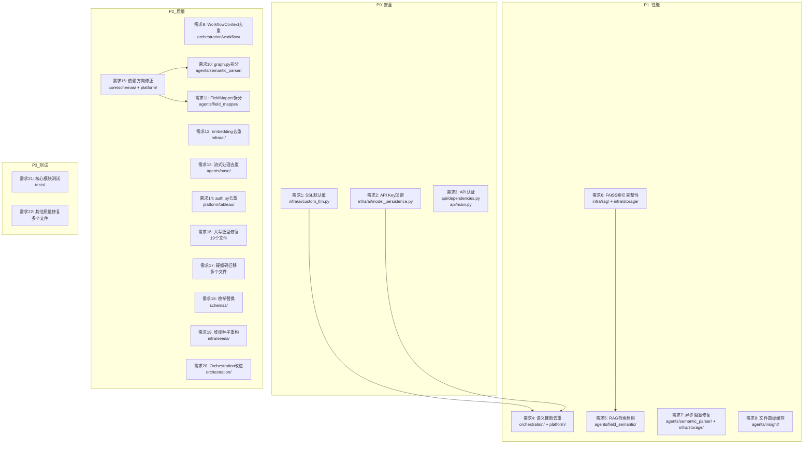

# 设计文档：代码质量修复计划

## 概述

本设计文档基于 `deep_code_review.md` 深度审查报告中发现的 130+ 个问题，系统性地规划修复方案。修复工作按四个优先级组织：

- **P0 安全修复**（需求 1-3）：SSL 默认值、API Key 加密、API 认证增强
- **P1 性能修复**（需求 4-8）：消除重复执行、索引完整性、异步阻塞、数据缓存
- **P2 代码质量**（需求 9-20）：代码去重、文件拆分、规范统一、依赖修正
- **P3 测试补充**（需求 21-22）：核心模块单元测试和属性测试

设计原则：
1. 每个修复必须遵循 `coding-standards.md` 编码规范
2. 修复不引入新的依赖方向违规
3. 优先使用项目已有基础设施（`infra/`、`agents/base/`）
4. 所有可配置参数迁移到 `app.yaml`

## 架构

### 修复影响范围

修复涉及 7 个顶层模块，按依赖方向从底层到上层排列：



### 修复执行顺序

修复必须按依赖关系排序，避免中间状态破坏：

1. **Phase 1**（P0 安全）：需求 1 → 需求 2 → 需求 3（无依赖，可并行）
2. **Phase 2**（P1 性能 - 基础设施层）：需求 6（FAISS 索引）→ 需求 7（异步/批量删除）
3. **Phase 3**（P1 性能 - 应用层）：需求 5（RAG 检索）→ 需求 4（语义推断去重）→ 需求 8（数据缓存）
4. **Phase 4**（P2 质量 - 底层先行）：需求 15（依赖方向）→ 需求 16/17/18（规范统一）
5. **Phase 5**（P2 质量 - 重构）：需求 9/12/13/14（代码去重）→ 需求 10/11/19（文件拆分）→ 需求 20（编排改进）
6. **Phase 6**（P3 测试）：需求 21 → 需求 22

## 组件与接口

### P0：安全修复组件

#### 需求 1：SSL 默认值修复（IAI-001）

**修改文件**：`infra/ai/custom_llm.py`

**变更**：将 `CustomChatLLM.verify_ssl` 默认值从 `False` 改为 `True`，与 `ModelConfig.verify_ssl = True` 保持一致。

```python
# 修改前
verify_ssl: bool = False

# 修改后
verify_ssl: bool = True  # 与 ModelConfig.verify_ssl 默认值一致
```

开发环境可通过 `app.yaml` 中 `ssl.verify: false` 覆盖。

#### 需求 2：API Key 持久化安全加固（IAI-002、IAI-010）

**修改文件**：`infra/ai/model_persistence.py`、`infra/ai/models.py`

**方案**：使用 `cryptography.fernet` 对称加密 API Key，密钥从环境变量 `ANALYTICS_ASSISTANT_ENCRYPTION_KEY` 读取。

```python
# infra/ai/model_persistence.py
import os
from cryptography.fernet import Fernet

class ModelPersistence:
    def __init__(self):
        self._fernet = self._init_fernet()

    def _init_fernet(self) -> Optional[Fernet]:
        """初始化加密器，密钥不可用时返回 None"""
        key = os.environ.get("ANALYTICS_ASSISTANT_ENCRYPTION_KEY")
        if key:
            return Fernet(key.encode() if isinstance(key, str) else key)
        logger.warning("加密密钥不可用，API Key 将使用环境变量引用模式存储")
        return None

    def _encrypt_api_key(self, api_key: str) -> str:
        """加密 API Key"""
        if self._fernet and api_key and not api_key.startswith("${"):
            return f"ENC:{self._fernet.encrypt(api_key.encode()).decode()}"
        return api_key

    def _decrypt_api_key(self, stored_value: str) -> str:
        """解密 API Key"""
        if self._fernet and stored_value.startswith("ENC:"):
            return self._fernet.decrypt(stored_value[4:].encode()).decode()
        return stored_value
```

同时将 `_config_to_dict` 替换为 `config.model_dump()`（IAI-010）：

```python
def save(self, configs: list[ModelConfig]) -> None:
    for config in configs:
        data = config.model_dump(mode="python")
        # 加密 api_key
        if data.get("api_key"):
            data["api_key"] = self._encrypt_api_key(data["api_key"])
        # 枚举值转字符串
        for key, val in data.items():
            if isinstance(val, Enum):
                data[key] = val.value
        self._cache.set(config.id, data)
```

#### 需求 3：API 认证增强（API-001、API-002）

**修改文件**：`api/dependencies.py`、`api/main.py`

**方案 A（JWT 验证）**：在 `get_tableau_username` 中增加 JWT token 验证。

```python
# api/dependencies.py
from fastapi import Header, HTTPException, Depends
from jose import jwt, JWTError

async def get_tableau_username(
    x_tableau_username: str = Header(None, alias="X-Tableau-Username"),
    authorization: str = Header(None, alias="Authorization"),
) -> str:
    """验证用户身份，支持 JWT token 或 API Key"""
    config = get_config()
    auth_config = config.get("api", {}).get("auth", {})

    if auth_config.get("enabled", True):
        if not authorization:
            raise HTTPException(status_code=401, detail="缺少 Authorization 请求头")
        # 验证 JWT token
        try:
            token = authorization.replace("Bearer ", "")
            payload = jwt.decode(token, auth_config["secret_key"], algorithms=["HS256"])
            return payload.get("sub", x_tableau_username)
        except JWTError:
            raise HTTPException(status_code=401, detail="无效的认证凭证")
    else:
        # 开发模式：仅依赖请求头
        if not x_tableau_username:
            raise HTTPException(status_code=401, detail="缺少 X-Tableau-Username 请求头")
        return x_tableau_username
```

**CORS 加固**（API-002）：

```python
# api/main.py
cors_config = api_config.get("cors", {})
allowed_origins = cors_config.get("allowed_origins", [])  # 默认空列表
allow_credentials = cors_config.get("allow_credentials", False)

# 安全检查：credentials=True 时禁止 origins=["*"]
if allow_credentials and "*" in allowed_origins:
    logger.warning("allow_credentials=True 时不应使用 allowed_origins=['*']，已自动禁用 credentials")
    allow_credentials = False
```

### P1：性能修复组件

#### 需求 4：消除语义推断重复执行（PLAT-007、FS-009）

**修改文件**：`platform/tableau/data_loader.py`、`orchestration/workflow/context.py`、`agents/field_semantic/inference.py`

**方案**：

1. `data_loader._ensure_field_index()` 执行语义推断后，将结果存入 `DataModel` 的扩展属性中
2. `WorkflowContext.load_field_semantic()` 检查 `data_model` 中是否已有语义结果，有则直接复用
3. `infer_field_semantic()` 便捷函数改为模块级单例

```python
# agents/field_semantic/inference.py
_inference_instance: Optional[FieldSemanticInference] = None
_inference_lock = threading.Lock()

async def infer_field_semantic(...) -> FieldSemanticResult:
    """便捷函数，使用模块级单例避免重复初始化"""
    global _inference_instance
    if _inference_instance is None:
        with _inference_lock:
            if _inference_instance is None:
                _inference_instance = FieldSemanticInference()
    return await _inference_instance.infer(...)
```

```python
# orchestration/workflow/context.py
async def load_field_semantic(self) -> "WorkflowContext":
    # 检查 data_model 中是否已有语义结果
    if self.data_model and hasattr(self.data_model, '_field_semantic_cache'):
        cached = self.data_model._field_semantic_cache
        if cached:
            return self.model_copy(update={"field_semantic": cached})
    # 否则执行推断
    result = await infer_field_semantic(...)
    return self.model_copy(update={"field_semantic": result.field_semantic})
```

#### 需求 5：RAG 检索结果实际使用（FS-002）

**修改文件**：`agents/field_semantic/inference.py`

**方案**：在 `_infer_with_lock()` 的步骤 4 中，调用 `_rag_search()` 进行检索，将命中结果直接使用，仅将未命中字段传递给 LLM。

```python
# inference.py - _infer_with_lock() 步骤 4 修改
# 步骤 4: RAG 检索
rag_hits = {}
if self._enable_rag and fields_need_llm:
    await self._init_rag()
    rag_hits, fields_need_llm = await self._rag_search(fields_need_llm)
    results.update(rag_hits)
    logger.info(f"RAG 检索命中 {len(rag_hits)} 个字段，剩余 {len(fields_need_llm)} 个需 LLM 推断")

# 步骤 5: LLM 推断（仅处理 RAG 未命中的字段）
if fields_need_llm:
    await self._llm_infer(fields_need_llm, results, on_token, on_thinking)
```

#### 需求 6：FAISS 索引完整性与膨胀修复（ISTO-001、IRAG-001、IRAG-002、IRAG-010）

**修改文件**：`infra/storage/vector_store.py`、`infra/rag/index_manager.py`

**方案**：

1. **索引完整性校验**（ISTO-001）：加载 FAISS 索引时验证 SHA-256 哈希

```python
# infra/storage/vector_store.py
import hashlib

def _verify_index_integrity(index_path: str) -> bool:
    """验证 FAISS 索引文件的 SHA-256 哈希"""
    hash_path = f"{index_path}.sha256"
    if not os.path.exists(hash_path):
        logger.warning(f"索引哈希文件不存在: {hash_path}")
        return True  # 向前兼容：无哈希文件时跳过验证
    with open(index_path, "rb") as f:
        file_hash = hashlib.sha256(f.read()).hexdigest()
    with open(hash_path, "r") as f:
        expected_hash = f.read().strip()
    return file_hash == expected_hash
```

2. **真正的文档删除**（IRAG-001）：使用 FAISS IDMap 包装器支持向量删除

```python
# infra/rag/index_manager.py
def delete_documents(self, index_name: str, doc_ids: list[str]) -> int:
    """删除文档，同时从 FAISS 索引中移除向量"""
    retriever = self._retrievers.get(index_name)
    if retriever and hasattr(retriever, '_store'):
        store = retriever._store
        # 从 FAISS 索引中删除向量
        if hasattr(store, 'delete'):
            store.delete(doc_ids)
    # 删除哈希记录
    deleted = self._doc_hash_cache.delete_batch(
        namespace=f"{index_name}_hashes", keys=doc_ids
    )
    return deleted
```

3. **索引文件清理**（IRAG-010）：删除索引时同时清理磁盘文件

```python
def delete_index(self, index_name: str) -> bool:
    # ... 现有逻辑 ...
    # 清理磁盘上的 FAISS 索引文件
    index_dir = os.path.join(self._index_base_dir, index_name)
    if os.path.exists(index_dir):
        import shutil
        shutil.rmtree(index_dir)
        logger.info(f"已清理索引目录: {index_dir}")
    return True
```

#### 需求 7：异步阻塞与批量删除修复（SP-012、SP-013、SP-036）

**修改文件**：`agents/semantic_parser/components/field_retriever.py`、`infra/storage/cache.py`

1. **异步 LLM 调用**（SP-012）：

```python
# field_retriever.py
async def _llm_rerank(self, candidates, query):
    # 修改前: response = self._llm.invoke(messages)
    # 修改后:
    response = await self._llm.ainvoke(messages)
```

2. **批量删除方法**（SP-013、SP-036）：

```python
# infra/storage/cache.py
class CacheManager:
    async def delete_by_filter(
        self, filter_fn: Callable[[dict], bool]
    ) -> int:
        """按条件批量删除，替代 search(limit=10000) + 循环删除模式"""
        items = await self._store.asearch(self._namespace, limit=10000)
        to_delete = [item for item in items if filter_fn(item.value)]
        for item in to_delete:
            await self._store.adelete(self._namespace, item.key)
        deleted = len(to_delete)
        self._stats["deletes"] += deleted
        return deleted
```

#### 需求 8：文件模式数据缓存（IN-001）

**修改文件**：`agents/insight/components/data_store.py`

```python
class DataStore:
    def __init__(self, ...):
        self._cached_file_data: Optional[list[RowData]] = None  # 文件模式缓存

    def _get_all_data(self) -> list[RowData]:
        if self._is_file_mode:
            if self._cached_file_data is None:
                self._cached_file_data = self._load_from_file()
            return self._cached_file_data
        return self._data or []
```

### P2：代码质量组件

#### 需求 9：WorkflowContext 重建代码消除重复（ORCH-001）

**修改文件**：`orchestration/workflow/context.py`

将 `refresh_auth_if_needed()`、`update_current_time()`、`load_field_semantic()` 中的手动构造替换为 `model_copy(update={...})`：

```python
async def refresh_auth_if_needed(self) -> "WorkflowContext":
    if self.is_auth_valid():
        return self
    new_auth = await self._refresh_auth()
    return self.model_copy(update={"auth": new_auth})

def update_current_time(self) -> "WorkflowContext":
    return self.model_copy(update={
        "previous_schema_hash": self.schema_hash,
        "current_time": datetime.now().isoformat(),
    })
```

#### 需求 10：Semantic Parser graph.py 拆分（SP-001、SP-002、SP-003）

**修改文件**：`agents/semantic_parser/graph.py` → 拆分为多个文件

**目标目录结构**：

```
agents/semantic_parser/
├── graph.py              # 仅保留 create/compile 图组装函数（~100 行）
├── routes.py             # 8 个路由函数（~120 行）
├── node_utils.py         # 公共辅助函数（~60 行）
├── nodes/
│   ├── __init__.py       # 导出所有节点函数
│   ├── intent.py         # intent_router_node
│   ├── cache.py          # query_cache_node, feature_cache_node
│   ├── optimization.py   # rule_prefilter, feature_extractor, dynamic_schema_builder, modular_prompt_builder
│   ├── retrieval.py      # field_retriever_node, few_shot_manager_node
│   ├── understanding.py  # semantic_understanding_node
│   ├── validation.py     # output_validator_node, filter_validator_node
│   └── execution.py      # query_adapter_node, error_corrector_node, feedback_learner_node
```

**node_utils.py 公共函数**：

```python
def parse_field_candidates(raw: Optional[list[dict]]) -> list[FieldCandidate]:
    """从 state 中解析字段候选列表"""
    if not raw:
        return []
    return [FieldCandidate.model_validate(c) for c in raw]

def classify_fields(candidates: list[FieldCandidate]) -> dict:
    """将字段候选按 role 分类"""
    return {
        "measures": [c for c in candidates if c.field_type.lower() == "measure"],
        "dimensions": [c for c in candidates if c.field_type.lower() == "dimension"],
        "time_fields": [c for c in candidates if c.data_type in ("date", "datetime")],
    }

def merge_metrics(state: dict, **new_metrics) -> dict:
    """合并优化指标"""
    existing = state.get("optimization_metrics", {})
    return {**existing, **new_metrics}
```

同时删除死代码 `route_after_validation`（SP-003）。

#### 需求 11：FieldMapperNode 拆分与代码去重（FM-001、FM-002、FM-005）

**修改文件**：`agents/field_mapper/node.py` → 拆分为 Mixin 组件

**目标结构**：

```
agents/field_mapper/
├── node.py                  # 主类 FieldMapperNode（组合 Mixin）+ 节点函数
├── components/
│   ├── __init__.py
│   ├── cache_mixin.py       # 缓存相关：_make_cache_key, _get_from_cache, _put_to_cache
│   ├── rag_mixin.py         # RAG 检索：_retrieve, _convert_to_candidates, load_metadata
│   └── llm_mixin.py         # LLM 调用：_llm_select, _llm_select_from_candidates
├── schemas/
│   └── config.py            # FieldMappingConfig 改为 Pydantic BaseModel
```

**公共 LLM 选择方法**（FM-002）：

```python
# components/llm_mixin.py
class LLMMixin:
    async def _llm_select_from_candidates(
        self, term: str, candidates: list[FieldCandidate],
        context: Optional[str], datasource_luid: str,
        role_filter: Optional[str],
    ) -> FieldMapping:
        """公共的 LLM 候选选择逻辑，消除 _map_field_with_llm_only 和 _map_field_with_llm_fallback 的重复"""
        selection = await self._llm_select(term, candidates, context)
        # ... 统一的结果处理逻辑
```

#### 需求 12：批量 Embedding 代码去重与框架对齐（IAI-003、IAI-004、IAI-005、IAI-012）

**修改文件**：`infra/ai/model_manager.py`

**方案**：

1. 提取公共核心方法 `_embed_batch_core_async`（IAI-003）
2. 使用 `ModelFactory.create_embedding()` 替代直接 aiohttp 调用（IAI-004）
3. 为 `ModelManager.__new__` 添加 `threading.Lock`（IAI-005）
4. 统一 Embedding 缓存 TTL 从 `app.yaml` 读取（IAI-012）

```python
class ModelManager:
    _lock = threading.Lock()

    def __new__(cls):
        if not hasattr(cls, '_instance') or cls._instance is None:
            with cls._lock:
                if not hasattr(cls, '_instance') or cls._instance is None:
                    cls._instance = super().__new__(cls)
        return cls._instance

    async def _embed_batch_core_async(
        self, texts: list[str], model_id: Optional[str] = None,
        batch_size: int = 100, max_concurrency: int = 5,
        use_cache: bool = True, progress_callback=None,
    ) -> tuple[list[Optional[list[float]]], int, int]:
        """核心批量 Embedding 逻辑，返回 (results, cache_hits, cache_misses)"""
        config = self._get_embedding_config(model_id)
        embedding_instance = self._factory.create_embedding(config)
        ttl = get_config().get("ai", {}).get("embedding_cache_ttl", 3600)
        # ... 统一的批处理逻辑 ...

    async def embed_documents_batch_async(self, texts, **kwargs) -> list[list[float]]:
        results, _, _ = await self._embed_batch_core_async(texts, **kwargs)
        return [r for r in results if r is not None]

    async def embed_documents_batch_with_stats_async(self, texts, **kwargs):
        results, hits, misses = await self._embed_batch_core_async(texts, **kwargs)
        return {"vectors": results, "cache_hits": hits, "cache_misses": misses}
```

#### 需求 13：流式处理逻辑去重（ABAS-001、ABAS-002）

**修改文件**：`agents/base/node.py`

提取公共流式 chunk 处理函数和 JSON Schema 注入函数：

```python
async def _collect_stream_chunks(
    astream, on_token=None, on_partial=None, on_thinking=None, output_model=None,
) -> tuple[str, list, dict]:
    """公共流式 chunk 收集逻辑，返回 (content, tool_calls, additional_kwargs)"""
    collected_content = ""
    tool_calls = []
    additional_kwargs = {}
    async for chunk in astream:
        # content 收集
        if chunk.content:
            collected_content += chunk.content
            if on_token:
                await on_token(chunk.content)
        # thinking 收集
        if on_thinking and chunk.additional_kwargs.get("thinking"):
            await on_thinking(chunk.additional_kwargs["thinking"])
            additional_kwargs.update(chunk.additional_kwargs)
        # tool_call 收集
        if chunk.additional_kwargs.get("tool_calls"):
            tool_calls.extend(chunk.additional_kwargs["tool_calls"])
        # partial JSON 解析
        if on_partial and collected_content and output_model:
            parsed = parse_partial_json(collected_content)
            if parsed:
                await on_partial(parsed)
    return collected_content, tool_calls, additional_kwargs

def _inject_schema_instruction(messages: list, output_model) -> list:
    """在最后一条 HumanMessage 后追加 JSON Schema 指令"""
    schema = output_model.model_json_schema()
    instruction = f"\n\n请严格按照以下 JSON Schema 格式输出：\n{json.dumps(schema, ensure_ascii=False)}"
    # 追加到最后一条 HumanMessage
    for i in range(len(messages) - 1, -1, -1):
        if isinstance(messages[i], HumanMessage):
            messages[i] = HumanMessage(content=messages[i].content + instruction)
            break
    return messages
```

#### 需求 14：auth.py 同步/异步代码去重（PLAT-001）

**修改文件**：`platform/tableau/auth.py`

提取公共逻辑为内部函数，仅在 HTTP 调用处区分同步/异步：

```python
def _build_jwt_auth_request(domain, site, api_version, user, jwt_config):
    """构建 JWT 认证请求参数（公共逻辑）"""
    token = _build_jwt_token(domain, site, user, jwt_config)
    url = f"{domain}/api/{api_version}/auth/signin"
    payload = {"credentials": {"jwt": token, "site": {"contentUrl": site}}}
    return url, payload

def _parse_auth_response(response_data: dict) -> TableauAuthContext:
    """解析认证响应（公共逻辑）"""
    credentials = response_data.get("credentials", {})
    return TableauAuthContext(
        token=credentials.get("token"),
        site_id=credentials.get("site", {}).get("id"),
        user_id=credentials.get("user", {}).get("id"),
    )

def _jwt_authenticate(domain, site, ...):
    url, payload = _build_jwt_auth_request(domain, site, ...)
    response = httpx.post(url, json=payload, verify=get_ssl_verify())
    return _parse_auth_response(response.json())

async def _jwt_authenticate_async(domain, site, ...):
    url, payload = _build_jwt_auth_request(domain, site, ...)
    async with httpx.AsyncClient(verify=get_ssl_verify()) as client:
        response = await client.post(url, json=payload)
    return _parse_auth_response(response.json())
```

#### 需求 15：依赖方向修正（CS-003、PLAT-004、API-003）

**修改文件**：
- `agents/semantic_parser/schemas/output.py` → 将 `SemanticOutput`、`DerivedComputation` 移到 `core/schemas/`
- `api/routers/chat.py` → 通过 `orchestration/` 间接使用 `HistoryManager`

**迁移步骤**：

1. 在 `core/schemas/` 下创建 `semantic_output.py`，包含 `SemanticOutput` 和 `DerivedComputation`
2. 在 `agents/semantic_parser/schemas/output.py` 中改为从 `core/schemas/` 导入并重新导出
3. 更新 `platform/tableau/adapter.py` 的导入路径
4. 在 `orchestration/workflow/` 中封装 `HistoryManager` 的使用，API 层通过编排层间接调用

#### 需求 16：大写泛型统一修复（CS-004）

**修改文件**：约 19 个文件

**规则**：将 `List[`、`Dict[`、`Tuple[`、`Set[` 替换为 `list[`、`dict[`、`tuple[`、`set[`，保留 `Optional[X]` 不变。

涉及目录：
- `platform/tableau/`（6 文件）
- `orchestration/workflow/`（3 文件）
- `infra/storage/`（4 文件）
- `infra/seeds/`（3 文件）
- `infra/rag/`（3 文件）

#### 需求 17：硬编码配置参数迁移（CS-001、FM-007、ISTO-005、SP-026、SP-037）

**修改文件**：多个文件 + `config/app.yaml`

新增 `app.yaml` 配置节：

```yaml
# 新增配置项
platform:
  tableau:
    data_loader:
      batch_size: 5  # CS-001: data_loader.py 中的 batch_size

field_mapper:
  low_confidence_threshold: 0.7  # FM-007: mapping.py 中的置信度阈值

storage:
  sqlite:
    sweep_interval_minutes: 60  # ISTO-005: store_factory.py 中的清理间隔

semantic_parser:
  filter_validator:
    max_concurrency: 5  # SP-026: filter_validator.py 中的并发限制
  rule_prefilter:
    confidence_weights: [0.3, 0.4, 0.3]  # SP-037: 置信度计算权重
```

#### 需求 18：字符串替换为枚举类型（FM-006、SP-049、ISED-003）

**修改文件**：`agents/field_mapper/schemas/mapping.py`、`agents/semantic_parser/schemas/intent.py`、`infra/seeds/computation.py`

```python
# agents/field_mapper/schemas/mapping.py
class MappingSource(str, Enum):
    """字段映射来源"""
    CACHE_HIT = "cache_hit"
    RAG_DIRECT = "rag_direct"
    RAG_LLM_FALLBACK = "rag_llm_fallback"
    LLM_ONLY = "llm_only"
    ERROR = "error"

# agents/semantic_parser/schemas/intent.py
class IntentSource(str, Enum):
    """意图识别来源"""
    L0_RULES = "l0_rules"
    L1_CLASSIFIER = "l1_classifier"
    L2_FALLBACK = "l2_fallback"
```

#### 需求 19：维度种子数据重构（ISED-001、ISED-002）

**修改文件**：`infra/seeds/dimension.py` → 拆分为 `infra/seeds/dimensions/` 目录

**目标结构**：

```
infra/seeds/dimensions/
├── __init__.py          # 汇总导出 DIMENSION_SEEDS
├── _types.py            # DimensionSeed dataclass 定义
├── _utils.py            # 自动生成大小写变体的函数
├── time.py              # 时间维度种子
├── geography.py         # 地理维度种子
├── product.py           # 产品维度种子
├── customer.py          # 客户维度种子
├── organization.py      # 组织维度种子
├── channel.py           # 渠道维度种子
├── financial.py         # 财务维度种子
└── common.py            # 通用命名模式
```

**类型化数据结构**：

```python
# _types.py
@dataclass
class DimensionSeed:
    """维度模式种子"""
    field_caption: str
    data_type: str
    category: str
    category_detail: str
    level: int
    business_description: str
    aliases: list[str] = field(default_factory=list)
    reasoning: str = ""

    @property
    def granularity(self) -> str:
        """根据 level 自动计算粒度，消除冗余字段"""
        mapping = {1: "coarsest", 2: "coarse", 3: "medium", 4: "fine", 5: "finest"}
        return mapping.get(self.level, "unknown")

@dataclass
class MeasureSeed:
    """度量模式种子"""
    field_caption: str
    data_type: str
    measure_category: str
    business_description: str
    aliases: list[str] = field(default_factory=list)
    reasoning: str = ""
```

**自动生成大小写变体**：

```python
# _utils.py
def generate_case_variants(seed: DimensionSeed) -> list[DimensionSeed]:
    """自动生成大小写变体，减少手工维护"""
    variants = [seed]
    caption = seed.field_caption
    if caption[0].islower():
        variants.append(replace(seed, field_caption=caption.capitalize()))
    if caption[0].isupper():
        variants.append(replace(seed, field_caption=caption.lower()))
    return variants
```

#### 需求 20：Orchestration 层改进（ORCH-003、ORCH-006、ORCH-007）

**修改文件**：`orchestration/workflow/context.py`、`orchestration/workflow/executor.py`、`orchestration/workflow/callbacks.py`

1. **认证刷新抽象**（ORCH-003）：

```python
# context.py
async def refresh_auth_if_needed(self) -> "WorkflowContext":
    if self.is_auth_valid():
        return self
    if self.platform_adapter and hasattr(self.platform_adapter, 'refresh_auth'):
        new_auth = await self.platform_adapter.refresh_auth()
    else:
        logger.warning("无平台适配器，无法刷新认证")
        return self
    return self.model_copy(update={"auth": new_auth})
```

2. **总超时控制**（ORCH-006）：

```python
# executor.py
async def execute_stream(self, ...):
    start_time = asyncio.get_event_loop().time()
    while True:
        elapsed = asyncio.get_event_loop().time() - start_time
        remaining = float(self._timeout) - elapsed
        if remaining <= 0:
            yield {"type": "error", "error": "工作流执行超时"}
            break
        try:
            event = await asyncio.wait_for(event_queue.get(), timeout=min(remaining, 30.0))
            yield event
        except asyncio.TimeoutError:
            yield {"type": "heartbeat"}
```

3. **补充节点映射**（ORCH-007）：

```python
# callbacks.py
_VISIBLE_NODE_MAPPING: dict[str, str] = {
    "query_adapter": "building",
    "tableau_query": "executing",
    "feedback_learner": "generating",
    "rule_prefilter": "understanding",
    "feature_extractor": "understanding",
    "filter_validator": "building",
    "output_validator": "building",
    "error_corrector": "building",
}
```

### P3：测试补充组件

#### 需求 21：核心模块测试补充

**新增文件**：

```
tests/
├── core/
│   └── schemas/
│       └── test_schemas_roundtrip.py    # Pydantic 模型序列化/反序列化属性测试
├── infra/
│   ├── storage/
│   │   └── test_cache_manager.py        # CacheManager 存取对称性测试
│   └── rag/
│       └── test_exact_retriever.py      # ExactRetriever 精确匹配测试
├── agents/
│   ├── semantic_parser/
│   │   └── components/
│   │       └── test_error_corrector.py  # 错误模式检测测试
│   └── field_mapper/
│       └── test_field_mapper.py         # 字段映射核心逻辑测试
```

**属性测试使用 Hypothesis 库**，每个属性测试至少 100 次迭代。

#### 需求 22：其他代码质量修复

涉及多个小修复，按文件分组：

| 修复项 | 文件 | 变更 |
|--------|------|------|
| CORE-005 | `core/exceptions.py` | 添加 `ConfigurationError` 异常类 |
| CORE-012 | `core/schemas/validation.py` | `ValidationError` → `ValidationErrorDetail` |
| CORE-013 | `core/schemas/execute_result.py` | 移除 `rows` 兼容属性 |
| CORE-008 | `core/schemas/field_candidate.py` | 合并 `field_type`/`role`、`confidence`/`score` |
| IRAG-004 | `infra/rag/exceptions.py` | `IndexError` → `RAGIndexError` |
| SP-028 | `agents/semantic_parser/components/history_manager.py` | 修复 `insert(0)` O(n²) |
| RP-003 | `agents/replanner/graph.py` | 添加重规划轮数上限 |
| API-005 | `api/routers/sessions.py` | `session_id` UUID 格式验证 |
| API-004 | `api/routers/sessions.py` | 会话列表分页参数 |

## 数据模型

### 新增/修改的数据模型

#### 1. API Key 加密存储格式

```
存储格式: "ENC:<base64-encoded-fernet-ciphertext>"
回退格式: "${ENV_VAR_NAME}"（环境变量引用）
```

#### 2. FAISS 索引完整性校验文件

```
<index_dir>/<index_name>.faiss       # FAISS 索引文件
<index_dir>/<index_name>.faiss.sha256 # SHA-256 哈希文件
```

#### 3. 新增枚举类型

```python
# agents/field_mapper/schemas/mapping.py
class MappingSource(str, Enum):
    CACHE_HIT = "cache_hit"
    RAG_DIRECT = "rag_direct"
    RAG_LLM_FALLBACK = "rag_llm_fallback"
    LLM_ONLY = "llm_only"
    ERROR = "error"

# agents/semantic_parser/schemas/intent.py
class IntentSource(str, Enum):
    L0_RULES = "l0_rules"
    L1_CLASSIFIER = "l1_classifier"
    L2_FALLBACK = "l2_fallback"
```

#### 4. 新增异常类

```python
# core/exceptions.py
class ConfigurationError(Exception):
    """配置错误"""
    def __init__(self, message: str, config_key: Optional[str] = None):
        super().__init__(message)
        self.config_key = config_key
```

#### 5. 类型化种子数据结构

```python
# infra/seeds/dimensions/_types.py
@dataclass
class DimensionSeed:
    field_caption: str
    data_type: str
    category: str
    category_detail: str
    level: int
    business_description: str
    aliases: list[str] = field(default_factory=list)

@dataclass
class MeasureSeed:
    field_caption: str
    data_type: str
    measure_category: str
    business_description: str
    aliases: list[str] = field(default_factory=list)
```

#### 6. app.yaml 新增配置节

```yaml
# 安全配置
api:
  auth:
    enabled: true
    secret_key: "${API_AUTH_SECRET_KEY}"
  cors:
    allowed_origins: []  # 默认空列表，需显式配置

# 性能配置
ai:
  embedding_cache_ttl: 3600

# 代码质量配置
platform:
  tableau:
    data_loader:
      batch_size: 5
storage:
  sqlite:
    sweep_interval_minutes: 60
semantic_parser:
  filter_validator:
    max_concurrency: 5
  rule_prefilter:
    confidence_weights: [0.3, 0.4, 0.3]
field_mapper:
  low_confidence_threshold: 0.7
replanner:
  max_replan_rounds: 3
```

## 正确性属性

*属性是在系统所有有效执行中都应成立的特征或行为——本质上是关于系统应该做什么的形式化陈述。属性是人类可读规范与机器可验证正确性保证之间的桥梁。*

### Property 1: API Key 加密 round-trip

*For any* 非空 API Key 字符串 `key`，当加密密钥可用时，`decrypt(encrypt(key))` 应产生与原始 `key` 相同的值，且 `encrypt(key)` 不等于 `key`。

**Validates: Requirements 2.1, 2.2**

### Property 2: ModelConfig 序列化完整性

*For any* 有效的 `ModelConfig` 实例 `config`，`model_dump()` 产生的字典应包含所有 29 个字段，且 `ModelConfig(**config.model_dump())` 应产生等价对象（排除 `api_key` 加密差异）。

**Validates: Requirements 2.3**

### Property 3: 无效认证凭证拒绝

*For any* HTTP 请求，当 API 认证启用时，如果请求不包含有效的 JWT token 或 API Key，系统应返回 HTTP 401 状态码。

**Validates: Requirements 3.1**

### Property 4: CORS credentials 与 wildcard 互斥

*For any* CORS 配置组合，当 `allow_credentials` 为 `True` 且 `allowed_origins` 包含 `"*"` 时，系统应自动禁用 `allow_credentials` 或拒绝该配置。

**Validates: Requirements 3.4**

### Property 5: FAISS 索引完整性校验

*For any* FAISS 索引文件，如果对应的 SHA-256 哈希文件存在且哈希值不匹配，加载操作应失败并报告完整性错误。

**Validates: Requirements 6.1**

### Property 6: 索引操作后检索一致性

*For any* 文档集合和索引操作序列（添加、删除、更新），执行操作后的检索结果应仅包含当前有效的文档版本：删除的文档不应出现在检索结果中，更新的文档应返回最新版本。

**Validates: Requirements 6.2, 6.3**

### Property 7: 批量删除正确性

*For any* 缓存内容集合和过滤条件，`delete_by_filter` 应删除所有满足条件的项，且不影响不满足条件的项。删除后，满足条件的项不可通过 `get` 获取。

**Validates: Requirements 7.2**

### Property 8: ModelManager 单例线程安全

*For any* 数量的并发线程同时调用 `ModelManager()` 构造函数，所有线程应获得同一个实例（`id()` 相同）。

**Validates: Requirements 12.3**

### Property 9: 种子数据类型完整性

*For any* `DimensionSeed` 实例，其 `granularity` 属性应与 `level` 字段一致（level=1 → "coarsest"，level=5 → "finest"），且所有必填字段（`field_caption`、`data_type`、`category`、`level`）不为空。

**Validates: Requirements 19.2**

### Property 10: 大小写变体生成正确性

*For any* 种子数据，`generate_case_variants` 生成的变体列表应包含原始种子，且每个变体的 `field_caption` 应是原始 `field_caption` 的大小写变体，其他字段保持不变。

**Validates: Requirements 19.3**

### Property 11: Pydantic 模型序列化 round-trip

*For any* 有效的 `core/schemas/` Pydantic 模型实例 `m`（包括 `Field`、`DataModel`、`ExecuteResult`、`FieldCandidate`、`ValidationResult` 等），`type(m).model_validate(m.model_dump())` 应产生与 `m` 等价的对象。

**Validates: Requirements 21.1, 21.6**

### Property 12: CacheManager 存取对称性

*For any* 命名空间 `ns`、键 `key` 和可序列化值 `value`，`cache.set(key, value)` 后 `cache.get(key)` 应返回与 `value` 等价的对象。

**Validates: Requirements 21.2**

### Property 13: ExactRetriever 精确匹配正确性

*For any* 字段集合和查询字符串 `q`，如果 `q` 精确匹配某个字段的 `name` 或 `caption`，`ExactRetriever.retrieve(q)` 应返回该字段且置信度为 1.0。

**Validates: Requirements 21.3**

### Property 14: 历史截断正确性

*For any* 消息历史列表和 token 限制 `max_tokens`，`truncate_history(history, max_tokens)` 的结果应满足：(1) 总 token 数不超过 `max_tokens`，(2) 保留的消息是原始列表中最新的连续子序列，(3) 消息顺序与原始列表一致。

**Validates: Requirements 22.6**

### Property 15: UUID 格式验证

*For any* 非 UUID 格式的字符串作为 `session_id` 路径参数，API 应返回 HTTP 422 状态码。*For any* 有效的 UUID 字符串，API 应正常处理请求。

**Validates: Requirements 22.8**

### Property 16: 分页参数正确性

*For any* 会话列表和分页参数 `(offset, limit)`，返回的结果数量应不超过 `limit`，且结果应是完整列表从 `offset` 开始的子序列。

**Validates: Requirements 22.9**

## 错误处理

### P0 安全修复的错误处理

| 场景 | 处理策略 | 日志级别 |
|------|----------|----------|
| SSL 验证失败 | 抛出 `ConnectionError`，不降级 | ERROR |
| 加密密钥不可用 | 回退到环境变量引用模式 `${ENV_VAR}` | WARNING |
| 加密/解密失败 | 记录错误，返回原始值（避免数据丢失） | ERROR |
| JWT token 无效 | 返回 HTTP 401 | WARNING |
| JWT token 过期 | 返回 HTTP 401，提示刷新 | WARNING |
| CORS 配置冲突 | 自动修正（禁用 credentials），记录警告 | WARNING |

### P1 性能修复的错误处理

| 场景 | 处理策略 | 日志级别 |
|------|----------|----------|
| FAISS 索引哈希不匹配 | 删除损坏索引，触发重建 | ERROR |
| FAISS 向量删除失败 | 标记为需要重建，下次访问时重建 | WARNING |
| RAG 检索超时 | 跳过 RAG，直接走 LLM 推断 | WARNING |
| 批量删除部分失败 | 记录失败项，返回成功删除数量 | WARNING |
| 文件模式数据加载失败 | 降级为空数据，记录错误 | ERROR |
| 语义推断单例初始化失败 | 每次创建新实例（降级到旧行为） | WARNING |

### P2 代码质量修复的错误处理

| 场景 | 处理策略 | 日志级别 |
|------|----------|----------|
| `model_copy` 失败 | 回退到手动构造（不应发生） | ERROR |
| 配置参数读取失败 | 使用代码中的 `_DEFAULT_*` 常量 | WARNING |
| 枚举值转换失败 | 保留原始字符串值 | WARNING |
| 种子数据加载失败 | 使用空种子列表，记录错误 | ERROR |

### P3 测试相关的错误处理

测试代码本身不需要错误处理策略，但测试应覆盖以下错误场景：
- Pydantic 模型验证失败（无效字段值）
- CacheManager 存储后端不可用
- ExactRetriever 空索引查询
- 历史截断空列表输入

## 测试策略

### 测试方法

本项目采用双轨测试策略：

1. **单元测试**：验证具体示例、边界情况和错误条件
2. **属性测试**：使用 Hypothesis 库验证跨所有输入的通用属性

两者互补：单元测试捕获具体 bug，属性测试验证通用正确性。

### 属性测试配置

- **测试库**：`hypothesis`（Python 属性测试标准库）
- **最小迭代次数**：每个属性测试 100 次
- **标签格式**：`Feature: code-quality-remediation, Property {number}: {property_text}`
- **每个正确性属性由一个属性测试实现**

### 测试文件组织

```
analytics_assistant/tests/
├── core/
│   └── schemas/
│       └── test_schemas_roundtrip.py       # Property 11: Pydantic round-trip
├── infra/
│   ├── ai/
│   │   ├── test_api_key_encryption.py      # Property 1, 2: API Key 加密
│   │   └── test_model_manager_singleton.py # Property 8: 单例线程安全
│   ├── storage/
│   │   ├── test_cache_manager.py           # Property 7, 12: 批量删除 + 存取对称性
│   │   └── test_faiss_integrity.py         # Property 5: FAISS 完整性
│   ├── rag/
│   │   ├── test_exact_retriever.py         # Property 13: 精确匹配
│   │   └── test_index_operations.py        # Property 6: 索引操作一致性
│   └── seeds/
│       └── test_dimension_seeds.py         # Property 9, 10: 种子数据类型 + 变体生成
├── agents/
│   ├── semantic_parser/
│   │   └── components/
│   │       ├── test_error_corrector.py     # 单元测试：错误模式检测
│   │       └── test_history_manager.py     # Property 14: 历史截断
│   └── field_mapper/
│       └── test_field_mapper.py            # 单元测试：字段映射
├── api/
│   ├── test_auth.py                        # Property 3: 认证验证
│   ├── test_cors.py                        # Property 4: CORS 配置
│   ├── test_uuid_validation.py             # Property 15: UUID 验证
│   └── test_pagination.py                  # Property 16: 分页
```

### 属性测试示例

```python
# tests/infra/ai/test_api_key_encryption.py
from hypothesis import given, strategies as st, settings

@given(st.text(min_size=1, max_size=200))
@settings(max_examples=100)
def test_api_key_encryption_roundtrip(api_key: str):
    """Feature: code-quality-remediation, Property 1: API Key 加密 round-trip"""
    persistence = ModelPersistence()
    if persistence._fernet:
        encrypted = persistence._encrypt_api_key(api_key)
        assert encrypted != api_key  # 加密后不等于明文
        decrypted = persistence._decrypt_api_key(encrypted)
        assert decrypted == api_key  # 解密后等于原始值
```

```python
# tests/core/schemas/test_schemas_roundtrip.py
from hypothesis import given, settings
from hypothesis_pydantic import from_model

@given(from_model(Field))
@settings(max_examples=100)
def test_field_roundtrip(field: Field):
    """Feature: code-quality-remediation, Property 11: Pydantic 模型序列化 round-trip"""
    dumped = field.model_dump()
    restored = Field.model_validate(dumped)
    assert restored == field
```

```python
# tests/infra/storage/test_cache_manager.py
from hypothesis import given, strategies as st, settings

@given(
    key=st.text(min_size=1, max_size=50),
    value=st.dictionaries(st.text(min_size=1), st.text(), min_size=1, max_size=5),
)
@settings(max_examples=100)
def test_cache_set_get_roundtrip(key: str, value: dict):
    """Feature: code-quality-remediation, Property 12: CacheManager 存取对称性"""
    cache = CacheManager(namespace="test")
    cache.set(key, value)
    result = cache.get(key)
    assert result == value
```

### 单元测试覆盖

| 模块 | 测试重点 | Mock 策略 |
|------|----------|-----------|
| `core/schemas/` | 模型验证器、序列化、schema_hash | 无需 Mock |
| `infra/ai/` | API Key 加密、单例模式 | Mock 环境变量 |
| `infra/storage/` | CacheManager CRUD、批量删除 | 使用内存后端 |
| `infra/rag/` | ExactRetriever、索引操作 | 使用内存 FAISS |
| `infra/seeds/` | 种子数据完整性、变体生成 | 无需 Mock |
| `agents/semantic_parser/` | 错误模式检测、历史截断 | 无需 Mock |
| `agents/field_mapper/` | 字段映射逻辑 | Mock LLM 调用 |
| `api/` | 认证、CORS、UUID 验证、分页 | 使用 FastAPI TestClient |

### Mock 策略

遵循编码规范 6.1：
- **单元测试**：允许 Mock 外部 API（LLM、Embedding、HTTP 请求）
- **属性测试**：对于纯逻辑属性（如序列化 round-trip、加密 round-trip），可 Mock 外部依赖以提高测试速度
- **禁止 Mock 内部逻辑**（如配置读取、数据模型转换）

