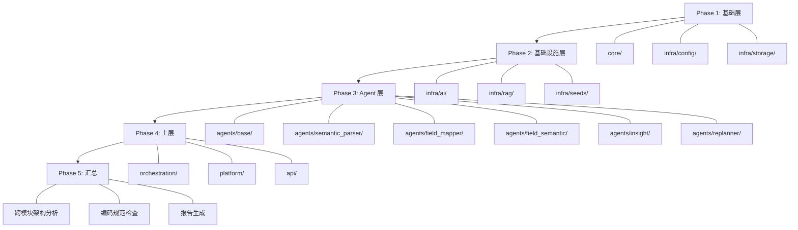

# 设计文档：Analytics Assistant 深度代码审查与功能分析

## 概述

本设计文档描述了对 Analytics Assistant 项目进行系统性深度代码审查的执行方案。审查采用自底向上的分层策略，从 Core 层开始逐层向上，最终汇总为一份结构化的审查报告。

审查系统的核心设计原则：
- **分层审查**：按依赖方向从底层到上层逐步推进
- **模板驱动**：使用统一的审查模板确保一致性
- **量化评估**：每个模块产出可量化的质量评分
- **可操作输出**：每个发现项都附带具体的优化建议和代码示例

## 架构

审查流程分为 5 个阶段（Phase），每个阶段包含若干审查任务：



## 组件与接口

### 审查模板体系

审查过程使用三级模板：

#### 1. 函数级审查模板

对每个公开函数检查：
- 签名分析：参数类型注解、返回值类型注解、参数数量
- 逻辑分析：圈复杂度、嵌套深度、边界条件处理
- 错误处理：异常捕获完整性、异常信息上下文
- 文档：Docstring 完整性（Args/Returns/Raises）
- 性能：时间复杂度、不必要的拷贝、阻塞调用

#### 2. 类级审查模板

对每个类检查：
- 职责分析：是否符合单一职责原则
- 代码量：总行数，超过 500 行标记
- 依赖分析：导入的模块、依赖方向
- 设计模式：使用的模式是否合理
- 状态管理：可变状态、线程安全

#### 3. 模块级审查模板

对每个模块检查：
- 文件组织：目录结构是否符合规范
- 依赖方向：是否符合 12A.2 依赖方向图
- 接口设计：对外暴露的接口是否合理
- 数据流：模块内的数据流转路径
- 质量评分：七维度评分汇总

### 质量评分体系

七个维度，每维度 0-100 分：

| 维度 | 权重 | 评分依据 |
|------|------|----------|
| 功能完整性 | 20% | 设计要求是否完整实现，是否有占位实现 |
| 代码质量 | 20% | 命名规范、代码结构、重复代码 |
| 性能 | 15% | 异步并发、缓存使用、数据结构选择 |
| 错误处理 | 15% | 异常捕获、降级策略、日志记录 |
| 可维护性 | 10% | 圈复杂度、代码行数、文档完整性 |
| 安全性 | 10% | 敏感信息、输入验证、注入防护 |
| 测试覆盖 | 10% | 测试文件存在性、核心函数覆盖 |

### 问题严重程度分级

| 级别 | 定义 | 示例 |
|------|------|------|
| Critical | 可能导致数据丢失、安全漏洞或系统崩溃 | SQL 注入、硬编码密码、未处理的空指针 |
| High | 影响功能正确性或性能 | 逻辑错误、N+1 查询、资源泄漏 |
| Medium | 影响可维护性或不符合规范 | 延迟导入、缺失 Docstring、魔法数字 |
| Low | 代码风格或微小改进 | 命名不一致、冗余注释、可简化的表达式 |

### 审查执行流程

每个模块的审查按以下步骤执行：


### 项目文件清单

审查覆盖的完整文件清单：

**Core 层（3 文件 + 7 schema 文件）**
- `core/interfaces.py` - 抽象接口定义
- `core/exceptions.py` - 自定义异常
- `core/schemas/` - 7 个数据模型文件（computations, data_model, enums, execute_result, field_candidate, fields, filters, validation）

**Infra 配置与存储（7 文件）**
- `infra/config/config_loader.py` - 配置加载器
- `infra/storage/` - 5 个文件（cache, kv_store, repository, store_factory, vector_store）

**Infra AI（7 文件）**
- `infra/ai/` - 7 个文件（custom_llm, model_factory, model_manager, model_persistence, model_registry, model_router, models）

**Infra RAG（10 文件）**
- `infra/rag/` - 8 个核心文件 + 2 个 schema 文件 + 1 个 prompt 文件

**Infra Seeds（5 文件）**
- `infra/seeds/` - 3 个种子数据文件 + 2 个子目录文件

**Agents Base（3 文件）**
- `agents/base/` - context.py, middleware_runner.py, node.py

**Semantic Parser（30+ 文件）**
- graph.py, state.py
- components/ - 16 个业务组件
- prompts/ - 4 个 Prompt 文件
- schemas/ - 10 个数据模型文件
- seeds/ - 种子匹配器

**Field Mapper（3 文件）**
- node.py, prompts/prompt.py, schemas/（config.py, mapping.py）

**Field Semantic（7 文件）**
- inference.py, utils.py
- components/ - 4 个 Mixin 文件
- prompts/prompt.py, schemas/output.py

**Insight（5 文件）**
- graph.py, components/（3 文件）, prompts/, schemas/

**Replanner（3 文件）**
- graph.py, prompts/, schemas/

**Orchestration（3 文件）**
- workflow/ - callbacks.py, context.py, executor.py

**Platform（7 文件）**
- base.py
- tableau/ - 6 文件（adapter, auth, client, data_loader, query_builder, ssl_utils）

**API（11 文件）**
- main.py, dependencies.py, middleware.py
- models/ - 5 文件
- routers/ - 5 文件
- utils/sse.py

**测试目录**
- tests/agents/ - base/, insight/, replanner/
- tests/api/ - routers/, utils/, test_middleware_pbt.py
- tests/integration/ - 2 个集成测试
- tests/manual/ - 手动测试脚本

## 数据模型

### 审查报告结构

```
deep_code_review.md
├── 执行摘要
│   ├── 总体质量评分
│   ├── 关键发现数量（按严重程度）
│   └── Top 10 高优先级问题
├── 审查框架说明
│   ├── 评分标准
│   ├── 严重程度定义
│   └── 审查维度说明
├── Phase 1: 基础层审查
│   ├── Core 模块
│   │   ├── 模块概述
│   │   ├── 文件清单
│   │   ├── 类与函数分析
│   │   ├── 质量评分表
│   │   ├── 问题列表（按严重程度排序）
│   │   └── 优化建议
│   ├── Infra/Config 模块
│   └── Infra/Storage 模块
├── Phase 2: 基础设施层审查
│   ├── Infra/AI 模块
│   ├── Infra/RAG 模块
│   └── Infra/Seeds 模块
├── Phase 3: Agent 层审查
│   ├── Agents/Base 模块
│   ├── Semantic Parser Agent
│   ├── Field Mapper Agent
│   ├── Field Semantic Agent
│   ├── Insight Agent
│   └── Replanner Agent
├── Phase 4: 上层审查
│   ├── Orchestration 模块
│   ├── Platform 模块
│   └── API 模块
├── Phase 5: 跨模块分析
│   ├── 依赖关系图
│   ├── 循环依赖检查
│   ├── 编码规范符合性汇总
│   ├── 性能瓶颈汇总
│   ├── 安全性汇总
│   └── 测试覆盖分析
└── 优化路线图
    ├── P0 任务（核心流程）
    ├── P1 任务（基础设施）
    ├── P2 任务（辅助功能）
    └── P3 任务（API 与集成）
```

### Finding 数据结构

每个审查发现项包含：

| 字段 | 说明 |
|------|------|
| ID | 唯一标识，格式：`{module}-{seq}`，如 `CORE-001` |
| 严重程度 | Critical / High / Medium / Low |
| 类别 | 功能 / 性能 / 安全 / 规范 / 可维护性 / 测试 |
| 位置 | 文件路径:行号 或 文件路径:类名.方法名 |
| 描述 | 问题的具体描述 |
| 影响 | 该问题可能造成的影响 |
| 建议 | 具体的修复建议，包含代码示例（如适用） |

### 模块质量评分表格式

```markdown
| 维度 | 评分 | 说明 |
|------|------|------|
| 功能完整性 | 85 | ... |
| 代码质量 | 90 | ... |
| 性能 | 75 | ... |
| 错误处理 | 80 | ... |
| 可维护性 | 85 | ... |
| 安全性 | 90 | ... |
| 测试覆盖 | 60 | ... |
| **加权总分** | **82** | |
```


## 正确性属性

*正确性属性是一种在系统所有有效执行中都应成立的特征或行为——本质上是关于系统应该做什么的形式化陈述。属性是人类可读规范与机器可验证正确性保证之间的桥梁。*

由于本 spec 的核心任务是**阅读和分析代码并生成报告**，而非构建可执行软件，大部分验收标准涉及人工审查判断，不适合自动化属性测试。以下属性聚焦于可自动化验证的编码规范检查和报告格式验证。

### 编码规范检查属性

Property 1: 依赖方向合规性
*For any* Python 文件在 `analytics_assistant/src/` 下，其导入语句的方向应符合编码规范 12A.2 定义的依赖方向图。具体而言：agents/ 不应导入 orchestration/，core/ 不应导入 agents/ 或 infra/，infra/ 不应导入 agents/。
**Validates: Requirements 2.4, 9.8**

Property 2: 延迟导入检测
*For any* Python 文件在 `analytics_assistant/src/` 下，函数或方法体内不应包含 `import` 或 `from ... import` 语句（`__init__` 方法中获取全局单例除外）。
**Validates: Requirements 9.1**

Property 3: Pydantic 模型位置合规性
*For any* Python 文件在 `analytics_assistant/src/` 下且不在 `schemas/` 目录中，该文件不应定义继承自 `BaseModel` 的类（`api/models/` 目录除外，因为 API 模型有独立的组织规范）。
**Validates: Requirements 9.4**

Property 4: 异常捕获完整性
*For any* `except` 块在 `analytics_assistant/src/` 下的 Python 文件中，该块应包含日志记录调用（`logger.warning`、`logger.error`、`logger.exception`）或 `raise` 语句，不应静默吞掉异常。
**Validates: Requirements 9.5**

Property 5: 异步函数无阻塞调用
*For any* `async def` 函数在 `analytics_assistant/src/` 下的 Python 文件中，函数体内不应调用已知的阻塞函数（`time.sleep`、`requests.get`、`requests.post`、`open()` 用于网络 IO）。
**Validates: Requirements 9.6**

Property 6: 类型注解泛型大写
*For any* 类型注解在 `analytics_assistant/src/` 下的 Python 文件中，不应使用小写泛型语法（`list[`、`dict[`、`tuple[`、`set[`），应使用 `typing` 模块的 `List`、`Dict`、`Tuple`、`Set`。
**Validates: Requirements 9.7**

Property 7: 无硬编码敏感信息
*For any* Python 文件在 `analytics_assistant/src/` 下，不应包含匹配常见密钥模式的硬编码字符串（如 `sk-`、`api_key = "..."`、`token = "..."`、`password = "..."`）。
**Validates: Requirements 11.1**

### 可维护性指标属性

Property 8: 函数行数限制
*For any* 函数在 `analytics_assistant/src/` 下的 Python 文件中，审查报告应标记超过 50 行的函数。超过 500 行的类也应被标记。
**Validates: Requirements 13.1**

Property 9: 圈复杂度限制
*For any* 函数在 `analytics_assistant/src/` 下的 Python 文件中，审查报告应标记圈复杂度超过 10 的函数。
**Validates: Requirements 13.2**

Property 10: 嵌套深度限制
*For any* 代码块在 `analytics_assistant/src/` 下的 Python 文件中，审查报告应标记嵌套层次超过 4 层的代码。
**Validates: Requirements 13.3**

Property 11: 参数数量限制
*For any* 函数在 `analytics_assistant/src/` 下的 Python 文件中，审查报告应标记参数超过 5 个的函数。
**Validates: Requirements 13.4**

Property 12: Docstring 完整性
*For any* 公开函数或公开类（名称不以 `_` 开头）在 `analytics_assistant/src/` 下的 Python 文件中，审查报告应标记缺失 Docstring 的项。
**Validates: Requirements 13.5**

### 测试覆盖属性

Property 13: 测试文件覆盖
*For any* 源代码模块目录在 `analytics_assistant/src/` 下，`analytics_assistant/tests/` 下应存在对应的测试目录或测试文件。审查报告应列出缺失测试的模块。
**Validates: Requirements 14.1**

### 报告格式属性

Property 14: 报告模块章节完整性
*For any* 审查的模块，Review_Report 中应包含该模块的独立章节，且章节包含：概述、文件清单、质量评分表、问题列表、优化建议。
**Validates: Requirements 1.4, 15.2**

Property 15: Finding 严重程度标记
*For any* Finding 在 Review_Report 中，该 Finding 应标记为 Critical、High、Medium、Low 四个严重程度之一。
**Validates: Requirements 1.3**

Property 16: 优化路线图工作量标注
*For any* 优化任务在 Review_Report 的优化路线图中，该任务应标注预估工作量（小时或人天）。
**Validates: Requirements 15.5**

## 错误处理

由于本 spec 的任务是代码审查（读取和分析），而非构建运行时系统，错误处理主要关注审查过程中的异常情况：

| 场景 | 处理策略 |
|------|----------|
| 文件读取失败（文件不存在或编码错误） | 在报告中标记该文件为"无法读取"，继续审查其他文件 |
| 文件过大无法一次读取 | 使用分段读取（readFile 的 start_line/end_line），分批分析 |
| 模块结构与预期不符 | 在报告中记录实际结构，调整审查策略 |
| 审查发现数量过多 | 按严重程度排序，优先记录 Critical 和 High 级别问题 |

## 测试策略

### 双重测试方法

由于本 spec 的输出是审查报告文档而非可执行代码，测试策略聚焦于：

**单元测试（示例验证）**：
- 验证报告文件是否成功生成在指定路径
- 验证报告是否包含执行摘要章节
- 验证报告是否包含优化路线图章节
- 验证 SSL 禁用检查（搜索 `verify=False`）
- 验证 Hypothesis 使用情况检查

**属性测试（Property-Based Testing）**：
- 使用 Hypothesis 库
- 每个属性测试运行至少 100 次迭代
- 标签格式：**Feature: code-review-deep-analysis, Property {number}: {property_text}**

属性测试主要用于验证编码规范检查的自动化扫描结果：
- Property 1-7：编码规范扫描可以通过 AST 分析和正则匹配实现自动化验证
- Property 8-12：可维护性指标可以通过 AST 分析实现自动化计算
- Property 13：测试覆盖可以通过目录对比实现自动化检查
- Property 14-16：报告格式可以通过解析 Markdown 结构实现自动化验证

**注意**：大部分审查工作（如逻辑正确性分析、性能瓶颈识别、架构评估）需要人工判断，不适合自动化测试。属性测试仅覆盖可自动化的规范检查部分。
