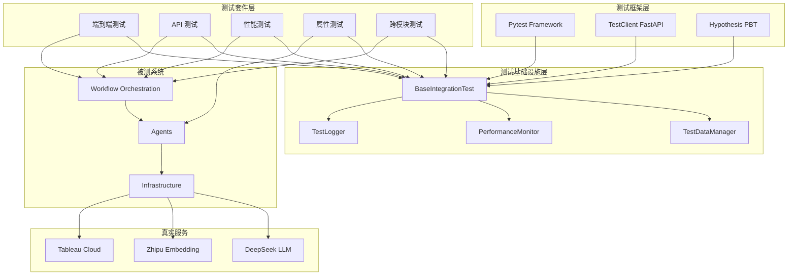
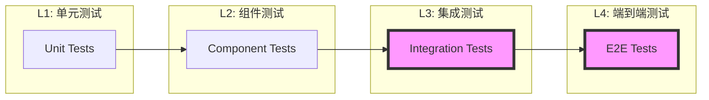
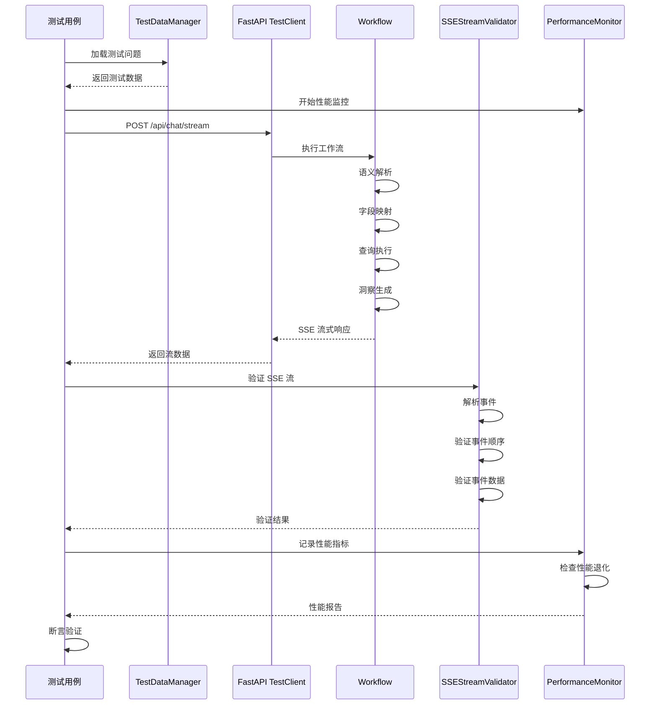
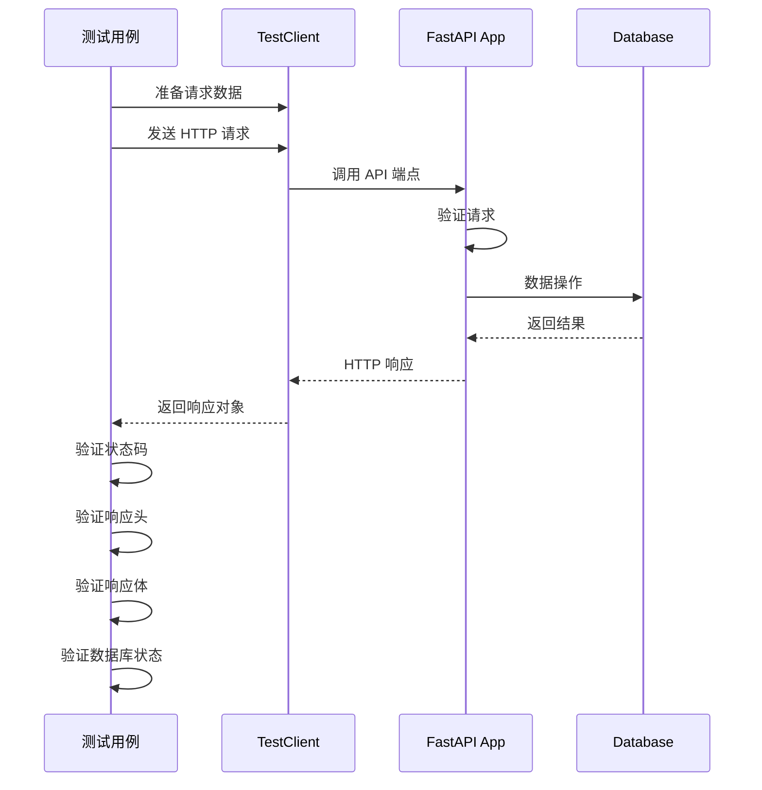
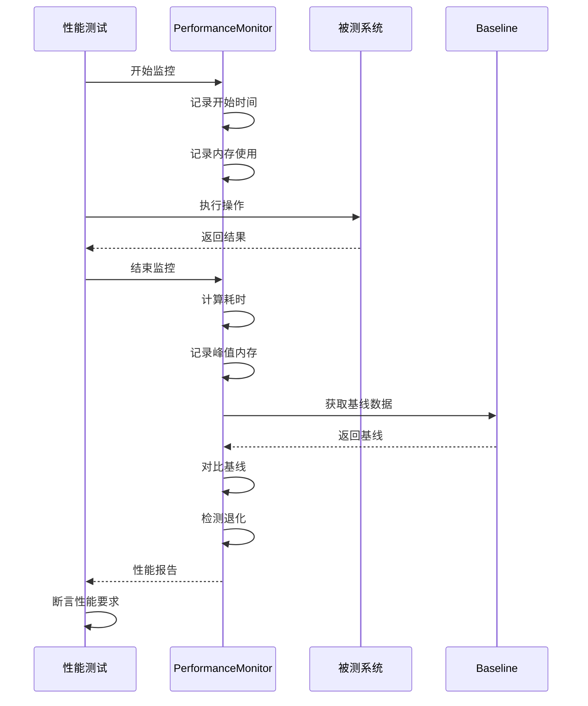
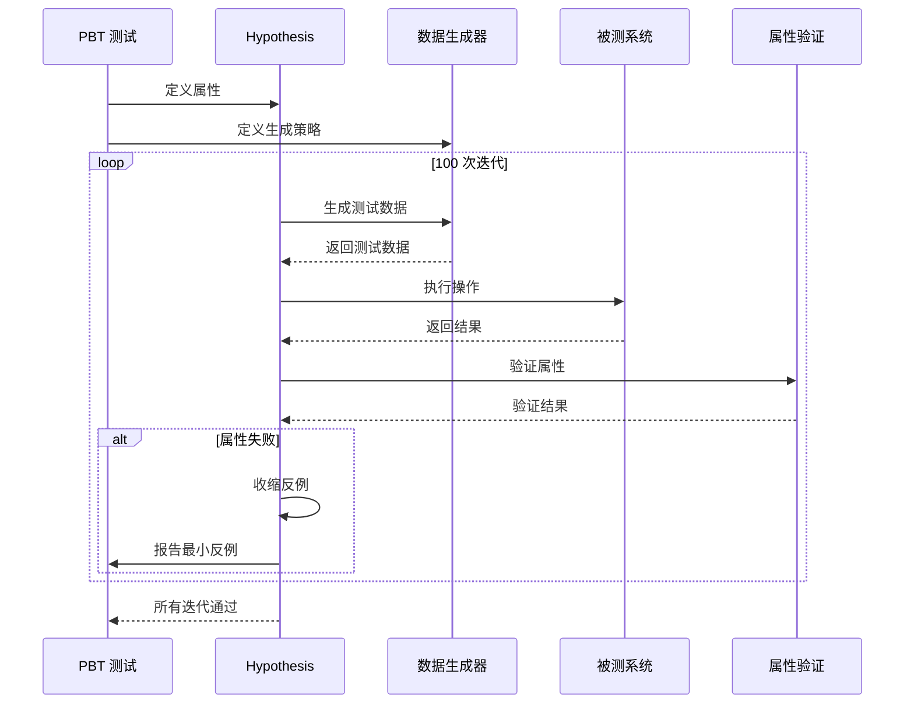

# 设计文档 - 完整集成测试套件

## 概述

本设计文档定义了 Analytics Assistant 的完整集成测试套件架构。该测试套件使用真实服务（DeepSeek LLM、Zhipu Embedding、Tableau Cloud）进行端到端测试，确保系统在生产环境下的可靠性和正确性。

### 设计目标

1. **真实性**: 使用真实外部服务，而非 Mock，确保测试结果反映生产环境
2. **完整性**: 覆盖从用户问题到数据洞察的完整流程
3. **可维护性**: 清晰的测试组织结构，易于扩展和维护
4. **可重复性**: 标准化的测试数据和环境配置，确保测试结果可重复
5. **性能监控**: 建立性能基准，持续监控系统性能
6. **自动化**: 支持 CI/CD 集成，自动化回归测试

### 核心原则

- **禁止 Mock 外部服务**: 集成测试必须使用真实的 LLM、Embedding、Tableau 服务
- **独立测试数据库**: 使用独立的测试数据库，避免污染生产数据
- **测试隔离**: 每个测试独立运行，互不影响
- **详细日志**: 记录详细的测试日志，便于问题排查
- **性能追踪**: 记录每个测试的性能指标，建立性能基线

## 架构设计

### 整体架构



### 测试层次结构



**本设计文档关注 L3（集成测试）和 L4（端到端测试）**

## 组件设计

### 1. BaseIntegrationTest 基类

所有集成测试的基类，提供通用的测试基础设施。

```python
# analytics_assistant/tests/integration/base.py

from abc import ABC
from typing import Optional, Dict, Any
import logging
import time
from pathlib import Path

from analytics_assistant.src.infra.config import get_config
from analytics_assistant.src.infra.storage import get_kv_store
from analytics_assistant.src.infra.ai import get_llm, get_embeddings
from analytics_assistant.src.platform.tableau.adapter import TableauAdapter
from analytics_assistant.src.orchestration.workflow.context import WorkflowContext


class BaseIntegrationTest(ABC):
    """集成测试基类
    
    提供：
    - 真实服务连接管理
    - 测试数据库隔离
    - 性能指标收集
    - 测试日志记录
    - 测试前后清理
    """
    
    # 类级别的共享资源（session scope）
    _config: Optional[Dict[str, Any]] = None
    _llm = None
    _embeddings = None
    _tableau_adapter: Optional[TableauAdapter] = None
    _workflow_context: Optional[WorkflowContext] = None
    
    @classmethod
    def setup_class(cls):
        """类级别的设置（所有测试开始前执行一次）"""
        cls._config = get_config()
        cls._llm = get_llm()
        cls._embeddings = get_embeddings()
        cls._setup_test_database()
        cls._setup_test_logger()
    
    @classmethod
    def teardown_class(cls):
        """类级别的清理（所有测试结束后执行一次）"""
        cls._cleanup_test_database()
    
    def setup_method(self):
        """方法级别的设置（每个测试开始前执行）"""
        self._start_time = time.time()
        self._test_metrics = {}
        self._setup_workflow_context()
    
    def teardown_method(self):
        """方法级别的清理（每个测试结束后执行）"""
        elapsed = time.time() - self._start_time
        self._test_metrics["elapsed_time"] = elapsed
        self._log_test_metrics()
    
    @classmethod
    def _setup_test_database(cls):
        """设置独立的测试数据库"""
        # 使用测试专用的数据库路径
        test_db_path = Path("analytics_assistant/data/test_storage.db")
        # 清理旧的测试数据
        if test_db_path.exists():
            test_db_path.unlink()
    
    @classmethod
    def _cleanup_test_database(cls):
        """清理测试数据库"""
        test_db_path = Path("analytics_assistant/data/test_storage.db")
        if test_db_path.exists():
            test_db_path.unlink()
    
    @classmethod
    def _setup_test_logger(cls):
        """设置测试日志"""
        log_path = Path("analytics_assistant/tests/test_outputs/integration_tests.log")
        log_path.parent.mkdir(parents=True, exist_ok=True)
        
        logging.basicConfig(
            level=logging.DEBUG,
            format="%(asctime)s - %(name)s - %(levelname)s - %(message)s",
            handlers=[
                logging.FileHandler(log_path),
                logging.StreamHandler(),
            ],
        )
    
    def _setup_workflow_context(self):
        """设置工作流上下文"""
        # 每个测试使用独立的 WorkflowContext
        self._workflow_context = WorkflowContext(
            datasource_luid=self._get_test_datasource_luid(),
        )
    
    def _get_test_datasource_luid(self) -> str:
        """获取测试数据源 LUID"""
        # 从配置中读取测试数据源
        return self._config.get("tableau", {}).get("test_datasource_luid", "")
    
    def _log_test_metrics(self):
        """记录测试指标"""
        logger = logging.getLogger(self.__class__.__name__)
        logger.info(f"Test metrics: {self._test_metrics}")
    
    def _record_metric(self, name: str, value: Any):
        """记录性能指标"""
        self._test_metrics[name] = value
```

### 2. TestDataManager 测试数据管理器

管理测试数据的加载、验证和清理。

```python
# analytics_assistant/tests/integration/test_data_manager.py

from typing import List, Dict, Any, Optional
from pathlib import Path
import yaml
import json
from pydantic import BaseModel


class TestQuestion(BaseModel):
    """测试问题模型"""
    id: str
    question: str
    category: str  # simple, complex, time_series, etc.
    expected_intent: str
    expected_dimensions: List[str]
    expected_measures: List[str]
    expected_filters: Optional[List[Dict[str, Any]]] = None
    expected_confidence_min: float = 0.7
    description: str


class TestDataManager:
    """测试数据管理器
    
    职责：
    - 加载测试问题和预期结果
    - 验证测试数据的完整性
    - 提供测试数据查询接口
    """
    
    def __init__(self, data_dir: Path):
        self.data_dir = data_dir
        self._questions: List[TestQuestion] = []
        self._load_test_data()
    
    def _load_test_data(self):
        """加载测试数据"""
        questions_file = self.data_dir / "questions.yaml"
        if not questions_file.exists():
            raise FileNotFoundError(f"测试数据文件不存在: {questions_file}")
        
        with open(questions_file, "r", encoding="utf-8") as f:
            data = yaml.safe_load(f)
        
        self._questions = [TestQuestion(**q) for q in data.get("questions", [])]
    
    def get_questions_by_category(self, category: str) -> List[TestQuestion]:
        """按类别获取测试问题"""
        return [q for q in self._questions if q.category == category]
    
    def get_question_by_id(self, question_id: str) -> Optional[TestQuestion]:
        """按 ID 获取测试问题"""
        for q in self._questions:
            if q.id == question_id:
                return q
        return None
    
    def get_all_questions(self) -> List[TestQuestion]:
        """获取所有测试问题"""
        return self._questions
```

### 3. PerformanceMonitor 性能监控器

收集和分析性能指标。

```python
# analytics_assistant/tests/integration/performance_monitor.py

from typing import Dict, Any, List
from dataclasses import dataclass, field
from datetime import datetime
import json
from pathlib import Path


@dataclass
class PerformanceMetric:
    """性能指标"""
    test_name: str
    timestamp: datetime
    elapsed_time: float
    memory_usage_mb: float
    llm_calls: int = 0
    embedding_calls: int = 0
    tableau_calls: int = 0
    cache_hits: int = 0
    cache_misses: int = 0
    metadata: Dict[str, Any] = field(default_factory=dict)


class PerformanceMonitor:
    """性能监控器
    
    职责：
    - 收集性能指标
    - 存储性能数据
    - 分析性能趋势
    - 检测性能退化
    """
    
    def __init__(self, output_dir: Path):
        self.output_dir = output_dir
        self.output_dir.mkdir(parents=True, exist_ok=True)
        self._metrics: List[PerformanceMetric] = []
    
    def record_metric(self, metric: PerformanceMetric):
        """记录性能指标"""
        self._metrics.append(metric)
    
    def save_metrics(self):
        """保存性能指标到文件"""
        output_file = self.output_dir / f"performance_{datetime.now().strftime('%Y%m%d_%H%M%S')}.json"
        
        data = [
            {
                "test_name": m.test_name,
                "timestamp": m.timestamp.isoformat(),
                "elapsed_time": m.elapsed_time,
                "memory_usage_mb": m.memory_usage_mb,
                "llm_calls": m.llm_calls,
                "embedding_calls": m.embedding_calls,
                "tableau_calls": m.tableau_calls,
                "cache_hits": m.cache_hits,
                "cache_misses": m.cache_misses,
                "metadata": m.metadata,
            }
            for m in self._metrics
        ]
        
        with open(output_file, "w", encoding="utf-8") as f:
            json.dump(data, f, indent=2, ensure_ascii=False)
    
    def get_baseline(self, test_name: str) -> Optional[PerformanceMetric]:
        """获取性能基线"""
        # 从历史数据中获取基线
        baseline_file = self.output_dir / "baseline.json"
        if not baseline_file.exists():
            return None
        
        with open(baseline_file, "r", encoding="utf-8") as f:
            baselines = json.load(f)
        
        return baselines.get(test_name)
    
    def check_regression(self, metric: PerformanceMetric, threshold: float = 1.2) -> bool:
        """检查性能退化
        
        Args:
            metric: 当前性能指标
            threshold: 退化阈值（如 1.2 表示慢 20% 视为退化）
        
        Returns:
            True 如果检测到性能退化
        """
        baseline = self.get_baseline(metric.test_name)
        if baseline is None:
            return False
        
        return metric.elapsed_time > baseline.elapsed_time * threshold
```


### 4. SSEStreamValidator SSE 流式响应验证器

验证 SSE 流式响应的正确性。

```python
# analytics_assistant/tests/integration/sse_validator.py

from typing import List, Dict, Any, Optional
from dataclasses import dataclass
import json


@dataclass
class SSEEvent:
    """SSE 事件"""
    event: str
    data: Dict[str, Any]
    id: Optional[str] = None


class SSEStreamValidator:
    """SSE 流式响应验证器
    
    职责：
    - 解析 SSE 流
    - 验证事件顺序
    - 验证事件数据完整性
    - 验证流式响应的正确性
    """
    
    def __init__(self):
        self.events: List[SSEEvent] = []
    
    def parse_sse_stream(self, stream_text: str) -> List[SSEEvent]:
        """解析 SSE 流文本
        
        Args:
            stream_text: SSE 流文本（包含多个事件）
        
        Returns:
            解析后的事件列表
        """
        events = []
        current_event = {}
        
        for line in stream_text.split("\n"):
            line = line.strip()
            
            if not line:
                # 空行表示事件结束
                if current_event:
                    events.append(self._create_event(current_event))
                    current_event = {}
                continue
            
            if line.startswith("event:"):
                current_event["event"] = line[6:].strip()
            elif line.startswith("data:"):
                data_str = line[5:].strip()
                try:
                    current_event["data"] = json.loads(data_str)
                except json.JSONDecodeError:
                    current_event["data"] = data_str
            elif line.startswith("id:"):
                current_event["id"] = line[3:].strip()
        
        # 处理最后一个事件
        if current_event:
            events.append(self._create_event(current_event))
        
        self.events = events
        return events
    
    def _create_event(self, event_dict: Dict[str, Any]) -> SSEEvent:
        """创建 SSE 事件对象"""
        return SSEEvent(
            event=event_dict.get("event", "message"),
            data=event_dict.get("data", {}),
            id=event_dict.get("id"),
        )
    
    def validate_event_sequence(self, expected_sequence: List[str]) -> bool:
        """验证事件顺序
        
        Args:
            expected_sequence: 期望的事件类型序列
        
        Returns:
            True 如果事件顺序正确
        """
        actual_sequence = [e.event for e in self.events]
        return actual_sequence == expected_sequence
    
    def validate_event_data(self, event_type: str, validator_func) -> bool:
        """验证特定类型事件的数据
        
        Args:
            event_type: 事件类型
            validator_func: 验证函数，接收事件数据，返回 bool
        
        Returns:
            True 如果所有该类型事件的数据都通过验证
        """
        for event in self.events:
            if event.event == event_type:
                if not validator_func(event.data):
                    return False
        return True
    
    def get_events_by_type(self, event_type: str) -> List[SSEEvent]:
        """获取特定类型的所有事件"""
        return [e for e in self.events if e.event == event_type]
    
    def has_error_event(self) -> bool:
        """检查是否有错误事件"""
        return any(e.event == "error" for e in self.events)
    
    def get_final_result(self) -> Optional[Dict[str, Any]]:
        """获取最终结果（通常是最后一个 done 事件的数据）"""
        done_events = self.get_events_by_type("done")
        if done_events:
            return done_events[-1].data
        return None
```

### 5. AsyncTestHelper 异步测试辅助器

简化异步测试的编写。

```python
# analytics_assistant/tests/integration/async_helper.py

import asyncio
from typing import Coroutine, Any, Optional
from functools import wraps


class AsyncTestHelper:
    """异步测试辅助器
    
    职责：
    - 提供异步测试装饰器
    - 处理超时控制
    - 处理异步异常
    """
    
    @staticmethod
    def async_test(timeout: float = 60.0):
        """异步测试装饰器
        
        Args:
            timeout: 超时时间（秒）
        
        Usage:
            @AsyncTestHelper.async_test(timeout=30.0)
            async def test_something(self):
                result = await some_async_function()
                assert result is not None
        """
        def decorator(func):
            @wraps(func)
            def wrapper(*args, **kwargs):
                coro = func(*args, **kwargs)
                return asyncio.run(
                    asyncio.wait_for(coro, timeout=timeout)
                )
            return wrapper
        return decorator
    
    @staticmethod
    async def run_with_timeout(
        coro: Coroutine,
        timeout: float,
        error_message: str = "操作超时",
    ) -> Any:
        """运行协程并设置超时
        
        Args:
            coro: 协程对象
            timeout: 超时时间（秒）
            error_message: 超时错误消息
        
        Returns:
            协程的返回值
        
        Raises:
            asyncio.TimeoutError: 如果超时
        """
        try:
            return await asyncio.wait_for(coro, timeout=timeout)
        except asyncio.TimeoutError:
            raise asyncio.TimeoutError(error_message)
    
    @staticmethod
    async def gather_with_timeout(
        *coros: Coroutine,
        timeout: float,
        return_exceptions: bool = False,
    ) -> List[Any]:
        """并发运行多个协程并设置超时
        
        Args:
            *coros: 协程对象列表
            timeout: 超时时间（秒）
            return_exceptions: 是否返回异常而非抛出
        
        Returns:
            所有协程的返回值列表
        """
        return await asyncio.wait_for(
            asyncio.gather(*coros, return_exceptions=return_exceptions),
            timeout=timeout,
        )
```

## 数据模型设计

### 测试数据模型

```python
# analytics_assistant/tests/integration/schemas.py

from typing import List, Dict, Any, Optional
from pydantic import BaseModel, Field
from datetime import datetime


class TestQuestion(BaseModel):
    """测试问题"""
    id: str = Field(..., description="问题唯一标识")
    question: str = Field(..., description="用户问题文本")
    category: str = Field(..., description="问题类别")
    expected_intent: str = Field(..., description="期望的意图")
    expected_dimensions: List[str] = Field(default_factory=list, description="期望的维度字段")
    expected_measures: List[str] = Field(default_factory=list, description="期望的度量字段")
    expected_filters: Optional[List[Dict[str, Any]]] = Field(None, description="期望的筛选条件")
    expected_confidence_min: float = Field(0.7, description="最低置信度")
    description: str = Field(..., description="测试目的说明")
    tags: List[str] = Field(default_factory=list, description="测试标签")


class ExpectedSemanticOutput(BaseModel):
    """期望的语义解析输出"""
    intent: str
    dimensions: List[str]
    measures: List[str]
    filters: Optional[List[Dict[str, Any]]] = None
    sort: Optional[Dict[str, str]] = None
    limit: Optional[int] = None
    computations: Optional[List[Dict[str, Any]]] = None
    confidence: float


class TestResult(BaseModel):
    """测试结果"""
    test_id: str
    test_name: str
    status: str  # passed, failed, skipped, error
    elapsed_time: float
    error_message: Optional[str] = None
    error_traceback: Optional[str] = None
    metrics: Dict[str, Any] = Field(default_factory=dict)
    timestamp: datetime = Field(default_factory=datetime.now)


class PerformanceBenchmark(BaseModel):
    """性能基准"""
    test_name: str
    baseline_time: float
    max_time: float
    avg_time: float
    p95_time: float
    p99_time: float
    memory_baseline_mb: float
    memory_max_mb: float


class TestReport(BaseModel):
    """测试报告"""
    total_tests: int
    passed: int
    failed: int
    skipped: int
    errors: int
    total_time: float
    test_results: List[TestResult]
    performance_benchmarks: List[PerformanceBenchmark]
    timestamp: datetime = Field(default_factory=datetime.now)
```

### 测试配置模型

```python
# analytics_assistant/tests/integration/config.py

from typing import Optional, Dict, Any
from pydantic import BaseModel, Field


class TestConfig(BaseModel):
    """测试配置"""
    
    # 测试模式
    mode: str = Field("integration", description="测试模式: integration, quick, full")
    
    # 超时配置
    default_timeout: float = Field(60.0, description="默认超时时间（秒）")
    semantic_parsing_timeout: float = Field(30.0, description="语义解析超时")
    field_mapping_timeout: float = Field(20.0, description="字段映射超时")
    query_execution_timeout: float = Field(30.0, description="查询执行超时")
    
    # 数据库配置
    test_database_path: str = Field(
        "analytics_assistant/data/test_storage.db",
        description="测试数据库路径",
    )
    
    # 日志配置
    log_level: str = Field("DEBUG", description="日志级别")
    log_path: str = Field(
        "analytics_assistant/tests/test_outputs/integration_tests.log",
        description="日志文件路径",
    )
    
    # 性能配置
    enable_performance_monitoring: bool = Field(True, description="启用性能监控")
    performance_regression_threshold: float = Field(1.2, description="性能退化阈值")
    
    # 并发配置
    max_concurrent_tests: int = Field(5, description="最大并发测试数")
    
    # 重试配置
    max_retries: int = Field(3, description="最大重试次数")
    retry_delay: float = Field(1.0, description="重试延迟（秒）")
    
    # 测试数据配置
    test_data_dir: str = Field(
        "analytics_assistant/tests/integration/test_data",
        description="测试数据目录",
    )
    
    # Tableau 配置
    test_datasource_luid: str = Field(..., description="测试数据源 LUID")
    
    # 报告配置
    generate_html_report: bool = Field(True, description="生成 HTML 报告")
    generate_junit_xml: bool = Field(True, description="生成 JUnit XML 报告")
```

## 测试流程设计

### 端到端测试流程



### API 测试流程



### 性能测试流程




### PBT 测试流程



## 配置管理设计

### 测试配置文件结构

```yaml
# analytics_assistant/tests/integration/test_config.yaml

# 测试模式
mode: integration  # integration, quick, full

# 超时配置
timeouts:
  default: 60.0
  semantic_parsing: 30.0
  field_mapping: 20.0
  query_execution: 30.0
  insight_generation: 120.0

# 数据库配置
database:
  test_storage: analytics_assistant/data/test_storage.db
  test_data_model: analytics_assistant/data/test_data_model.db
  test_field_semantic: analytics_assistant/data/test_field_semantic.db

# 日志配置
logging:
  level: DEBUG
  file: analytics_assistant/tests/test_outputs/integration_tests.log
  format: "%(asctime)s - %(name)s - %(levelname)s - %(message)s"

# 性能配置
performance:
  enable_monitoring: true
  regression_threshold: 1.2  # 慢 20% 视为退化
  baseline_file: analytics_assistant/tests/test_outputs/performance_baseline.json

# 并发配置
concurrency:
  max_concurrent_tests: 5
  max_concurrent_queries: 3

# 重试配置
retry:
  max_retries: 3
  retry_delay: 1.0
  exponential_backoff: true

# 测试数据配置
test_data:
  dir: analytics_assistant/tests/integration/test_data
  questions_file: questions.yaml
  expected_outputs_file: expected_outputs.yaml
  edge_cases_file: edge_cases.yaml

# Tableau 配置（从环境变量读取）
tableau:
  test_datasource_luid: ${TEST_DATASOURCE_LUID}
  domain: ${TABLEAU_DOMAIN}
  site: ${TABLEAU_SITE}

# 报告配置
reporting:
  output_dir: analytics_assistant/tests/test_outputs
  generate_html: true
  generate_junit_xml: true
  generate_coverage: true

# PBT 配置
hypothesis:
  max_examples: 100
  deadline: 60000  # 毫秒
  verbosity: normal
  database_file: analytics_assistant/tests/.hypothesis/examples
```

### 配置加载器

```python
# analytics_assistant/tests/integration/config_loader.py

from typing import Dict, Any, Optional
from pathlib import Path
import yaml
import os


class TestConfigLoader:
    """测试配置加载器
    
    职责：
    - 加载测试配置文件
    - 支持环境变量覆盖
    - 验证配置完整性
    """
    
    _config: Optional[Dict[str, Any]] = None
    
    @classmethod
    def load_config(cls, config_path: Optional[Path] = None) -> Dict[str, Any]:
        """加载测试配置
        
        Args:
            config_path: 配置文件路径，默认使用 test_config.yaml
        
        Returns:
            配置字典
        """
        if cls._config is not None:
            return cls._config
        
        if config_path is None:
            config_path = Path(__file__).parent / "test_config.yaml"
        
        with open(config_path, "r", encoding="utf-8") as f:
            config = yaml.safe_load(f)
        
        # 环境变量替换
        cls._replace_env_vars(config)
        
        # 验证配置
        cls._validate_config(config)
        
        cls._config = config
        return config
    
    @classmethod
    def _replace_env_vars(cls, config: Dict[str, Any]):
        """递归替换环境变量
        
        支持 ${VAR_NAME} 语法
        """
        for key, value in config.items():
            if isinstance(value, dict):
                cls._replace_env_vars(value)
            elif isinstance(value, str) and value.startswith("${") and value.endswith("}"):
                env_var = value[2:-1]
                config[key] = os.environ.get(env_var, value)
    
    @classmethod
    def _validate_config(cls, config: Dict[str, Any]):
        """验证配置完整性"""
        required_keys = ["mode", "timeouts", "database", "test_data"]
        for key in required_keys:
            if key not in config:
                raise ValueError(f"配置缺少必需的键: {key}")
    
    @classmethod
    def get_timeout(cls, operation: str) -> float:
        """获取操作超时时间
        
        Args:
            operation: 操作名称（如 semantic_parsing）
        
        Returns:
            超时时间（秒）
        """
        config = cls.load_config()
        timeouts = config.get("timeouts", {})
        return timeouts.get(operation, timeouts.get("default", 60.0))
    
    @classmethod
    def get_test_data_dir(cls) -> Path:
        """获取测试数据目录"""
        config = cls.load_config()
        return Path(config["test_data"]["dir"])
```

## 错误处理设计

### 错误分类

```python
# analytics_assistant/tests/integration/exceptions.py

class TestError(Exception):
    """测试错误基类"""
    pass


class TestSetupError(TestError):
    """测试设置错误"""
    pass


class TestDataError(TestError):
    """测试数据错误"""
    pass


class TestTimeoutError(TestError):
    """测试超时错误"""
    pass


class TestValidationError(TestError):
    """测试验证错误"""
    pass


class TestEnvironmentError(TestError):
    """测试环境错误"""
    pass
```

### 错误处理策略

```python
# analytics_assistant/tests/integration/error_handler.py

from typing import Optional, Callable, Any
import logging
import traceback
from functools import wraps


class TestErrorHandler:
    """测试错误处理器
    
    职责：
    - 捕获和记录测试错误
    - 提供错误恢复机制
    - 生成详细的错误报告
    """
    
    def __init__(self, logger: Optional[logging.Logger] = None):
        self.logger = logger or logging.getLogger(__name__)
    
    def handle_test_error(
        self,
        error: Exception,
        test_name: str,
        context: Optional[Dict[str, Any]] = None,
    ) -> Dict[str, Any]:
        """处理测试错误
        
        Args:
            error: 异常对象
            test_name: 测试名称
            context: 错误上下文
        
        Returns:
            错误报告字典
        """
        error_report = {
            "test_name": test_name,
            "error_type": type(error).__name__,
            "error_message": str(error),
            "traceback": traceback.format_exc(),
            "context": context or {},
        }
        
        self.logger.error(
            f"测试失败: {test_name}\n"
            f"错误类型: {error_report['error_type']}\n"
            f"错误消息: {error_report['error_message']}\n"
            f"上下文: {error_report['context']}"
        )
        
        return error_report
    
    @staticmethod
    def with_retry(max_retries: int = 3, delay: float = 1.0):
        """重试装饰器
        
        Args:
            max_retries: 最大重试次数
            delay: 重试延迟（秒）
        """
        def decorator(func: Callable) -> Callable:
            @wraps(func)
            async def wrapper(*args, **kwargs):
                last_error = None
                for attempt in range(max_retries):
                    try:
                        return await func(*args, **kwargs)
                    except Exception as e:
                        last_error = e
                        if attempt < max_retries - 1:
                            await asyncio.sleep(delay * (2 ** attempt))
                        else:
                            raise last_error
            return wrapper
        return decorator
    
    def save_failure_snapshot(
        self,
        test_name: str,
        state: Dict[str, Any],
        output_dir: Path,
    ):
        """保存失败时的状态快照
        
        Args:
            test_name: 测试名称
            state: 状态数据
            output_dir: 输出目录
        """
        snapshot_file = output_dir / f"{test_name}_failure_snapshot.json"
        
        with open(snapshot_file, "w", encoding="utf-8") as f:
            json.dump(state, f, indent=2, ensure_ascii=False, default=str)
        
        self.logger.info(f"失败快照已保存: {snapshot_file}")
```

## 测试策略设计

### 测试分层策略

```python
# analytics_assistant/tests/integration/test_strategy.py

from enum import Enum
from typing import List, Set


class TestLevel(Enum):
    """测试级别"""
    SMOKE = "smoke"  # 冒烟测试（最核心功能）
    CORE = "core"    # 核心测试（主要功能）
    FULL = "full"    # 完整测试（所有功能）


class TestCategory(Enum):
    """测试类别"""
    E2E = "e2e"                    # 端到端测试
    API = "api"                    # API 测试
    PERFORMANCE = "performance"    # 性能测试
    PBT = "pbt"                    # 属性测试
    CROSS_MODULE = "cross_module"  # 跨模块测试


class TestStrategy:
    """测试策略
    
    定义不同模式下运行哪些测试
    """
    
    # 冒烟测试（< 5 分钟）
    SMOKE_TESTS: Set[str] = {
        "test_simple_query_e2e",
        "test_health_endpoint",
        "test_create_session",
    }
    
    # 核心测试（< 15 分钟）
    CORE_TESTS: Set[str] = {
        *SMOKE_TESTS,
        "test_complex_query_e2e",
        "test_field_mapping_accuracy",
        "test_query_execution",
        "test_all_api_endpoints",
        "test_error_handling",
    }
    
    # 完整测试（< 30 分钟）
    FULL_TESTS: Set[str] = {
        *CORE_TESTS,
        "test_insight_generation",
        "test_performance_benchmarks",
        "test_pbt_round_trip",
        "test_pbt_invariants",
        "test_cross_module_integration",
        "test_multi_scenario",
    }
    
    @classmethod
    def get_tests_for_level(cls, level: TestLevel) -> Set[str]:
        """获取指定级别的测试集"""
        if level == TestLevel.SMOKE:
            return cls.SMOKE_TESTS
        elif level == TestLevel.CORE:
            return cls.CORE_TESTS
        elif level == TestLevel.FULL:
            return cls.FULL_TESTS
        else:
            return set()
    
    @classmethod
    def get_tests_for_category(cls, category: TestCategory) -> Set[str]:
        """获取指定类别的测试集"""
        # 根据测试文件名前缀过滤
        prefix_map = {
            TestCategory.E2E: "test_e2e_",
            TestCategory.API: "test_api_",
            TestCategory.PERFORMANCE: "test_performance_",
            TestCategory.PBT: "test_pbt_",
            TestCategory.CROSS_MODULE: "test_cross_module_",
        }
        
        prefix = prefix_map.get(category, "")
        return {t for t in cls.FULL_TESTS if t.startswith(prefix)}
```


## Correctness Properties

*属性（Property）是一个特征或行为，应该在系统的所有有效执行中保持为真——本质上是关于系统应该做什么的形式化陈述。属性是人类可读规范和机器可验证正确性保证之间的桥梁。*

### 属性反思（Property Reflection）

在定义正确性属性之前，我们需要识别并消除冗余的属性。通过分析 prework 结果，我们发现以下可以合并的属性：

**冗余分析：**

1. **性能属性合并**: 需求 1.10、2.8、7.1-7.8 都是关于操作耗时的性能要求，可以合并为一个综合的性能属性
2. **Round Trip 属性合并**: 需求 9.1（SemanticOutput）、9.7（缓存）、9.9（配置）都是 Round Trip 属性，可以合并为一个泛型的序列化往返属性
3. **不变量属性合并**: 需求 9.2（置信度范围）、9.3（行数限制）、9.4（筛选条件）、9.5（排序顺序）都是数据不变量，可以按类型分组
4. **错误处理属性合并**: 需求 6.9（错误日志）、6.10（错误消息）、5.12（API 错误）都是关于错误处理的一致性，可以合并

**合并后的属性列表：**

- 属性 1: 序列化往返对称性（合并 9.1, 9.7, 9.9）
- 属性 2: 数据范围不变量（合并 9.2, 9.3）
- 属性 3: 筛选结果不变量（9.4）
- 属性 4: 排序结果不变量（9.5）
- 属性 5: 聚合结果一致性（9.6）
- 属性 6: 幂等操作不变量（9.8）
- 属性 7: Schema 一致性（1.9, 8.5）
- 属性 8: 错误处理一致性（合并 5.12, 6.9, 6.10）
- 属性 9: 性能要求（合并 1.10, 2.8, 7.1-7.8）
- 属性 10: API 响应格式一致性（5.11）

### 属性定义

基于 prework 分析和属性反思，我们定义以下正确性属性：

#### 属性 1: 序列化往返对称性

*For any* 可序列化的数据对象（SemanticOutput、配置、缓存值），序列化后再反序列化应该得到等价的对象。

**验证: 需求 9.1, 9.7, 9.9, 14.4**

**测试策略**: 使用 Hypothesis 生成随机的数据对象，验证 `deserialize(serialize(obj)) == obj`

**实现示例**:
```python
@given(semantic_output=semantic_output_strategy())
def test_semantic_output_round_trip(semantic_output):
    json_str = semantic_output.model_dump_json()
    parsed = SemanticOutput.model_validate_json(json_str)
    assert parsed == semantic_output
```

#### 属性 2: 数据范围不变量

*For any* 系统输出的数值数据，应该满足预定义的范围约束：
- 置信度分数在 [0.0, 1.0] 范围内
- 查询结果行数 <= LIMIT 参数（如果指定）
- 相似度分数在 [0.0, 1.0] 范围内

**验证: 需求 1.8, 9.2, 9.3**

**测试策略**: 使用 Hypothesis 生成随机输入，验证所有输出满足范围约束

**实现示例**:
```python
@given(query=query_strategy(), limit=st.integers(min_value=1, max_value=1000))
async def test_query_result_limit_invariant(query, limit):
    result = await execute_query(query, limit=limit)
    assert len(result.rows) <= limit

@given(mapping_result=mapping_result_strategy())
def test_confidence_range_invariant(mapping_result):
    assert 0.0 <= mapping_result.confidence <= 1.0
```

#### 属性 3: 筛选结果不变量

*For any* 查询结果和筛选条件，筛选后的所有行都应该满足筛选条件。

**验证: 需求 9.4**

**测试策略**: 使用 Hypothesis 生成随机的查询结果和筛选条件，验证所有筛选后的行满足条件

**实现示例**:
```python
@given(
    query_result=query_result_strategy(),
    filter_condition=filter_condition_strategy(),
)
def test_filter_result_invariant(query_result, filter_condition):
    filtered = apply_filter(query_result, filter_condition)
    for row in filtered.rows:
        assert row_satisfies_condition(row, filter_condition)
```

#### 属性 4: 排序结果不变量

*For any* 查询结果和排序规则，排序后的相邻行应该满足排序顺序。

**验证: 需求 9.5**

**测试策略**: 使用 Hypothesis 生成随机的查询结果和排序规则，验证排序后的顺序正确

**实现示例**:
```python
@given(
    query_result=query_result_strategy(),
    sort_field=st.text(),
    sort_order=st.sampled_from(["asc", "desc"]),
)
def test_sort_result_invariant(query_result, sort_field, sort_order):
    sorted_result = apply_sort(query_result, sort_field, sort_order)
    for i in range(len(sorted_result.rows) - 1):
        current = sorted_result.rows[i][sort_field]
        next_val = sorted_result.rows[i + 1][sort_field]
        if sort_order == "asc":
            assert current <= next_val
        else:
            assert current >= next_val
```

#### 属性 5: 聚合结果一致性

*For any* 原始数据和聚合函数，系统计算的聚合结果应该与简单模型计算的结果一致（在浮点误差范围内）。

**验证: 需求 9.6**

**测试策略**: 使用 Hypothesis 生成随机数据，对比系统聚合结果和简单 Python 实现的结果

**实现示例**:
```python
@given(
    data=st.lists(st.floats(allow_nan=False, allow_infinity=False), min_size=1),
    agg_func=st.sampled_from(["sum", "avg", "count", "min", "max"]),
)
async def test_aggregation_consistency(data, agg_func):
    # 系统计算
    system_result = await compute_aggregation(data, agg_func)
    
    # 简单模型计算
    model_result = {
        "sum": sum(data),
        "avg": sum(data) / len(data),
        "count": len(data),
        "min": min(data),
        "max": max(data),
    }[agg_func]
    
    # 浮点误差容忍
    assert abs(system_result - model_result) < 1e-6
```

#### 属性 6: 幂等操作不变量

*For any* 幂等操作（如创建索引、设置缓存），重复执行应该产生相同的结果。

**验证: 需求 9.8**

**测试策略**: 使用 Hypothesis 生成随机操作参数，验证重复执行的结果一致

**实现示例**:
```python
@given(index_name=st.text(min_size=1), documents=documents_strategy())
async def test_index_creation_idempotence(index_name, documents):
    # 第一次创建
    await create_index(index_name, documents)
    result1 = await get_index(index_name)
    
    # 第二次创建（应该是幂等的）
    await create_index(index_name, documents)
    result2 = await get_index(index_name)
    
    assert result1 == result2

@given(key=st.text(), value=st.text())
async def test_cache_set_idempotence(key, value):
    await cache.set(key, value)
    result1 = await cache.get(key)
    
    await cache.set(key, value)  # 重复设置
    result2 = await cache.get(key)
    
    assert result1 == result2 == value
```

#### 属性 7: Schema 一致性

*For any* 系统解析或生成的字段名称，都应该存在于数据源的 Schema 中。

**验证: 需求 1.9, 8.5**

**测试策略**: 使用真实的数据源 Schema，验证所有字段名称都在 Schema 中

**实现示例**:
```python
@given(question=question_strategy())
async def test_parsed_fields_in_schema(question, datasource_schema):
    semantic_output = await parse_question(question)
    
    all_fields = (
        semantic_output.dimensions +
        semantic_output.measures +
        [f.field_name for f in semantic_output.filters or []]
    )
    
    for field in all_fields:
        assert field in datasource_schema.field_names
```

#### 属性 8: 错误处理一致性

*For any* 错误情况，系统应该：
1. 返回适当的 HTTP 状态码（API 错误）
2. 记录详细的错误日志
3. 返回用户友好的错误消息

**验证: 需求 5.12, 6.9, 6.10**

**测试策略**: 使用 Hypothesis 生成各种错误场景，验证错误处理的一致性

**实现示例**:
```python
@given(invalid_input=invalid_input_strategy())
async def test_error_handling_consistency(invalid_input, caplog):
    with pytest.raises(Exception) as exc_info:
        await process_input(invalid_input)
    
    # 验证错误日志
    assert len(caplog.records) > 0
    assert "error" in caplog.text.lower()
    
    # 验证错误消息
    error_message = str(exc_info.value)
    assert len(error_message) > 0
    assert not error_message.startswith("Traceback")  # 不应该是原始堆栈
```

#### 属性 9: 性能要求

*For any* 系统操作，应该在规定的时间内完成：
- 语义解析: <= 30 秒
- 字段映射: <= 20 秒
- 查询执行: <= 30 秒
- 端到端流程: <= 60 秒

**验证: 需求 1.10, 2.8, 7.1-7.8**

**测试策略**: 使用真实输入测试，记录执行时间并验证是否满足要求

**实现示例**:
```python
@given(question=question_strategy())
async def test_semantic_parsing_performance(question):
    start_time = time.time()
    result = await parse_question(question)
    elapsed = time.time() - start_time
    
    assert elapsed <= 30.0, f"语义解析超时: {elapsed:.2f}s"

@given(question=question_strategy())
async def test_e2e_performance(question):
    start_time = time.time()
    result = await execute_full_workflow(question)
    elapsed = time.time() - start_time
    
    assert elapsed <= 60.0, f"端到端流程超时: {elapsed:.2f}s"
```

#### 属性 10: API 响应格式一致性

*For any* API 端点，响应应该符合 OpenAPI 规范定义的 Schema。

**验证: 需求 5.11**

**测试策略**: 使用 OpenAPI Schema 验证器，验证所有 API 响应

**实现示例**:
```python
@given(
    endpoint=st.sampled_from(["/api/sessions", "/api/chat/stream", "/api/settings"]),
    request_data=request_data_strategy(),
)
async def test_api_response_schema(endpoint, request_data, openapi_spec):
    response = await client.post(endpoint, json=request_data)
    
    # 使用 OpenAPI 验证器
    validate_response(
        response=response,
        spec=openapi_spec,
        endpoint=endpoint,
    )
```

### 属性测试配置

所有属性测试应该使用以下配置：

```python
# conftest.py

from hypothesis import settings, HealthCheck

# 全局配置
settings.register_profile(
    "integration",
    max_examples=100,  # 每个属性测试运行 100 次
    deadline=60000,    # 每个测试最多 60 秒
    suppress_health_check=[HealthCheck.too_slow],  # 允许慢速测试
)

settings.load_profile("integration")
```

### 属性测试标签

每个属性测试必须使用以下标签格式：

```python
@pytest.mark.pbt
@pytest.mark.property(number=1, name="序列化往返对称性")
def test_serialization_round_trip():
    """
    Feature: comprehensive-integration-tests
    Property 1: For any 可序列化的数据对象，序列化后再反序列化应该得到等价的对象
    """
    ...
```


## 错误处理策略

### 错误分类和处理

```python
# analytics_assistant/tests/integration/error_handling.py

from enum import Enum
from typing import Dict, Any, Optional
import logging


class ErrorSeverity(Enum):
    """错误严重程度"""
    CRITICAL = "critical"  # 测试无法继续
    ERROR = "error"        # 测试失败但可以继续
    WARNING = "warning"    # 非预期但可接受
    INFO = "info"          # 信息性消息


class TestErrorCategory(Enum):
    """测试错误类别"""
    SETUP_ERROR = "setup"              # 测试设置错误
    TEARDOWN_ERROR = "teardown"        # 测试清理错误
    ASSERTION_ERROR = "assertion"      # 断言失败
    TIMEOUT_ERROR = "timeout"          # 超时错误
    SERVICE_ERROR = "service"          # 外部服务错误
    DATA_ERROR = "data"                # 测试数据错误
    ENVIRONMENT_ERROR = "environment"  # 环境配置错误


class ErrorHandler:
    """统一的错误处理器"""
    
    def __init__(self, logger: Optional[logging.Logger] = None):
        self.logger = logger or logging.getLogger(__name__)
        self.error_counts: Dict[ErrorSeverity, int] = {
            severity: 0 for severity in ErrorSeverity
        }
    
    def handle_error(
        self,
        error: Exception,
        category: TestErrorCategory,
        severity: ErrorSeverity,
        context: Optional[Dict[str, Any]] = None,
        recovery_action: Optional[str] = None,
    ) -> Dict[str, Any]:
        """处理测试错误
        
        Args:
            error: 异常对象
            category: 错误类别
            severity: 严重程度
            context: 错误上下文
            recovery_action: 恢复操作建议
        
        Returns:
            错误报告字典
        """
        self.error_counts[severity] += 1
        
        error_report = {
            "error_type": type(error).__name__,
            "error_message": str(error),
            "category": category.value,
            "severity": severity.value,
            "context": context or {},
            "recovery_action": recovery_action,
        }
        
        # 根据严重程度选择日志级别
        log_method = {
            ErrorSeverity.CRITICAL: self.logger.critical,
            ErrorSeverity.ERROR: self.logger.error,
            ErrorSeverity.WARNING: self.logger.warning,
            ErrorSeverity.INFO: self.logger.info,
        }[severity]
        
        log_method(
            f"测试错误 [{category.value}]: {error_report['error_message']}\n"
            f"上下文: {error_report['context']}\n"
            f"恢复建议: {recovery_action or '无'}"
        )
        
        return error_report
    
    def should_continue(self, severity: ErrorSeverity) -> bool:
        """判断是否应该继续测试
        
        Args:
            severity: 错误严重程度
        
        Returns:
            True 如果可以继续测试
        """
        return severity != ErrorSeverity.CRITICAL
    
    def get_error_summary(self) -> Dict[str, int]:
        """获取错误统计摘要"""
        return {
            severity.value: count
            for severity, count in self.error_counts.items()
        }
```

### 重试策略

```python
# analytics_assistant/tests/integration/retry_strategy.py

from typing import Callable, TypeVar, Optional, Type
from functools import wraps
import asyncio
import logging

T = TypeVar("T")


class RetryStrategy:
    """重试策略"""
    
    def __init__(
        self,
        max_retries: int = 3,
        initial_delay: float = 1.0,
        exponential_backoff: bool = True,
        max_delay: float = 30.0,
        retryable_exceptions: Optional[tuple] = None,
    ):
        self.max_retries = max_retries
        self.initial_delay = initial_delay
        self.exponential_backoff = exponential_backoff
        self.max_delay = max_delay
        self.retryable_exceptions = retryable_exceptions or (Exception,)
        self.logger = logging.getLogger(__name__)
    
    def __call__(self, func: Callable[..., T]) -> Callable[..., T]:
        """装饰器：为函数添加重试逻辑"""
        @wraps(func)
        async def async_wrapper(*args, **kwargs):
            last_exception = None
            
            for attempt in range(self.max_retries):
                try:
                    return await func(*args, **kwargs)
                except self.retryable_exceptions as e:
                    last_exception = e
                    
                    if attempt < self.max_retries - 1:
                        delay = self._calculate_delay(attempt)
                        self.logger.warning(
                            f"重试 {func.__name__} (尝试 {attempt + 1}/{self.max_retries}): {e}\n"
                            f"等待 {delay:.2f}s 后重试..."
                        )
                        await asyncio.sleep(delay)
                    else:
                        self.logger.error(
                            f"{func.__name__} 失败，已达最大重试次数 {self.max_retries}"
                        )
            
            raise last_exception
        
        @wraps(func)
        def sync_wrapper(*args, **kwargs):
            last_exception = None
            
            for attempt in range(self.max_retries):
                try:
                    return func(*args, **kwargs)
                except self.retryable_exceptions as e:
                    last_exception = e
                    
                    if attempt < self.max_retries - 1:
                        delay = self._calculate_delay(attempt)
                        self.logger.warning(
                            f"重试 {func.__name__} (尝试 {attempt + 1}/{self.max_retries}): {e}\n"
                            f"等待 {delay:.2f}s 后重试..."
                        )
                        import time
                        time.sleep(delay)
                    else:
                        self.logger.error(
                            f"{func.__name__} 失败，已达最大重试次数 {self.max_retries}"
                        )
            
            raise last_exception
        
        # 根据函数类型选择包装器
        if asyncio.iscoroutinefunction(func):
            return async_wrapper
        else:
            return sync_wrapper
    
    def _calculate_delay(self, attempt: int) -> float:
        """计算重试延迟"""
        if self.exponential_backoff:
            delay = self.initial_delay * (2 ** attempt)
        else:
            delay = self.initial_delay
        
        return min(delay, self.max_delay)
```

### 失败快照保存

```python
# analytics_assistant/tests/integration/snapshot.py

from typing import Dict, Any
from pathlib import Path
import json
from datetime import datetime


class FailureSnapshot:
    """失败快照管理器"""
    
    def __init__(self, output_dir: Path):
        self.output_dir = output_dir
        self.output_dir.mkdir(parents=True, exist_ok=True)
    
    def save_snapshot(
        self,
        test_name: str,
        state: Dict[str, Any],
        error: Exception,
    ) -> Path:
        """保存失败时的状态快照
        
        Args:
            test_name: 测试名称
            state: 状态数据
            error: 异常对象
        
        Returns:
            快照文件路径
        """
        timestamp = datetime.now().strftime("%Y%m%d_%H%M%S")
        snapshot_file = self.output_dir / f"{test_name}_{timestamp}_snapshot.json"
        
        snapshot_data = {
            "test_name": test_name,
            "timestamp": timestamp,
            "error": {
                "type": type(error).__name__,
                "message": str(error),
                "traceback": traceback.format_exc(),
            },
            "state": state,
        }
        
        with open(snapshot_file, "w", encoding="utf-8") as f:
            json.dump(snapshot_data, f, indent=2, ensure_ascii=False, default=str)
        
        return snapshot_file
    
    def load_snapshot(self, snapshot_file: Path) -> Dict[str, Any]:
        """加载失败快照"""
        with open(snapshot_file, "r", encoding="utf-8") as f:
            return json.load(f)
```

## 测试策略

### 测试金字塔

```
         /\
        /  \  E2E Tests (10%)
       /____\
      /      \  Integration Tests (30%)
     /________\
    /          \  Unit Tests (60%)
   /____________\
```

本设计文档关注的是金字塔的中上层（集成测试和端到端测试）。

### 测试优先级

| 优先级 | 测试类型 | 运行频率 | 目标时间 |
|--------|----------|----------|----------|
| P0 | 冒烟测试 | 每次提交 | < 5 分钟 |
| P1 | 核心功能测试 | 每次 PR | < 15 分钟 |
| P2 | 完整集成测试 | 每日构建 | < 30 分钟 |
| P3 | 性能基准测试 | 每周 | < 60 分钟 |

### 测试选择策略

```python
# analytics_assistant/tests/integration/test_selector.py

from typing import Set, List
from enum import Enum


class TestPriority(Enum):
    """测试优先级"""
    P0 = "p0"  # 冒烟测试
    P1 = "p1"  # 核心功能
    P2 = "p2"  # 完整测试
    P3 = "p3"  # 性能测试


class TestSelector:
    """测试选择器
    
    根据运行模式选择要执行的测试
    """
    
    # 测试标记映射
    TEST_MARKERS = {
        TestPriority.P0: {"smoke", "critical"},
        TestPriority.P1: {"smoke", "critical", "core"},
        TestPriority.P2: {"smoke", "critical", "core", "integration"},
        TestPriority.P3: {"smoke", "critical", "core", "integration", "performance"},
    }
    
    @classmethod
    def get_pytest_markers(cls, priority: TestPriority) -> str:
        """获取 pytest 标记表达式
        
        Args:
            priority: 测试优先级
        
        Returns:
            pytest -m 参数值
        """
        markers = cls.TEST_MARKERS.get(priority, set())
        return " or ".join(markers)
    
    @classmethod
    def get_test_files(cls, priority: TestPriority) -> List[str]:
        """获取要运行的测试文件列表
        
        Args:
            priority: 测试优先级
        
        Returns:
            测试文件路径列表
        """
        if priority == TestPriority.P0:
            return [
                "tests/integration/test_e2e_simple_query.py",
                "tests/integration/test_api_health.py",
            ]
        elif priority == TestPriority.P1:
            return [
                "tests/integration/test_e2e_*.py",
                "tests/integration/test_api_*.py",
            ]
        elif priority == TestPriority.P2:
            return [
                "tests/integration/",
            ]
        else:  # P3
            return [
                "tests/integration/",
                "tests/performance/",
            ]
```

### 并行测试策略

```python
# pytest.ini 或 pyproject.toml

[tool.pytest.ini_options]
# 并行运行测试（使用 pytest-xdist）
addopts = "-n auto --dist loadscope"

# 测试标记
markers = [
    "smoke: 冒烟测试",
    "critical: 关键功能测试",
    "core: 核心功能测试",
    "integration: 集成测试",
    "performance: 性能测试",
    "pbt: 属性测试",
    "slow: 慢速测试",
]

# 超时设置
timeout = 300  # 单个测试最多 5 分钟

# 日志设置
log_cli = true
log_cli_level = "INFO"
log_file = "tests/test_outputs/pytest.log"
log_file_level = "DEBUG"
```

### 测试隔离策略

```python
# conftest.py

import pytest
from pathlib import Path


@pytest.fixture(scope="function")
def isolated_database(tmp_path):
    """为每个测试提供独立的数据库"""
    db_path = tmp_path / "test.db"
    yield db_path
    # 测试后自动清理
    if db_path.exists():
        db_path.unlink()


@pytest.fixture(scope="function")
def isolated_cache(tmp_path):
    """为每个测试提供独立的缓存"""
    cache_dir = tmp_path / "cache"
    cache_dir.mkdir()
    yield cache_dir
    # 测试后自动清理
    import shutil
    shutil.rmtree(cache_dir)


@pytest.fixture(scope="session")
def shared_llm():
    """会话级别的共享 LLM 连接"""
    from analytics_assistant.src.infra.ai import get_llm
    llm = get_llm()
    yield llm
    # 会话结束后清理


@pytest.fixture(scope="session")
def shared_embeddings():
    """会话级别的共享 Embedding 连接"""
    from analytics_assistant.src.infra.ai import get_embeddings
    embeddings = get_embeddings()
    yield embeddings
```

## Testing Strategy

### 双重测试方法

本测试套件采用双重测试方法，结合单元测试和属性测试：

**单元测试（Example-Based Testing）**:
- 验证特定的示例和边界情况
- 测试已知的错误场景
- 验证集成点和工作流
- 提供清晰的失败消息和调试信息

**属性测试（Property-Based Testing）**:
- 验证通用属性在所有输入下成立
- 通过随机化实现广泛的输入覆盖
- 发现意外的边界情况
- 验证系统的不变量

**互补性**:
- 单元测试捕获具体的 bug
- 属性测试验证通用的正确性
- 两者结合提供全面的测试覆盖

### 单元测试平衡

单元测试应该关注：
- 特定的示例（如"显示所有产品的销售额"）
- 边界情况（空输入、极值、特殊字符）
- 错误条件（无效输入、服务失败）
- 集成点（Agent 之间的数据传递）

避免编写过多的单元测试来覆盖大量输入——这是属性测试的职责。

### 属性测试配置

每个属性测试必须：
- 运行最少 100 次迭代（通过 Hypothesis 配置）
- 引用设计文档中的属性编号
- 使用标签格式: `Feature: comprehensive-integration-tests, Property {number}: {property_text}`
- 每个正确性属性由单个属性测试实现

```python
# 示例配置
from hypothesis import settings

@settings(max_examples=100, deadline=60000)
@pytest.mark.pbt
@pytest.mark.property(number=1, name="序列化往返对称性")
def test_serialization_round_trip():
    """
    Feature: comprehensive-integration-tests
    Property 1: For any 可序列化的数据对象，序列化后再反序列化应该得到等价的对象
    """
    ...
```

### 测试数据生成策略

使用 Hypothesis 策略生成测试数据：

```python
# analytics_assistant/tests/integration/strategies.py

from hypothesis import strategies as st
from analytics_assistant.src.core.schemas import SemanticOutput, FieldMapping


@st.composite
def semantic_output_strategy(draw):
    """生成随机的 SemanticOutput"""
    return SemanticOutput(
        intent=draw(st.sampled_from(["DATA_QUERY", "CLARIFICATION", "IRRELEVANT"])),
        dimensions=draw(st.lists(st.text(min_size=1), min_size=0, max_size=5)),
        measures=draw(st.lists(st.text(min_size=1), min_size=1, max_size=5)),
        filters=draw(st.none() | st.lists(filter_strategy(), min_size=0, max_size=3)),
        confidence=draw(st.floats(min_value=0.0, max_value=1.0)),
    )


@st.composite
def field_mapping_strategy(draw):
    """生成随机的 FieldMapping"""
    return FieldMapping(
        business_term=draw(st.text(min_size=1)),
        technical_field=draw(st.text(min_size=1)),
        confidence=draw(st.floats(min_value=0.0, max_value=1.0)),
    )


@st.composite
def query_result_strategy(draw):
    """生成随机的查询结果"""
    num_rows = draw(st.integers(min_value=0, max_value=100))
    num_cols = draw(st.integers(min_value=1, max_value=10))
    
    columns = [f"col_{i}" for i in range(num_cols)]
    rows = [
        {col: draw(st.one_of(st.integers(), st.floats(), st.text())) for col in columns}
        for _ in range(num_rows)
    ]
    
    return {"columns": columns, "rows": rows}
```


## CI/CD 集成设计

### GitHub Actions Workflow

```yaml
# .github/workflows/integration-tests.yml

name: Integration Tests

on:
  push:
    branches: [main, develop]
  pull_request:
    branches: [main, develop]
  schedule:
    # 每日构建（UTC 时间 00:00）
    - cron: '0 0 * * *'

env:
  PYTHON_VERSION: '3.11'
  DEEPSEEK_API_KEY: ${{ secrets.DEEPSEEK_API_KEY }}
  ZHIPU_API_KEY: ${{ secrets.ZHIPU_API_KEY }}
  TABLEAU_DOMAIN: ${{ secrets.TABLEAU_DOMAIN }}
  TABLEAU_SITE: ${{ secrets.TABLEAU_SITE }}
  TABLEAU_JWT_CLIENT_ID: ${{ secrets.TABLEAU_JWT_CLIENT_ID }}
  TABLEAU_JWT_SECRET: ${{ secrets.TABLEAU_JWT_SECRET }}
  TEST_DATASOURCE_LUID: ${{ secrets.TEST_DATASOURCE_LUID }}

jobs:
  smoke-tests:
    name: Smoke Tests (P0)
    runs-on: ubuntu-latest
    timeout-minutes: 10
    
    steps:
      - uses: actions/checkout@v3
      
      - name: Set up Python
        uses: actions/setup-python@v4
        with:
          python-version: ${{ env.PYTHON_VERSION }}
      
      - name: Install dependencies
        run: |
          pip install -r requirements.txt
          pip install pytest pytest-asyncio pytest-timeout pytest-xdist
      
      - name: Run smoke tests
        run: |
          pytest tests/integration/ -m smoke -v --tb=short --junit-xml=test-results/smoke.xml
      
      - name: Upload test results
        if: always()
        uses: actions/upload-artifact@v3
        with:
          name: smoke-test-results
          path: test-results/

  core-tests:
    name: Core Tests (P1)
    runs-on: ubuntu-latest
    timeout-minutes: 20
    needs: smoke-tests
    
    steps:
      - uses: actions/checkout@v3
      
      - name: Set up Python
        uses: actions/setup-python@v4
        with:
          python-version: ${{ env.PYTHON_VERSION }}
      
      - name: Install dependencies
        run: |
          pip install -r requirements.txt
          pip install pytest pytest-asyncio pytest-timeout pytest-xdist pytest-cov
      
      - name: Run core tests
        run: |
          pytest tests/integration/ -m "smoke or core" -v --tb=short \
            --junit-xml=test-results/core.xml \
            --cov=analytics_assistant/src \
            --cov-report=xml:coverage.xml
      
      - name: Upload test results
        if: always()
        uses: actions/upload-artifact@v3
        with:
          name: core-test-results
          path: test-results/
      
      - name: Upload coverage
        uses: codecov/codecov-action@v3
        with:
          files: ./coverage.xml
          flags: integration

  full-tests:
    name: Full Integration Tests (P2)
    runs-on: ubuntu-latest
    timeout-minutes: 40
    needs: core-tests
    if: github.event_name == 'schedule' || github.ref == 'refs/heads/main'
    
    steps:
      - uses: actions/checkout@v3
      
      - name: Set up Python
        uses: actions/setup-python@v4
        with:
          python-version: ${{ env.PYTHON_VERSION }}
      
      - name: Install dependencies
        run: |
          pip install -r requirements.txt
          pip install pytest pytest-asyncio pytest-timeout pytest-xdist pytest-cov pytest-html
      
      - name: Run full integration tests
        run: |
          pytest tests/integration/ -v --tb=short \
            --junit-xml=test-results/full.xml \
            --html=test-results/report.html \
            --self-contained-html \
            --cov=analytics_assistant/src \
            --cov-report=html:test-results/coverage
      
      - name: Upload test results
        if: always()
        uses: actions/upload-artifact@v3
        with:
          name: full-test-results
          path: test-results/
      
      - name: Check performance regression
        run: |
          python scripts/check_performance_regression.py \
            --current test-results/performance.json \
            --baseline test-results/baseline.json \
            --threshold 1.2

  performance-tests:
    name: Performance Benchmarks (P3)
    runs-on: ubuntu-latest
    timeout-minutes: 60
    needs: full-tests
    if: github.event_name == 'schedule'
    
    steps:
      - uses: actions/checkout@v3
      
      - name: Set up Python
        uses: actions/setup-python@v4
        with:
          python-version: ${{ env.PYTHON_VERSION }}
      
      - name: Install dependencies
        run: |
          pip install -r requirements.txt
          pip install pytest pytest-asyncio pytest-timeout pytest-benchmark
      
      - name: Run performance tests
        run: |
          pytest tests/integration/ -m performance -v --tb=short \
            --benchmark-only \
            --benchmark-json=test-results/benchmark.json
      
      - name: Upload benchmark results
        uses: actions/upload-artifact@v3
        with:
          name: performance-results
          path: test-results/benchmark.json
      
      - name: Update performance baseline
        if: github.ref == 'refs/heads/main'
        run: |
          python scripts/update_performance_baseline.py \
            --input test-results/benchmark.json \
            --output test-results/baseline.json
```

### 性能回归检测脚本

```python
# scripts/check_performance_regression.py

import json
import sys
from pathlib import Path
from typing import Dict, Any


def load_metrics(file_path: Path) -> Dict[str, Any]:
    """加载性能指标"""
    with open(file_path, "r") as f:
        return json.load(f)


def check_regression(
    current: Dict[str, Any],
    baseline: Dict[str, Any],
    threshold: float = 1.2,
) -> bool:
    """检查性能退化
    
    Args:
        current: 当前性能指标
        baseline: 基线性能指标
        threshold: 退化阈值（如 1.2 表示慢 20% 视为退化）
    
    Returns:
        True 如果检测到性能退化
    """
    regressions = []
    
    for test_name, current_metrics in current.items():
        if test_name not in baseline:
            print(f"⚠️  新测试（无基线）: {test_name}")
            continue
        
        baseline_metrics = baseline[test_name]
        current_time = current_metrics.get("elapsed_time", 0)
        baseline_time = baseline_metrics.get("elapsed_time", 0)
        
        if current_time > baseline_time * threshold:
            regression_pct = ((current_time / baseline_time) - 1) * 100
            regressions.append({
                "test_name": test_name,
                "current_time": current_time,
                "baseline_time": baseline_time,
                "regression_pct": regression_pct,
            })
            print(
                f"❌ 性能退化: {test_name}\n"
                f"   当前: {current_time:.2f}s\n"
                f"   基线: {baseline_time:.2f}s\n"
                f"   退化: {regression_pct:.1f}%"
            )
    
    if regressions:
        print(f"\n检测到 {len(regressions)} 个性能退化")
        return True
    else:
        print("✅ 未检测到性能退化")
        return False


if __name__ == "__main__":
    import argparse
    
    parser = argparse.ArgumentParser(description="检查性能回归")
    parser.add_argument("--current", required=True, help="当前性能指标文件")
    parser.add_argument("--baseline", required=True, help="基线性能指标文件")
    parser.add_argument("--threshold", type=float, default=1.2, help="退化阈值")
    
    args = parser.parse_args()
    
    current = load_metrics(Path(args.current))
    baseline = load_metrics(Path(args.baseline))
    
    has_regression = check_regression(current, baseline, args.threshold)
    
    sys.exit(1 if has_regression else 0)
```

## 测试报告生成

### HTML 报告生成

```python
# analytics_assistant/tests/integration/report_generator.py

from typing import List, Dict, Any
from pathlib import Path
from datetime import datetime
import json


class TestReportGenerator:
    """测试报告生成器"""
    
    def __init__(self, output_dir: Path):
        self.output_dir = output_dir
        self.output_dir.mkdir(parents=True, exist_ok=True)
    
    def generate_html_report(
        self,
        test_results: List[Dict[str, Any]],
        performance_metrics: Dict[str, Any],
    ) -> Path:
        """生成 HTML 测试报告
        
        Args:
            test_results: 测试结果列表
            performance_metrics: 性能指标
        
        Returns:
            报告文件路径
        """
        report_file = self.output_dir / f"test_report_{datetime.now().strftime('%Y%m%d_%H%M%S')}.html"
        
        # 统计数据
        total = len(test_results)
        passed = sum(1 for r in test_results if r["status"] == "passed")
        failed = sum(1 for r in test_results if r["status"] == "failed")
        skipped = sum(1 for r in test_results if r["status"] == "skipped")
        
        pass_rate = (passed / total * 100) if total > 0 else 0
        
        # 生成 HTML
        html_content = f"""
<!DOCTYPE html>
<html>
<head>
    <meta charset="UTF-8">
    <title>集成测试报告</title>
    <style>
        body {{ font-family: Arial, sans-serif; margin: 20px; }}
        .summary {{ background: #f0f0f0; padding: 20px; border-radius: 5px; }}
        .passed {{ color: green; }}
        .failed {{ color: red; }}
        .skipped {{ color: orange; }}
        table {{ width: 100%; border-collapse: collapse; margin-top: 20px; }}
        th, td {{ border: 1px solid #ddd; padding: 8px; text-align: left; }}
        th {{ background-color: #4CAF50; color: white; }}
        .performance {{ margin-top: 30px; }}
    </style>
</head>
<body>
    <h1>集成测试报告</h1>
    
    <div class="summary">
        <h2>测试摘要</h2>
        <p>总计: {total} | <span class="passed">通过: {passed}</span> | 
           <span class="failed">失败: {failed}</span> | 
           <span class="skipped">跳过: {skipped}</span></p>
        <p>通过率: {pass_rate:.1f}%</p>
        <p>生成时间: {datetime.now().strftime('%Y-%m-%d %H:%M:%S')}</p>
    </div>
    
    <h2>测试结果详情</h2>
    <table>
        <tr>
            <th>测试名称</th>
            <th>状态</th>
            <th>耗时（秒）</th>
            <th>错误消息</th>
        </tr>
"""
        
        for result in test_results:
            status_class = result["status"]
            error_msg = result.get("error_message", "")
            html_content += f"""
        <tr>
            <td>{result['test_name']}</td>
            <td class="{status_class}">{result['status']}</td>
            <td>{result['elapsed_time']:.2f}</td>
            <td>{error_msg}</td>
        </tr>
"""
        
        html_content += """
    </table>
    
    <div class="performance">
        <h2>性能指标</h2>
        <table>
            <tr>
                <th>指标</th>
                <th>值</th>
            </tr>
"""
        
        for metric_name, metric_value in performance_metrics.items():
            html_content += f"""
            <tr>
                <td>{metric_name}</td>
                <td>{metric_value}</td>
            </tr>
"""
        
        html_content += """
        </table>
    </div>
</body>
</html>
"""
        
        with open(report_file, "w", encoding="utf-8") as f:
            f.write(html_content)
        
        return report_file
    
    def generate_junit_xml(
        self,
        test_results: List[Dict[str, Any]],
    ) -> Path:
        """生成 JUnit XML 报告（用于 CI/CD）"""
        import xml.etree.ElementTree as ET
        
        report_file = self.output_dir / "junit.xml"
        
        # 创建根元素
        testsuites = ET.Element("testsuites")
        testsuite = ET.SubElement(
            testsuites,
            "testsuite",
            name="Integration Tests",
            tests=str(len(test_results)),
            failures=str(sum(1 for r in test_results if r["status"] == "failed")),
            skipped=str(sum(1 for r in test_results if r["status"] == "skipped")),
        )
        
        # 添加测试用例
        for result in test_results:
            testcase = ET.SubElement(
                testsuite,
                "testcase",
                name=result["test_name"],
                time=str(result["elapsed_time"]),
            )
            
            if result["status"] == "failed":
                failure = ET.SubElement(
                    testcase,
                    "failure",
                    message=result.get("error_message", ""),
                )
                failure.text = result.get("error_traceback", "")
            elif result["status"] == "skipped":
                ET.SubElement(testcase, "skipped")
        
        # 写入文件
        tree = ET.ElementTree(testsuites)
        tree.write(report_file, encoding="utf-8", xml_declaration=True)
        
        return report_file
```

## 实现路线图

### 阶段 1: 基础设施搭建（1-2 周）

1. 创建 BaseIntegrationTest 基类
2. 实现 TestDataManager
3. 实现 PerformanceMonitor
4. 配置测试环境和数据库隔离
5. 设置 CI/CD workflow

### 阶段 2: 核心测试实现（2-3 周）

1. 实现端到端语义解析测试（需求 1）
2. 实现字段映射准确性测试（需求 2）
3. 实现查询执行正确性测试（需求 3）
4. 实现 API 端点测试（需求 5）
5. 实现错误处理测试（需求 6）

### 阶段 3: 高级测试实现（2-3 周）

1. 实现洞察生成质量测试（需求 4）
2. 实现跨模块集成测试（需求 8）
3. 实现多场景覆盖测试（需求 13）
4. 实现 SSE 流式响应验证

### 阶段 4: 属性测试实现（1-2 周）

1. 定义 Hypothesis 策略
2. 实现数据正确性属性测试（需求 9）
3. 实现 Parser 和 Serializer 测试（需求 14）
4. 配置 PBT 运行参数

### 阶段 5: 性能和报告（1 周）

1. 实现性能基准测试（需求 7）
2. 建立性能基线
3. 实现性能回归检测
4. 实现测试报告生成
5. 完善 CI/CD 集成

### 阶段 6: 文档和优化（1 周）

1. 编写测试运行文档
2. 编写故障排查指南
3. 优化测试性能
4. 代码审查和重构

## 成功标准

集成测试套件被认为成功实现，当且仅当：

1. ✅ 所有 14 个需求的验收标准全部通过
2. ✅ 测试覆盖率 >= 80%（针对核心模块）
3. ✅ 所有测试可以在 CI/CD 环境自动运行
4. ✅ 测试失败时提供清晰的失败原因和调试信息
5. ✅ 性能基准测试建立并记录基线数据
6. ✅ 测试文档完整，包含运行说明和故障排查指南
7. ✅ 冒烟测试 < 5 分钟
8. ✅ 核心测试 < 15 分钟
9. ✅ 完整测试 < 30 分钟
10. ✅ 所有属性测试运行 >= 100 次迭代

## 附录

### A. 测试数据示例

```yaml
# tests/integration/test_data/questions.yaml

questions:
  - id: simple_001
    question: "显示所有产品的销售额"
    category: simple
    expected_intent: DATA_QUERY
    expected_dimensions: []
    expected_measures: ["销售额"]
    expected_filters: null
    expected_confidence_min: 0.8
    description: "测试简单的单度量查询"
    tags: [smoke, simple]
  
  - id: complex_001
    question: "按地区和产品类别显示2024年的销售额和利润，按销售额降序排列，显示前10条"
    category: complex
    expected_intent: DATA_QUERY
    expected_dimensions: ["地区", "产品类别"]
    expected_measures: ["销售额", "利润"]
    expected_filters:
      - field: "日期"
        operator: "year_equals"
        value: "2024"
    expected_confidence_min: 0.7
    description: "测试复杂的多维度多度量查询，包含筛选、排序和限制"
    tags: [core, complex]
```

### B. 环境变量清单

```bash
# .env.example

# Tableau 配置
TABLEAU_DOMAIN=https://10ax.online.tableau.com
TABLEAU_SITE=tianci
TABLEAU_JWT_CLIENT_ID=your_client_id
TABLEAU_JWT_SECRET=your_secret
TEST_DATASOURCE_LUID=your_test_datasource_luid

# LLM 配置
DEEPSEEK_API_KEY=your_deepseek_api_key
ZHIPU_API_KEY=your_zhipu_api_key

# 测试配置
TEST_MODE=integration
TEST_DATABASE_PATH=analytics_assistant/data/test_storage.db
TEST_LOG_PATH=analytics_assistant/tests/test_outputs/integration_tests.log
TEST_LOG_LEVEL=DEBUG

# 性能配置
ENABLE_PERFORMANCE_MONITORING=true
PERFORMANCE_REGRESSION_THRESHOLD=1.2

# 并发配置
MAX_CONCURRENT_TESTS=5
```

### C. 故障排查指南

**问题: 测试超时**
- 检查网络连接
- 检查外部服务状态（Tableau、LLM）
- 增加超时时间配置
- 检查是否有死锁或阻塞

**问题: 测试数据库冲突**
- 确保每个测试使用独立的数据库
- 检查测试清理逻辑
- 使用 `isolated_database` fixture

**问题: API 认证失败**
- 检查环境变量是否正确设置
- 检查 JWT token 是否过期
- 检查 Tableau 服务器连接

**问题: 性能测试不稳定**
- 使用多次运行取平均值
- 排除网络波动影响
- 在稳定的环境中运行

**问题: 属性测试失败**
- 检查反例（Hypothesis 会自动收缩）
- 验证生成策略是否正确
- 检查属性定义是否准确

