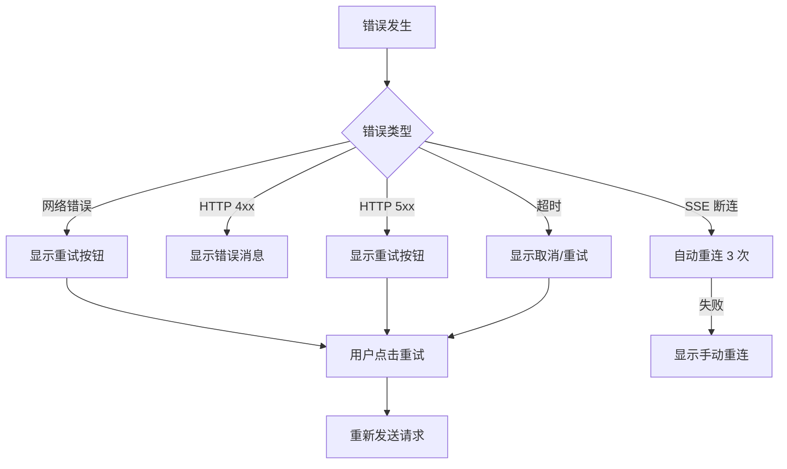
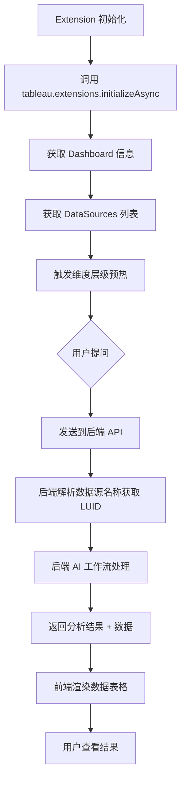

# 设计文档

## 概述

本设计文档描述 Tableau AI 助手前端界面的技术架构和实现方案。系统采用 Vue 3 + TypeScript + Vite 技术栈，实现一个嵌入 Tableau 仪表板的对话式数据分析界面。

### 设计目标

1. **用户体验优先**：流畅的对话交互、实时流式输出、清晰的数据展示
2. **Tableau 风格融合**：使用 Tableau 配色方案和设计语言
3. **可维护性**：组件化架构、类型安全、清晰的状态管理
4. **性能优化**：首屏加载 < 1.5s、流式延迟 < 50ms

### 技术选型

| 技术 | 选择 | 理由 |
|-----|------|------|
| 框架 | Vue 3 + Composition API | 响应式、组合式 API 更灵活 |
| 语言 | TypeScript | 类型安全、IDE 支持好 |
| 构建 | Vite | 快速 HMR、优化的生产构建 |
| 状态管理 | Pinia | Vue 官方推荐、TypeScript 友好 |
| 样式 | Tailwind CSS | 原子化 CSS、快速开发 |
| 图表 | ECharts | 功能丰富、性能好 |
| Markdown | markdown-it + highlight.js | 可扩展、语法高亮支持 |
| 测试 | Vitest + fast-check | 单元测试 + 属性测试 |

## 架构

### 整体架构图

系统采用分层架构，从上到下分为：展示层、状态层、服务层、外部集成层。

```
┌─────────────────────────────────────────────────────────────────────────┐
│                         Tableau Dashboard                                │
│  ┌───────────────────────────────────────────────────────────────────┐  │
│  │                    Tableau Extension (manifest.trex)               │  │
│  │  ┌─────────────────────────────────────────────────────────────┐  │  │
│  │  │                     Vue 3 Application                        │  │  │
│  │  │                                                              │  │  │
│  │  │  ┌──────────────────────────────────────────────────────┐   │  │  │
│  │  │  │              展示层 (Components)                      │   │  │  │
│  │  │  │  ┌─────────┐ ┌─────────────┐ ┌─────────────────────┐ │   │  │  │
│  │  │  │  │HeaderBar│ │ChatContainer│ │    InputArea        │ │   │  │  │
│  │  │  │  └─────────┘ │ ┌─────────┐ │ └─────────────────────┘ │   │  │  │
│  │  │  │              │ │UserMsg  │ │                         │   │  │  │
│  │  │  │              │ │AIMsg    │ │  AIMsg 子组件:          │   │  │  │
│  │  │  │              │ │Thinking │ │  - MarkdownRenderer     │   │  │  │
│  │  │  │              │ └─────────┘ │  - DataTable            │   │  │  │
│  │  │  │              └─────────────┘  - DataChart            │   │  │  │
│  │  │  │                               - InsightCards         │   │  │  │
│  │  │  │                               - TechDetails          │   │  │  │
│  │  │  │                               - SuggestedQuestions   │   │  │  │
│  │  │  └──────────────────────────────────────────────────────┘   │  │  │
│  │  │                            │                                 │  │  │
│  │  │  ┌──────────────────────────────────────────────────────┐   │  │  │
│  │  │  │              状态层 (Pinia Stores)                    │   │  │  │
│  │  │  │  ┌──────────┐ ┌────────────┐ ┌───────┐ ┌──────────┐  │   │  │  │
│  │  │  │  │chatStore │ │sessionStore│ │uiStore│ │tableauStore│ │   │  │  │
│  │  │  │  │(消息管理) │ │(会话持久化)│ │(UI状态)│ │(Tableau集成)│ │   │  │  │
│  │  │  │  └──────────┘ └────────────┘ └───────┘ └──────────┘  │   │  │  │
│  │  │  └──────────────────────────────────────────────────────┘   │  │  │
│  │  │                            │                                 │  │  │
│  │  │  ┌──────────────────────────────────────────────────────┐   │  │  │
│  │  │  │              服务层 (Services)                        │   │  │  │
│  │  │  │  ┌──────────┐ ┌──────────┐ ┌────────────────────┐    │   │  │  │
│  │  │  │  │SSEClient │ │APIClient │ │  StorageService    │    │   │  │  │
│  │  │  │  │(流式通信) │ │(REST API)│ │  (localStorage)    │    │   │  │  │
│  │  │  │  └──────────┘ └──────────┘ └────────────────────┘    │   │  │  │
│  │  │  └──────────────────────────────────────────────────────┘   │  │  │
│  │  └─────────────────────────────────────────────────────────────┘  │  │
│  └───────────────────────────────────────────────────────────────────┘  │
│                                    │                                     │
│                    tableau.extensions.1.latest.min.js                    │
│                         (Tableau Extensions API)                         │
└─────────────────────────────────────────────────────────────────────────┘
                                     │
                                     │ SSE / REST
                                     ��
                    ┌─────────────────────────────────┐
                    │        FastAPI Backend          │
                    │   (AI 分析工作流 + VizQL 查询)   │
                    └─────────────────────────────────┘
```

### 数据流图

```
用户输入 ──? InputArea ──? chatStore.sendMessage()
                                    │
                                    ��
                          SSEClient.connect()
                                    │
                    ┌───────────────┼───────────────┐
                    ��               ��               ��
              token 事件      node_start      complete 事件
                    │               │               │
                    ��               ��               ��
            追加文字到      更新 Thinking      解析完整响应
            currentResponse   Indicator        渲染 AIMessage
```


### 目录结构

基于现有代码结构进行扩展：

```
analytics_assistant/frontend/
├── public/
│   ├── manifest.trex                      # Tableau 扩展清单文件（已有）
│   ├── tableau.extensions.1.latest.min.js # Tableau Extensions API（已有）
│   └── README.md
├── src/
│   ├── App.vue                    # 根组件（已有，需修改）
│   ├── main.ts                    # 入口文件（已有）
│   ├── api/
│   │   ├── client.ts              # API 客户端（已有）
│   │   └── streaming.ts           # SSE 流式客户端（已有，需扩展）
│   ├── components/
│   │   ├── StreamingProgress.vue  # 流式进度组件（已有）
│   │   ├── layout/                # 新增：布局组件
│   │   │   ├── LayoutContainer.vue
│   │   │   ├── HeaderBar.vue
│   │   │   └── InputArea.vue
│   │   ├── chat/                  # 新增：对话组件
│   │   │   ├── ChatContainer.vue
│   │   │   ├── MessageList.vue
│   │   │   ├── UserMessage.vue
│   │   │   ├── AIMessage.vue
│   │   │   └── ThinkingIndicator.vue
│   │   ├── content/               # 新增：内容展示组件
│   │   │   ├── MarkdownRenderer.vue
│   │   │   ├── DataTable.vue
│   │   │   ├── DataChart.vue
│   │   │   ├── InsightCards.vue
│   │   │   ├── TechDetails.vue
│   │   │   └── SuggestedQuestions.vue
│   │   ├── settings/              # 新增：设置组件
│   │   │   ├── SettingsPanel.vue
│   │   │   └── CustomModelDialog.vue
│   │   └── common/                # 新增：通用组件
│   │       ├── CopyButton.vue
│   │       ├── Collapsible.vue
│   │       └── ErrorMessage.vue
│   ├── composables/
│   │   └── useStreaming.ts        # 流式处理 composable（已有）
│   ├── stores/
│   │   ├── tableau.ts             # Tableau 状态（已有）
│   │   ├── analysis.ts            # 分析状态（已有）
│   │   ├── chat.ts                # 新增：对话状态
│   │   ├── session.ts             # 新增：会话状态
│   │   ├── settings.ts            # 新增：设置状态
│   │   └── ui.ts                  # 新增：UI 状态
│   ├── types/
│   │   ├── index.ts               # 类型导出（已有）
│   │   ├── tableau.d.ts           # Tableau 类型定义（已有）
│   │   ├── message.ts             # 新增：消息类型
│   │   ├── insight.ts             # 新增：洞察类型
│   │   └── session.ts             # 新增：会话类型
│   ├── utils/
│   │   ├── tableau.ts             # Tableau 工具（已有）
│   │   ├── markdown.ts            # 新增：Markdown 解析
│   │   ├── formatters.ts          # 新增：数据格式化
│   │   ├── validators.ts          # 新增：输入验证
│   │   └── storage.ts             # 新增：本地存储
│   ├── views/
│   │   ├── HomeView.vue           # 首页（已有，需重构为对话界面）
│   │   ├── AnalysisView.vue       # 分析视图（已有）
│   │   └── StreamingDemoView.vue  # 流式演示（已有）
│   └── styles/
│       ├── variables.css          # 新增：CSS 变量
│       └── tailwind.config.js     # 新增：Tailwind 配置
├── index.html
├── package.json
├── tsconfig.json
└── vite.config.ts
```

### 状态管理架构

基于现有的 Pinia stores 进行扩展：

```
┌─────────────────────────────────────────────────────────────────────────┐
│                         Pinia Stores                                     │
├─────────────────────────────────────────────────────────────────────────┤
│                                                                          │
│  ┌─────────────────────┐    ┌─────────────────────┐                     │
│  │   tableauStore      │    │    chatStore        │                     │
│  │   (已有，保持)       │    │    (新增)           │                     │
│  ├─────────────────────┤    ├─────────────────────┤                     │
│  │ - isInitialized     │    │ - messages[]        │                     │
│  │ - isInitializing    │    │ - currentResponse   │                     │
│  │ - dataSources[]     │    │ - isProcessing      │                     │
│  │ - selectedDataSource│    │ - processingStage   │                     │
│  │ - preloadStatus     │    │ - error             │                     │
│  └─────────────────────┘    └─────────────────────┘                     │
│                                                                          │
│  ┌─────────────────────┐    ┌─────────────────────┐                     │
│  │   sessionStore      │    │    uiStore          │                     │
│  │   (新增)            │    │    (新增)           │                     │
│  ├─────────────────────┤    ├─────────────────────┤                     │
│  │ - sessionId         │    │ - theme             │                     │
│  │ - sessions[]        │    │ - layoutMode        │                     │
│  │ - persist to        │    │ - windowWidth       │                     │
│  │   localStorage      │    │ - errors[]          │                     │
│  └─────────────────────┘    └─────────────────────┘                     │
│                                                                          │
└─────────────────────────────────────────────────────────────────────────┘

Store 依赖关系:
- chatStore 依赖 tableauStore（获取 datasourceName，注意：前端只有名称，LUID 由后端解析）
- chatStore 依赖 sessionStore（获取 sessionId）
- chatStore 依赖 settingsStore（获取 language、analysisDepth、selectedModel）
- uiStore 独立，被所有组件使用
- settingsStore 独立，管理用户设置

**重要说明：数据源标识**
- Tableau Extensions API 只能获取数据源名称（`DataSource.name`），无法获取 LUID
- 前端存储和传递的是 `datasourceName`（数据源名称）
- 后端负责通过 GraphQL 将名称转换为 LUID，并缓存映射关系
```

#### settingsStore 设置状态

```typescript
// stores/settings.ts
interface SettingsStore {
  // 状态
  language: 'zh' | 'en';
  analysisDepth: 'detailed' | 'comprehensive';
  selectedModel: string;
  customModels: CustomModel[];
  theme: 'light' | 'dark' | 'system';
  
  // Actions
  setLanguage(lang: 'zh' | 'en'): void;
  setAnalysisDepth(depth: 'detailed' | 'comprehensive'): void;
  setSelectedModel(modelId: string): void;
  setTheme(theme: 'light' | 'dark' | 'system'): void;
  
  // 自定义模型管理
  addCustomModel(model: CustomModel): Promise<void>;
  removeCustomModel(name: string): Promise<void>;
  loadCustomModels(): Promise<void>;
  testCustomModel(model: CustomModel): Promise<boolean>;
}
```


## 组件与接口

### 核心组件设计

#### 1. LayoutContainer 布局容器

```typescript
// 组件职责：管理三区域布局
interface LayoutContainerProps {
  // 无 props，从 uiStore 获取布局模式
}

// 布局模式
type LayoutMode = 'standard' | 'compact' | 'minimal';

// 响应式断点
const BREAKPOINTS = {
  minimal: 320,   // < 480px
  compact: 480,   // 480-768px
  standard: 768   // >= 768px
};
```

#### 2. MessageList 消息列表

```typescript
interface MessageListProps {
  messages: Message[];
  isProcessing: boolean;
}

// 自动滚动行为
const scrollBehavior = {
  behavior: 'smooth',
  block: 'end'
};
```

#### 3. AIMessage AI 消息组件

```typescript
interface AIMessageProps {
  message: AIResponseMessage;
  isStreaming: boolean;
}

// AI 消息结构
interface AIResponseMessage {
  id: string;
  type: 'ai';
  content: string;           // Markdown 内容
  data?: TableData;          // 表格数据
  insights?: Insight[];      // 洞察列表
  techDetails?: TechDetails; // 技术细节
  suggestions?: string[];    // 推荐问题
  timestamp: number;
}
```

#### 4. MarkdownRenderer Markdown 渲染器

```typescript
interface MarkdownRendererProps {
  content: string;
  streaming?: boolean;  // 是否流式渲染
}

// markdown-it 配置
const markdownConfig = {
  html: false,          // 禁用 HTML 标签（安全）
  linkify: true,        // 自动链接
  typographer: true,    // 排版优化
  highlight: (code: string, lang: string) => {
    // highlight.js 语法高亮
  }
};
```

#### 5. DataTable 数据表格

```typescript
interface DataTableProps {
  data: TableData;
  pageSize?: number;    // 每页条数，默认 10
  sortable?: boolean;   // 默认 true
  exportable?: boolean; // 默认 true
}

interface TableData {
  columns: ColumnDef[];
  rows: Record<string, any>[];
  totalCount: number;   // 总条数
}

interface ColumnDef {
  key: string;
  label: string;
  type: 'string' | 'number' | 'date';
  align?: 'left' | 'center' | 'right';
}

// 分页状态
interface PaginationState {
  currentPage: number;  // 当前页码（从 1 开始）
  pageSize: number;     // 每页条数（固定 10）
  totalPages: number;   // 总页数
  totalCount: number;   // 总条数
}

// 排序状态
type SortState = {
  column: string | null;
  direction: 'asc' | 'desc' | null;
};
```

**分页规则：**

| 配置项 | 值 | 说明 |
|-------|-----|------|
| 每页条数 | 10 条 | 固定，不可调整 |
| 默认显示 | 第 1 页 | 首次加载 |
| 分页控件 | `? 1 / 3 ?` | 简洁的翻页器 |
| 总数显示 | `共 25 条` | 让用户知道数据量 |

**特殊情况处理：**

| 场景 | 处理 |
|-----|------|
| 数据 ≤ 10 条 | 不显示分页控件 |
| 数据 = 0 条 | 显示"暂无数据" |
| 导出 CSV | 导出全部数据（不受分页限制） |
```

#### 6. DataChart 数据图表（Phase 2 - 后续扩展）

**当前阶段：数据默认以表格形式展示**

Phase 1 阶段，所有查询结果数据默认使用 DataTable 组件以文本表格形式展示。可视化图表功能将在后续阶段扩展。

**后续扩展方向（Phase 2+）：**
- ECharts 图表渲染（Tableau 风格配色）
- Tableau 原生可视化集成（待研究可行方案）

```typescript
// Phase 1: 仅支持表格视图
interface DataDisplayProps {
  data: TableData;
  viewType: 'table';  // Phase 1 仅支持 table
}

// Phase 2+: 扩展图表支持
// type ViewType = 'table' | 'bar' | 'line' | 'pie';

// Tableau 官方配色序列（Tableau 10）- 预留给后续图表使用
const TABLEAU_COLORS = [
  '#1F77B4', '#FF7F0E', '#2CA02C', '#D62728',
  '#9467BD', '#8C564B', '#E377C2', '#7F7F7F',
  '#BCBD22', '#17BECF'
];
```

#### 7. InsightCards 洞察卡片

```typescript
interface InsightCardsProps {
  insights: Insight[];
}

interface Insight {
  id: string;
  type: 'discovery' | 'anomaly' | 'suggestion';
  title: string;
  description: string;
  confidence: number;  // 0-100
  priority: number;    // 排序用
}

// 类型图标映射
const INSIGHT_ICONS = {
  discovery: { icon: '??', color: '#1F77B4' },
  anomaly: { icon: '??', color: '#FF7F0E' },
  suggestion: { icon: '?', color: '#2CA02C' }
};
```

#### 8. ThinkingIndicator 思考指示器

```typescript
interface ThinkingIndicatorProps {
  stage: ProcessingStage;
  error?: string;
}

type ProcessingStage = 
  | 'understanding'  // 理解问题
  | 'building'       // 构建查询
  | 'executing'      // 执行分析
  | 'generating'     // 生成洞察
  | 'error';         // 错误状态

const STAGE_LABELS: Record<ProcessingStage, string> = {
  understanding: '理解问题...',
  building: '构建查询...',
  executing: '执行分析...',
  generating: '生成洞察...',
  error: '处理出错'
};
```

#### 9. SettingsPanel 设置面板

```typescript
interface SettingsPanelProps {
  visible: boolean;
  onClose: () => void;
}

// 设置状态（存储在 settingsStore）
interface SettingsState {
  // 数据源（注意：前端只存储名称，LUID 由后端解析）
  datasourceName: string | null;
  
  // 语言
  language: 'zh' | 'en';
  
  // 分析深度
  analysisDepth: 'detailed' | 'comprehensive';
  
  // AI 模型
  selectedModel: string;  // 模型标识
  customModels: CustomModel[];  // 自定义模型列表
  
  // 主题
  theme: 'light' | 'dark' | 'system';
}

// 自定义模型配置
interface CustomModel {
  name: string;        // 显示名称
  apiBase: string;     // API 基础地址
  apiKey?: string;     // API Key（可选）
  modelId?: string;    // 模型标识（可选）
}

// 内置模型列表
const BUILTIN_MODELS = [
  { id: 'deepseek', name: 'DeepSeek', description: '深度求索' },
  { id: 'qwen', name: 'Qwen', description: '阿里通义千问' },
  { id: 'glm', name: 'GLM', description: '智谱 ChatGLM' },
  { id: 'kimi', name: 'Kimi', description: '月之暗面 Kimi' },
  { id: 'gpt', name: 'GPT', description: 'OpenAI GPT' },
  { id: 'claude', name: 'Claude', description: 'Anthropic Claude' },
];

// 分析深度选项（前端只显示两个选项）
const ANALYSIS_DEPTH_OPTIONS = [
  { value: 'detailed', label: '标准', description: '标准分析，包含数据支撑和主要发现' },
  { value: 'comprehensive', label: '深入分析', description: '完整报告，包含趋势预测和行动建议' },
];
// 注意：basic 作为内部保留值，不暴露给用户
```

#### 10. CustomModelDialog 自定义模型对话框

```typescript
interface CustomModelDialogProps {
  visible: boolean;
  onClose: () => void;
  onSave: (model: CustomModel) => void;
  editModel?: CustomModel;  // 编辑模式时传入
}

// 表单验证
interface CustomModelFormState {
  name: string;
  apiBase: string;
  apiKey: string;
  modelId: string;
  isValid: boolean;
  isTesting: boolean;
  testResult?: 'success' | 'error';
  testError?: string;
}
```


### 服务层接口

#### SSEClient 流式客户端

```typescript
interface SSEClientConfig {
  url: string;
  timeout?: number;      // 默认 60000ms
  reconnectDelay?: number; // 默认 5000ms
}

interface SSEClient {
  connect(sessionId: string, query: string): void;
  disconnect(): void;
  onToken(callback: (token: string) => void): void;
  onNodeStart(callback: (node: string) => void): void;
  onNodeComplete(callback: (node: string) => void): void;
  onComplete(callback: (response: AIResponseMessage) => void): void;
  onError(callback: (error: SSEError) => void): void;
}

// SSE 事件类型
type SSEEventType = 
  | 'token'
  | 'node_start'
  | 'node_complete'
  | 'complete'
  | 'error';

interface SSEEvent {
  type: SSEEventType;
  data: any;
  timestamp: number;
}
```

#### StorageService 存储服务

```typescript
interface StorageService {
  // Session 管理
  saveSession(session: Session): void;
  getSession(sessionId: string): Session | null;
  getAllSessions(): Session[];
  deleteSession(sessionId: string): void;
  clearAllSessions(): void;
  
  // 配置管理
  saveConfig(config: AppConfig): void;
  getConfig(): AppConfig | null;
}

interface Session {
  id: string;
  messages: Message[];
  createdAt: number;
  updatedAt: number;
  archived: boolean;
}

// 存储键
const STORAGE_KEYS = {
  SESSIONS: 'tableau_ai_sessions',
  CURRENT_SESSION: 'tableau_ai_current_session',
  CONFIG: 'tableau_ai_config'
};
```

#### TableauAPI 封装

```typescript
interface TableauAPIService {
  initialize(): Promise<void>;
  getDashboardName(): string;
  getDataSources(): Promise<DataSource[]>;
  getFilters(): Promise<Filter[]>;
  saveSettings(settings: Record<string, string>): Promise<void>;
  loadSettings(): Promise<Record<string, string>>;
}

interface DataSource {
  id: string;
  name: string;
  luid: string;
}

interface Filter {
  fieldName: string;
  values: string[];
  filterType: 'categorical' | 'range';
}
```

## 数据模型

### 消息模型

```typescript
// 基础消息类型
interface BaseMessage {
  id: string;
  timestamp: number;
}

// 用户消息
interface UserMessage extends BaseMessage {
  type: 'user';
  content: string;
}

// AI 消息
interface AIMessage extends BaseMessage {
  type: 'ai';
  content: string;           // Markdown 格式
  data?: TableData;          // 查询结果数据
  insights?: Insight[];      // 洞察列表
  techDetails?: TechDetails; // 技术细节
  suggestions?: string[];    // 推荐问题
  isStreaming?: boolean;     // 是否正在流式输出
}

// 系统消息（错误、提示等）
interface SystemMessage extends BaseMessage {
  type: 'system';
  content: string;
  level: 'info' | 'warning' | 'error';
}

type Message = UserMessage | AIMessage | SystemMessage;
```

### 技术细节模型

```typescript
interface TechDetails {
  query: SemanticQuery;      // VizQL 查询
  executionTime: number;     // 执行时间（毫秒）
  rowCount: number;          // 返回行数
}

interface SemanticQuery {
  datasource_luid: string;
  columns: QueryColumn[];
  filters?: QueryFilter[];
  sorts?: QuerySort[];
  limit?: number;
}

interface QueryColumn {
  field: string;
  aggregation?: 'sum' | 'avg' | 'count' | 'min' | 'max';
}
```

### 配置模型

```typescript
interface AppConfig {
  theme: 'light' | 'dark';
  datasourceName?: string;   // 数据源名称（LUID 由后端解析）
  apiEndpoint: string;
  maxMessageLength: number;  // 默认 2000
  autoScroll: boolean;       // 默认 true
}

// 默认配置
const DEFAULT_CONFIG: AppConfig = {
  theme: 'light',
  apiEndpoint: '/api/v1',
  maxMessageLength: 2000,
  autoScroll: true
};
```


## 正确性属性

*A property is a characteristic or behavior that should hold true across all valid executions of a system-essentially, a formal statement about what the system should do. Properties serve as the bridge between human-readable specifications and machine-verifiable correctness guarantees.*

基于需求文档的验收标准分析，以下是可通过属性测试验证的正确性属性：

### Property 1: 布局响应式适配

*For any* 窗口宽度 w（320px ≤ w ≤ 1920px），系统应根据以下规则选择布局模式：
- w >= 768px → 'standard'
- 480px ≤ w < 768px → 'compact'  
- 320px ≤ w < 480px → 'minimal'

**Validates: Requirements 1.4, 15.1, 15.2, 15.3**

### Property 2: 消息类型样式映射

*For any* 消息 m，系统应根据消息类型应用正确的样式：
- type === 'user' → 右对齐、蓝色背景(#1F77B4)、白色文字
- type === 'ai' → 左对齐、白色背景、灰色边框

**Validates: Requirements 2.1, 2.2**

### Property 3: 输入验证规则

*For any* 输入字符串 s：
- 若 s 仅包含空白字符（空格、换行、制表符），则发送按钮应禁用
- 若 s.length > 2000，则应阻止继续输入
- 若 s 包含有效非空白字符且 s.length ≤ 2000，则发送按钮应启用

**Validates: Requirements 2.6, 2.7, 8.5**

### Property 4: 相对时间戳格式化

*For any* 时间戳 t 和当前时间 now，若 (now - t) > 60 秒，则格式化结果应为：
- 60s ≤ diff < 3600s → "X分钟前"
- 3600s ≤ diff < 86400s → "X小时前"
- diff >= 86400s → "X天前"

**Validates: Requirements 2.4**

### Property 5: Markdown 渲染正确性

*For any* 有效 Markdown 字符串 md，经过 parse → render → 提取纯文本 流程后，纯文本内容应与原始文本的语义内容等价（去除格式标记后）。

**Validates: Requirements 2.3, 17.1, 17.4**

### Property 6: 表格自适应行为

*For any* 表格数据 data：
- 若 data.rows.length > 10，则默认显示 10 行，显示"展开全部"按钮
- 若 data.columns.length > 5 或总宽度超出容器，则启用水平滚动
- 若 data.rows.length === 0，则显示空状态提示

**Validates: Requirements 4.2, 4.3, 4.7**

### Property 7: 表格排序正确性

*For any* 表格数据 data 和列 column，点击表头后：
- 首次点击：按该列升序排列
- 再次点击：按该列降序排列
- 第三次点击：恢复原始顺序

排序后的数据应满足排序不变量：相邻元素满足排序条件。

**Validates: Requirements 4.4**

### Property 8: 数值格式化正确性

*For any* 数值 n：
- 整数应使用千分位分隔符（如 1,234,567）
- 小数应保留 2 位（如 3.14）
- 负数应显示红色

**Validates: Requirements 4.6**

### Property 9: CSV 导出 Round-Trip

*For any* 表格数据 data，导出为 CSV 后重新解析，应得到与原始数据等价的结构（考虑类型转换）。

**Validates: Requirements 4.5**

### Property 10: 图表类型推荐

*For any* 表格数据 data：
- 若包含时间维度列（Date/DateTime 类型）→ 推荐折线图
- 若包含分类维度列（String 类型，唯一值 ≤ 20）→ 推荐柱状图
- 若数值列求和为 100% ± 1% → 推荐饼图
- 否则 → 默认表格视图

**Validates: Requirements 5.2, 5.3, 5.4**

### Property 11: 洞察卡片排序与类型映射

*For any* 洞察列表 insights：
- 渲染后的卡片顺序应按 priority 降序排列
- 每个洞察应根据类型显示正确的图标和颜色：
  - type === 'discovery' → ?? 蓝色(#1F77B4)
  - type === 'anomaly' → ?? 橙色(#FF7F0E)
  - type === 'suggestion' → ? 绿色(#2CA02C)

**Validates: Requirements 6.3, 6.4**

### Property 13: 推荐问题显示数量

*For any* 推荐问题列表 suggestions：
- 若 suggestions.length ≤ 3，则显示全部
- 若 suggestions.length > 3，则显示前 3 个 + "更多"按钮

**Validates: Requirements 3.5, 9.5**

### Property 14: JSON Round-Trip 一致性

*For any* 有效 JSON 对象 obj，JSON.parse(JSON.stringify(obj)) 应与 obj 深度相等。

**Validates: Requirements 10.6**

### Property 15: SSE 事件状态更新

*For any* SSE 事件序列 events，系统状态应正确更新：
- token 事件 → 追加文字到当前响应
- node_start 事件 → 更新处理阶段
- node_complete 事件 → 标记节点完成
- complete 事件 → 结束流式输出
- error 事件 → 显示错误状态

**Validates: Requirements 11.1, 11.2, 11.3**

### Property 16: 流式 Markdown 渲染一致性

*For any* Markdown 内容 md，流式渲染（逐 token 追加）的最终 HTML 结构应与一次性渲染的 HTML 结构等价。

**Validates: Requirements 11.7**

### Property 17: Session ID 格式

*For any* 新创建的 Session，其 ID 应符合 UUID v4 格式（8-4-4-4-12 十六进制字符）。

**Validates: Requirements 12.1**

### Property 18: Session 序列化 Round-Trip

*For any* Session 对象 session，经过 JSON.stringify → localStorage.setItem → localStorage.getItem → JSON.parse 后，应与原始 session 深度相等。

**Validates: Requirements 12.6**

### Property 19: Session 归档逻辑

*For any* Session session，若 (now - session.createdAt) > 24 小时，则 session.archived 应为 true。

**Validates: Requirements 12.4**

### Property 20: HTTP 错误消息映射

*For any* HTTP 状态码 status，应映射到正确的用户友好消息：
- 400 → "请求格式错误"
- 401 → "请重新登录"
- 403 → "无访问权限"
- 404 → "资源不存在"
- 500 → "服务器内部错误，请稍后重试"

**Validates: Requirements 14.2**

### Property 21: XSS 向量转义

*For any* 包含潜在 XSS 向量的字符串 s（如 `<script>`、`onerror`、`javascript:`），渲染后的 HTML 不应包含可执行的脚本代码。

**Validates: Requirements 14.5, 17.5**


## UI 设计详图

> 详细的 UI 设计规范请参考：
> - [对话界面设计](./ui-design/chat.md)
> - [设置页面设计](./ui-design/settings.md)

### 页面结构

系统包含**两个独立页面**：

```
┌─────────────┐                      ┌─────────────┐
│             │    发送第一条消息     │             │
│    首页     │  ─────────────────?  │  对话页面   │
│  (欢迎页)   │                      │             │
│             │  ?─────────────────  │             │
└─────────────┘    点击返回按钮      └─────────────┘
```

### 页面1: 首页（欢迎页）

```
┌─────────────────────────────────────────────────────────────────────────┐
│                        HeaderBar (48px)                                  │
│  ┌──────┐                                                   ┌────────┐ │
│  │ Logo │  Tableau AI 助手                                  │ ??设置 │ │
│  │32x32 │                                                   │  24x24 │ │
│  └──────┘                                                   └────────┘ │
├─────────────────────────────────────────────────────────────────────────┤
│                     WelcomeContainer (flex: 1)                           │
│                                                                          │
│  ┌─────────────────────────────────────────────────────────────────┐    │
│  │ ?? 欢迎使用 Tableau AI 助手！                                    │    │
│  │    请输入您的数据分析问题，我会帮您查询和分析数据。              │    │
│  │                                                                   │    │
│  │    ?? 试试问：                                                   │    │
│  │    ? 各产品线的销售额是多少？                                    │    │
│  │    ? 本月销售趋势如何？                                          │    │
│  │    ? 哪个区域的利润最高？                                        │    │
│  └─────────────────────────────────────────────────────────────────┘    │
│                                                                          │
├─────────────────────────────────────────────────────────────────────────┤
│                        InputArea (64px)                                  │
│  ┌─────────────────────────────────────────────────────────────┐ ┌───┐ │
│  │ 请输入您的数据分析问题...                                    │ │ ? │ │
│  └─────────────────────────────────────────────────────────────┘ └───┘ │
└─────────────────────────────────────────────────────────────────────────┘
```

**首页特点：** Logo + 标题 | 无返回按钮 | 设置按钮

### 页面2: 对话页面

```
┌─────────────────────────────────────────────────────────────────────────┐
│                        HeaderBar (48px)                                  │
│  ┌────┐                                                     ┌────────┐ │
│  │ ←  │                                                     │ ??设置 │ │
│  │返回│                                                     │  24x24 │ │
│  └────┘                                                     └────────┘ │
├─────────────────────────────────────────────────────────────────────────┤
│                     ChatContainer (flex: 1, 可滚动)                      │
│                                                                          │
│  [消息列表区域 - 详见下方"多轮重规划展示设计"]                           │
│                                                                          │
├─────────────────────────────────────────────────────────────────────────┤
│                        InputArea (64px)                                  │
│  ┌─────────────────────────────────────────────────────────────┐ ┌───┐ │
│  │ 请输入您的问题...                                            │ │ ? │ │
│  └─────────────────────────────────────────────────────────────┘ └───┘ │
└─────────────────────────────────────────────────────────────────────────┘
```

**对话页面特点：** 返回按钮（无 Logo、无标题）| 设置按钮

**页面切换逻辑：**

| 当前页面 | 动作 | 结果 |
|---------|------|------|
| 首页 | 发送问题 / 点击示例 | 跳转到对话页面 |
| 对话页面 | 点击返回 | 回到首页，清空对话（新 session） |

### 多轮重规划展示设计（思维链可视化）

**设计原则：**
1. 每一轮重规划都有一个**触发原因**，来自上一轮的发现
2. 用户需要看到 AI 的**思考过程**（思维链），理解为什么要进行下一轮分析
3. 按**问题导向**组织内容，每轮回答一个具体问题
4. **总结放最后**，汇总所有轮次的发现

**多轮重规划完整示例：**

每轮分析是一个独立卡片，包含：问题标题 → 查询结果 → 发现，轮次之间用思考气泡连接。

```
┌─────────────────────────────────────────────────────────────────┐
│ ? 各产品线销售额是多少                                          │
├ ─ ─ ─ ─ ─ ─ ─ ─ ─ ─ ─ ─ ─ ─ ─ ─ ─ ─ ─ ─ ─ ─ ─ ─ ─ ─ ─ ─ ─ ─ ─┤
│                                                                   │
│ ?? 查询结果                                                      │
│ ┌───────────────────────────────────────────────────────────┐    │
│ │ 产品线     │ 销售额        │ 占比    │ 同比      │        │    │
│ ├───────────────────────────────────────────────────────────┤    │
│ │ 电子产品   │ ￥1,234,567   │ 35.2%  │ +12.3%   │        │    │
│ │ 家居用品   │ ￥987,654     │ 28.1%  │ +8.7%    │        │    │
│ │ 服装配饰   │ ￥765,432     │ 21.8%  │ -2.1%    │        │    │
│ └───────────────────────────────────────────────────────────┘    │
│ [??查询详情]            共 25 条  ?  1/3  ?            [??导出]  │
│                                                                   │
│ ─ ─ ─ ─ ─ ─ ─ ─ ─ ─ ─ ─ ─ ─ ─ ─ ─ ─ ─ ─ ─ ─ ─ ─ ─ ─ ─ ─ ─ ─   │
│                                                                   │
│ ?? 发现                                                          │
│ ? 电子产品销售最高，占比 35.2%                                   │
│ ? ?? 服装配饰同比下滑 2.1%，需关注                              │
│                                                                   │
└─────────────────────────────────────────────────────────────────┘
        │
        │ ?? 发现服装配饰异常下滑，需要深入分析原因
        ��
┌─────────────────────────────────────────────────────────────────┐
│ ? 服装配饰各细分品类的销售情况                                   │
├ ─ ─ ─ ─ ─ ─ ─ ─ ─ ─ ─ ─ ─ ─ ─ ─ ─ ─ ─ ─ ─ ─ ─ ─ ─ ─ ─ ─ ─ ─ ─┤
│ ...（同上结构）                                                   │
└─────────────────────────────────────────────────────────────────┘

�T�T�T�T�T�T�T�T�T�T�T�T�T�T�T�T�T�T�T�T�T�T�T�T�T�T�T�T�T�T�T�T�T�T�T�T�T�T�T�T�T�T�T�T�T�T�T�T�T�T�T�T�T�T�T�T�T�T�T�T�T�T�T�T�T�T�T�T

?? 总结

根据多维度分析，各产品线销售情况如下：
1. **电子产品**表现最佳，占比35%，同比+12%
2. **服装配饰**整体下滑2.1%，主要原因是男装持续下滑
3. **建议**：重点关注男装品类，分析竞品动态和库存策略

────────────────────────────────────────────────────────────────────

?? 继续探索

┌──────────────────┐ ┌──────────────────┐ ┌──────────────────┐
│ ??               │ │ ??               │ │ ??               │
│ 男装7月大幅下滑  │ │ 男装竞品分析     │ │ 女装增长驱动因素 │
│ 的原因           │ │                  │ │                  │
└──────────────────┘ └──────────────────┘ └──────────────────┘
```

**单轮场景（无重规划）：** 简化展示，不显示问题标题，结构相同但只有一个分析卡片。

### 数据表格工具栏设计

工具栏采用三段式布局：

```
[??查询详情]            共 25 条  ?  1/3  ?            [??导出]
 ↑                        ↑          ↑                    ↑
次要功能                 总数      分页控件            主要操作
(左对齐)               (居中)     (居中)              (右对齐)
```

| 元素 | 位置 | 样式 |
|-----|------|------|
| [??查询详情] | 左侧 | 文字按钮，#666666，hover 变 #1F77B4 |
| 共 N 条 | 中间偏左 | 12px，#999999 |
| ? 1/3 ? | 中间 | 分页控件，当前页加粗 |
| [??导出] | 右侧 | 主按钮样式，#1F77B4 背景 |

**分页规则：**
- 数据 ≤ 10 条：不显示分页控件，只显示 `共 N 条`
- 数据 > 10 条：显示完整工具栏

### 多轮重规划展示设计要点

| 元素 | 样式 | 说明 |
|-----|------|------|
| 分析卡片 | 白色背景，1px #E8E8E8 边框，8px 圆角 | 每轮分析一个卡片 |
| ? 问题标题 | 16px 加粗，#1A1A1A，卡片头部 | 多轮时显示 |
| 虚线分隔 | `─ ─ ─`，#E0E0E0 | 区分表格和发现 |
| ?? 思考气泡 | #F5F5F5 背景，14px 斜体，#666666 | 展示 AI 推理过程 |
| 连接线 | 2px，#E0E0E0 | 视觉连接两轮分析 |
| 双线分隔 | `�T�T�T�T`，2px solid #E0E0E0 | 区分分析过程和总结 |
| 单线分隔 | `────`，1px solid #E8E8E8 | 区分总结和推荐问题 |
| 推荐问题卡片 | #F8F9FA 背景，hover 边框变 #1F77B4 | 可点击，填入输入框 |

### 思考气泡数据来源

思考气泡的内容来自 **Replanner Agent** 的 `reason` 字段：

```typescript
// Replanner 输出（should_replan=true 时）
{
  "should_replan": true,
  "completeness_score": 65,
  "reason": "发现服装配饰异常下滑，需要深入分析原因",  // ← 思考气泡内容
  "next_question": "服装配饰各细分品类的销售情况"      // ← 下一轮问题标题
}
```

### 流式渲染逻辑

| 事件 | 前端行为 |
|-----|---------|
| 第1轮 Execute 完成 | 创建分析卡片，显示表格和分页 |
| 第1轮 Insight 完成 | 在卡片内追加"?? 发现" |
| Replanner: should_replan=true | 显示思考气泡和连接线，等待下一轮 |
| 第2轮 Execute 完成 | 创建新卡片，显示问题标题和表格 |
| 第2轮 Insight 完成 | 追加发现 |
| Replanner: should_replan=false | 显示分隔线、总结和推荐问题 |

### 错误分类

| 错误类型 | 触发条件 | 处理方式 |
|---------|---------|---------|
| 网络错误 | fetch 异常、status 0 | 显示重试按钮 |
| HTTP 错误 | 4xx/5xx 响应 | 显示映射消息 |
| 超时错误 | 请求超过 60s | 显示取消按钮 |
| SSE 断连 | 连接中断 > 5s | 显示重连按钮 |
| 输入验证 | 空白/超长输入 | 禁用发送按钮 |
| XSS 攻击 | 危险字符输入 | 转义后显示 |

### 错误消息组件

```typescript
interface ErrorMessageProps {
  type: 'network' | 'http' | 'timeout' | 'validation';
  message: string;
  retryable: boolean;
  onRetry?: () => void;
}

// 错误样式
const ERROR_STYLES = {
  background: '#FEE2E2',
  border: '#D62728',
  icon: '??',
  textColor: '#991B1B'
};
```

### 错误恢复策略



## 前后端对接逻辑

### API 接口定义

#### 1. 流式聊天接口

```
POST /api/stream/chat
Content-Type: application/json

Request:
{
  "question": "各产品线的销售额是多少？",
  "datasource_name": "超市销售数据",    // 数据源名称（前端传递）
  "user_id": "user-001",
  "session_id": "session-uuid-v4",
  "analysis_depth": "detailed",         // 分析深度：detailed/comprehensive
  "language": "zh",                     // 回复语言：zh/en
  "boost_question": false,
  "generate_visualization": true        // 是否生成 Tableau 可视化
}

Response: Server-Sent Events (SSE)

Event Types:
- token: { "token": "根据", "agent": "writer" }
- agent_start: { "agent": "query_builder", "timestamp": 1234567890 }
- agent_complete: { "agent": "query_builder", "output": {...}, "timestamp": 1234567890 }
- viz_ready: { "viz_url": "https://server/views/nlq-xxx", "chart_type": "bar" }
- workflow_complete: { "duration": 5.2, "timestamp": 1234567890 }
- workflow_error: { "error": "Error message", "timestamp": 1234567890 }
```

**analysis_depth 参数说明：**

| 值 | 前端显示 | 完成度阈值 | 最大轮数（兜底） | 说明 |
|---|---------|----------|----------------|------|
| `detailed` | 标准 | 80% | 3 轮 | 标准分析，包含数据支撑和关键发现 |
| `comprehensive` | 深入分析 | 95% | 5 轮 | 深度分析，完整报告含趋势预测和行动建议 |

> **注意**：`basic` 作为内部保留值，不暴露给前端用户。重规划次数由 LLM 动态评估 completeness_score 决定，最大轮数仅作为兜底限制。

**数据源名称到 LUID 转换：**

前端通过 Tableau Extensions API 只能获取数据源名称（`DataSource.name`），无法直接获取 LUID。后端负责将名称转换为 LUID：

```
前端 (Tableau Extensions API)          后端
        │                                │
        │  datasource_name: "超市销售数据"  │
        │ ─────────────────────────────? │
        │                                │
        │                    ┌───────────┴───────────┐
        │                    │ get_datasource_luid_by_name()
        │                    │ 通过 GraphQL 查询 LUID
        │                    │ 缓存 name → LUID 映射
        │                    └───────────┬───────────┘
        │                                │
        │                    使用 LUID 调用 VizQL API
        │                                │
```

后端使用现有的 `get_datasource_luid_by_name()` 函数（位于 `analytics_assistant/src/bi_platforms/tableau/metadata.py`）进行转换，支持：
- 精确匹配数据源名称
- 支持 `名称 | 项目 : 项目名` 格式
- 模糊匹配作为兜底

**LUID 缓存策略：**

使用 `StoreManager` 缓存 name → LUID 映射，避免重复 GraphQL 查询：

```python
from analytics_assistant.src.capabilities.storage.store_manager import get_store_manager

store = get_store_manager()

# 缓存 LUID（TTL 1小时）
store.put(
    namespace=("datasource_luid_cache",),
    key=datasource_name,
    value={"luid": luid, "cached_at": time.time()},
    ttl=3600
)

# 查询缓存
cached = store.get(namespace=("datasource_luid_cache",), key=datasource_name)
if cached:
    return cached["luid"]
```

#### 2. 预热接口（已有）

```
POST /api/preload/dimension-hierarchy
Request: { "datasource_name": "超市销售数据" }  // 同样使用名称

GET /api/preload/status/{task_id}
GET /api/preload/cache-status/{datasource_name}  // 使用名称查询
```

#### 3. 自定义模型管理接口

```
# 获取自定义模型列表
GET /api/models/custom
Response: {
  "models": [
    {
      "name": "My-LLaMA",
      "api_base": "http://localhost:8000/v1",
      "model_id": "llama-3-70b",
      "created_at": 1702800000
    }
  ]
}

# 添加自定义模型
POST /api/models/custom
Request: {
  "name": "My-LLaMA",
  "api_base": "http://localhost:8000/v1",
  "api_key": "sk-xxx",
  "model_id": "llama-3-70b"
}
Response: { "success": true }

# 删除自定义模型
DELETE /api/models/custom/{model_name}
Response: { "success": true }

# 测试模型连接
POST /api/models/custom/test
Request: {
  "api_base": "http://localhost:8000/v1",
  "api_key": "sk-xxx",
  "model_id": "llama-3-70b"
}
Response: { "success": true, "latency_ms": 150 }
```

**后端存储实现：**

使用现有的 `StoreManager` 进行持久化存储，命名空间为 `custom_models`：

```python
from analytics_assistant.src.capabilities.storage.store_manager import get_store_manager

store = get_store_manager()

# 保存自定义模型（永久存储）
store.put(
    namespace=("custom_models",), 
    key=model_name,
    value={
        "name": model_name,
        "api_base": api_base,
        "api_key": api_key,  # 加密存储
        "model_id": model_id,
        "created_at": time.time()
    },
    ttl=None  # 永久存储
)

# 获取所有自定义模型
models = store.search(namespace_prefix=("custom_models",))

# 删除自定义模型
store.delete(namespace=("custom_models",), key=model_name)
```

### SSE 事件协议

```typescript
// SSE 事件类型定义
interface SSEEventMap {
  // Token 级流式输出
  token: {
    token: string;
    agent?: string;
  };
  
  // Agent 生命周期
  agent_start: {
    agent: string;
    run_id?: string;
    timestamp: number;
  };
  agent_complete: {
    agent: string;
    output?: any;
    timestamp: number;
  };
  agent_error: {
    agent: string;
    error: string;
    timestamp: number;
  };
  
  // 工作流生命周期
  workflow_start: {
    question: string;
    timestamp: number;
  };
  workflow_complete: {
    duration: number;
    timestamp: number;
    response: AIResponseMessage;
  };
  workflow_error: {
    error: string;
    timestamp: number;
  };
}
```

### 数据流时序图

```
┌──────────┐     ┌──────────┐     ┌──────────┐     ┌──────────┐
│  用户    │     │  前端    │     │  后端    │     │ Tableau  │
└────┬─────┘     └────┬─────┘     └────┬─────┘     └────┬─────┘
     │                │                │                │
     │ 输入问题       │                │                │
     │───────────────>│                │                │
     │                │                │                │
     │                │ POST /api/stream/chat           │
     │                │───────────────>│                │
     │                │                │                │
     │                │ SSE: workflow_start             │
     │                │<───────────────│                │
     │                │                │                │
     │ 显示思考状态   │                │                │
     │<───────────────│                │                │
     │                │                │                │
     │                │ SSE: agent_start (query_builder)│
     │                │<───────────────│                │
     │                │                │                │
     │ 更新状态:      │                │                │
     │ "构建查询..."  │                │                │
     │<───────────────│                │                │
     │                │                │                │                │
     │                │ SSE: token (流式文字)           │
     │                │<───────────────│                │
     │                │                │                │
     │ 显示流式文字   │                │                │
     │<───────────────│                │                │
     │                │                │                │
     │                │ SSE: workflow_complete          │
     │                │<───────────────│                │
     │                │                │                │
     │ 渲染完整回复   │                │                │
     │ + 数据表格    │                │                │
     │<───────────────│                │                │
     │                │                │                │
```

### 错误码映射

| HTTP 状态码 | 错误类型 | 用户友好消息 | 处理方式 |
|------------|---------|-------------|---------|
| 0 | 网络错误 | 网络连接失败，请检查网络后重试 | 显示重试按钮 |
| 400 | 请求错误 | 请求格式错误 | 显示错误消息 |
| 401 | 未授权 | 请重新登录 | 跳转登录 |
| 403 | 禁止访问 | 无访问权限 | 显示错误消息 |
| 404 | 未找到 | 资源不存在 | 显示错误消息 |
| 408 | 超时 | 分析时间较长，请稍候或尝试简化问题 | 显示取消/重试 |
| 500 | 服务器错误 | 服务器内部错误，请稍后重试 | 显示重试按钮 |
| 502/503/504 | 网关错误 | 服务暂时不可用，请稍后重试 | 显示重试按钮 |

### Tableau 集成流程



## 前后端完整数据流转

### 系统架构总览

```
┌─────────────────────────────────────────────────────────────────────────────────┐
│                              Tableau Dashboard                                   │
│  ┌───────────────────────────────────────────────────────────────────────────┐  │
│  │                         Vue 3 前端应用                                     │  │
│  │                                                                            │  │
│  │  ┌──────────────┐    ┌──────────────┐    ┌──────────────┐                 │  │
│  │  │  InputArea   │───?│  chatStore   │───?│  SSEClient   │                 │  │
│  │  │  用户输入     │    │  状态管理     │    │  流式通信     │                 │  │
│  │  └──────────────┘    └──────────────┘    └──────┬───────┘                 │  │
│  │                                                  │                         │  │
│  │  ┌──────────────┐    ┌──────────────┐           │ SSE                     │  │
│  │  │  AIMessage   │?───│  MessageList │?──────────┘                         │  │
│  │  │  结果展示     │    │  消息列表     │                                     │  │
│  │  └──────────────┘    └──────────────┘                                     │  │
│  └───────────────────────────────────────────────────────────────────────────┘  │
│                                      │                                           │
│                    tableau.extensions.initializeAsync()                          │
│                    获取 DataSource.name（只有名称，无 LUID）                       │
└──────────────────────────────────────┼───────────────────────────────────────────┘
                                       │
                                       │ HTTP POST /api/chat/stream
                                       │ { question, datasource_name, session_id }
                                       ��
┌─────────────────────────────────────────────────────────────────────────────────┐
│                              FastAPI 后端                                        │
│                                                                                  │
│  ┌─────────────────────────────────────────────────────────────────────────┐    │
│  │                         API 层 (chat.py)                                 │    │
│  │  ┌──────────────────────────────────────────────────────────────────┐   │    │
│  │  │ POST /api/chat/stream                                             │   │    │
│  │  │ 1. 验证请求参数 (Pydantic)                                         │   │    │
│  │  │ 2. 调用 get_datasource_luid_by_name() 转换名称→LUID               │   │    │
│  │  │ 3. 创建 WorkflowExecutor                                          │   │    │
│  │  │ 4. 返回 SSE StreamingResponse                                     │   │    │
│  │  └──────────────────────────────────────────────────────────────────┘   │    │
│  └─────────────────────────────────────────────────────────────────────────┘    │
│                                       │                                          │
│                                       ��                                          │
│  ┌─────────────────────────────────────────────────────────────────────────┐    │
│  │                    WorkflowExecutor (executor.py)                        │    │
│  │  ┌──────────────────────────────────────────────────────────────────┐   │    │
│  │  │ 1. 获取 Tableau 认证 (get_tableau_auth_async)                     │   │    │
│  │  │ 2. 创建 WorkflowContext (auth + store + datasource_luid)          │   │    │
│  │  │ 3. 加载数据模型 (ensure_metadata_loaded)                          │   │    │
│  │  │ 4. 执行 LangGraph StateGraph                                      │   │    │
│  │  │ 5. 流式输出事件 (astream_events)                                   │   │    │
│  │  └──────────────────────────────────────────────────────────────────┘   │    │
│  └─────────────────────────────────────────────────────────────────────────┘    │
│                                       │                                          │
│                                       ��                                          │
│  ┌─────────────────────────────────────────────────────────────────────────┐    │
│  │                    LangGraph 工作流 (6 节点)                             │    │
│  │                                                                          │    │
│  │  ┌────────────┐   ┌────────────┐   ┌────────────┐   ┌────────────┐      │    │
│  │  │Understanding│──?│FieldMapper │──?│QueryBuilder│──?│  Execute   │      │    │
│  │  │   Agent    │   │   Node     │   │   Node     │   │   Node     │      │    │
│  │  │   (LLM)    │   │ (RAG+LLM)  │   │  (纯代码)   │   │  (纯代码)   │      │    │
│  │  └────────────┘   └────────────┘   └────────────┘   └─────┬──────┘      │    │
│  │        │                                                   │             │    │
│  │        │ is_analysis=false                                 ��             │    │
│  │        └──────────────────?END              ┌────────────┐               │    │
│  │                                             │  Insight   │               │    │
│  │  ┌────────────┐                             │   Agent    │               │    │
│  │  │ Replanner  │?────────────────────────────│   (LLM)    │               │    │
│  │  │   Agent    │                             └────────────┘               │    │
│  │  │   (LLM)    │                                                          │    │
│  │  └─────┬──────┘                                                          │    │
│  │        │                                                                 │    │
│  │        ├── should_replan=true ──? Understanding (循环)                   │    │
│  │        └── should_replan=false ─? END                                    │    │
│  └─────────────────────────────────────────────────────────────────────────┘    │
│                                       │                                          │
│                                       ��                                          │
│  ┌─────────────────────────────────────────────────────────────────────────┐    │
│  │                         外部服务调用                                      │    │
│  │                                                                          │    │
│  │  ┌──────────────┐    ┌──────────────┐    ┌──────────────┐               │    │
│  │  │ Tableau Auth │    │  VizQL API   │    │  GraphQL API │               │    │
│  │  │ (PAT/JWT)    │    │ (数据查询)    │    │ (元数据查询)  │               │    │
│  │  └──────────────┘    └──────────────┘    └──────────────┘               │    │
│  │                                                                          │    │
│  │  ┌──────────────┐    ┌──────────────┐    ┌──────────────┐               │    │
│  │  │   LLM API    │    │  RAG 向量库   │    │  StoreManager│               │    │
│  │  │(DeepSeek等)  │    │ (字段匹配)    │    │ (SQLite缓存) │               │    │
│  │  └──────────────┘    └──────────────┘    └──────────────┘               │    │
│  └─────────────────────────────────────────────────────────────────────────┘    │
└─────────────────────────────────────────────────────────────────────────────────┘
```

### 工作流节点详解

| 节点 | 类型 | 输入 | 输出 | 职责 |
|-----|------|------|------|------|
| **Understanding** | LLM Agent | question, metadata | SemanticQuery, is_analysis_question | 理解用户问题，提取语义查询意图 |
| **FieldMapper** | RAG + LLM | SemanticQuery, metadata | MappedQuery | 将业务术语映射到技术字段 |
| **QueryBuilder** | 纯代码 | MappedQuery | VizQLQuery | 生成 VizQL 查询语句 |
| **Execute** | 纯代码 | VizQLQuery | ExecuteResult | 调用 VizQL API 执行查询 |
| **Insight** | LLM Agent | ExecuteResult | Insight[] | 分析数据，提取洞察（不输出总结） |
| **Replanner** | LLM Agent | Insight[], analysis_depth | ReplanDecision, summary(最后一轮) | 评估完成度，决定是否继续；**最后一轮输出总结** |

### 节点输入输出详解

#### Understanding Agent
```
输入:
  - question: string              # 用户问题
  - metadata: Metadata            # 数据模型（字段定义）
  - dimension_hierarchy: Dict     # 维度层级

输出:
  - semantic_query: SemanticQuery # 语义查询（维度、度量、筛选）
  - is_analysis_question: bool    # 是否为分析问题（用于路由）

异常处理:
  - LLM 调用失败 → ModelRetryMiddleware 自动重试（指数退避）
  - 输出格式错误 → OutputValidationMiddleware 触发重试
  - 非分析问题 → 路由到 END，返回友好提示
```

#### FieldMapper Node
```
输入:
  - semantic_query: SemanticQuery # 语义查询
  - metadata: Metadata            # 数据模型

输出:
  - mapped_query: MappedQuery     # 映射后的查询（业务术语→技术字段）

异常处理:
  - 字段匹配失败 → 使用 RAG 向量搜索兜底
  - 无匹配字段 → 返回错误，前端显示"无法识别的字段"
```

#### QueryBuilder Node
```
输入:
  - mapped_query: MappedQuery     # 映射后的查询

输出:
  - vizql_query: VizQLQuery       # VizQL 查询语句

异常处理:
  - 查询构建失败 → 记录错误到 state.errors
  - 无效字段组合 → 返回错误，前端显示具体原因
```

#### Execute Node
```
输入:
  - vizql_query: VizQLQuery       # VizQL 查询
  - datasource_luid: string       # 数据源 LUID

输出:
  - query_result: ExecuteResult   # 查询结果（data, row_count, columns）

异常处理:
  - VizQL API 调用失败 → ToolRetryMiddleware 自动重试
  - 认证过期 → 自动刷新 token 后重试
  - 查询超时 → 返回错误，前端显示"查询超时"
  - 无数据 → 返回空结果，Insight 节点处理
```

#### Insight Agent
```
输入:
  - query_result: ExecuteResult   # 查询结果
  - question: string              # 原始问题
  - dimension_hierarchy: Dict     # 维度层级

输出:
  - insights: Insight[]           # 当前轮洞察 → InsightCards
  - all_insights: Insight[]       # 累积洞察（所有轮次）
  - data_insight_profile: Dict    # 数据画像（传给 Replanner）

说明:
  - Insight Agent 只负责分析数据、提取洞察（findings）
  - **不输出总结性回答**，总结由 Replanner Agent 负责

异常处理:
  - 空数据 → 返回"查询结果为空，无数据可分析"
  - LLM 分析失败 → 返回基础统计信息作为兜底
```

#### Replanner Agent
```
输入:
  - all_insights: Insight[]       # 累积洞察（所有轮次）
  - question: string              # 原始问题
  - data_insight_profile: Dict    # 数据画像
  - answered_questions: string[]  # 已回答问题（去重用）
  - replan_count: int             # 当前轮数
  - analysis_depth: string        # 分析深度（detailed/comprehensive）

输出:
  - replan_decision: ReplanDecision
    - should_replan: bool         # 是否继续探索（由 LLM 根据完成度判断）
    - completeness_score: float   # LLM 评估的回答完成度（0-100）
    - reason: string              # 为什么要继续分析（思维链，展示给用户）
    - next_question: string       # 下一轮要回答的问题（should_replan=true 时）
    - exploration_questions: []   # 推荐问题 → SuggestedQuestions（should_replan=false 时）
  - summary: string | null        # 总结性回答（仅当 should_replan=false 时输出）

重规划判断逻辑（由 LLM 动态评估）:
  LLM 根据以下因素评估 completeness_score（0-100）：
  - 问题是否被完整回答
  - 数据是否充分支撑结论
  - 是否存在未探索的重要维度
  - 洞察是否有足够深度

  判断规则：
  - detailed（标准）: completeness_score >= 80 → should_replan=false
  - comprehensive（深入分析）: completeness_score >= 95 → should_replan=false
  - 达到最大轮数（兜底）→ 强制 should_replan=false

总结输出规则:
  - should_replan=true  → 不输出 summary，继续下一轮探索
  - should_replan=false → 输出 summary，汇总所有轮次的洞察

分析深度对输出的影响（前端只暴露 detailed 和 comprehensive）:
  - detailed（标准）- 前端显示为"标准":
    - 完成度阈值: 80%
    - 最大轮数（兜底）: 3 轮
    - summary: 1-2 段落，包含结论、数据支撑、主要发现、简要建议
    - insights: 3-5 个发现（含异常和建议）
    - exploration_questions: 2-3 个
  - comprehensive（深入分析）- 前端显示为"深入分析":
    - 完成度阈值: 95%
    - 最大轮数（兜底）: 5 轮
    - summary: 完整分析报告（结构化多段落）
    - insights: 所有发现（无上限）
    - exploration_questions: 3-5 个

异常处理:
  - 达到最大轮数 → 强制 should_replan=false，输出最终总结
  - 无洞察 → 返回 should_replan=false，输出"未发现有价值的洞察"
```

### 分析深度输出示例

以用户问题 **"各产品线的销售额是多少？"** 为例，展示两种模式的完整输出：

#### 标准模式（detailed）

**summary：**
```
根据查询结果，各产品线销售额分布如下：

**销售排名：**
1. 电子产品：￥1,234,567（占比 35.2%，同比 +12.3%）
2. 家居用品：￥987,654（占比 28.1%，同比 +8.7%）
3. 服装配饰：￥765,432（占比 21.8%，同比 -2.1%）
4. 食品饮料：￥523,456（占比 14.9%，同比 +5.2%）

**关键发现：** 电子产品贡献了超过三分之一的销售额，且增速最快。服装配饰是唯一下滑的品类，建议关注。

**建议：** 可进一步分析电子产品的细分品类，了解增长驱动因素。
```

**洞察卡片：**
- ?? 电子产品销售额最高，占总销售额的 35.2%
- ?? 服装配饰同比下降 2.1%，是唯一负增长品类
- ? 建议加大电子产品的营销投入

**推荐问题：**
- 电子产品的细分品类销售情况？
- 服装配饰下滑的原因是什么？

---

#### 深入分析模式（comprehensive）

**summary：**
```markdown
## ?? 分析概述

根据您的查询，我对各产品线销售额进行了全面分析，涵盖销售分布、同比变化、趋势预测及行动建议。

## ?? 销售分布

| 产品线 | 销售额 | 占比 | 同比增长 | 环比增长 |
|-------|--------|------|---------|---------|
| 电子产品 | ￥1,234,567 | 35.2% | +12.3% | +3.5% |
| 家居用品 | ￥987,654 | 28.1% | +8.7% | +1.2% |
| 服装配饰 | ￥765,432 | 21.8% | -2.1% | -0.8% |
| 食品饮料 | ￥523,456 | 14.9% | +5.2% | +2.1% |

**总销售额：** ￥3,511,109，同比增长 6.8%

## ?? 关键发现

1. **电子产品领跑：** 贡献超过三分之一销售额，同比增长 12.3%，是增速最快的品类。主要受益于智能手机和笔记本电脑的强劲需求。

2. **家居用品稳健：** 占比 28.1%，同比增长 8.7%，受益于居家办公趋势延续。

3. **服装配饰承压：** 唯一负增长品类（-2.1%），连续 3 个月环比下滑，需重点关注。

4. **食品饮料平稳：** 增长 5.2%，符合行业平均水平。

## ?? 异常与风险

- **服装配饰持续下滑：** 同比 -2.1%，环比 -0.8%，已连续 3 个月负增长
- **电子产品库存压力：** 高增长可能带来库存周转风险，建议监控库存天数

## ?? 趋势预测

基于历史数据和季节性因素：
- Q4 电子产品预计继续增长（双十一、圣诞季）
- 服装配饰可能在换季促销后回暖
- 整体销售额预计 Q4 同比增长 8-10%

## ? 行动建议

1. **电子产品：** 加大营销投入，备足库存迎接 Q4 旺季
2. **服装配饰：** 深入分析下滑原因（价格？款式？竞争？），制定促销策略
3. **家居用品：** 保持现有策略，关注居家办公相关品类
4. **跨品类：** 考虑电子产品与家居用品的联合促销
```

**洞察卡片：**
- ?? 电子产品销售额最高，占总销售额的 35.2%，同比增长 12.3%
- ?? 家居用品表现稳健，同比增长 8.7%
- ?? 服装配饰同比下降 2.1%，连续 3 个月环比下滑
- ?? 电子产品高增长可能带来库存周转风险
- ? 建议加大电子产品 Q4 营销投入
- ? 建议深入分析服装配饰下滑原因

**推荐问题：**
- 电子产品中哪个细分品类增长最快？
- 服装配饰各子品类的销售趋势？
- 各产品线的毛利率对比？
- 各区域的产品线销售差异？

### 节点输出与前端组件映射

| 节点 | 输出字段 | 前端组件 | 展示内容 |
|-----|---------|---------|---------|
| Understanding | `semantic_query` | ThinkingIndicator | "理解问题..." |
| FieldMapper | `mapped_query` | ThinkingIndicator | "构建查询..." |
| QueryBuilder | `vizql_query` | **TechDetails** (折叠) | VizQL 查询 JSON |
| Execute | `query_result.data` | **DataTable** | 查询结果表格 |
| Execute | `query_result.row_count` | **TechDetails** | 返回行数 |
| Insight | `insights[].title` | **InsightCards** | 洞察卡片标题 |
| Insight | `insights[].description` | **InsightCards** | 洞察卡片描述 |
| Insight | `insights[].type` | **InsightCards** | 图标（??/??/?） |
| Replanner | `summary` | **MarkdownRenderer** | AI 回复正文（仅最后一轮输出） |
| Replanner | `exploration_questions` | **SuggestedQuestions** | 推荐问题列表 |

### 中间件与前端的关系

**中间件对前端完全透明**，前端不直接与中间件交互：

```
前端 SSE 请求
      │
      ��
┌─────────────────────────────────────────────────────────┐
│                    后端工作流                            │
│                                                         │
│  请求 → [中间件栈] → 节点执行 → [中间件栈] → 响应        │
│                                                         │
│  中间件作用（前端无感知）：                               │
│  - SummarizationMiddleware: 自动摘要对话历史            │
│  - ModelRetryMiddleware: LLM 失败自动重试               │
│  - ToolRetryMiddleware: 工具调用失败自动重试            │
│  - OutputValidationMiddleware: 验证 LLM 输出格式        │
│                                                         │
│  前端只看到：                                            │
│  - node_start/node_complete 事件                        │
│  - token 流式输出                                       │
│  - error 事件（中间件重试失败后）                        │
│                                                         │
└─────────────────────────────────────────────────────────┘
      │
      ��
前端收到 SSE 事件
```

### 中间件栈 (7 个中间件)

```
请求 ──? TodoListMiddleware ──? SummarizationMiddleware ──? ModelRetryMiddleware
                                                                    │
                                                                    ��
响应 ?── OutputValidationMiddleware ?── PatchToolCallsMiddleware ?── FilesystemMiddleware
                                                                    │
                                                                    ��
                                                          ToolRetryMiddleware
```

| 中间件 | 来源 | 职责 |
|-------|------|------|
| TodoListMiddleware | LangChain | 任务队列管理 |
| SummarizationMiddleware | LangChain | 自动摘要对话历史（防止 token 超限） |
| ModelRetryMiddleware | LangChain | LLM 调用失败自动重试（指数退避） |
| ToolRetryMiddleware | LangChain | 工具调用失败自动重试 |
| FilesystemMiddleware | 自定义 | 大结果自动保存到文件 |
| PatchToolCallsMiddleware | 自定义 | 修复悬空的工具调用 |
| OutputValidationMiddleware | 自定义 | 验证 LLM 输出格式 |

### SSE 事件流格式

前端通过 SSE 接收实时事件：

```typescript
// 事件类型
type EventType = 
  | 'node_start'    // 节点开始执行
  | 'token'         // LLM 生成的 token（实时流式）
  | 'node_complete' // 节点执行完成
  | 'complete'      // 工作流完成
  | 'error';        // 错误

// 事件数据结构
interface SSEEvent {
  event_type: EventType;
  data: {
    node?: string;           // 节点名称
    content?: string;        // token 内容
    output?: NodeOutput;     // 节点输出（node_complete 时）
  };
  timestamp: number;
}

// 节点输出结构
interface NodeOutput {
  semantic_query?: SemanticQuery;    // Understanding 输出
  mapped_query?: MappedQuery;        // FieldMapper 输出
  vizql_query?: VizQLQuery;          // QueryBuilder 输出
  query_result?: ExecuteResult;      // Execute 输出
  insights?: Insight[];              // Insight 输出
  replan_decision?: ReplanDecision;  // Replanner 输出
}
```

### 完整请求流程示例

```
1. 用户在 InputArea 输入问题："各产品线的销售额是多少？"

2. 前端 chatStore.sendMessage() 触发：
   - 添加 UserMessage 到 messages[]
   - 设置 isProcessing = true
   - 调用 SSEClient.connect()

3. 前端发送 HTTP POST 请求：
   POST /api/chat/stream
   {
     "question": "各产品线的销售额是多少？",
     "datasource_name": "超市销售数据",
     "session_id": "session-uuid-v4"
   }

4. 后端 API 层处理：
   a. Pydantic 验证请求参数
   b. 调用 get_datasource_luid_by_name("超市销售数据") → "abc-123-def"
   c. 创建 WorkflowExecutor(datasource_luid="abc-123-def")
   d. 返回 SSE StreamingResponse

5. 后端 WorkflowExecutor.stream() 执行：
   a. 获取 Tableau 认证 token
   b. 创建 WorkflowContext
   c. 加载数据模型（从缓存或 API）
   d. 执行 LangGraph 工作流

6. 工作流节点依次执行，每个节点产生事件：
   
   [Understanding Agent]
   ← SSE: { event_type: "node_start", data: { node: "understanding" } }
   ← SSE: { event_type: "token", data: { content: "分析" } }
   ← SSE: { event_type: "token", data: { content: "用户" } }
   ← SSE: { event_type: "token", data: { content: "问题" } }
   ← SSE: { event_type: "node_complete", data: { node: "understanding", output: { semantic_query: {...} } } }
   
   [FieldMapper Node]
   ← SSE: { event_type: "node_start", data: { node: "field_mapper" } }
   ← SSE: { event_type: "node_complete", data: { node: "field_mapper", output: { mapped_query: {...} } } }
   
   [QueryBuilder Node]
   ← SSE: { event_type: "node_start", data: { node: "query_builder" } }
   ← SSE: { event_type: "node_complete", data: { node: "query_builder", output: { vizql_query: {...} } } }
   
   [Execute Node]
   ← SSE: { event_type: "node_start", data: { node: "execute" } }
   ← SSE: { event_type: "node_complete", data: { node: "execute", output: { query_result: {...} } } }
   
   [Insight Agent]
   ← SSE: { event_type: "node_start", data: { node: "insight" } }
   ← SSE: { event_type: "token", data: { content: "根据" } }
   ← SSE: { event_type: "token", data: { content: "数据" } }
   ← SSE: { event_type: "token", data: { content: "分析" } }
   ← SSE: { event_type: "node_complete", data: { node: "insight", output: { insights: [...] } } }
   
   [Replanner Agent]
   ← SSE: { event_type: "node_start", data: { node: "replanner" } }
   ← SSE: { event_type: "node_complete", data: { node: "replanner", output: { replan_decision: { should_replan: false } } } }
   
   ← SSE: { event_type: "complete" }

7. 前端处理 SSE 事件：
   - node_start → 更新 ThinkingIndicator 状态
   - token → 追加到 currentResponse，实时渲染 Markdown
   - node_complete → 解析结构化数据
   - complete → 创建完整 AIMessage，添加到 messages[]

8. 前端渲染 AIMessage：
   - MarkdownRenderer 渲染文字内容
   - DataTable 渲染查询结果表格
   - InsightCards 渲染洞察卡片
   - SuggestedQuestions 渲染推荐问题
```

### 数据源名称到 LUID 转换流程

```
前端                                    后端
  │                                       │
  │  datasource_name: "超市销售数据"        │
  │ ─────────────────────────────────────?│
  │                                       │
  │                           ┌───────────┴───────────┐
  │                           │ 1. 检查缓存            │
  │                           │    StoreManager.get(   │
  │                           │      namespace=("datasource_luid_cache",),
  │                           │      key="超市销售数据" │
  │                           │    )                   │
  │                           └───────────┬───────────┘
  │                                       │
  │                           ┌───────────┴───────────┐
  │                           │ 2. 缓存未命中          │
  │                           │    调用 GraphQL API    │
  │                           │    get_datasource_luid_by_name()
  │                           └───────────┬───────────┘
  │                                       │
  │                           ┌───────────┴───────────┐
  │                           │ 3. GraphQL 查询        │
  │                           │    publishedDatasources│
  │                           │    (filter: {name: "超市销售数据"})
  │                           │    → luid: "abc-123-def"
  │                           └───────────┬───────────┘
  │                                       │
  │                           ┌───────────┴───────────┐
  │                           │ 4. 缓存结果 (TTL 1小时) │
  │                           │    StoreManager.put(   │
  │                           │      namespace=("datasource_luid_cache",),
  │                           │      key="超市销售数据",│
  │                           │      value={"luid": "abc-123-def"},
  │                           │      ttl=3600          │
  │                           │    )                   │
  │                           └───────────┬───────────┘
  │                                       │
  │                           使用 LUID 调用 VizQL API
  │                                       │
```

## 测试策略

### 测试框架选择

| 测试类型 | 框架 | 说明 |
|---------|------|------|
| 单元测试 | Vitest | Vue 官方推荐，与 Vite 集成 |
| 属性测试 | fast-check | JavaScript 属性测试库 |
| 组件测试 | @vue/test-utils | Vue 组件测试工具 |
| E2E 测试 | Playwright | 跨浏览器 E2E 测试 |

### 属性测试配置

```typescript
// vitest.config.ts
import { defineConfig } from 'vitest/config';

export default defineConfig({
  test: {
    globals: true,
    environment: 'jsdom',
    coverage: {
      provider: 'v8',
      reporter: ['text', 'json', 'html']
    }
  }
});

// fast-check 配置
import fc from 'fast-check';

// 每个属性测试运行 100 次
fc.configureGlobal({ numRuns: 100 });
```

### 测试文件组织

```
tests/
├── unit/
│   ├── utils/
│   │   ├── markdown.test.ts      # Markdown 工具测试
│   │   ├── formatters.test.ts    # 格式化工具测试
│   │   └── validators.test.ts    # 验证工具测试
│   ├── stores/
│   │   ├── chatStore.test.ts     # 对话状态测试
│   │   └── sessionStore.test.ts  # 会话状态测试
│   └── services/
│       ├── sseClient.test.ts     # SSE 客户端测试
│       └── storageService.test.ts # 存储服务测试
├── property/
│   ├── markdown.property.test.ts  # Markdown 属性测试
│   ├── formatters.property.test.ts # 格式化属性测试
│   ├── validators.property.test.ts # 验证属性测试
│   ├── session.property.test.ts   # 会话属性测试
│   └── table.property.test.ts     # 表格属性测试
├── component/
│   ├── MessageList.test.ts       # 消息列表组件测试
│   ├── DataTable.test.ts         # 数据表格组件测试
│   └── InsightCards.test.ts      # 洞察卡片组件测试
└── e2e/
    ├── chat.spec.ts              # 对话流程 E2E 测试
    └── tableau.spec.ts           # Tableau 集成 E2E 测试
```

### 属性测试示例

```typescript
// tests/property/validators.property.test.ts
import { describe, it, expect } from 'vitest';
import fc from 'fast-check';
import { isValidInput, sanitizeInput } from '@/utils/validators';

describe('Input Validation Properties', () => {
  /**
   * **Feature: frontend-redesign, Property 3: 输入验证规则**
   * **Validates: Requirements 2.6, 2.7, 8.5**
   */
  it('should reject all whitespace-only strings', () => {
    fc.assert(
      fc.property(
        fc.stringOf(fc.constantFrom(' ', '\t', '\n', '\r')),
        (whitespaceStr) => {
          expect(isValidInput(whitespaceStr)).toBe(false);
        }
      )
    );
  });

  /**
   * **Feature: frontend-redesign, Property 3: 输入验证规则**
   * **Validates: Requirements 2.6, 2.7, 8.5**
   */
  it('should accept valid non-empty strings within length limit', () => {
    fc.assert(
      fc.property(
        fc.string({ minLength: 1, maxLength: 2000 }).filter(s => s.trim().length > 0),
        (validStr) => {
          expect(isValidInput(validStr)).toBe(true);
        }
      )
    );
  });
});
```

### 单元测试与属性测试互补

| 测试类型 | 覆盖场景 | 示例 |
|---------|---------|------|
| 单元测试 | 具体边界值 | 空字符串、2000 字符边界 |
| 属性测试 | 通用规则 | 所有空白字符串都被拒绝 |
| 单元测试 | 特定格式 | UUID v4 格式验证 |
| 属性测试 | Round-trip | JSON 序列化/反序列化一致性 |