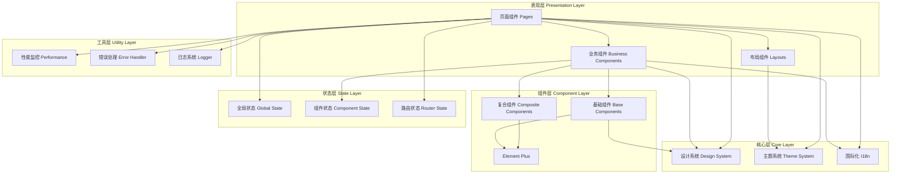

# 前端界面优化设计文档

## 概述

### 项目背景

Tableau AI 分析助手的前端界面需要进行全面优化，以提升用户体验、改善性能、增强可访问性。本设计基于 Vue 3 + TypeScript + Element Plus 技术栈，涵盖视觉设计、交互流程、性能优化、国际化等多个方面。

### 设计目标

1. **视觉优化**: 建立清晰的视觉层次和统一的设计系统
2. **性能提升**: 优化设置页面性能，减少 DOM 复杂度，提升响应速度
3. **交互改进**: 简化操作流程，减少用户操作步骤
4. **响应式设计**: 支持多种设备和屏幕尺寸
5. **可访问性**: 符合 WCAG 2.1 AA 标准
6. **国际化**: 支持多语言切换

### 技术栈

- **框架**: Vue 3 (Composition API)
- **语言**: TypeScript 4.9+
- **UI 库**: Element Plus
- **状态管理**: Pinia
- **路由**: Vue Router 4
- **国际化**: Vue I18n
- **构建工具**: Vite
- **CSS 方案**: SCSS + CSS Variables
- **动画**: CSS Transitions + Vue Transition

## 架构设计

### 系统架构



### 目录结构

```
src/
├── assets/              # 静态资源
│   ├── styles/          # 全局样式
│   │   ├── variables.scss    # SCSS 变量
│   │   ├── mixins.scss       # SCSS 混入
│   │   ├── reset.scss        # 样式重置
│   │   └── theme.scss        # 主题样式
│   ├── fonts/           # 字体文件
│   └── images/          # 图片资源

├── components/          # 组件
│   ├── base/            # 基础组件
│   │   ├── Button/
│   │   ├── Input/
│   │   ├── Card/
│   │   ├── Modal/
│   │   └── ...
│   ├── composite/       # 复合组件
│   │   ├── DataTable/
│   │   ├── Form/
│   │   ├── SearchBar/
│   │   └── ...
│   └── business/        # 业务组件
│       ├── ChatInterface/
│       ├── SettingsPanel/
│       ├── DataSourceSelector/
│       └── ...
├── layouts/             # 布局组件
│   ├── DefaultLayout.vue
│   ├── ChatLayout.vue
│   └── SettingsLayout.vue
├── pages/               # 页面组件
│   ├── Home/
│   ├── Chat/
│   ├── Settings/
│   └── ...
├── composables/         # 组合式函数
│   ├── useTheme.ts
│   ├── useI18n.ts
│   ├── usePerformance.ts
│   └── ...
├── stores/              # Pinia 状态管理
│   ├── app.ts
│   ├── user.ts
│   ├── settings.ts
│   └── ...
├── router/              # 路由配置
│   └── index.ts
├── locales/             # 国际化文件
│   ├── zh-CN.ts
│   └── en-US.ts

├── utils/               # 工具函数
│   ├── performance.ts
│   ├── logger.ts
│   ├── validator.ts
│   └── ...
├── types/               # TypeScript 类型定义
│   ├── components.d.ts
│   ├── api.d.ts
│   └── ...
├── design-system/       # 设计系统
│   ├── tokens.ts        # 设计令牌
│   ├── theme.ts         # 主题配置
│   └── spacing.ts       # 间距系统
└── App.vue
```

## 组件设计

### 设计系统 (Design System)

设计系统是整个 UI 的基础，定义了颜色、字体、间距、阴影等设计令牌。

#### 设计令牌 (Design Tokens)

```typescript
// design-system/tokens.ts

export interface DesignTokens {
  colors: ColorTokens;
  typography: TypographyTokens;
  spacing: SpacingTokens;
  shadows: ShadowTokens;
  borders: BorderTokens;
  transitions: TransitionTokens;
}

export interface ColorTokens {
  // 主色
  primary: ColorScale;
  // 辅助色
  secondary: ColorScale;
  // 中性色
  neutral: ColorScale;
  // 语义色
  success: ColorScale;
  warning: ColorScale;
  error: ColorScale;
  info: ColorScale;
}


export interface ColorScale {
  50: string;   // 最浅
  100: string;
  200: string;
  300: string;
  400: string;
  500: string;  // 基准色
  600: string;
  700: string;
  800: string;
  900: string;  // 最深
}

export interface TypographyTokens {
  fontFamily: {
    base: string;
    heading: string;
    mono: string;
  };
  fontSize: {
    xs: string;    // 12px
    sm: string;    // 14px
    base: string;  // 16px
    lg: string;    // 18px
    xl: string;    // 20px
    '2xl': string; // 24px
    '3xl': string; // 30px
    '4xl': string; // 36px
  };
  fontWeight: {
    light: number;    // 300
    normal: number;   // 400
    medium: number;   // 500
    semibold: number; // 600
    bold: number;     // 700
  };
  lineHeight: {
    tight: number;   // 1.25
    normal: number;  // 1.5
    relaxed: number; // 1.75
  };
}

export interface SpacingTokens {
  0: string;    // 0
  1: string;    // 4px
  2: string;    // 8px
  3: string;    // 12px
  4: string;    // 16px
  5: string;    // 20px
  6: string;    // 24px
  8: string;    // 32px
  10: string;   // 40px
  12: string;   // 48px
  16: string;   // 64px
  20: string;   // 80px
}


export interface ShadowTokens {
  sm: string;   // 小阴影
  base: string; // 基础阴影
  md: string;   // 中等阴影
  lg: string;   // 大阴影
  xl: string;   // 超大阴影
}

export interface BorderTokens {
  radius: {
    none: string;   // 0
    sm: string;     // 4px
    base: string;   // 8px
    md: string;     // 12px
    lg: string;     // 16px
    full: string;   // 9999px
  };
  width: {
    thin: string;   // 1px
    base: string;   // 2px
    thick: string;  // 4px
  };
}

export interface TransitionTokens {
  duration: {
    fast: string;     // 150ms
    base: string;     // 250ms
    slow: string;     // 400ms
  };
  timing: {
    linear: string;
    easeIn: string;
    easeOut: string;
    easeInOut: string;
  };
}
```

#### 主题系统

```typescript
// design-system/theme.ts

export type ThemeMode = 'light' | 'dark';

export interface Theme {
  mode: ThemeMode;
  tokens: DesignTokens;
}

export const lightTheme: Theme = {
  mode: 'light',
  tokens: {
    colors: {
      primary: {
        50: '#E3F2FD',
        100: '#BBDEFB',
        // ... 其他色阶
        500: '#2196F3',  // 主色
        // ...
      },
      // ... 其他颜色
    },
    // ... 其他令牌
  }
};


export const darkTheme: Theme = {
  mode: 'dark',
  tokens: {
    colors: {
      primary: {
        50: '#1A237E',
        // ... 深色主题色阶
        500: '#64B5F6',
        // ...
      },
      // ... 其他颜色
    },
    // ... 其他令牌
  }
};

export class ThemeManager {
  private currentTheme: Theme = lightTheme;
  
  setTheme(mode: ThemeMode): void {
    this.currentTheme = mode === 'light' ? lightTheme : darkTheme;
    this.applyTheme();
  }
  
  private applyTheme(): void {
    // 将主题令牌应用到 CSS 变量
    const root = document.documentElement;
    const { tokens } = this.currentTheme;
    
    // 应用颜色
    Object.entries(tokens.colors.primary).forEach(([key, value]) => {
      root.style.setProperty(`--color-primary-${key}`, value);
    });
    
    // 应用其他令牌...
  }
  
  getTheme(): Theme {
    return this.currentTheme;
  }
}
```

### 核心组件设计

#### 1. 聊天界面组件 (ChatInterface)

聊天界面是用户与 AI 交互的主要界面。

```typescript
// components/business/ChatInterface/types.ts

export interface Message {
  id: string;
  role: 'user' | 'assistant' | 'system';
  content: string;
  timestamp: Date;
  status?: 'sending' | 'sent' | 'error';
  metadata?: MessageMetadata;
}

export interface MessageMetadata {
  tokens?: number;
  model?: string;
  confidence?: number;
}


export interface ChatInterfaceProps {
  messages: Message[];
  loading?: boolean;
  placeholder?: string;
  maxHeight?: string;
  onSend: (content: string) => void | Promise<void>;
  onRetry?: (messageId: string) => void | Promise<void>;
}
```

**组件结构**:

```vue
<!-- components/business/ChatInterface/ChatInterface.vue -->
<template>
  <div class="chat-interface">
    <!-- 消息列表区域 -->
    <div class="chat-messages" ref="messagesContainer">
      <TransitionGroup name="message-fade">
        <MessageItem
          v-for="message in messages"
          :key="message.id"
          :message="message"
          @retry="handleRetry"
        />
      </TransitionGroup>
      
      <!-- 加载指示器 -->
      <LoadingIndicator v-if="loading" />
    </div>
    
    <!-- 输入区域 -->
    <div class="chat-input-area">
      <ChatInput
        v-model="inputValue"
        :placeholder="placeholder"
        :disabled="loading"
        @send="handleSend"
        @keydown.enter.exact="handleSend"
      />
      <Button
        type="primary"
        :loading="loading"
        :disabled="!inputValue.trim()"
        @click="handleSend"
      >
        发送
      </Button>
    </div>
  </div>
</template>

<script setup lang="ts">
import { ref, watch, nextTick } from 'vue';
import type { ChatInterfaceProps } from './types';

const props = defineProps<ChatInterfaceProps>();
const emit = defineEmits<{
  send: [content: string];
  retry: [messageId: string];
}>();

const inputValue = ref('');
const messagesContainer = ref<HTMLElement>();

// 自动滚动到底部
const scrollToBottom = () => {
  nextTick(() => {
    if (messagesContainer.value) {
      messagesContainer.value.scrollTop = messagesContainer.value.scrollHeight;
    }
  });
};

watch(() => props.messages, scrollToBottom, { deep: true });

const handleSend = async () => {
  if (!inputValue.value.trim() || props.loading) return;
  
  const content = inputValue.value;
  inputValue.value = '';
  
  await props.onSend(content);
};

const handleRetry = async (messageId: string) => {
  if (props.onRetry) {
    await props.onRetry(messageId);
  }
};
</script>
```


**样式设计**:

```scss
// components/business/ChatInterface/ChatInterface.scss

.chat-interface {
  display: flex;
  flex-direction: column;
  height: 100%;
  background: var(--color-neutral-50);
  
  .chat-messages {
    flex: 1;
    overflow-y: auto;
    padding: var(--spacing-4);
    scroll-behavior: smooth;
    
    // 自定义滚动条
    &::-webkit-scrollbar {
      width: 8px;
    }
    
    &::-webkit-scrollbar-thumb {
      background: var(--color-neutral-300);
      border-radius: var(--border-radius-full);
      
      &:hover {
        background: var(--color-neutral-400);
      }
    }
  }
  
  .chat-input-area {
    display: flex;
    gap: var(--spacing-2);
    padding: var(--spacing-4);
    background: var(--color-white);
    border-top: var(--border-width-thin) solid var(--color-neutral-200);
    box-shadow: var(--shadow-sm);
  }
}

// 消息动画
.message-fade-enter-active,
.message-fade-leave-active {
  transition: all var(--transition-duration-base) var(--transition-timing-easeInOut);
}

.message-fade-enter-from {
  opacity: 0;
  transform: translateY(20px);
}

.message-fade-leave-to {
  opacity: 0;
  transform: translateY(-20px);
}
```

#### 2. 消息项组件 (MessageItem)

```typescript
// components/business/ChatInterface/MessageItem.vue
```

```vue
<template>
  <div :class="['message-item', `message-${message.role}`]">
    <!-- 头像 -->
    <div class="message-avatar">
      <Avatar :type="message.role" />
    </div>
    
    <!-- 消息内容 -->
    <div class="message-content">
      <div class="message-header">
        <span class="message-role">{{ getRoleName(message.role) }}</span>
        <span class="message-time">{{ formatTime(message.timestamp) }}</span>
      </div>
      
      <div class="message-body">
        <MarkdownRenderer :content="message.content" />
      </div>
      
      <!-- 消息状态 -->
      <div v-if="message.status" class="message-status">
        <Icon v-if="message.status === 'sending'" name="loading" spin />
        <Icon v-else-if="message.status === 'error'" name="error" />
        <Button
          v-if="message.status === 'error'"
          type="text"
          size="small"
          @click="$emit('retry', message.id)"
        >
          重试
        </Button>
      </div>
    </div>
  </div>
</template>
```


```scss
.message-item {
  display: flex;
  gap: var(--spacing-3);
  margin-bottom: var(--spacing-4);
  
  &.message-user {
    flex-direction: row-reverse;
    
    .message-content {
      background: var(--color-primary-500);
      color: var(--color-white);
      border-radius: var(--border-radius-lg) var(--border-radius-lg) 0 var(--border-radius-lg);
    }
  }
  
  &.message-assistant {
    .message-content {
      background: var(--color-white);
      border: var(--border-width-thin) solid var(--color-neutral-200);
      border-radius: var(--border-radius-lg) var(--border-radius-lg) var(--border-radius-lg) 0;
    }
  }
  
  .message-avatar {
    flex-shrink: 0;
    width: 40px;
    height: 40px;
  }
  
  .message-content {
    flex: 1;
    max-width: 70%;
    padding: var(--spacing-3);
    box-shadow: var(--shadow-sm);
  }
  
  .message-header {
    display: flex;
    justify-content: space-between;
    margin-bottom: var(--spacing-2);
    font-size: var(--font-size-sm);
    opacity: 0.8;
  }
  
  .message-body {
    line-height: var(--line-height-normal);
  }
  
  .message-status {
    display: flex;
    align-items: center;
    gap: var(--spacing-2);
    margin-top: var(--spacing-2);
    font-size: var(--font-size-sm);
  }
}
```

#### 3. 设置面板组件 (SettingsPanel)

设置面板采用懒加载和虚拟滚动优化性能。

```typescript
// components/business/SettingsPanel/types.ts

export interface SettingSection {
  id: string;
  title: string;
  icon?: string;
  component: () => Promise<any>; // 懒加载组件
}

export interface SettingsPanelProps {
  sections: SettingSection[];
  activeSection?: string;
  onSectionChange?: (sectionId: string) => void;
}
```


```vue
<!-- components/business/SettingsPanel/SettingsPanel.vue -->
<template>
  <div class="settings-panel">
    <!-- 侧边栏导航 -->
    <aside class="settings-sidebar">
      <nav class="settings-nav">
        <button
          v-for="section in sections"
          :key="section.id"
          :class="['settings-nav-item', { active: activeSection === section.id }]"
          @click="handleSectionChange(section.id)"
        >
          <Icon v-if="section.icon" :name="section.icon" />
          <span>{{ section.title }}</span>
        </button>
      </nav>
    </aside>
    
    <!-- 内容区域 -->
    <main class="settings-content">
      <Suspense>
        <template #default>
          <component
            :is="currentSectionComponent"
            v-if="currentSectionComponent"
          />
        </template>
        <template #fallback>
          <LoadingSpinner />
        </template>
      </Suspense>
    </main>
  </div>
</template>

<script setup lang="ts">
import { ref, computed, watch } from 'vue';
import type { SettingsPanelProps } from './types';

const props = defineProps<SettingsPanelProps>();
const emit = defineEmits<{
  sectionChange: [sectionId: string];
}>();

const currentSection = ref(props.activeSection || props.sections[0]?.id);

// 懒加载当前选中的设置组件
const currentSectionComponent = computed(() => {
  const section = props.sections.find(s => s.id === currentSection.value);
  return section?.component();
});

const handleSectionChange = (sectionId: string) => {
  currentSection.value = sectionId;
  emit('sectionChange', sectionId);
};

watch(() => props.activeSection, (newValue) => {
  if (newValue) {
    currentSection.value = newValue;
  }
});
</script>
```


```scss
.settings-panel {
  display: flex;
  height: 100%;
  background: var(--color-neutral-50);
  
  .settings-sidebar {
    width: 240px;
    background: var(--color-white);
    border-right: var(--border-width-thin) solid var(--color-neutral-200);
    overflow-y: auto;
  }
  
  .settings-nav {
    padding: var(--spacing-4);
  }
  
  .settings-nav-item {
    display: flex;
    align-items: center;
    gap: var(--spacing-3);
    width: 100%;
    padding: var(--spacing-3);
    border: none;
    background: transparent;
    border-radius: var(--border-radius-base);
    cursor: pointer;
    transition: all var(--transition-duration-fast) var(--transition-timing-easeOut);
    
    &:hover {
      background: var(--color-neutral-100);
    }
    
    &.active {
      background: var(--color-primary-50);
      color: var(--color-primary-500);
      font-weight: var(--font-weight-medium);
    }
  }
  
  .settings-content {
    flex: 1;
    padding: var(--spacing-6);
    overflow-y: auto;
  }
}

// 响应式设计
@media (max-width: 768px) {
  .settings-panel {
    flex-direction: column;
    
    .settings-sidebar {
      width: 100%;
      border-right: none;
      border-bottom: var(--border-width-thin) solid var(--color-neutral-200);
    }
    
    .settings-nav {
      display: flex;
      overflow-x: auto;
      padding: var(--spacing-2);
    }
    
    .settings-nav-item {
      flex-shrink: 0;
      white-space: nowrap;
    }
  }
}
```

#### 4. 数据源选择器 (DataSourceSelector)

```typescript
// components/business/DataSourceSelector/types.ts

export interface DataSource {
  id: string;
  name: string;
  type: 'tableau' | 'powerbi' | 'excel';
  status: 'connected' | 'disconnected' | 'error';
  lastSync?: Date;
  metadata?: Record<string, any>;
}

export interface DataSourceSelectorProps {
  dataSources: DataSource[];
  selectedId?: string;
  loading?: boolean;
  onSelect: (dataSource: DataSource) => void;
  onRefresh?: () => void;
}
```


```vue
<template>
  <div class="data-source-selector">
    <div class="selector-header">
      <h3>数据源</h3>
      <Button
        type="text"
        :loading="loading"
        @click="handleRefresh"
      >
        <Icon name="refresh" />
      </Button>
    </div>
    
    <div class="selector-list">
      <div
        v-for="source in dataSources"
        :key="source.id"
        :class="['source-item', { selected: selectedId === source.id }]"
        @click="handleSelect(source)"
      >
        <div class="source-icon">
          <Icon :name="getSourceIcon(source.type)" />
        </div>
        
        <div class="source-info">
          <div class="source-name">{{ source.name }}</div>
          <div class="source-meta">
            <StatusBadge :status="source.status" />
            <span v-if="source.lastSync" class="source-sync">
              最后同步: {{ formatRelativeTime(source.lastSync) }}
            </span>
          </div>
        </div>
        
        <Icon
          v-if="selectedId === source.id"
          name="check"
          class="source-check"
        />
      </div>
    </div>
  </div>
</template>

<script setup lang="ts">
import type { DataSourceSelectorProps, DataSource } from './types';

const props = defineProps<DataSourceSelectorProps>();
const emit = defineEmits<{
  select: [dataSource: DataSource];
  refresh: [];
}>();

const handleSelect = (source: DataSource) => {
  emit('select', source);
};

const handleRefresh = () => {
  emit('refresh');
};

const getSourceIcon = (type: string): string => {
  const icons = {
    tableau: 'tableau',
    powerbi: 'powerbi',
    excel: 'excel'
  };
  return icons[type] || 'database';
};
</script>
```

### 界面设计详细说明

#### 主界面布局

```vue
<!-- layouts/DefaultLayout.vue -->
<template>
  <div class="default-layout">
    <!-- 顶部导航栏 -->
    <header class="layout-header">
      <div class="header-left">
        <Logo />
        <h1 class="app-title">Tableau AI 分析助手</h1>
      </div>
      
      <nav class="header-nav">
        <RouterLink to="/" class="nav-item">首页</RouterLink>
        <RouterLink to="/chat" class="nav-item">对话</RouterLink>
        <RouterLink to="/settings" class="nav-item">设置</RouterLink>
      </nav>
      
      <div class="header-right">
        <ThemeToggle />
        <LanguageSelector />
        <UserMenu />
      </div>
    </header>
    
    <!-- 主内容区 -->
    <main class="layout-main">
      <RouterView v-slot="{ Component }">
        <Transition name="page-fade" mode="out-in">
          <component :is="Component" />
        </Transition>
      </RouterView>
    </main>
  </div>
</template>
```


#### 对话页面完整设计

```vue
<!-- pages/Chat/ChatPage.vue -->
<template>
  <div class="chat-page">
    <!-- 侧边栏：会话历史 -->
    <aside class="chat-sidebar" :class="{ collapsed: sidebarCollapsed }">
      <div class="sidebar-header">
        <h3>会话历史</h3>
        <Button type="text" @click="toggleSidebar">
          <Icon :name="sidebarCollapsed ? 'expand' : 'collapse'" />
        </Button>
      </div>
      
      <div class="sidebar-content">
        <Button
          type="primary"
          block
          @click="createNewChat"
        >
          <Icon name="plus" />
          新建对话
        </Button>
        
        <div class="chat-history">
          <div
            v-for="chat in chatHistory"
            :key="chat.id"
            :class="['history-item', { active: currentChatId === chat.id }]"
            @click="switchChat(chat.id)"
          >
            <div class="history-title">{{ chat.title }}</div>
            <div class="history-time">{{ formatRelativeTime(chat.updatedAt) }}</div>
          </div>
        </div>
      </div>
    </aside>
    
    <!-- 主对话区 -->
    <div class="chat-main">
      <!-- 对话配置栏 -->
      <div class="chat-toolbar">
        <DataSourceSelector
          :data-sources="dataSources"
          :selected-id="selectedDataSourceId"
          @select="handleDataSourceSelect"
        />
        
        <div class="toolbar-actions">
          <Select v-model="analysisDepth" placeholder="分析深度">
            <Option value="quick">快速分析</Option>
            <Option value="standard">标准分析</Option>
            <Option value="deep">深度分析</Option>
          </Select>
          
          <Select v-model="aiModel" placeholder="AI 模型">
            <Option value="gpt-4">GPT-4</Option>
            <Option value="gpt-3.5">GPT-3.5</Option>
            <Option value="claude">Claude</Option>
          </Select>
        </div>
      </div>
      
      <!-- 对话界面 -->
      <ChatInterface
        :messages="messages"
        :loading="isLoading"
        placeholder="输入您的问题..."
        @send="handleSendMessage"
        @retry="handleRetryMessage"
      />
    </div>
  </div>
</template>

<script setup lang="ts">
import { ref, computed } from 'vue';
import { useChatStore } from '@/stores/chat';
import { useDataSourceStore } from '@/stores/dataSource';

const chatStore = useChatStore();
const dataSourceStore = useDataSourceStore();

const sidebarCollapsed = ref(false);
const currentChatId = ref<string>();
const selectedDataSourceId = ref<string>();
const analysisDepth = ref('standard');
const aiModel = ref('gpt-4');

const chatHistory = computed(() => chatStore.history);
const messages = computed(() => chatStore.currentMessages);
const isLoading = computed(() => chatStore.isLoading);
const dataSources = computed(() => dataSourceStore.dataSources);

const toggleSidebar = () => {
  sidebarCollapsed.value = !sidebarCollapsed.value;
};

const createNewChat = async () => {
  const chat = await chatStore.createChat();
  currentChatId.value = chat.id;
};

const switchChat = async (chatId: string) => {
  await chatStore.loadChat(chatId);
  currentChatId.value = chatId;
};

const handleSendMessage = async (content: string) => {
  await chatStore.sendMessage({
    content,
    dataSourceId: selectedDataSourceId.value,
    analysisDepth: analysisDepth.value,
    model: aiModel.value
  });
};

const handleRetryMessage = async (messageId: string) => {
  await chatStore.retryMessage(messageId);
};

const handleDataSourceSelect = (dataSource: DataSource) => {
  selectedDataSourceId.value = dataSource.id;
};
</script>
```


```scss
.chat-page {
  display: flex;
  height: 100vh;
  
  .chat-sidebar {
    width: 280px;
    background: var(--color-white);
    border-right: var(--border-width-thin) solid var(--color-neutral-200);
    transition: width var(--transition-duration-base) var(--transition-timing-easeInOut);
    
    &.collapsed {
      width: 60px;
      
      .sidebar-header h3,
      .sidebar-content .chat-history {
        display: none;
      }
    }
    
    .sidebar-header {
      display: flex;
      justify-content: space-between;
      align-items: center;
      padding: var(--spacing-4);
      border-bottom: var(--border-width-thin) solid var(--color-neutral-200);
    }
    
    .sidebar-content {
      padding: var(--spacing-4);
    }
    
    .chat-history {
      margin-top: var(--spacing-4);
      max-height: calc(100vh - 200px);
      overflow-y: auto;
    }
    
    .history-item {
      padding: var(--spacing-3);
      margin-bottom: var(--spacing-2);
      border-radius: var(--border-radius-base);
      cursor: pointer;
      transition: background var(--transition-duration-fast);
      
      &:hover {
        background: var(--color-neutral-100);
      }
      
      &.active {
        background: var(--color-primary-50);
        border-left: 3px solid var(--color-primary-500);
      }
      
      .history-title {
        font-weight: var(--font-weight-medium);
        margin-bottom: var(--spacing-1);
        overflow: hidden;
        text-overflow: ellipsis;
        white-space: nowrap;
      }
      
      .history-time {
        font-size: var(--font-size-sm);
        color: var(--color-neutral-500);
      }
    }
  }
  
  .chat-main {
    flex: 1;
    display: flex;
    flex-direction: column;
    
    .chat-toolbar {
      display: flex;
      justify-content: space-between;
      align-items: center;
      padding: var(--spacing-4);
      background: var(--color-white);
      border-bottom: var(--border-width-thin) solid var(--color-neutral-200);
      
      .toolbar-actions {
        display: flex;
        gap: var(--spacing-3);
      }
    }
  }
}

// 响应式设计
@media (max-width: 768px) {
  .chat-page {
    .chat-sidebar {
      position: fixed;
      left: 0;
      top: 0;
      height: 100vh;
      z-index: 1000;
      transform: translateX(-100%);
      transition: transform var(--transition-duration-base);
      
      &.show {
        transform: translateX(0);
      }
    }
    
    .chat-main {
      width: 100%;
      
      .chat-toolbar {
        flex-direction: column;
        gap: var(--spacing-3);
        
        .toolbar-actions {
          width: 100%;
          flex-direction: column;
        }
      }
    }
  }
}
```

#### 设置页面完整设计

```vue
<!-- pages/Settings/SettingsPage.vue -->
<template>
  <div class="settings-page">
    <SettingsPanel
      :sections="settingSections"
      :active-section="activeSection"
      @section-change="handleSectionChange"
    />
  </div>
</template>

<script setup lang="ts">
import { ref } from 'vue';
import type { SettingSection } from '@/components/business/SettingsPanel/types';

const activeSection = ref('general');

// 懒加载设置组件
const settingSections: SettingSection[] = [
  {
    id: 'general',
    title: '通用设置',
    icon: 'settings',
    component: () => import('./sections/GeneralSettings.vue')
  },
  {
    id: 'datasource',
    title: '数据源',
    icon: 'database',
    component: () => import('./sections/DataSourceSettings.vue')
  },
  {
    id: 'ai',
    title: 'AI 模型',
    icon: 'brain',
    component: () => import('./sections/AISettings.vue')
  },
  {
    id: 'appearance',
    title: '外观',
    icon: 'palette',
    component: () => import('./sections/AppearanceSettings.vue')
  },
  {
    id: 'language',
    title: '语言',
    icon: 'language',
    component: () => import('./sections/LanguageSettings.vue')
  },
  {
    id: 'accessibility',
    title: '无障碍',
    icon: 'accessibility',
    component: () => import('./sections/AccessibilitySettings.vue')
  }
];

const handleSectionChange = (sectionId: string) => {
  activeSection.value = sectionId;
};
</script>
```


**通用设置组件**:

```vue
<!-- pages/Settings/sections/GeneralSettings.vue -->
<template>
  <div class="general-settings">
    <h2>通用设置</h2>
    
    <SettingGroup title="分析偏好">
      <SettingItem
        label="默认分析深度"
        description="设置新对话的默认分析深度"
      >
        <Select v-model="settings.defaultAnalysisDepth">
          <Option value="quick">快速分析</Option>
          <Option value="standard">标准分析</Option>
          <Option value="deep">深度分析</Option>
        </Select>
      </SettingItem>
      
      <SettingItem
        label="自动保存对话"
        description="自动保存对话历史记录"
      >
        <Switch v-model="settings.autoSaveChat" />
      </SettingItem>
      
      <SettingItem
        label="对话保留时间"
        description="对话历史保留天数"
      >
        <InputNumber
          v-model="settings.chatRetentionDays"
          :min="1"
          :max="365"
        />
      </SettingItem>
    </SettingGroup>
    
    <SettingGroup title="性能">
      <SettingItem
        label="启用动画"
        description="启用界面过渡动画效果"
      >
        <Switch v-model="settings.enableAnimations" />
      </SettingItem>
      
      <SettingItem
        label="消息加载数量"
        description="每次加载的历史消息数量"
      >
        <InputNumber
          v-model="settings.messageLoadCount"
          :min="10"
          :max="100"
          :step="10"
        />
      </SettingItem>
    </SettingGroup>
    
    <div class="settings-actions">
      <Button type="primary" @click="saveSettings">保存设置</Button>
      <Button @click="resetSettings">重置为默认</Button>
    </div>
  </div>
</template>

<script setup lang="ts">
import { ref, onMounted } from 'vue';
import { useSettingsStore } from '@/stores/settings';
import { ElMessage } from 'element-plus';

const settingsStore = useSettingsStore();

const settings = ref({
  defaultAnalysisDepth: 'standard',
  autoSaveChat: true,
  chatRetentionDays: 30,
  enableAnimations: true,
  messageLoadCount: 50
});

onMounted(async () => {
  const savedSettings = await settingsStore.loadSettings();
  Object.assign(settings.value, savedSettings);
});

const saveSettings = async () => {
  try {
    await settingsStore.saveSettings(settings.value);
    ElMessage.success('设置已保存');
  } catch (error) {
    ElMessage.error('保存失败，请重试');
  }
};

const resetSettings = () => {
  settings.value = {
    defaultAnalysisDepth: 'standard',
    autoSaveChat: true,
    chatRetentionDays: 30,
    enableAnimations: true,
    messageLoadCount: 50
  };
};
</script>
```

**外观设置组件**:

```vue
<!-- pages/Settings/sections/AppearanceSettings.vue -->
<template>
  <div class="appearance-settings">
    <h2>外观设置</h2>
    
    <SettingGroup title="主题">
      <SettingItem
        label="主题模式"
        description="选择浅色或深色主题"
      >
        <RadioGroup v-model="appearance.theme">
          <Radio value="light">浅色</Radio>
          <Radio value="dark">深色</Radio>
          <Radio value="auto">跟随系统</Radio>
        </RadioGroup>
      </SettingItem>
      
      <SettingItem
        label="主题预览"
        description="实时预览主题效果"
      >
        <ThemePreview :theme="appearance.theme" />
      </SettingItem>
    </SettingGroup>
    
    <SettingGroup title="字体">
      <SettingItem
        label="字体大小"
        description="调整界面字体大小"
      >
        <Slider
          v-model="appearance.fontSize"
          :min="12"
          :max="20"
          :marks="{ 12: '小', 16: '中', 20: '大' }"
        />
      </SettingItem>
      
      <SettingItem
        label="字体族"
        description="选择界面使用的字体"
      >
        <Select v-model="appearance.fontFamily">
          <Option value="system">系统默认</Option>
          <Option value="sans-serif">无衬线</Option>
          <Option value="serif">衬线</Option>
          <Option value="monospace">等宽</Option>
        </Select>
      </SettingItem>
    </SettingGroup>
    
    <SettingGroup title="布局">
      <SettingItem
        label="紧凑模式"
        description="减少界面元素间距"
      >
        <Switch v-model="appearance.compactMode" />
      </SettingItem>
      
      <SettingItem
        label="侧边栏位置"
        description="设置侧边栏显示位置"
      >
        <RadioGroup v-model="appearance.sidebarPosition">
          <Radio value="left">左侧</Radio>
          <Radio value="right">右侧</Radio>
        </RadioGroup>
      </SettingItem>
    </SettingGroup>
    
    <div class="settings-actions">
      <Button type="primary" @click="saveAppearance">保存设置</Button>
      <Button @click="resetAppearance">重置为默认</Button>
    </div>
  </div>
</template>
```


## 数据模型

### 状态管理模型

#### Chat Store

```typescript
// stores/chat.ts

export interface ChatState {
  currentChatId: string | null;
  chats: Map<string, Chat>;
  messages: Map<string, Message[]>;
  isLoading: boolean;
  error: Error | null;
}

export interface Chat {
  id: string;
  title: string;
  createdAt: Date;
  updatedAt: Date;
  metadata: ChatMetadata;
}

export interface ChatMetadata {
  dataSourceId?: string;
  analysisDepth?: string;
  model?: string;
  messageCount: number;
}

export const useChatStore = defineStore('chat', {
  state: (): ChatState => ({
    currentChatId: null,
    chats: new Map(),
    messages: new Map(),
    isLoading: false,
    error: null
  }),
  
  getters: {
    currentChat: (state) => {
      return state.currentChatId ? state.chats.get(state.currentChatId) : null;
    },
    
    currentMessages: (state) => {
      return state.currentChatId ? state.messages.get(state.currentChatId) || [] : [];
    },
    
    history: (state) => {
      return Array.from(state.chats.values())
        .sort((a, b) => b.updatedAt.getTime() - a.updatedAt.getTime());
    }
  },
  
  actions: {
    async createChat(): Promise<Chat> {
      const chat: Chat = {
        id: generateId(),
        title: '新对话',
        createdAt: new Date(),
        updatedAt: new Date(),
        metadata: {
          messageCount: 0
        }
      };
      
      this.chats.set(chat.id, chat);
      this.messages.set(chat.id, []);
      this.currentChatId = chat.id;
      
      return chat;
    },
    
    async loadChat(chatId: string): Promise<void> {
      if (!this.chats.has(chatId)) {
        throw new Error(`Chat ${chatId} not found`);
      }
      
      this.currentChatId = chatId;
      
      // 如果消息未加载，从存储加载
      if (!this.messages.has(chatId)) {
        const messages = await loadMessagesFromStorage(chatId);
        this.messages.set(chatId, messages);
      }
    },

    
    async sendMessage(params: SendMessageParams): Promise<void> {
      if (!this.currentChatId) {
        throw new Error('No active chat');
      }
      
      this.isLoading = true;
      this.error = null;
      
      try {
        // 创建用户消息
        const userMessage: Message = {
          id: generateId(),
          role: 'user',
          content: params.content,
          timestamp: new Date(),
          status: 'sending'
        };
        
        // 添加到消息列表
        const messages = this.messages.get(this.currentChatId) || [];
        messages.push(userMessage);
        this.messages.set(this.currentChatId, messages);
        
        // 发送到后端
        const response = await sendMessageToAPI({
          chatId: this.currentChatId,
          message: params.content,
          dataSourceId: params.dataSourceId,
          analysisDepth: params.analysisDepth,
          model: params.model
        });
        
        // 更新用户消息状态
        userMessage.status = 'sent';
        
        // 添加 AI 响应
        const assistantMessage: Message = {
          id: generateId(),
          role: 'assistant',
          content: response.content,
          timestamp: new Date(),
          metadata: {
            tokens: response.tokens,
            model: response.model,
            confidence: response.confidence
          }
        };
        
        messages.push(assistantMessage);
        
        // 更新对话标题（如果是第一条消息）
        const chat = this.chats.get(this.currentChatId);
        if (chat && chat.metadata.messageCount === 0) {
          chat.title = generateChatTitle(params.content);
        }
        
        // 更新元数据
        if (chat) {
          chat.updatedAt = new Date();
          chat.metadata.messageCount = messages.length;
        }
        
        // 保存到存储
        await saveMessagesToStorage(this.currentChatId, messages);
        
      } catch (error) {
        this.error = error as Error;
        
        // 标记消息为错误状态
        const messages = this.messages.get(this.currentChatId) || [];
        const lastMessage = messages[messages.length - 1];
        if (lastMessage && lastMessage.role === 'user') {
          lastMessage.status = 'error';
        }
        
        throw error;
      } finally {
        this.isLoading = false;
      }
    },
    
    async retryMessage(messageId: string): Promise<void> {
      if (!this.currentChatId) return;
      
      const messages = this.messages.get(this.currentChatId) || [];
      const messageIndex = messages.findIndex(m => m.id === messageId);
      
      if (messageIndex === -1) return;
      
      const message = messages[messageIndex];
      
      // 移除失败的消息及其后续消息
      messages.splice(messageIndex);
      
      // 重新发送
      await this.sendMessage({
        content: message.content
      });
    }
  }
});
```

#### Settings Store

```typescript
// stores/settings.ts

export interface SettingsState {
  general: GeneralSettings;
  appearance: AppearanceSettings;
  ai: AISettings;
  language: LanguageSettings;
  accessibility: AccessibilitySettings;
}

export interface GeneralSettings {
  defaultAnalysisDepth: 'quick' | 'standard' | 'deep';
  autoSaveChat: boolean;
  chatRetentionDays: number;
  enableAnimations: boolean;
  messageLoadCount: number;
}

export interface AppearanceSettings {
  theme: 'light' | 'dark' | 'auto';
  fontSize: number;
  fontFamily: string;
  compactMode: boolean;
  sidebarPosition: 'left' | 'right';
}

export interface AISettings {
  defaultModel: string;
  temperature: number;
  maxTokens: number;
  streamResponse: boolean;
}

export interface LanguageSettings {
  locale: string;
  dateFormat: string;
  timeFormat: string;
  numberFormat: string;
}

export interface AccessibilitySettings {
  reduceMotion: boolean;
  highContrast: boolean;
  screenReaderOptimized: boolean;
  keyboardNavigationHints: boolean;
}

export const useSettingsStore = defineStore('settings', {
  state: (): SettingsState => ({
    general: {
      defaultAnalysisDepth: 'standard',
      autoSaveChat: true,
      chatRetentionDays: 30,
      enableAnimations: true,
      messageLoadCount: 50
    },
    appearance: {
      theme: 'auto',
      fontSize: 16,
      fontFamily: 'system',
      compactMode: false,
      sidebarPosition: 'left'
    },
    ai: {
      defaultModel: 'gpt-4',
      temperature: 0.7,
      maxTokens: 2000,
      streamResponse: true
    },
    language: {
      locale: 'zh-CN',
      dateFormat: 'YYYY-MM-DD',
      timeFormat: 'HH:mm:ss',
      numberFormat: '0,0.00'
    },
    accessibility: {
      reduceMotion: false,
      highContrast: false,
      screenReaderOptimized: false,
      keyboardNavigationHints: true
    }
  }),
  
  actions: {
    async loadSettings(): Promise<SettingsState> {
      try {
        const saved = await loadSettingsFromStorage();
        if (saved) {
          Object.assign(this.$state, saved);
        }
      } catch (error) {
        console.error('Failed to load settings:', error);
      }
      return this.$state;
    },
    
    async saveSettings(settings: Partial<SettingsState>): Promise<void> {
      Object.assign(this.$state, settings);
      await saveSettingsToStorage(this.$state);
      
      // 应用设置
      this.applySettings();
    },
    
    applySettings(): void {
      // 应用主题
      if (this.appearance.theme === 'auto') {
        const prefersDark = window.matchMedia('(prefers-color-scheme: dark)').matches;
        applyTheme(prefersDark ? 'dark' : 'light');
      } else {
        applyTheme(this.appearance.theme);
      }
      
      // 应用字体大小
      document.documentElement.style.setProperty('--base-font-size', `${this.appearance.fontSize}px`);
      
      // 应用动画设置
      if (!this.general.enableAnimations || this.accessibility.reduceMotion) {
        document.documentElement.classList.add('reduce-motion');
      } else {
        document.documentElement.classList.remove('reduce-motion');
      }
      
      // 应用高对比度
      if (this.accessibility.highContrast) {
        document.documentElement.classList.add('high-contrast');
      } else {
        document.documentElement.classList.remove('high-contrast');
      }
    }
  }
});
```

### API 数据模型

```typescript
// types/api.d.ts

export interface SendMessageRequest {
  chatId: string;
  message: string;
  dataSourceId?: string;
  analysisDepth?: string;
  model?: string;
}

export interface SendMessageResponse {
  content: string;
  tokens: number;
  model: string;
  confidence: number;
}

export interface DataSourceListResponse {
  dataSources: DataSource[];
  total: number;
}

export interface DataSourceSyncRequest {
  dataSourceId: string;
  force?: boolean;
}

export interface DataSourceSyncResponse {
  success: boolean;
  syncedAt: Date;
  changes: {
    added: number;
    updated: number;
    removed: number;
  };
}
```

## 性能优化策略

### 1. 代码拆分 (Code Splitting)

```typescript
// router/index.ts

import { createRouter, createWebHistory } from 'vue-router';

const router = createRouter({
  history: createWebHistory(),
  routes: [
    {
      path: '/',
      name: 'Home',
      component: () => import('@/pages/Home/HomePage.vue')
    },
    {
      path: '/chat',
      name: 'Chat',
      component: () => import('@/pages/Chat/ChatPage.vue')
    },
    {
      path: '/settings',
      name: 'Settings',
      component: () => import('@/pages/Settings/SettingsPage.vue'),
      children: [
        {
          path: 'general',
          component: () => import('@/pages/Settings/sections/GeneralSettings.vue')
        },
        {
          path: 'appearance',
          component: () => import('@/pages/Settings/sections/AppearanceSettings.vue')
        }
        // ... 其他设置页面
      ]
    }
  ]
});

export default router;
```

### 2. 虚拟滚动

```typescript
// composables/useVirtualScroll.ts

export interface VirtualScrollOptions {
  itemHeight: number;
  bufferSize?: number;
}

export function useVirtualScroll<T>(
  items: Ref<T[]>,
  containerRef: Ref<HTMLElement | undefined>,
  options: VirtualScrollOptions
) {
  const { itemHeight, bufferSize = 5 } = options;
  
  const scrollTop = ref(0);
  const containerHeight = ref(0);
  
  // 计算可见范围
  const visibleRange = computed(() => {
    const start = Math.floor(scrollTop.value / itemHeight);
    const end = Math.ceil((scrollTop.value + containerHeight.value) / itemHeight);
    
    return {
      start: Math.max(0, start - bufferSize),
      end: Math.min(items.value.length, end + bufferSize)
    };
  });
  
  // 可见项
  const visibleItems = computed(() => {
    const { start, end } = visibleRange.value;
    return items.value.slice(start, end).map((item, index) => ({
      item,
      index: start + index,
      top: (start + index) * itemHeight
    }));
  });
  
  // 总高度
  const totalHeight = computed(() => items.value.length * itemHeight);
  
  // 监听滚动
  const handleScroll = (event: Event) => {
    const target = event.target as HTMLElement;
    scrollTop.value = target.scrollTop;
  };
  
  // 监听容器大小
  const updateContainerHeight = () => {
    if (containerRef.value) {
      containerHeight.value = containerRef.value.clientHeight;
    }
  };
  
  onMounted(() => {
    updateContainerHeight();
    window.addEventListener('resize', updateContainerHeight);
  });
  
  onUnmounted(() => {
    window.removeEventListener('resize', updateContainerHeight);
  });
  
  return {
    visibleItems,
    totalHeight,
    handleScroll
  };
}
```

使用示例：

```vue
<template>
  <div
    ref="containerRef"
    class="virtual-scroll-container"
    @scroll="handleScroll"
  >
    <div :style="{ height: `${totalHeight}px`, position: 'relative' }">
      <div
        v-for="{ item, index, top } in visibleItems"
        :key="index"
        :style="{ position: 'absolute', top: `${top}px`, width: '100%' }"
      >
        <slot :item="item" :index="index" />
      </div>
    </div>
  </div>
</template>

<script setup lang="ts">
import { ref } from 'vue';
import { useVirtualScroll } from '@/composables/useVirtualScroll';

const props = defineProps<{
  items: any[];
  itemHeight: number;
}>();

const containerRef = ref<HTMLElement>();

const { visibleItems, totalHeight, handleScroll } = useVirtualScroll(
  toRef(props, 'items'),
  containerRef,
  { itemHeight: props.itemHeight }
);
</script>
```

### 3. 防抖与节流

```typescript
// utils/performance.ts

export function debounce<T extends (...args: any[]) => any>(
  func: T,
  wait: number
): (...args: Parameters<T>) => void {
  let timeout: ReturnType<typeof setTimeout> | null = null;
  
  return function(this: any, ...args: Parameters<T>) {
    const context = this;
    
    if (timeout) {
      clearTimeout(timeout);
    }
    
    timeout = setTimeout(() => {
      func.apply(context, args);
    }, wait);
  };
}

export function throttle<T extends (...args: any[]) => any>(
  func: T,
  wait: number
): (...args: Parameters<T>) => void {
  let timeout: ReturnType<typeof setTimeout> | null = null;
  let previous = 0;
  
  return function(this: any, ...args: Parameters<T>) {
    const context = this;
    const now = Date.now();
    const remaining = wait - (now - previous);
    
    if (remaining <= 0 || remaining > wait) {
      if (timeout) {
        clearTimeout(timeout);
        timeout = null;
      }
      previous = now;
      func.apply(context, args);
    } else if (!timeout) {
      timeout = setTimeout(() => {
        previous = Date.now();
        timeout = null;
        func.apply(context, args);
      }, remaining);
    }
  };
}
```

### 4. 图片懒加载

```typescript
// directives/lazyLoad.ts

export const lazyLoad = {
  mounted(el: HTMLImageElement, binding: any) {
    const options = {
      root: null,
      rootMargin: '50px',
      threshold: 0.01
    };
    
    const observer = new IntersectionObserver((entries) => {
      entries.forEach(entry => {
        if (entry.isIntersecting) {
          const img = entry.target as HTMLImageElement;
          img.src = binding.value;
          img.classList.add('loaded');
          observer.unobserve(img);
        }
      });
    }, options);
    
    observer.observe(el);
    
    // 保存 observer 以便清理
    (el as any)._lazyLoadObserver = observer;
  },
  
  unmounted(el: HTMLElement) {
    const observer = (el as any)._lazyLoadObserver;
    if (observer) {
      observer.disconnect();
    }
  }
};
```

使用：

```vue
<template>
  
</template>

<script setup lang="ts">
import { lazyLoad } from '@/directives/lazyLoad';

const vLazyLoad = lazyLoad;
</script>
```

### 5. 性能监控

```typescript
// utils/performanceMonitor.ts

export class PerformanceMonitor {
  private metrics: Map<string, PerformanceMetric> = new Map();
  
  startMeasure(name: string): void {
    performance.mark(`${name}-start`);
  }
  
  endMeasure(name: string): number {
    performance.mark(`${name}-end`);
    performance.measure(name, `${name}-start`, `${name}-end`);
    
    const measure = performance.getEntriesByName(name)[0];
    const duration = measure.duration;
    
    this.recordMetric(name, duration);
    
    // 清理标记
    performance.clearMarks(`${name}-start`);
    performance.clearMarks(`${name}-end`);
    performance.clearMeasures(name);
    
    return duration;
  }
  
  private recordMetric(name: string, duration: number): void {
    const metric = this.metrics.get(name) || {
      name,
      count: 0,
      total: 0,
      min: Infinity,
      max: 0,
      avg: 0
    };
    
    metric.count++;
    metric.total += duration;
    metric.min = Math.min(metric.min, duration);
    metric.max = Math.max(metric.max, duration);
    metric.avg = metric.total / metric.count;
    
    this.metrics.set(name, metric);
  }
  
  getMetrics(): PerformanceMetric[] {
    return Array.from(this.metrics.values());
  }
  
  logMetrics(): void {
    console.table(this.getMetrics());
  }
}

export interface PerformanceMetric {
  name: string;
  count: number;
  total: number;
  min: number;
  max: number;
  avg: number;
}

export const performanceMonitor = new PerformanceMonitor();
```

使用：

```typescript
// 在组件中使用
import { performanceMonitor } from '@/utils/performanceMonitor';

onMounted(() => {
  performanceMonitor.startMeasure('component-mount');
  // ... 初始化逻辑
  performanceMonitor.endMeasure('component-mount');
});
```


## 接口设计

### 组件接口

#### ChatInterface 接口

```typescript
export interface ChatInterfaceAPI {
  // 发送消息
  sendMessage(content: string): Promise<void>;
  
  // 重试消息
  retryMessage(messageId: string): Promise<void>;
  
  // 清空消息
  clearMessages(): void;
  
  // 滚动到底部
  scrollToBottom(): void;
  
  // 滚动到指定消息
  scrollToMessage(messageId: string): void;
}
```

#### SettingsPanel 接口

```typescript
export interface SettingsPanelAPI {
  // 切换到指定设置区块
  switchSection(sectionId: string): void;
  
  // 保存所有设置
  saveAllSettings(): Promise<void>;
  
  // 重置所有设置
  resetAllSettings(): void;
  
  // 获取当前设置
  getCurrentSettings(): SettingsState;
}
```

### 主题系统接口

```typescript
export interface ThemeSystemAPI {
  // 设置主题模式
  setTheme(mode: ThemeMode): void;
  
  // 获取当前主题
  getTheme(): Theme;
  
  // 切换主题
  toggleTheme(): void;
  
  // 监听主题变化
  onThemeChange(callback: (theme: Theme) => void): () => void;
}
```

### 国际化接口

```typescript
export interface I18nAPI {
  // 设置语言
  setLocale(locale: string): void;
  
  // 获取当前语言
  getLocale(): string;
  
  // 翻译文本
  t(key: string, params?: Record<string, any>): string;
  
  // 格式化日期
  formatDate(date: Date, format?: string): string;
  
  // 格式化数字
  formatNumber(value: number, format?: string): string;
}
```

## Correctness Properties

*属性是一个特征或行为，应该在系统的所有有效执行中保持为真——本质上是关于系统应该做什么的形式化陈述。属性作为人类可读规范和机器可验证正确性保证之间的桥梁。*

### 属性反思

在分析了所有验收标准后，我识别出以下可以合并或优化的属性：

**性能相关属性合并**：
- 多个关于响应时间的属性（1.2, 2.1, 2.5, 2.7, 3.4, 5.4, 8.1, 9.2）可以合并为一个通用的"操作响应时间"属性
- 但考虑到不同操作有不同的性能要求，保持分开更有利于精确测试

**样式验证属性合并**：
- 3.7（抗锯齿）和 7.7（页面切换过渡）是具体实现示例，不需要作为独立属性
- 5.1（断点定义）、3.2（颜色色阶）、3.3（主题模式）、3.5（文本层级）、9.1（语言支持）是配置验证，可以合并为配置完整性检查

**可访问性属性合并**：
- 10.1-10.7 都是关于 ARIA 和键盘导航的具体要求，可以保持独立以便精确测试
- 10.8 是综合测试，包含了前面所有可访问性属性

**最终决定**：保持大部分属性独立，因为它们测试不同的具体行为，合并会降低测试的精确性。

### 性能属性

#### 属性 1: 页面首次渲染性能

*对于任何*页面，当用户首次打开时，主要内容区域应在 500ms 内完成渲染，关键交互元素应在 100ms 内可见。

**验证需求: 1.2, 2.1**

#### 属性 2: 交互响应性能

*对于任何*用户交互操作（点击、输入、切换），系统应在 100ms 内提供视觉反馈，复杂操作（如选项卡切换）应在 300ms 内完成。

**验证需求: 2.5, 2.7, 5.4**

#### 属性 3: DOM 复杂度控制

*对于任何*页面，渲染的 DOM 节点总数应不超过 1500 个，设置页面应通过懒加载和虚拟滚动控制复杂度。

**验证需求: 2.2, 2.3, 2.6**

#### 属性 4: 代码包大小控制

*对于任何*路由页面，初始加载的 JavaScript 包大小应不超过 200KB（gzip 压缩后），组件库总体积应不超过 500KB。

**验证需求: 2.4, 6.7**

#### 属性 5: 动画性能

*对于任何*包含动画的界面，动画帧率应保持在 60fps，动画持续时间应在 150-400ms 之间，且只使用 transform 和 opacity 属性以优化性能。

**验证需求: 7.2, 7.5, 7.6**

### 视觉设计属性

#### 属性 6: 间距系统一致性

*对于任何*界面元素，所有间距值（margin、padding、gap）应为 8px 的倍数，确保视觉一致性。

**验证需求: 1.3**

#### 属性 7: 颜色对比度

*对于任何*文本内容和交互元素，前景色与背景色的对比度比率应至少为 4.5:1，符合 WCAG AA 标准。

**验证需求: 1.6**

#### 属性 8: 字体行高

*对于任何*正文文本，行高应至少为字体大小的 1.5 倍，确保可读性。

**验证需求: 3.6**

#### 属性 9: 交互状态视觉反馈

*对于任何*交互元素（按钮、链接、输入框），在 hover 和 focus 状态下应有明显的视觉变化（颜色、边框、阴影等）。

**验证需求: 3.8**

#### 属性 10: 主题切换

*对于任何*主题模式（浅色、深色），切换时所有使用主题令牌的元素应在 200ms 内完成颜色过渡。

**验证需求: 3.4**

### 响应式布局属性

#### 属性 11: 断点响应

*对于任何*屏幕宽度，当宽度小于 768px 时应应用移动端布局，768-1024px 应用平板布局，大于 1024px 应用桌面布局。

**验证需求: 5.2**

#### 属性 12: 触摸目标尺寸

*对于任何*交互元素，在移动端的最小触摸目标尺寸应为 44x44px，确保易于点击。

**验证需求: 5.3**

#### 属性 13: 文本可读性

*对于任何*断点下的文本内容，应自动换行且不需要横向滚动即可完整阅读。

**验证需求: 5.6**

#### 属性 14: 移动端功能优先级

*对于任何*移动端视图，非关键功能应被隐藏或折叠到菜单中，只显示核心功能。

**验证需求: 5.5**

### 交互流程属性

#### 属性 15: 进度指示

*对于任何*多步骤操作，应显示进度指示器，明确当前步骤和总步骤数。

**验证需求: 4.2**

#### 属性 16: 实时验证

*对于任何*用户输入，应在输入时进行实时验证，并立即显示验证结果（成功或错误）。

**验证需求: 4.3**

#### 属性 17: 加载状态指示

*对于任何*响应时间可能超过 1 秒的异步操作，应显示加载状态指示器（spinner、进度条等）。

**验证需求: 4.4**

#### 属性 18: 错误恢复

*对于任何*错误情况，应显示清晰的错误消息，包含错误原因和恢复建议或操作按钮。

**验证需求: 4.5, 8.3**

#### 属性 19: 操作反馈

*对于任何*用户操作，成功时应显示成功提示（3 秒后自动消失），失败时应显示错误提示（需用户手动关闭或点击重试）。

**验证需求: 4.7, 8.8**

#### 属性 20: 撤销功能

*对于任何*可撤销的操作（删除、修改等），应提供撤销按钮，撤销窗口至少保持 5 秒。

**验证需求: 4.8**

### 动画属性

#### 属性 21: 状态过渡动画

*对于任何*状态变化（显示/隐藏、展开/折叠、切换等），应提供平滑的过渡动画，使用缓动函数而非线性过渡。

**验证需求: 7.1, 7.3**

#### 属性 22: 减少动画模式

*对于任何*装饰性动画，当用户启用"减少动画"偏好设置或系统检测到 prefers-reduced-motion 时，应禁用或简化动画。

**验证需求: 7.4**

### 错误处理属性

#### 属性 23: 错误响应时间

*对于任何*错误情况，错误提示应在错误发生后 100ms 内显示。

**验证需求: 8.1**

#### 属性 24: 错误严重程度区分

*对于任何*错误，应根据严重程度（info、warning、error、critical）使用不同的视觉样式（颜色、图标）。

**验证需求: 8.2**

#### 属性 25: 网络错误重试

*对于任何*网络请求失败，应提供重试按钮，允许用户手动重试操作。

**验证需求: 8.4**

#### 属性 26: 错误日志记录

*对于任何*错误，应记录到日志系统，包含错误类型、消息、堆栈跟踪和上下文信息。

**验证需求: 8.5**

#### 属性 27: 表单验证反馈

*对于任何*表单字段，验证失败时应在字段旁显示内联错误提示，而不是只在表单提交时显示。

**验证需求: 8.6**

#### 属性 28: 长操作取消

*对于任何*预计执行时间超过 3 秒的操作，应提供取消按钮，允许用户中止操作。

**验证需求: 8.7**

### 国际化属性

#### 属性 29: 语言切换性能

*对于任何*语言切换操作，界面文本应在 500ms 内完成更新。

**验证需求: 9.2**

#### 属性 30: 文本国际化覆盖

*对于任何*用户可见的文本，应通过 i18n 系统管理，不应存在硬编码的文本字符串。

**验证需求: 9.3**

#### 属性 31: 默认语言检测

*对于任何*首次访问，应根据浏览器语言设置（navigator.language）自动选择匹配的界面语言。

**验证需求: 9.4**

#### 属性 32: 本地化格式

*对于任何*日期、时间、数字的显示，应根据当前语言设置使用相应的本地化格式。

**验证需求: 9.5**

#### 属性 33: 布局语言适配

*对于任何*语言，界面布局应能适应不同长度的文本，不应出现文本溢出或布局破坏。

**验证需求: 9.6**

#### 属性 34: 翻译回退

*对于任何*缺失的翻译键，应回退到默认语言（中文），并在开发模式下输出警告日志。

**验证需求: 9.7**

### 可访问性属性

#### 属性 35: ARIA 标签完整性

*对于任何*交互元素（按钮、链接、输入框、自定义控件），应提供适当的 ARIA 标签（aria-label、aria-labelledby 或 aria-describedby）。

**验证需求: 10.1**

#### 属性 36: 键盘导航

*对于任何*交互元素，应可通过 Tab 键访问，且焦点顺序应符合逻辑阅读顺序（从上到下、从左到右）。

**验证需求: 10.2, 10.4**

#### 属性 37: 焦点指示器

*对于任何*获得焦点的元素，应显示清晰可见的焦点指示器（outline 或自定义样式），对比度至少为 3:1。

**验证需求: 10.3**

#### 属性 38: 替代文本

*对于任何*图像、图标、图表等非文本内容，应提供描述性的替代文本（alt 属性或 aria-label）。

**验证需求: 10.5**

#### 属性 39: 表单标签关联

*对于任何*表单字段，应有对应的 label 元素或 aria-labelledby 属性，确保屏幕阅读器能正确识别。

**验证需求: 10.6**

#### 属性 40: 动态内容通知

*对于任何*重要的状态变化（错误提示、成功消息、内容更新），应使用 ARIA live regions（aria-live、role="status"等）通知屏幕阅读器。

**验证需求: 10.7**

#### 属性 41: WCAG 合规性

*对于任何*页面和组件，应通过 WCAG 2.1 AA 级别的自动化可访问性测试（使用 axe-core 或类似工具）。

**验证需求: 10.8**

### 组件标准化属性

#### 属性 42: TypeScript 类型定义

*对于任何*自定义组件，应提供完整的 TypeScript 类型定义，包括 props、emits、slots 和暴露的方法。

**验证需求: 6.2**

#### 属性 43: 主题定制支持

*对于任何*组件，样式应使用 CSS 变量或设计令牌，支持主题定制而不需要修改组件代码。

**验证需求: 6.4**

#### 属性 44: Props 验证

*对于任何*组件，当接收到无效的 props 时，应在开发模式下输出警告，说明期望的类型和接收到的值。

**验证需求: 6.5**

#### 属性 45: 组件无障碍性

*对于任何*交互组件，应包含必要的 ARIA 属性、键盘事件处理和焦点管理。

**验证需求: 6.6**


## 错误处理

### 错误分类

```typescript
// types/errors.ts

export enum ErrorSeverity {
  INFO = 'info',
  WARNING = 'warning',
  ERROR = 'error',
  CRITICAL = 'critical'
}

export enum ErrorCategory {
  NETWORK = 'network',
  VALIDATION = 'validation',
  PERMISSION = 'permission',
  SYSTEM = 'system',
  BUSINESS = 'business'
}

export interface AppError {
  id: string;
  severity: ErrorSeverity;
  category: ErrorCategory;
  message: string;
  details?: string;
  timestamp: Date;
  context?: Record<string, any>;
  stack?: string;
  recoverable: boolean;
  retryable: boolean;
}
```

### 错误处理策略

#### 网络错误

```typescript
// utils/errorHandler.ts

export class NetworkErrorHandler {
  async handleNetworkError(error: Error, context: RequestContext): Promise<void> {
    const appError: AppError = {
      id: generateId(),
      severity: ErrorSeverity.ERROR,
      category: ErrorCategory.NETWORK,
      message: '网络请求失败',
      details: error.message,
      timestamp: new Date(),
      context: {
        url: context.url,
        method: context.method,
        status: context.status
      },
      recoverable: true,
      retryable: true
    };
    
    // 记录错误
    logger.error('Network error', appError);
    
    // 显示错误提示
    ElMessage({
      type: 'error',
      message: appError.message,
      duration: 0, // 不自动关闭
      showClose: true,
      customClass: 'network-error-message',
      dangerouslyUseHTMLString: true,
      message: `
        <div>
          <p>${appError.message}</p>
          <p class="error-details">${appError.details}</p>
          <button class="retry-button" onclick="window.retryLastRequest()">
            重试
          </button>
        </div>
      `
    });
  }
}
```

#### 验证错误

```typescript
export class ValidationErrorHandler {
  handleValidationError(
    field: string,
    rule: ValidationRule,
    value: any
  ): ValidationError {
    const error: ValidationError = {
      field,
      rule: rule.type,
      message: rule.message || this.getDefaultMessage(rule.type),
      value
    };
    
    // 在字段旁显示错误
    this.showFieldError(field, error.message);
    
    return error;
  }
  
  private getDefaultMessage(ruleType: string): string {
    const messages: Record<string, string> = {
      required: '此字段为必填项',
      email: '请输入有效的邮箱地址',
      min: '输入值过短',
      max: '输入值过长',
      pattern: '格式不正确'
    };
    
    return messages[ruleType] || '验证失败';
  }
  
  private showFieldError(field: string, message: string): void {
    // 查找字段元素
    const fieldElement = document.querySelector(`[name="${field}"]`);
    if (!fieldElement) return;
    
    // 添加错误类
    fieldElement.classList.add('is-error');
    
    // 显示错误消息
    const errorElement = document.createElement('div');
    errorElement.className = 'field-error-message';
    errorElement.textContent = message;
    errorElement.setAttribute('role', 'alert');
    
    fieldElement.parentElement?.appendChild(errorElement);
  }
}
```

#### 全局错误处理

```typescript
// main.ts

import { createApp } from 'vue';
import App from './App.vue';

const app = createApp(App);

// 全局错误处理
app.config.errorHandler = (err, instance, info) => {
  const appError: AppError = {
    id: generateId(),
    severity: ErrorSeverity.CRITICAL,
    category: ErrorCategory.SYSTEM,
    message: '应用程序错误',
    details: err.message,
    timestamp: new Date(),
    context: {
      component: instance?.$options.name,
      info
    },
    stack: err.stack,
    recoverable: false,
    retryable: false
  };
  
  // 记录错误
  logger.error('Application error', appError);
  
  // 显示错误页面或提示
  if (appError.severity === ErrorSeverity.CRITICAL) {
    showErrorPage(appError);
  } else {
    ElMessage.error({
      message: appError.message,
      duration: 5000
    });
  }
};

// 未捕获的 Promise 错误
window.addEventListener('unhandledrejection', (event) => {
  const appError: AppError = {
    id: generateId(),
    severity: ErrorSeverity.ERROR,
    category: ErrorCategory.SYSTEM,
    message: '未处理的 Promise 错误',
    details: event.reason?.message || String(event.reason),
    timestamp: new Date(),
    recoverable: false,
    retryable: false
  };
  
  logger.error('Unhandled promise rejection', appError);
  
  ElMessage.error({
    message: appError.message,
    duration: 5000
  });
});
```

### 错误边界组件

```vue
<!-- components/base/ErrorBoundary/ErrorBoundary.vue -->
<template>
  <div class="error-boundary">
    <slot v-if="!hasError" />
    
    <div v-else class="error-fallback">
      <div class="error-icon">
        <Icon name="error" size="48" />
      </div>
      
      <h2>出错了</h2>
      
      <p class="error-message">{{ error?.message }}</p>
      
      <div class="error-actions">
        <Button type="primary" @click="handleRetry">
          重试
        </Button>
        <Button @click="handleReset">
          返回首页
        </Button>
      </div>
      
      <details v-if="showDetails" class="error-details">
        <summary>错误详情</summary>
        <pre>{{ error?.stack }}</pre>
      </details>
    </div>
  </div>
</template>

<script setup lang="ts">
import { ref, onErrorCaptured } from 'vue';
import { useRouter } from 'vue-router';

const props = defineProps<{
  showDetails?: boolean;
  onError?: (error: Error) => void;
}>();

const router = useRouter();
const hasError = ref(false);
const error = ref<Error | null>(null);

onErrorCaptured((err) => {
  hasError.value = true;
  error.value = err;
  
  if (props.onError) {
    props.onError(err);
  }
  
  // 阻止错误继续传播
  return false;
});

const handleRetry = () => {
  hasError.value = false;
  error.value = null;
};

const handleReset = () => {
  router.push('/');
  hasError.value = false;
  error.value = null;
};
</script>
```

## 测试策略

### 测试金字塔

```
        /\
       /  \
      / E2E \          端到端测试 (10%)
     /______\
    /        \
   / 集成测试  \        集成测试 (30%)
  /___________\
 /             \
/   单元测试     \      单元测试 (60%)
/_______________\
```

### 单元测试

使用 Vitest 进行单元测试，重点测试：
- 组件逻辑
- 工具函数
- 状态管理
- 数据转换

```typescript
// components/base/Button/Button.spec.ts

import { describe, it, expect } from 'vitest';
import { mount } from '@vue/test-utils';
import Button from './Button.vue';

describe('Button', () => {
  it('renders correctly', () => {
    const wrapper = mount(Button, {
      props: {
        type: 'primary'
      },
      slots: {
        default: '点击我'
      }
    });
    
    expect(wrapper.text()).toBe('点击我');
    expect(wrapper.classes()).toContain('button-primary');
  });
  
  it('emits click event', async () => {
    const wrapper = mount(Button);
    
    await wrapper.trigger('click');
    
    expect(wrapper.emitted('click')).toHaveLength(1);
  });
  
  it('is disabled when loading', () => {
    const wrapper = mount(Button, {
      props: {
        loading: true
      }
    });
    
    expect(wrapper.attributes('disabled')).toBeDefined();
    expect(wrapper.find('.loading-icon').exists()).toBe(true);
  });
});
```

### 属性测试

使用 fast-check 进行属性测试，验证通用属性：

```typescript
// utils/performance.spec.ts

import { describe, it } from 'vitest';
import fc from 'fast-check';
import { debounce, throttle } from './performance';

describe('Performance utilities - Property tests', () => {
  it('Property 1: debounce 应该延迟执行函数', () => {
    fc.assert(
      fc.property(
        fc.integer({ min: 10, max: 1000 }), // wait time
        fc.array(fc.integer({ min: 0, max: 100 }), { minLength: 1, maxLength: 10 }), // call times
        async (wait, callTimes) => {
          let callCount = 0;
          const debouncedFn = debounce(() => {
            callCount++;
          }, wait);
          
          // 快速连续调用
          callTimes.forEach(() => debouncedFn());
          
          // 等待 debounce 时间
          await new Promise(resolve => setTimeout(resolve, wait + 10));
          
          // 应该只执行一次
          return callCount === 1;
        }
      ),
      { numRuns: 100 }
    );
  });
  
  it('Property 2: throttle 应该限制执行频率', () => {
    fc.assert(
      fc.property(
        fc.integer({ min: 100, max: 500 }), // wait time
        fc.integer({ min: 5, max: 20 }), // call count
        async (wait, callCount) => {
          let executionCount = 0;
          const throttledFn = throttle(() => {
            executionCount++;
          }, wait);
          
          // 连续调用
          for (let i = 0; i < callCount; i++) {
            throttledFn();
            await new Promise(resolve => setTimeout(resolve, 10));
          }
          
          // 执行次数应该少于调用次数
          return executionCount < callCount;
        }
      ),
      { numRuns: 100 }
    );
  });
});
```

### 集成测试

测试组件之间的交互和数据流：

```typescript
// pages/Chat/ChatPage.integration.spec.ts

import { describe, it, expect, beforeEach } from 'vitest';
import { mount } from '@vue/test-utils';
import { createPinia, setActivePinia } from 'pinia';
import ChatPage from './ChatPage.vue';
import { useChatStore } from '@/stores/chat';

describe('ChatPage Integration', () => {
  beforeEach(() => {
    setActivePinia(createPinia());
  });
  
  it('should send message and display response', async () => {
    const wrapper = mount(ChatPage);
    const chatStore = useChatStore();
    
    // 创建新对话
    await chatStore.createChat();
    
    // 输入消息
    const input = wrapper.find('input[type="text"]');
    await input.setValue('测试消息');
    
    // 发送消息
    const sendButton = wrapper.find('button[type="submit"]');
    await sendButton.trigger('click');
    
    // 等待响应
    await wrapper.vm.$nextTick();
    
    // 验证消息显示
    const messages = wrapper.findAll('.message-item');
    expect(messages.length).toBeGreaterThan(0);
    expect(messages[0].text()).toContain('测试消息');
  });
});
```

### 端到端测试

使用 Playwright 进行端到端测试：

```typescript
// e2e/chat.spec.ts

import { test, expect } from '@playwright/test';

test.describe('Chat Flow', () => {
  test('complete chat interaction', async ({ page }) => {
    // 访问聊天页面
    await page.goto('/chat');
    
    // 等待页面加载
    await expect(page.locator('.chat-interface')).toBeVisible();
    
    // 输入消息
    await page.fill('input[placeholder="输入您的问题..."]', '显示销售数据');
    
    // 发送消息
    await page.click('button:has-text("发送")');
    
    // 等待响应
    await expect(page.locator('.message-assistant')).toBeVisible({ timeout: 10000 });
    
    // 验证响应内容
    const response = await page.locator('.message-assistant').textContent();
    expect(response).toBeTruthy();
  });
  
  test('Property: 页面首次渲染性能', async ({ page }) => {
    // Feature: frontend-ui-optimization, Property 1: 页面首次渲染性能
    const startTime = Date.now();
    
    await page.goto('/chat');
    
    // 等待主要内容渲染
    await page.waitForSelector('.chat-interface', { state: 'visible' });
    
    const renderTime = Date.now() - startTime;
    
    // 应在 500ms 内完成
    expect(renderTime).toBeLessThan(500);
  });
});
```

### 可访问性测试

使用 axe-core 进行自动化可访问性测试：

```typescript
// tests/accessibility.spec.ts

import { describe, it, expect } from 'vitest';
import { mount } from '@vue/test-utils';
import { axe, toHaveNoViolations } from 'jest-axe';
import ChatInterface from '@/components/business/ChatInterface/ChatInterface.vue';

expect.extend(toHaveNoViolations);

describe('Accessibility Tests', () => {
  it('Property 41: ChatInterface 应通过 WCAG 2.1 AA 测试', async () => {
    // Feature: frontend-ui-optimization, Property 41: WCAG 合规性
    const wrapper = mount(ChatInterface, {
      props: {
        messages: [],
        onSend: () => {}
      }
    });
    
    const results = await axe(wrapper.element);
    
    expect(results).toHaveNoViolations();
  });
  
  it('Property 35: 所有交互元素应有 ARIA 标签', () => {
    // Feature: frontend-ui-optimization, Property 35: ARIA 标签完整性
    const wrapper = mount(ChatInterface, {
      props: {
        messages: [],
        onSend: () => {}
      }
    });
    
    const buttons = wrapper.findAll('button');
    const inputs = wrapper.findAll('input');
    
    // 验证所有按钮有 aria-label 或文本内容
    buttons.forEach(button => {
      const hasLabel = button.attributes('aria-label') || button.text().trim();
      expect(hasLabel).toBeTruthy();
    });
    
    // 验证所有输入框有 aria-label 或关联的 label
    inputs.forEach(input => {
      const hasLabel = input.attributes('aria-label') || 
                      input.attributes('aria-labelledby') ||
                      input.attributes('id'); // 可能有关联的 label
      expect(hasLabel).toBeTruthy();
    });
  });
});
```

### 性能测试

```typescript
// tests/performance.spec.ts

import { describe, it, expect } from 'vitest';
import { mount } from '@vue/test-utils';
import SettingsPanel from '@/components/business/SettingsPanel/SettingsPanel.vue';

describe('Performance Tests', () => {
  it('Property 3: DOM 复杂度应控制在 1500 节点以内', () => {
    // Feature: frontend-ui-optimization, Property 3: DOM 复杂度控制
    const wrapper = mount(SettingsPanel, {
      props: {
        sections: [
          { id: '1', title: 'Section 1', component: () => import('./MockSection.vue') },
          { id: '2', title: 'Section 2', component: () => import('./MockSection.vue') }
        ]
      }
    });
    
    const nodeCount = wrapper.element.querySelectorAll('*').length;
    
    expect(nodeCount).toBeLessThanOrEqual(1500);
  });
  
  it('Property 6: 间距应为 8px 的倍数', () => {
    // Feature: frontend-ui-optimization, Property 6: 间距系统一致性
    const wrapper = mount(SettingsPanel);
    
    const elements = wrapper.element.querySelectorAll('*');
    
    elements.forEach(element => {
      const styles = window.getComputedStyle(element);
      const margin = parseInt(styles.marginTop) || 0;
      const padding = parseInt(styles.paddingTop) || 0;
      
      if (margin > 0) {
        expect(margin % 8).toBe(0);
      }
      if (padding > 0) {
        expect(padding % 8).toBe(0);
      }
    });
  });
});
```

### 测试配置

```typescript
// vitest.config.ts

import { defineConfig } from 'vitest/config';
import vue from '@vitejs/plugin-vue';
import { fileURLToPath } from 'url';

export default defineConfig({
  plugins: [vue()],
  test: {
    globals: true,
    environment: 'jsdom',
    setupFiles: ['./tests/setup.ts'],
    coverage: {
      provider: 'v8',
      reporter: ['text', 'json', 'html'],
      exclude: [
        'node_modules/',
        'tests/',
        '**/*.spec.ts',
        '**/*.d.ts'
      ]
    }
  },
  resolve: {
    alias: {
      '@': fileURLToPath(new URL('./src', import.meta.url))
    }
  }
});
```

### 测试覆盖率目标

- 单元测试覆盖率: ≥ 80%
- 集成测试覆盖率: ≥ 60%
- 端到端测试: 覆盖所有关键用户流程
- 属性测试: 每个属性至少 100 次迭代
- 可访问性测试: 所有页面和组件通过 WCAG 2.1 AA

## 实施计划

### 阶段 1: 基础设施 (2 周)

1. 设置项目结构和构建配置
2. 实现设计系统和主题系统
3. 配置国际化
4. 建立组件库基础

### 阶段 2: 核心组件 (3 周)

1. 实现基础组件（Button、Input、Card 等）
2. 实现复合组件（DataTable、Form 等）
3. 实现业务组件（ChatInterface、SettingsPanel 等）
4. 编写组件单元测试

### 阶段 3: 页面开发 (2 周)

1. 实现主要页面（Home、Chat、Settings）
2. 实现布局组件
3. 集成路由和状态管理
4. 编写集成测试

### 阶段 4: 性能优化 (1 周)

1. 实现代码拆分和懒加载
2. 实现虚拟滚动
3. 优化动画性能
4. 性能测试和调优

### 阶段 5: 可访问性和国际化 (1 周)

1. 添加 ARIA 属性
2. 实现键盘导航
3. 完善国际化翻译
4. 可访问性测试

### 阶段 6: 测试和发布 (1 周)

1. 端到端测试
2. 属性测试
3. 性能基准测试
4. 文档编写
5. 发布准备

## 附录

### 浏览器兼容性

- Chrome/Edge: 最新版本及前两个主要版本
- Firefox: 最新版本及前两个主要版本
- Safari: 最新版本及前一个主要版本
- 移动浏览器: iOS Safari 14+, Chrome Android 最新版

### 开发工具

- IDE: VS Code
- 代码格式化: Prettier
- 代码检查: ESLint
- 类型检查: TypeScript
- 测试: Vitest, Playwright
- 构建: Vite
- 版本控制: Git

### 参考资源

- [Vue 3 文档](https://vuejs.org/)
- [Element Plus 文档](https://element-plus.org/)
- [WCAG 2.1 指南](https://www.w3.org/WAI/WCAG21/quickref/)
- [MDN Web 文档](https://developer.mozilla.org/)
- [Web.dev 性能指南](https://web.dev/performance/)
