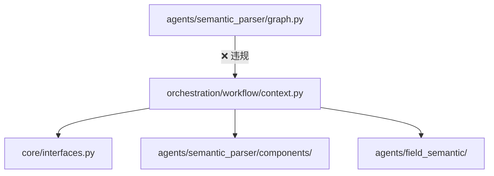
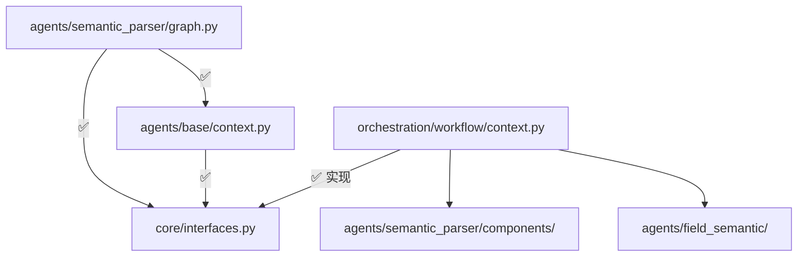

# 设计文档：Graph 依赖方向重构

## 概述

本次重构解决 `agents/semantic_parser/graph.py` 违反 Rule 12A.2 的依赖方向问题。当前 `graph.py` 直接导入 `orchestration/workflow/context.py` 中的 `get_context` 和 `get_context_or_raise`，形成了 `agents/ → orchestration/` 的非法依赖。

重构策略：
1. 在 `core/interfaces.py` 中新增 `WorkflowContextProtocol`（`typing.Protocol`），声明 Agent 节点所需的属性和方法
2. 在 `agents/base/context.py` 中新增 `get_context` / `get_context_or_raise` 辅助函数，返回类型为 Protocol
3. 更新 `graph.py` 的导入路径，从 `agents/base/` 导入
4. 清理 `orchestration/` 中不再被外部使用的冗余导出

## 架构

### 重构前依赖关系



### 重构后依赖关系



### 设计决策

**为什么用 `typing.Protocol` 而非 ABC？**
- `WorkflowContext` 是 Pydantic `BaseModel`，不方便多继承 ABC
- Protocol 支持结构化子类型（鸭子类型），`WorkflowContext` 无需显式声明实现关系
- 与现有 `BasePlatformAdapter`（ABC）互补：ABC 用于需要显式继承的平台适配器，Protocol 用于跨层解耦

**为什么在 `agents/base/context.py` 新建文件而非放入 `node.py`？**
- `node.py` 专注于 LLM 调用相关辅助函数
- 上下文获取是独立的关注点，单独文件更清晰
- 遵循单一职责原则

**为什么不把 `get_context` 放在 `core/` 中？**
- `get_context` 是 Agent 节点的辅助函数，属于 Agent 基础设施
- `core/` 应只包含接口定义和通用 Schema，不包含辅助函数逻辑

## 组件与接口

### 1. WorkflowContextProtocol（新增，core/interfaces.py）

```python
from typing import Any, Dict, List, Optional, Protocol, runtime_checkable

@runtime_checkable
class WorkflowContextProtocol(Protocol):
    """工作流上下文协议 - Agent 节点可依赖的抽象接口。"""

    @property
    def datasource_luid(self) -> str: ...

    @property
    def data_model(self) -> Optional[Any]: ...

    @property
    def field_semantic(self) -> Optional[Dict[str, Any]]: ...

    @property
    def platform_adapter(self) -> Optional[Any]: ...

    @property
    def auth(self) -> Optional[Any]: ...

    @property
    def field_values_cache(self) -> Dict[str, List[str]]: ...

    @property
    def schema_hash(self) -> str: ...

    def enrich_field_candidates_with_hierarchy(
        self, field_candidates: List[Any],
    ) -> List[Any]: ...
```

使用 `@runtime_checkable` 以便在需要时可以用 `isinstance()` 检查。

### 2. get_context / get_context_or_raise（新增，agents/base/context.py）

```python
from typing import Any, Dict, Optional

from analytics_assistant.src.core.interfaces import WorkflowContextProtocol


def get_context(
    config: Optional[Dict[str, Any]],
) -> Optional[WorkflowContextProtocol]:
    """从 RunnableConfig 获取工作流上下文。"""
    if config is None:
        return None
    configurable = config.get("configurable", {})
    return configurable.get("workflow_context")


def get_context_or_raise(
    config: Optional[Dict[str, Any]],
) -> WorkflowContextProtocol:
    """从 RunnableConfig 获取工作流上下文，不存在则抛出异常。"""
    if config is None:
        raise ValueError("config is None, cannot get WorkflowContext")
    ctx = get_context(config)
    if ctx is None:
        raise ValueError(
            "WorkflowContext not found in config. "
            "Make sure to use create_workflow_config() to create the config."
        )
    return ctx
```

### 3. graph.py 导入变更

```python
# 变更前
from analytics_assistant.src.orchestration.workflow.context import (
    get_context,
    get_context_or_raise,
)

# 变更后
from analytics_assistant.src.agents.base.context import (
    get_context,
    get_context_or_raise,
)
```

节点函数内部代码无需修改，因为 `get_context` 返回的对象仍然是 `WorkflowContext` 实例（只是类型注解变为 Protocol）。

### 4. agents/base/__init__.py 导出更新

在 `__init__.py` 中新增导出：

```python
from .context import get_context, get_context_or_raise
```

### 5. orchestration 模块清理

由于 `graph.py` 是唯一从 agents 层导入 `get_context` / `get_context_or_raise` 的文件，重构后 orchestration 中这两个函数仅在 orchestration 内部使用。保留它们在 `context.py` 中（orchestration 内部仍可使用），但从 `orchestration/__init__.py` 和 `orchestration/workflow/__init__.py` 的 `__all__` 中移除导出（因为外部调用方应使用 `agents/base/` 的版本）。

## 数据模型

本次重构不引入新的数据模型。`WorkflowContextProtocol` 是纯接口定义（Protocol），不包含数据存储。

现有数据流保持不变：
- `orchestration/` 创建 `WorkflowContext` 实例 → 放入 `RunnableConfig`
- Agent 节点通过 `get_context(config)` 获取 → 类型为 `WorkflowContextProtocol`
- 运行时实际对象仍是 `WorkflowContext`，行为完全一致


## 正确性属性

*正确性属性是系统在所有有效执行中都应保持为真的特征或行为——本质上是关于系统应该做什么的形式化陈述。属性是人类可读规范与机器可验证正确性保证之间的桥梁。*

### Property 1: WorkflowContext 满足 Protocol 约束

*对于任意* 有效的 `WorkflowContext` 实例（包含任意合法的 `datasource_luid`、`data_model`、`field_semantic`、`platform_adapter`、`auth`、`field_values_cache` 组合），该实例都应通过 `isinstance(ctx, WorkflowContextProtocol)` 检查。

**Validates: Requirements 1.5**

### Property 2: get_context 提取等价性

*对于任意* 对象 `obj`，如果将其放入 `config = {"configurable": {"workflow_context": obj}}`，则 `get_context(config)` 应返回与 `obj` 完全相同的对象（`is` 相等）。

**Validates: Requirements 2.4, 3.4**

## 错误处理

本次重构的错误处理策略与现有代码保持一致：

| 场景 | 处理方式 |
|------|----------|
| `get_context(None)` | 返回 `None`，由调用方决定降级策略 |
| `get_context_or_raise(None)` | 抛出 `ValueError`，包含明确的错误信息 |
| config 中无 `workflow_context` 键 | `get_context` 返回 `None`；`get_context_or_raise` 抛出 `ValueError` |
| `WorkflowContext` 不满足 Protocol | 编译时由类型检查器（mypy/pyright）捕获；运行时通过 `@runtime_checkable` 可用 `isinstance` 检查 |

不引入新的异常类型。所有错误处理逻辑复用现有模式。

## 测试策略

### 属性测试（Property-Based Testing）

使用 **Hypothesis** 库进行属性测试，每个属性至少运行 100 次迭代。

- **Property 1**: 生成随机的 `datasource_luid`（非空字符串）和可选的 `data_model`、`field_semantic` 等字段，构造 `WorkflowContext` 实例，验证 `isinstance(ctx, WorkflowContextProtocol)` 为 True
  - Tag: **Feature: graph-dependency-refactor, Property 1: WorkflowContext 满足 Protocol 约束**

- **Property 2**: 生成随机对象，放入 config 字典的 `configurable.workflow_context` 键，调用 `get_context(config)`，验证返回值 `is` 原始对象
  - Tag: **Feature: graph-dependency-refactor, Property 2: get_context 提取等价性**

### 单元测试

单元测试覆盖以下边界情况和具体示例：

- `get_context(None)` 返回 `None`
- `get_context_or_raise(None)` 抛出 `ValueError`
- `get_context({})` 返回 `None`（空 config）
- `get_context_or_raise({"configurable": {}})` 抛出 `ValueError`
- `graph.py` 文件不包含 `orchestration` 导入（静态分析测试）
- `agents/base/context.py` 仅导入 `core/` 模块（依赖方向验证）

### 测试配置

- 属性测试库：`hypothesis`
- 每个属性测试最少 100 次迭代
- 每个属性测试必须用注释标注对应的设计文档属性编号
- 测试文件位置：`analytics_assistant/tests/agents/base/test_context.py`
