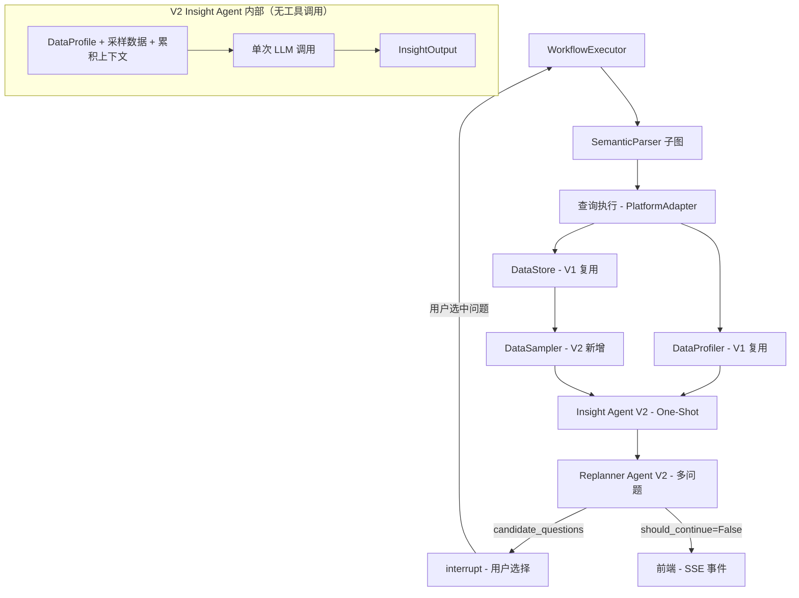
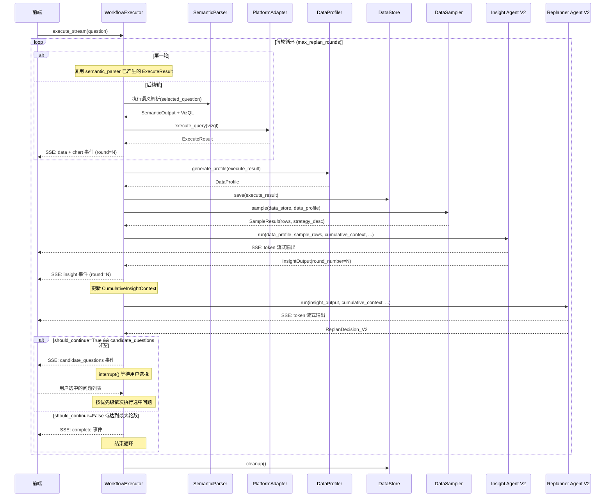
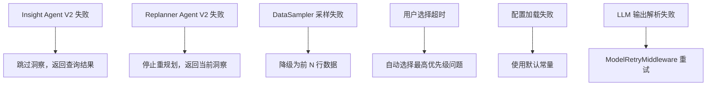

# 设计文档：洞察与重规划系统 V2 — 根本性重构

## 概述

本设计对 Analytics Assistant 的洞察生成和重规划系统进行根本性重构。V1 依赖 ReAct 循环 + Tool Calling 架构，但核心 LLM（DeepSeek R1 via CustomChatLLM）不支持原生 function calling，导致整个工具调用链路失效。

V2 核心架构变更：
- **One-Shot Analysis 替代 ReAct 循环**：新增 DataSampler 组件，将 DataProfile + 采样数据 + 用户问题一次性注入 Prompt，单次 LLM 调用输出 InsightOutput。彻底消除对 bind_tools / function calling 的依赖。
- **多问题选择机制**：Replanner 生成 `candidate_questions`（带 priority + expected_info_gain），通过 LangGraph `interrupt()` 暂停让用户选择要执行的问题。
- **渐进式累积洞察**：引入 CumulativeInsightContext，多轮洞察通过上下文串联，后续轮次参考前序发现。
- **V1 组件最大化复用**：DataStore、DataProfiler、DataProfile/Finding/FindingType/AnalysisLevel 模型全部复用，不做修改。

参考架构思路（2025-2026 高 star 开源项目）：
- **PandasAI**：一次性数据摘要注入 Prompt，LLM 直接输出分析结论
- **LIDA (Microsoft)**：分阶段 Pipeline（Summarize → Goal → Visualize → Evaluate）
- **Databricks Genie / Lakeview AI**：分层洞察策略（描述性 → 诊断性），优先级驱动
- **Microsoft Fabric Copilot**：渐进式分析，累积上下文

## 架构

### 整体架构（V2 One-Shot Pipeline）



### WorkflowExecutor V2 主循环



### 依赖方向

```
orchestration/workflow/executor.py → agents/insight/     ✅
orchestration/workflow/executor.py → agents/replanner/   ✅
agents/insight/ → core/schemas/                          ✅
agents/insight/ → infra/config/                          ✅
agents/insight/ → agents/base/                           ✅
agents/replanner/ → core/schemas/                        ✅
agents/replanner/ → infra/config/                        ✅
agents/replanner/ → agents/base/                         ✅
agents/insight/ ✗ agents/replanner/                      ❌ 互不依赖
agents/insight/ ✗ orchestration/                         ❌ 不反向依赖
```

### V1 → V2 变更清单

| 组件 | V1 状态 | V2 操作 |
|------|---------|---------|
| DataStore | 已实现 | **复用**，无修改 |
| DataProfiler | 已实现 | **复用**，无修改 |
| DataProfile / Finding / FindingType / AnalysisLevel | 已实现 | **复用**，无修改 |
| InsightOutput | 已实现 | **扩展**：新增 `round_number` 字段 |
| data_tools.py | ReAct 工具定义 | **删除** |
| insight/graph.py | ReAct 循环 | **重写**：One-Shot 分析 |
| insight/prompts/insight_prompt.py | 工具调用引导 | **重写**：数据分析引导 |
| replanner/graph.py | 单问题输出 | **重写**：多问题 + 用户选择 |
| replanner/prompts/replanner_prompt.py | 单问题引导 | **重写**：多问题 + 信息增益评估 |
| ReplanDecision | 单问题模型 | **替换**为 ReplanDecision_V2 |
| DataSampler | 不存在 | **新增** |
| CumulativeInsightContext | 不存在 | **新增** |
| QuestionCandidate / QuestionType | 不存在 | **新增** |
| RoundSummary | 不存在 | **新增** |

## 组件与接口

### 1. DataSampler（V2 新增）

**位置**：`agents/insight/components/data_sampler.py`

**职责**：从 DataStore 中智能采样代表性数据行，格式化后注入 Prompt 供 LLM 直接分析。替代 V1 中 LLM 通过工具调用逐批读取数据的方式。

```python
class SampleResult(BaseModel):
    """采样结果。"""
    model_config = ConfigDict(extra="forbid")
    
    rows: list[dict[str, Any]] = Field(description="采样数据行")
    strategy: str = Field(description="采样策略描述（注入 Prompt 供 LLM 参考）")
    total_rows: int = Field(description="原始数据总行数")
    sampled_count: int = Field(description="采样行数")


class DataSampler:
    """智能数据采样器。

    根据数据特征选择采样策略：
    - 小数据集（<= full_sample_threshold）：全量返回
    - 大数据集（> full_sample_threshold）：分层采样
      - 对每个分类列的 top 值确保覆盖
      - 对数值列确保包含极值（min/max）附近的行
      - 随机补充至目标采样数

    所有配置参数从 app.yaml 读取。
    """

    # 配置默认值
    _DEFAULT_TARGET_SAMPLE_SIZE = 50
    _DEFAULT_FULL_SAMPLE_THRESHOLD = 50

    def __init__(self) -> None:
        self._load_config()

    def _load_config(self) -> None:
        """从 app.yaml 加载采样配置。"""
        ...

    def sample(
        self,
        data_store: DataStore,
        data_profile: DataProfile,
    ) -> SampleResult:
        """执行智能采样。

        Args:
            data_store: 数据存储实例
            data_profile: 数据画像

        Returns:
            SampleResult 采样结果
        """
        ...

    def _full_sample(self, data_store: DataStore) -> SampleResult:
        """全量采样（小数据集）。"""
        ...

    def _stratified_sample(
        self,
        data_store: DataStore,
        data_profile: DataProfile,
    ) -> SampleResult:
        """分层采样（大数据集）。

        策略：
        1. 对每个分类列，取 top-N 值对应的行
        2. 对每个数值列，取 min/max 附近的行
        3. 随机补充至 target_sample_size
        4. 去重
        """
        ...

    def format_for_prompt(self, sample_result: SampleResult) -> str:
        """将采样结果格式化为 Prompt 文本。

        输出 Markdown 表格格式，便于 LLM 阅读。

        Args:
            sample_result: 采样结果

        Returns:
            格式化的文本
        """
        ...
```

### 2. DataStore（V1 复用，无修改）

**位置**：`agents/insight/components/data_store.py`

V2 继续使用 V1 的 DataStore，DataSampler 通过 `data_store.read_batch()` 和 `data_store.read_filtered()` 读取数据。无需修改。

### 3. DataProfiler（V1 复用，无修改）

**位置**：`agents/insight/components/data_profiler.py`

V2 继续使用 V1 的 DataProfiler 生成 DataProfile。无需修改。

### 4. Insight Agent V2 Graph（重写）

**位置**：`agents/insight/graph.py`

**核心变更**：从 ReAct 循环改为 One-Shot 分析。不再使用工具调用，不再依赖 `bind_tools`。

```python
async def run_insight_agent_v2(
    data_profile: DataProfile,
    sample_result: SampleResult,
    semantic_output_dict: dict[str, Any],
    analysis_depth: str = "detailed",
    cumulative_context: Optional[CumulativeInsightContext] = None,
    round_number: int = 1,
    on_token: Optional[Callable[[str], Awaitable[None]]] = None,
    on_thinking: Optional[Callable[[str], Awaitable[None]]] = None,
) -> InsightOutput:
    """执行 Insight Agent V2（One-Shot 分析）。

    将 DataProfile + 采样数据 + 累积上下文一次性注入 Prompt，
    通过单次 LLM 调用生成 InsightOutput。不依赖任何工具调用。

    Args:
        data_profile: 数据画像
        sample_result: DataSampler 采样结果
        semantic_output_dict: 语义解析输出（序列化后的字典）
        analysis_depth: 分析深度（"detailed" 或 "comprehensive"）
        cumulative_context: 累积洞察上下文（后续轮次传入）
        round_number: 当前轮次号（从 1 开始）
        on_token: Token 流式回调
        on_thinking: 思考过程回调

    Returns:
        InsightOutput 洞察结果（含 round_number）

    Raises:
        RuntimeError: LLM 调用失败
    """
    # 1. 获取 LLM（启用 json_mode）
    llm = get_llm(
        agent_name="insight",
        task_type=TaskType.INSIGHT_GENERATION,
        enable_json_mode=True,
    )

    # 2. 构建 Prompt
    #    - DataProfile 摘要
    #    - 采样数据（Markdown 表格）
    #    - 累积上下文（如有）
    #    - 分析深度指导
    system_prompt = get_system_prompt_v2()
    user_prompt = build_user_prompt_v2(
        data_profile_summary=_build_data_profile_summary(data_profile),
        sample_data_text=DataSampler.format_for_prompt(sample_result),
        semantic_output_summary=_build_semantic_output_summary(semantic_output_dict),
        analysis_depth=analysis_depth,
        cumulative_context=cumulative_context,
        round_number=round_number,
    )

    messages = [
        SystemMessage(content=system_prompt),
        HumanMessage(content=user_prompt),
    ]

    # 3. 构建中间件栈（仅 ModelRetry，无工具相关中间件）
    middleware_stack = _build_v2_middleware_stack(agents_config)

    # 4. 单次 LLM 调用（无 tools 参数）
    result = await stream_llm_structured(
        llm=llm,
        messages=messages,
        output_model=InsightOutput,
        middleware=middleware_stack,
        on_token=on_token,
        on_thinking=on_thinking,
    )

    # 5. 注入 round_number
    result.round_number = round_number

    return result
```

**实现策略**：
- 使用 `stream_llm_structured()` 的无工具模式（不传 `tools` 参数）
- LLM 启用 `json_mode`，通过 `_inject_schema_instruction` 自动注入 JSON Schema
- 中间件栈仅包含 `ModelRetryMiddleware`（无 ToolRetry / Filesystem / Summarization）
- `analysis_depth` 控制采样数据量和 Prompt 引导策略

### 5. Replanner Agent V2 Graph（重写）

**位置**：`agents/replanner/graph.py`

**核心变更**：从单问题输出改为多问题候选列表 + 用户选择机制。

```python
async def run_replanner_agent_v2(
    insight_output_dict: dict[str, Any],
    semantic_output_dict: dict[str, Any],
    data_profile_dict: dict[str, Any],
    cumulative_context: Optional[CumulativeInsightContext] = None,
    replan_history: Optional[list[dict[str, Any]]] = None,
    analysis_depth: str = "detailed",
    on_token: Optional[Callable[[str], Awaitable[None]]] = None,
    on_thinking: Optional[Callable[[str], Awaitable[None]]] = None,
) -> ReplanDecision_V2:
    """执行 Replanner Agent V2。

    基于洞察结果和累积上下文，生成多个候选后续问题，
    每个问题带有 question_type、expected_info_gain、priority。

    Args:
        insight_output_dict: 洞察输出（序列化后的字典）
        semantic_output_dict: 语义解析输出（序列化后的字典）
        data_profile_dict: 数据画像（序列化后的字典）
        cumulative_context: 累积洞察上下文
        replan_history: 重规划历史
        analysis_depth: 分析深度
        on_token: Token 流式回调
        on_thinking: 思考过程回调

    Returns:
        ReplanDecision_V2 重规划决策（含 candidate_questions）
    """
    # 1. 检查轮数上限
    # 2. 获取 LLM（启用 json_mode）
    # 3. 构建 Prompt（注入累积上下文和重规划历史）
    # 4. 构建中间件栈（仅 ModelRetry）
    # 5. 单次 LLM 调用
    # 6. 过滤低信息增益问题（< min_info_gain_threshold）
    # 7. 按 priority 排序
    # 8. 如果所有问题都被过滤，设置 should_continue=False
    ...
```

**后处理逻辑**：
- LLM 输出 `ReplanDecision_V2` 后，代码层过滤 `expected_info_gain < min_info_gain_threshold` 的问题
- 如果过滤后 `candidate_questions` 为空，强制设置 `should_continue=False`
- `candidate_questions` 按 `priority` 升序排列（1 最高）

### 6. Insight Prompt V2（重写）

**位置**：`agents/insight/prompts/insight_prompt.py`

**核心变更**：从工具调用引导改为数据分析引导。Prompt 中直接包含采样数据。

```python
SYSTEM_PROMPT_V2 = """你是一个数据分析专家，擅长从数据中发现有价值的洞察。

## 任务
基于用户的分析问题、数据画像和采样数据，直接分析并输出结构化洞察。

## 重要说明
- 你将直接收到数据画像（统计摘要）和采样数据（代表性数据行）
- 基于这些数据直接分析，不需要调用任何工具
- 输出必须严格遵循 JSON Schema 格式

## 分析策略

### 洞察优先级（按价值从高到低）
1. **异常值**: 显著偏离正常范围的数据点
2. **趋势变化**: 数据随时间或维度的变化模式
3. **对比差异**: 不同分组之间的显著差异
4. **分布特征**: 数据的集中趋势和离散程度
5. **相关性**: 不同指标之间的关联关系

### 分析层级
- **描述性 (descriptive)**: 发生了什么 — 统计摘要、排名、极值、分布概况
- **诊断性 (diagnostic)**: 为什么会这样 — 异常归因、趋势验证、交叉对比

## 约束
- 必须：基于实际数据得出结论，不能编造数据
- 必须：每条发现都要有 supporting_data 支撑
- 禁止：在没有数据支撑的情况下给出高置信度
"""


def get_system_prompt_v2() -> str:
    """获取 V2 系统提示。"""
    return SYSTEM_PROMPT_V2


def build_user_prompt_v2(
    data_profile_summary: str,
    sample_data_text: str,
    semantic_output_summary: str,
    analysis_depth: str,
    cumulative_context: Optional[CumulativeInsightContext] = None,
    round_number: int = 1,
) -> str:
    """构建 V2 用户提示。

    Args:
        data_profile_summary: DataProfile 摘要文本
        sample_data_text: 采样数据（Markdown 表格）
        semantic_output_summary: 语义解析输出摘要
        analysis_depth: 分析深度
        cumulative_context: 累积洞察上下文（后续轮次）
        round_number: 当前轮次号

    Returns:
        用户提示字符串
    """
    ...
```

**Prompt 结构**：

```
## 分析任务
{semantic_output_summary}

## 数据概览（统计摘要）
{data_profile_summary}

## 采样数据（{sampled_count}/{total_rows} 行，策略：{strategy}）
{sample_data_text}  ← Markdown 表格

## 前序分析上下文（第 N 轮，仅后续轮次）
{cumulative_context_summary}

## 分析深度指导
{depth_guidance}

请基于以上数据直接分析并输出 JSON 结果。
```

### 7. Replanner Prompt V2（重写）

**位置**：`agents/replanner/prompts/replanner_prompt.py`

**核心变更**：从单问题引导改为多问题生成 + 信息增益评估。

```python
SYSTEM_PROMPT_V2 = """你是一个数据分析规划专家，负责评估当前分析结果并生成高质量的后续分析问题。

## 任务
基于已有洞察、累积上下文和数据画像，生成多个有价值的候选后续问题。
每个问题需要评估预期信息增益，只推荐真正有价值的问题。

## 候选问题类型
1. **trend_validation**: 趋势验证 — 验证发现的趋势是否在更大范围内成立
2. **scope_expansion**: 范围扩大 — 扩展分析范围到相关维度或时间段
3. **angle_switch**: 角度切换 — 从不同维度或指标重新审视数据
4. **drill_down**: 下钻 — 深入探究特定子集的细节
5. **complementary**: 互补查询 — 补充当前分析缺失的信息

## 信息增益评估标准
- 与已有洞察的差异度（高差异 = 高增益）
- 覆盖未探索维度的程度
- 问题的具体性和可执行性
- 避免与重规划历史中已有问题语义重复

## 输出要求
- candidate_questions 按 priority 升序排列（1 = 最高优先级）
- 至少包含 2 个不同 question_type 的问题
- 每个问题的 question 必须是自然语言，可直接作为查询输入
- expected_info_gain < 阈值的问题不要输出

## 约束
- 必须：每个问题都有 rationale 说明推荐理由
- 禁止：生成与历史问题语义重复的候选
- 禁止：生成过于宽泛或无法执行的问题
"""


def get_system_prompt_v2() -> str:
    """获取 V2 系统提示。"""
    return SYSTEM_PROMPT_V2


def build_user_prompt_v2(
    insight_summary: str,
    semantic_output_summary: str,
    data_profile_summary: str,
    cumulative_context_summary: str,
    replan_history_summary: str,
    analysis_depth: str = "detailed",
) -> str:
    """构建 V2 用户提示。"""
    ...
```

### 8. Agent 中间件栈（V2 简化）

**核心决策**：V2 的 Insight Agent 和 Replanner Agent 均为单次 LLM 调用（无工具），中间件栈大幅简化。

#### V1 vs V2 中间件对比

| 中间件 | V1 Insight | V2 Insight | V2 Replanner |
|--------|-----------|-----------|-------------|
| ModelRetryMiddleware | ✅ | ✅ | ✅ |
| ToolRetryMiddleware | ✅ | ❌ 不需要 | ❌ 不需要 |
| FilesystemMiddleware | ✅ | ❌ 不需要 | ❌ 不需要 |
| SummarizationMiddleware | ✅ | ❌ 不需要 | ❌ 不需要 |

**原因**：
- V2 是单次 LLM 调用，没有工具调用 → 不需要 ToolRetry
- V2 没有多轮消息历史 → 不需要 Summarization
- V2 没有大工具结果 → 不需要 Filesystem

#### V2 中间件栈

```python
def _build_v2_middleware_stack(agents_config: dict[str, Any]) -> list[Any]:
    """构建 V2 中间件栈（仅 ModelRetry）。"""
    mw_config = agents_config.get("middleware", {})
    model_retry_config = mw_config.get("model_retry", {})

    return [
        ModelRetryMiddleware(
            max_retries=model_retry_config.get("max_retries", 3),
            initial_delay=model_retry_config.get("base_delay", 1.0),
            max_delay=model_retry_config.get("max_delay", 30.0),
        ),
    ]
```

### 9. SSE 回调扩展

**位置**：修改 `orchestration/workflow/callbacks.py`

新增节点映射和阶段：

```python
# 新增 LLM 调用节点映射
_LLM_NODE_MAPPING["insight_agent_v2"] = "insight"
_LLM_NODE_MAPPING["replanner_agent_v2"] = "replanning"

# 新增阶段名称
_STAGE_NAMES_ZH["insight"] = "生成洞察"
_STAGE_NAMES_ZH["replanning"] = "分析规划"
_STAGE_NAMES_EN["insight"] = "Generating Insights"
_STAGE_NAMES_EN["replanning"] = "Planning Analysis"

# 删除旧的 "generating" 阶段（feedback_learner 映射）
# 移除 _VISIBLE_NODE_MAPPING["feedback_learner"]
# 移除 _STAGE_NAMES_ZH["generating"] 和 _STAGE_NAMES_EN["generating"]
```

新增 SSE 事件类型：

| 事件类型 | 数据结构 | 说明 |
|----------|----------|------|
| `insight` | `{"type": "insight", "round": N, "findings": [...], "summary": "...", "overall_confidence": 0.85}` | 洞察结果 |
| `candidate_questions` | `{"type": "candidate_questions", "round": N, "questions": [QuestionCandidate...]}` | 候选问题列表，等待用户选择 |
| `replan` | `{"type": "replan", "round": N, "selected_question": "..."}` | 用户选中问题，开始新一轮 |

所有循环内的 SSE 事件都包含 `round` 字段（从 1 开始）。

### 10. WorkflowExecutor V2 扩展

**位置**：修改 `orchestration/workflow/executor.py`

在现有 `_run_workflow()` 方法中，semantic_parser 子图执行完成后，新增 V2 Insight + Replanner 循环：

```python
async def _run_insight_replanner_loop(
    self,
    first_execute_result: ExecuteResult,
    first_semantic_output: dict[str, Any],
    callbacks: SSECallbacks,
    event_queue: asyncio.Queue,
    ctx: WorkflowContext,
    graph: Any,
    config: dict[str, Any],
    analysis_depth: str,
    language: str,
) -> None:
    """V2 洞察与重规划循环。

    Args:
        first_execute_result: 第一轮查询结果（复用 semantic_parser 产出）
        first_semantic_output: 第一轮语义解析输出
        callbacks: SSE 回调
        event_queue: 事件队列
        ctx: 工作流上下文
        graph: semantic_parser 子图（后续轮次重新执行）
        config: RunnableConfig
        analysis_depth: 分析深度
        language: 语言
    """
    # 从 app.yaml 读取配置
    max_rounds = ...  # agents.replanner.max_replan_rounds
    user_selection_timeout = ...  # agents.replanner.user_selection_timeout

    cumulative_context = CumulativeInsightContext(
        previous_rounds=[],
        cross_round_patterns=[],
    )
    replan_history: list[dict[str, Any]] = []
    data_sampler = DataSampler()

    for round_num in range(1, max_rounds + 1):
        if round_num == 1:
            execute_result = first_execute_result
            semantic_output_dict = first_semantic_output
        else:
            # 使用选中的问题重新执行 semantic_parser
            execute_result, semantic_output_dict = await self._run_semantic_parser(
                selected_question, ctx, graph, config
            )
            # 发送 SSE: data + chart 事件
            await event_queue.put({
                "type": "data",
                "round": round_num,
                "tableData": execute_result.data,
            })

        # 6.1 生成 DataProfile
        profiler = DataProfiler()
        data_profile = profiler.generate(execute_result)

        # 6.2 保存数据到 DataStore
        data_store = DataStore(store_id=f"round-{round_num}")
        data_store.save(execute_result)
        data_store.set_profile(data_profile)

        # 6.3 采样
        sample_result = data_sampler.sample(data_store, data_profile)

        # 6.4 执行 Insight Agent V2
        try:
            await callbacks.on_node_start("insight_agent_v2")
            insight_output = await run_insight_agent_v2(
                data_profile=data_profile,
                sample_result=sample_result,
                semantic_output_dict=semantic_output_dict,
                analysis_depth=analysis_depth,
                cumulative_context=cumulative_context,
                round_number=round_num,
                on_token=callbacks.on_token,
                on_thinking=callbacks.on_thinking,
            )
            await callbacks.on_node_end("insight_agent_v2")

            # 发送 SSE: insight 事件
            await event_queue.put({
                "type": "insight",
                "round": round_num,
                "findings": [f.model_dump() for f in insight_output.findings],
                "summary": insight_output.summary,
                "overall_confidence": insight_output.overall_confidence,
            })
        except Exception as e:
            logger.error(f"Insight Agent V2 失败 (round={round_num}): {e}")
            break  # 跳过洞察，返回查询结果

        # 6.5 更新累积上下文
        cumulative_context = _update_cumulative_context(
            cumulative_context, insight_output, semantic_output_dict
        )

        # 6.6 执行 Replanner Agent V2
        try:
            await callbacks.on_node_start("replanner_agent_v2")
            replan_decision = await run_replanner_agent_v2(
                insight_output_dict=insight_output.model_dump(),
                semantic_output_dict=semantic_output_dict,
                data_profile_dict=data_profile.model_dump(),
                cumulative_context=cumulative_context,
                replan_history=replan_history,
                analysis_depth=analysis_depth,
                on_token=callbacks.on_token,
                on_thinking=callbacks.on_thinking,
            )
            await callbacks.on_node_end("replanner_agent_v2")
        except Exception as e:
            logger.error(f"Replanner Agent V2 失败 (round={round_num}): {e}")
            break  # 停止重规划循环

        replan_history.append(replan_decision.model_dump())

        # 6.7 判断是否继续
        if not replan_decision.should_continue or not replan_decision.candidate_questions:
            break

        # 6.8 发送候选问题，等待用户选择
        await event_queue.put({
            "type": "candidate_questions",
            "round": round_num,
            "questions": [q.model_dump() for q in replan_decision.candidate_questions],
        })

        # interrupt() 等待用户选择
        # 实现方式：通过 event_queue 的双向通信或 LangGraph interrupt()
        selected_question = await self._wait_for_user_selection(
            replan_decision.candidate_questions,
            timeout=user_selection_timeout,
        )

        if selected_question is None:
            break  # 用户选择跳过

        # 发送 SSE: replan 事件
        await event_queue.put({
            "type": "replan",
            "round": round_num,
            "selected_question": selected_question,
        })

        # 清理当前轮的 DataStore
        data_store.cleanup()

    # 循环结束，清理
    data_store.cleanup()
```

#### 用户选择机制实现

```python
async def _wait_for_user_selection(
    self,
    candidate_questions: list[QuestionCandidate],
    timeout: int,
) -> Optional[str]:
    """等待用户选择候选问题。

    通过 LangGraph interrupt() 暂停执行，等待用户通过前端选择。
    超时后自动选择最高优先级问题。

    Args:
        candidate_questions: 候选问题列表
        timeout: 超时秒数

    Returns:
        用户选中的问题文本，None 表示跳过
    """
    try:
        # 使用 asyncio.wait_for 实现超时
        user_choice = await asyncio.wait_for(
            self._selection_future,  # 由前端 API 设置
            timeout=timeout,
        )
        if user_choice == "__skip__":
            return None
        return user_choice
    except asyncio.TimeoutError:
        # 超时：自动选择最高优先级问题
        best = min(candidate_questions, key=lambda q: q.priority)
        logger.info(
            f"用户选择超时 ({timeout}s)，自动选择最高优先级问题: "
            f"'{best.question}' (priority={best.priority})"
        )
        return best.question
```

## 数据模型

### InsightOutput（V2 扩展）

**位置**：`agents/insight/schemas/output.py`

在 V1 基础上新增 `round_number` 字段：

```python
class InsightOutput(BaseModel):
    """洞察输出。"""
    model_config = ConfigDict(extra="forbid")

    findings: list[Finding] = Field(
        min_length=1, description="发现列表（至少一条）"
    )
    summary: str = Field(description="洞察摘要")
    overall_confidence: float = Field(
        ge=0.0, le=1.0, description="整体置信度"
    )
    # V2 新增
    round_number: int = Field(
        default=1, description="分析轮次号（从 1 开始）"
    )
```

> Finding、FindingType、AnalysisLevel、DataProfile 等模型不变。

### QuestionType（V2 新增）

**位置**：`agents/replanner/schemas/output.py`

```python
class QuestionType(str, Enum):
    """候选问题类型。"""
    TREND_VALIDATION = "trend_validation"
    SCOPE_EXPANSION = "scope_expansion"
    ANGLE_SWITCH = "angle_switch"
    DRILL_DOWN = "drill_down"
    COMPLEMENTARY = "complementary"
```

### QuestionCandidate（V2 新增）

**位置**：`agents/replanner/schemas/output.py`

```python
class QuestionCandidate(BaseModel):
    """候选后续问题。"""
    model_config = ConfigDict(extra="forbid")

    question: str = Field(description="自然语言问题，可直接作为 semantic_parser 输入")
    question_type: QuestionType = Field(description="问题类型")
    expected_info_gain: float = Field(
        ge=0.0, le=1.0,
        description="预期信息增益（0-1，越高越有价值）"
    )
    priority: int = Field(
        ge=1, le=5,
        description="优先级（1=最高，5=最低）"
    )
    rationale: str = Field(description="推荐理由")
```

### ReplanDecision_V2（V2 新增，替换 V1 ReplanDecision）

**位置**：`agents/replanner/schemas/output.py`

```python
class ReplanDecision_V2(BaseModel):
    """V2 重规划决策。"""
    model_config = ConfigDict(extra="forbid")

    should_continue: bool = Field(description="是否建议继续分析")
    reason: str = Field(description="决策原因")
    candidate_questions: list[QuestionCandidate] = Field(
        default_factory=list,
        description="候选后续问题列表（按 priority 升序）"
    )

    @model_validator(mode="after")
    def validate_consistency(self) -> "ReplanDecision_V2":
        """验证一致性。"""
        if self.should_continue and not self.candidate_questions:
            raise ValueError(
                "should_continue=True 时 candidate_questions 不能为空"
            )
        # 按 priority 排序
        self.candidate_questions.sort(key=lambda q: q.priority)
        return self
```

> 注意：V1 的 `ReplanDecision` 保留不删除（避免影响其他引用），V2 使用 `ReplanDecision_V2`。

### CumulativeInsightContext（V2 新增）

**位置**：`agents/insight/schemas/output.py`

```python
class RoundSummary(BaseModel):
    """单轮分析摘要。"""
    model_config = ConfigDict(extra="forbid")

    round_number: int = Field(description="轮次号")
    question: str = Field(description="该轮分析的问题")
    key_findings: list[str] = Field(description="关键发现摘要列表")
    confidence: float = Field(ge=0.0, le=1.0, description="该轮整体置信度")


class CumulativeInsightContext(BaseModel):
    """累积洞察上下文。

    跨轮次串联洞察，供后续轮次的 Prompt 参考。
    """
    model_config = ConfigDict(extra="forbid")

    previous_rounds: list[RoundSummary] = Field(
        default_factory=list,
        description="前序轮次摘要列表"
    )
    cross_round_patterns: list[str] = Field(
        default_factory=list,
        description="跨轮次发现的模式（如多轮都出现的趋势）"
    )
```

**累积上下文更新逻辑**（在 WorkflowExecutor 中）：

```python
def _update_cumulative_context(
    context: CumulativeInsightContext,
    insight_output: InsightOutput,
    semantic_output_dict: dict[str, Any],
) -> CumulativeInsightContext:
    """更新累积洞察上下文。

    Args:
        context: 当前累积上下文
        insight_output: 本轮洞察输出
        semantic_output_dict: 本轮语义解析输出

    Returns:
        更新后的累积上下文
    """
    # 提取关键发现摘要
    key_findings = [f.description for f in insight_output.findings[:5]]

    round_summary = RoundSummary(
        round_number=insight_output.round_number,
        question=semantic_output_dict.get("restated_question", ""),
        key_findings=key_findings,
        confidence=insight_output.overall_confidence,
    )

    new_rounds = list(context.previous_rounds) + [round_summary]

    return CumulativeInsightContext(
        previous_rounds=new_rounds,
        cross_round_patterns=context.cross_round_patterns,
        # cross_round_patterns 由 LLM 在后续轮次的 InsightOutput 中识别
    )
```

### SampleResult（V2 新增）

**位置**：`agents/insight/schemas/output.py`

```python
class SampleResult(BaseModel):
    """采样结果。"""
    model_config = ConfigDict(extra="forbid")

    rows: list[dict[str, Any]] = Field(description="采样数据行")
    strategy: str = Field(description="采样策略描述")
    total_rows: int = Field(ge=0, description="原始数据总行数")
    sampled_count: int = Field(ge=0, description="采样行数")
```

### app.yaml V2 新增配置

```yaml
agents:
  # ... 现有配置保持不变 ...

  # V2 新增：DataSampler 配置
  data_sampler:
    target_sample_size: 50           # 目标采样行数
    full_sample_threshold: 50        # 全量采样阈值（行数 <= 此值时全量返回）
    detailed_sample_multiplier: 1.0  # detailed 模式采样倍率
    comprehensive_sample_multiplier: 1.5  # comprehensive 模式采样倍率

  # V2 修改：Replanner 配置
  replanner:
    max_replan_rounds: 5             # 最大重规划轮数（V2 默认 5，V1 是 10）
    min_info_gain_threshold: 0.3     # 最低信息增益阈值
    user_selection_timeout: 300      # 用户选择超时（秒）

  # 中间件配置（保持不变，V2 仅使用 model_retry）
  middleware:
    model_retry:
      max_retries: 3
      base_delay: 1.0
      max_delay: 30.0
```

## 正确性属性

### Property 1: DataSampler 全量采样正确性

*For any* 有效的 DataStore（行数 <= full_sample_threshold）和 DataProfile，DataSampler.sample() 返回的 SampleResult.rows 应包含 DataStore 中的全部数据行，且 sampled_count == total_rows。

**Validates: Requirements 1.2, 1.6**

### Property 2: DataSampler 分层采样覆盖性

*For any* 有效的 DataStore（行数 > full_sample_threshold）和 DataProfile，DataSampler.sample() 返回的 SampleResult 应满足：sampled_count <= target_sample_size，且对于每个分类列的 top-1 值，采样结果中至少包含一行该值的数据。

**Validates: Requirements 1.3, 1.4**

### Property 3: DataSampler 空数据处理

*For any* 空的 DataStore（row_count == 0），DataSampler.sample() 返回的 SampleResult.rows 应为空列表，strategy 应包含"空"相关描述。

**Validates: Requirements 1.6**

### Property 4: InsightOutput V2 序列化往返一致性

*For any* 有效的 InsightOutput（含 round_number），调用 model_dump() 序列化后再通过 model_validate() 反序列化，应产生与原始对象等价的实例。

**Validates: Requirements 8.1, 8.7**

### Property 5: ReplanDecision_V2 结构一致性

*For any* 有效的 ReplanDecision_V2，若 should_continue=True 则 candidate_questions 非空；candidate_questions 按 priority 升序排列；每个 QuestionCandidate 的 expected_info_gain 在 [0, 1] 范围内，priority 在 [1, 5] 范围内。

**Validates: Requirements 4.1, 4.2, 4.3, 8.5**

### Property 6: QuestionCandidate 序列化往返一致性

*For any* 有效的 QuestionCandidate 对象，序列化后再反序列化应产生等价的对象。

**Validates: Requirements 8.4, 8.7**

### Property 7: CumulativeInsightContext 累积正确性

*For any* 初始空的 CumulativeInsightContext 和 N 个有效的 (InsightOutput, semantic_output_dict) 对，依次调用 _update_cumulative_context() 后，结果的 previous_rounds 长度应等于 N，且每个 RoundSummary 的 round_number 与对应 InsightOutput 的 round_number 一致。

**Validates: Requirements 3.1, 3.2, 3.3, 3.4**

### Property 8: ReplanDecision_V2 序列化往返一致性

*For any* 有效的 ReplanDecision_V2 对象，序列化后再反序列化应产生等价的对象。

**Validates: Requirements 8.5, 8.7, 8.8**

### Property 9: DataStore 保存/读取往返一致性（V1 复用）

*For any* 有效的 ExecuteResult，将其保存到 DataStore 后，通过 read_batch(0, row_count) 读取全部数据，返回的数据行应与原始 ExecuteResult.data 等价。

**Validates: Requirements 9.1（DataStore 复用验证）**

### Property 10: DataProfiler 统计正确性（V1 复用）

*For any* 非空的 ExecuteResult，DataProfiler 生成的 DataProfile 应满足：row_count 等于输入行数，column_count 等于输入列数；对于数值列，min <= avg <= max 且 std >= 0。

**Validates: Requirements 9.2（DataProfiler 复用验证）**

## 错误处理

### 错误分类与处理策略

| 错误场景 | 错误类型 | 处理策略 | 日志级别 |
|----------|----------|----------|----------|
| DataSampler 分层采样失败 | ValueError / TypeError | 降级为前 N 行数据（N = target_sample_size） | WARNING |
| DataSampler 空数据 | 非异常 | 返回空 SampleResult | INFO |
| Insight Agent V2 LLM 调用失败 | RuntimeError | WorkflowExecutor 跳过洞察，返回查询结果 | ERROR |
| Insight Agent V2 输出解析失败 | ValueError | ModelRetryMiddleware 重试，仍失败则抛出 | ERROR |
| Replanner Agent V2 LLM 调用失败 | RuntimeError | WorkflowExecutor 停止重规划循环 | ERROR |
| Replanner Agent V2 输出解析失败 | ValueError | ModelRetryMiddleware 重试，仍失败则抛出 | ERROR |
| 用户选择超时 | asyncio.TimeoutError | 自动选择最高优先级问题 | INFO |
| 配置加载失败 | Exception | 使用代码中的默认常量 | WARNING |
| DataStore 文件写入失败 | IOError | 降级为内存模式（V1 已实现） | WARNING |
| DataProfiler 单列统计失败 | ValueError / TypeError | 跳过该列，标记 error 字段（V1 已实现） | WARNING |

### 降级路径



### 异常定义

不新增自定义异常类。所有错误通过标准 Python 异常处理：
- DataSampler 错误：`ValueError`、`TypeError`，在组件内部捕获并降级
- LLM 调用错误：由 `stream_llm_structured` 抛出 `RuntimeError`，在 WorkflowExecutor 中捕获
- 配置错误：`Exception`，在各组件 `_load_config()` 中捕获并使用默认值

## 测试策略

### 双重测试方法

本功能采用单元测试 + 属性测试的双重测试策略：

- **单元测试**：验证具体示例、边界情况和错误条件
- **属性测试**：验证跨所有输入的通用属性

### 属性测试配置

- **库**：Hypothesis（Python）
- **最小迭代次数**：100 次/属性
- **标签格式**：`Feature: insight-replanner-v2, Property {N}: {property_text}`

### 属性测试计划

| 属性 | 测试文件 | 生成器 |
|------|----------|--------|
| Property 1: DataSampler 全量采样 | `tests/agents/insight/test_data_sampler_properties.py` | 随机小 DataStore（行数 <= threshold）+ 随机 DataProfile |
| Property 2: DataSampler 分层采样覆盖 | `tests/agents/insight/test_data_sampler_properties.py` | 随机大 DataStore（行数 > threshold）+ 随机 DataProfile |
| Property 3: DataSampler 空数据 | `tests/agents/insight/test_data_sampler_properties.py` | 空 DataStore |
| Property 4: InsightOutput V2 序列化 | `tests/agents/insight/test_schema_v2_properties.py` | 随机 InsightOutput（含 round_number） |
| Property 5: ReplanDecision_V2 结构 | `tests/agents/replanner/test_replan_v2_properties.py` | 随机 ReplanDecision_V2 |
| Property 6: QuestionCandidate 序列化 | `tests/agents/replanner/test_replan_v2_properties.py` | 随机 QuestionCandidate |
| Property 7: CumulativeInsightContext 累积 | `tests/agents/insight/test_cumulative_context_properties.py` | 随机 InsightOutput 序列 |
| Property 8: ReplanDecision_V2 序列化 | `tests/agents/replanner/test_replan_v2_properties.py` | 随机 ReplanDecision_V2 |
| Property 9: DataStore 往返（V1 复用） | `tests/agents/insight/test_data_store_properties.py` | 已有测试 |
| Property 10: DataProfiler 统计（V1 复用） | `tests/agents/insight/test_data_profiler_properties.py` | 已有测试 |

### 单元测试计划

| 测试范围 | 测试文件 | 重点 |
|----------|----------|------|
| DataSampler 基本功能 | `tests/agents/insight/test_data_sampler.py` | 全量/分层采样、空数据、降级、format_for_prompt |
| Insight Prompt V2 | `tests/agents/insight/test_insight_prompt_v2.py` | Prompt 构建包含采样数据和累积上下文 |
| Replanner Prompt V2 | `tests/agents/replanner/test_replanner_prompt_v2.py` | Prompt 构建包含候选问题类型和信息增益 |
| Schema V2 验证 | `tests/agents/insight/test_schemas_v2.py` | InsightOutput.round_number、SampleResult、CumulativeInsightContext |
| ReplanDecision_V2 验证 | `tests/agents/replanner/test_replan_decision_v2.py` | model_validator、QuestionCandidate、QuestionType |
| 累积上下文更新 | `tests/agents/insight/test_cumulative_context.py` | _update_cumulative_context 逻辑 |
| 配置加载 | `tests/agents/insight/test_config_v2.py` | V2 新增配置项读取、默认值回退 |

### Mock 策略

遵循编码规范 6.1：
- **单元测试**：Mock LLM 调用（`stream_llm_structured`），不 Mock 内部逻辑
- **属性测试**：纯逻辑属性（DataSampler、Schema 序列化、累积上下文更新）不 Mock 外部依赖
- **集成测试**：使用真实 LLM 服务
