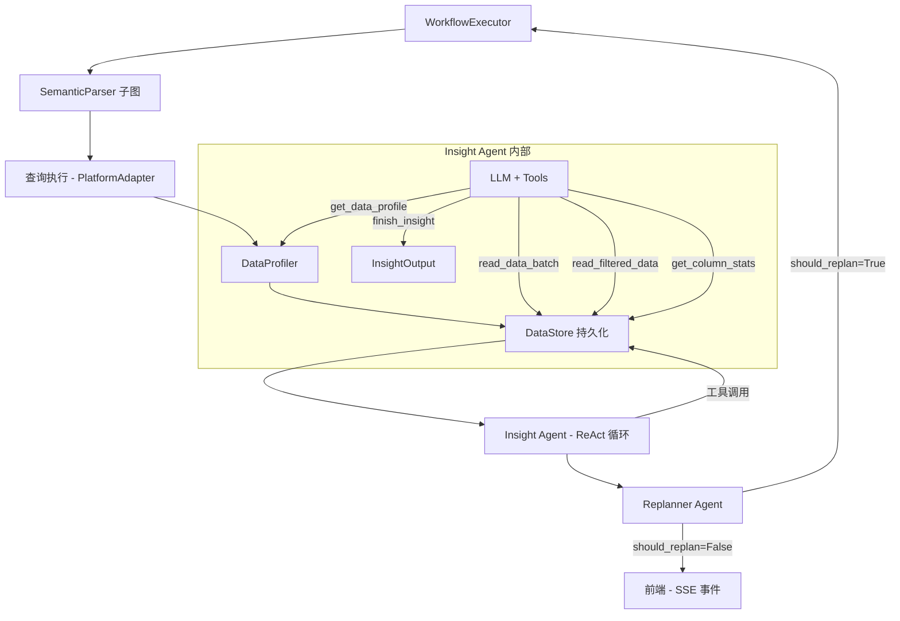
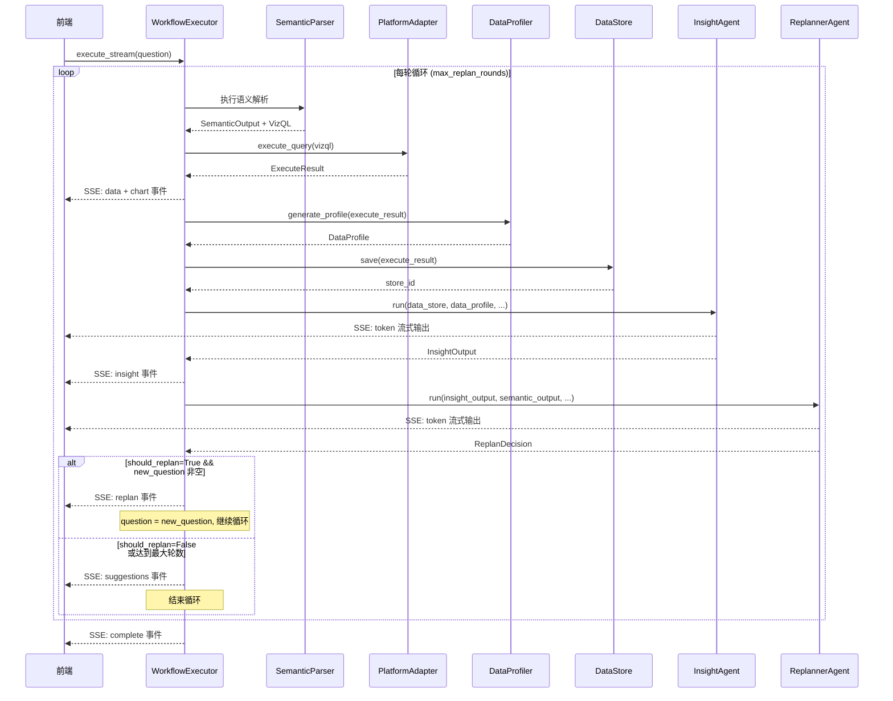
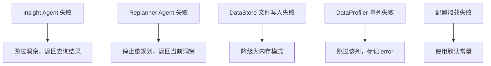

# 设计文档：洞察与重规划 Agent

## 概述

本设计为 Analytics Assistant 新增两个独立 Agent 模块（`agents/insight/` 和 `agents/replanner/`），并扩展 `WorkflowExecutor` 以编排 semantic_parser → 查询执行 → DataProfile → Insight → Replanner 的多轮循环。

核心设计决策：
- **渐进式累积洞察**：Insight Agent 通过 ReAct 循环 + Tool Calling 分批读取数据，LLM 自主决定何时停止
- **文件级数据持久化**：大数据集写入 JSON 临时文件，避免内存溢出
- **数据画像辅助**：预计算 DataProfile 作为 LLM 初始上下文，指导数据探索策略
- **多类型重规划**：Replanner 不仅做下钻，还能生成趋势验证、范围扩大、不同角度分析等多种后续问题
- **全流式输出**：Insight 和 Replanner 的 LLM 调用均支持 token 级流式输出

## 架构

### 整体架构



### WorkflowExecutor 主循环



### 依赖方向

```
orchestration/workflow/executor.py → agents/insight/     ✅
orchestration/workflow/executor.py → agents/replanner/   ✅
agents/insight/ → core/schemas/                          ✅
agents/insight/ → infra/config/                          ✅
agents/insight/ → agents/base/                           ✅
agents/replanner/ → core/schemas/                        ✅
agents/replanner/ → infra/config/                        ✅
agents/replanner/ → agents/base/                         ✅
agents/insight/ ✗ agents/replanner/                      ❌ 互不依赖
agents/insight/ ✗ orchestration/                         ❌ 不反向依赖
```

## 组件与接口

### 1. DataStore（数据存储后端）

**位置**：`agents/insight/components/data_store.py`

**职责**：将 ExecuteResult 数据持久化（大数据写文件，小数据留内存），提供分批读取和按条件筛选接口。

```python
class DataStore:
    """数据存储后端。
    
    根据数据量自动选择存储策略：
    - 行数 <= memory_threshold: 内存模式
    - 行数 > memory_threshold: 文件模式（JSON 临时文件）
    """
    
    def __init__(self, store_id: str) -> None:
        """初始化 DataStore。
        
        Args:
            store_id: 存储标识（用于文件命名和清理）
        """
        ...
    
    def save(self, execute_result: ExecuteResult) -> None:
        """保存 ExecuteResult 数据。
        
        根据 row_count 与 memory_threshold 比较，
        自动选择内存模式或文件模式。
        
        Args:
            execute_result: 查询执行结果
        """
        ...
    
    def read_batch(self, offset: int, limit: int) -> List[RowData]:
        """分批读取数据。
        
        Args:
            offset: 起始行偏移量
            limit: 读取行数
            
        Returns:
            数据行列表
        """
        ...
    
    def read_filtered(
        self, column: str, values: List[str]
    ) -> List[RowData]:
        """按列值筛选数据。
        
        Args:
            column: 列名
            values: 筛选值列表（OR 关系）
            
        Returns:
            满足条件的数据行列表
        """
        ...
    
    def get_column_stats(self, column: str) -> Dict[str, Any]:
        """获取单列统计信息（委托 DataProfile）。
        
        从已生成的 DataProfile 中提取对应列的统计信息，
        避免重复计算。需要在 save() 后调用 set_profile() 注入 DataProfile。
        
        Args:
            column: 列名
            
        Returns:
            统计信息字典（数值列: min/max/avg/median/std；分类列: unique_count/top_values）
            
        Raises:
            ValueError: 如果 set_profile() 尚未调用（DataProfile 未注入）
            KeyError: 如果指定列名不存在于 DataProfile 中
        """
        ...
    
    def set_profile(self, profile: "DataProfile") -> None:
        """注入 DataProfile，供 get_column_stats 使用。
        
        Args:
            profile: 已生成的数据画像
        """
        ...
    
    @property
    def columns(self) -> List[ColumnInfo]:
        """获取列信息列表。"""
        ...
    
    @property
    def row_count(self) -> int:
        """获取总行数。"""
        ...
    
    def cleanup(self) -> None:
        """清理临时文件。"""
        ...
```

### 2. DataProfiler（数据画像生成器）

**位置**：`agents/insight/components/data_profiler.py`

**职责**：纯计算组件，从 ExecuteResult 生成 DataProfile。

```python
class DataProfiler:
    """数据画像生成器。
    
    为每列计算统计信息，帮助 LLM 了解数据整体特征。
    """
    
    def generate(self, execute_result: ExecuteResult) -> DataProfile:
        """生成数据画像。
        
        Args:
            execute_result: 查询执行结果
            
        Returns:
            DataProfile 对象
        """
        ...
    
    def _is_numeric_column(self, column_info: ColumnInfo) -> bool:
        """判断列是否为数值列。
        
        基于 ColumnInfo.data_type 判断，而非 is_dimension/is_measure。
        数值类型包括：INTEGER、INT、REAL、FLOAT、DOUBLE、DECIMAL、NUMBER、NUMERIC。
        判断时忽略大小写。
        
        Args:
            column_info: 列信息
            
        Returns:
            是否为数值列
        """
        ...
    
    def _profile_numeric_column(
        self, values: List[Any], column_name: str
    ) -> ColumnProfile:
        """计算数值列统计信息。"""
        ...
    
    def _profile_categorical_column(
        self, values: List[Any], column_name: str
    ) -> ColumnProfile:
        """计算分类列统计信息。"""
        ...
```

### 3. Data Tools（LLM 工具定义）

**位置**：`agents/insight/components/data_tools.py`

**职责**：定义 Insight Agent ReAct 循环中 LLM 可调用的工具。

```python
def create_insight_tools(
    data_store: DataStore,
    data_profile: DataProfile,
) -> List[BaseTool]:
    """创建 Insight Agent 的工具集。
    
    工具列表：
    - read_data_batch: 分批读取数据（offset + limit）
    - read_filtered_data: 按列值筛选数据
    - get_column_stats: 获取单列统计
    - get_data_profile: 获取完整数据画像
    - finish_insight: 结束分析并输出洞察
    
    Args:
        data_store: 数据存储实例
        data_profile: 数据画像实例
        
    Returns:
        LangChain BaseTool 列表
    """
    ...
```

每个工具使用 `@tool` 装饰器定义，输入参数使用 Pydantic 模型验证：

| 工具名 | 输入参数 | 返回值 | 说明 |
|--------|----------|--------|------|
| `read_data_batch` | `offset: int, limit: int` | JSON 格式的数据行 | 分批读取 |
| `read_filtered_data` | `column: str, values: List[str]` | JSON 格式的筛选结果 | 按条件筛选 |
| `get_column_stats` | `column: str` | JSON 格式的统计信息（委托 DataProfile 已计算结果） | 单列统计 |
| `get_data_profile` | 无参数 | JSON 格式的完整画像 | 获取全局画像 |
| `finish_insight` | 无参数 | 确认消息 | 停止信号，结束 ReAct 循环 |

**finish_insight 设计说明**：`finish_insight` 是无参数的停止信号工具。当 LLM 调用此工具时，ReAct 循环终止，LLM 在下一轮（无工具调用）直接输出 InsightOutput 的 JSON 结构。这样避免了在工具参数中传递复杂结构化数据。

**get_column_stats 设计说明**：`get_column_stats` 不重新计算统计信息，而是从已生成的 DataProfile 中提取对应列的 ColumnProfile 返回，避免与 DataProfiler 的重复计算。

### 4. Insight Agent Graph

**位置**：`agents/insight/graph.py`

**职责**：编排 ReAct 循环，LLM 通过工具调用渐进式分析数据。

```python
async def run_insight_agent(
    data_store: DataStore,
    data_profile: DataProfile,
    semantic_output_dict: Dict[str, Any],
    analysis_depth: str,
    on_token: Optional[Callable[[str], Awaitable[None]]] = None,
    on_thinking: Optional[Callable[[str], Awaitable[None]]] = None,
    on_progress: Optional[Callable[[Dict[str, Any]], Awaitable[None]]] = None,
) -> InsightOutput:
    """执行 Insight Agent。
    
    使用 stream_llm_structured + tools 实现 ReAct 循环。
    LLM 通过工具调用分批读取数据，调用 finish_insight 时结束。
    
    Args:
        data_store: 数据存储实例
        data_profile: 数据画像
        semantic_output_dict: 语义解析输出（序列化后的字典）
        analysis_depth: 分析深度（"detailed" 或 "comprehensive"）
        on_token: Token 流式回调
        on_thinking: 思考过程回调
        on_progress: 进度回调（轮数、工具调用信息）
        
    Returns:
        InsightOutput 洞察结果
    """
    ...
```

**实现策略**：直接使用 `stream_llm_structured()` 的 `tools` 参数，利用其内置的 ReAct 循环（`max_iterations` 参数控制最大轮数）。不需要自建 LangGraph StateGraph，因为 `stream_llm_structured` 已经实现了完整的工具调用循环。

**分析深度映射**（从 app.yaml 读取，与前端 `ChatRequest.analysis_depth` 枚举对齐）：

| analysis_depth | max_iterations | 分层策略 | 说明 |
|----------------|----------------|----------|------|
| `detailed` | 5 | 以描述性洞察为主，少量诊断性 | 标准分析（默认） |
| `comprehensive` | 10 | 描述性 + 深度诊断性分析 | 深入分析 |

### 5. Replanner Agent

**位置**：`agents/replanner/graph.py`

**职责**：基于洞察结果决定是否需要后续分析。

```python
async def run_replanner_agent(
    insight_output_dict: Dict[str, Any],
    semantic_output_dict: Dict[str, Any],
    data_profile_dict: Dict[str, Any],
    conversation_history: List[Dict[str, str]],
    replan_history: List[Dict[str, Any]],
    analysis_depth: str = "detailed",
    on_token: Optional[Callable[[str], Awaitable[None]]] = None,
    on_thinking: Optional[Callable[[str], Awaitable[None]]] = None,
) -> ReplanDecision:
    """执行 Replanner Agent。
    
    基于洞察结果、语义输出、数据画像和历史信息，
    决定是否需要后续分析并生成新问题或建议。
    
    Args:
        insight_output_dict: 洞察输出（序列化后的字典）
        semantic_output_dict: 语义解析输出（序列化后的字典）
        data_profile_dict: 数据画像（序列化后的字典）
        conversation_history: 对话历史
        replan_history: 重规划历史（之前各轮的 ReplanDecision）
        analysis_depth: 分析深度（"detailed" 模式下更倾向于不重规划）
        on_token: Token 流式回调
        on_thinking: 思考过程回调
        
    Returns:
        ReplanDecision 重规划决策
    """
    ...
```

**实现策略**：使用 `stream_llm_structured()` 直接调用 LLM（无工具），输出结构化的 `ReplanDecision`。

### 6. Insight Prompt

**位置**：`agents/insight/prompts/insight_prompt.py`

```python
SYSTEM_PROMPT = """你是一个数据分析专家...
...
"""

def build_user_prompt(
    data_profile_summary: str,
    semantic_output_summary: str,
    analysis_depth: str,
) -> str:
    """构建用户提示。"""
    ...

def get_system_prompt() -> str:
    """获取系统提示。"""
    return SYSTEM_PROMPT
```

Prompt 设计要点：
- 系统 Prompt 定义分析任务、可用工具说明、输出格式要求
- 用户 Prompt 包含 DataProfile 摘要、用户原始问题（来自 SemanticOutput.restated_question）、分析深度指导
- 明确告知 LLM 调用 `finish_insight` 工具来结束分析
- **分层洞察策略（参考 Microsoft Fabric Copilot + Databricks Genie）**：
  - `detailed` 模式（默认）：引导 LLM 以描述性洞察为主（总量、均值、极值、排名、分布），辅以少量诊断性分析。Finding 主要标记为 `analysis_level=descriptive`
  - `comprehensive` 模式：引导 LLM 先做描述性分析，再通过多轮工具调用进行深度诊断性分析（异常归因、趋势验证、交叉对比）。描述性发现标记为 `descriptive`，诊断性发现标记为 `diagnostic`
- **洞察优先级引导**：Prompt 中指导 LLM 按优先级发现洞察：异常值 > 趋势变化 > 对比差异 > 分布特征 > 相关性。参考 Databricks Lakeview AI 的分层洞察策略，确保即使在 quick 模式下也能优先发现最有价值的洞察
- **信息增益引导**：Prompt 中要求 LLM 在每轮工具调用前评估预期信息增益，如果已有足够洞察则主动调用 finish_insight 结束分析

### 7. Replanner Prompt

**位置**：`agents/replanner/prompts/replanner_prompt.py`

```python
SYSTEM_PROMPT = """你是一个数据分析规划专家...
...
"""

def build_user_prompt(
    insight_summary: str,
    semantic_output_summary: str,
    data_profile_summary: str,
    replan_history_summary: str,
) -> str:
    """构建用户提示。"""
    ...

def get_system_prompt() -> str:
    """获取系统提示。"""
    return SYSTEM_PROMPT
```

Prompt 设计要点：
- 明确告知 LLM 可以生成多种类型的后续问题（趋势验证、范围扩大、不同角度、互补查询）
- 提供重规划历史，要求避免语义重复
- 输出格式为 ReplanDecision 的 JSON Schema
- **信息增益评估**：Prompt 中要求 LLM 评估新问题相对于已有洞察的预期信息增益，只有当预期增益足够高时才建议重规划
- **分析深度感知**：当 analysis_depth 为 "detailed" 时，Prompt 引导 LLM 更倾向于不重规划，直接给出建议问题；当为 "comprehensive" 时，鼓励深度重规划

### 8. Agent 中间件栈

**核心决策**：Insight Agent 和 Replanner Agent 使用 `stream_llm_structured` + `MiddlewareRunner` 构建，与现有 Agent 保持一致的架构。中间件全部使用框架现成实现，不自己造轮子。

#### 8.1 架构方案

**实测结论**：`create_agent` + `stream_mode="messages"` 在当前版本（langchain 1.x + langgraph 1.0.5）下，内部使用 `ainvoke` 而非 `astream` 调用 LLM，**不支持 token 级流式输出**。此外 `CustomChatLLM` 未实现 `bind_tools`，不兼容 `create_agent` 的工具调用和 `response_format`。

因此统一使用 `stream_llm_structured` + `MiddlewareRunner` 方案：
- `stream_llm_structured` 提供 token 级流式输出 + 结构化输出 + 工具调用循环
- `MiddlewareRunner` 在 `stream_llm_structured` 的 `middleware` 参数中集成框架中间件
- 所有 Agent（semantic_parser、insight、replanner）使用相同的架构

```
Insight Agent 中间件栈（由 stream_llm_structured + MiddlewareRunner 编排）:

before_agent ──► [ReAct 循环开始]
                    │
    before_model ──► wrap_model_call ──► LLM 流式调用 ──► after_model
                                                          │
                                              [如果有工具调用]
                                                          │
                                              wrap_tool_call ──► 工具执行
                                                          │
                                              [继续下一轮迭代]
                    │
               [循环结束] ──► after_agent

Replanner Agent 中间件栈（单次 LLM 调用，无工具）:

before_agent ──► before_model ──► wrap_model_call ──► LLM 流式调用 ──► after_model ──► after_agent
```

#### 8.2 中间件与钩子映射

所有中间件均来自 `langchain.agents.middleware` 或 `deepagents`，不自定义中间件类。

| 中间件 | 来源 | 使用的钩子 | 适用 Agent |
|-------|------|-----------|-----------|
| `ModelRetryMiddleware` | `langchain.agents.middleware` | `awrap_model_call` | Insight + Replanner |
| `ToolRetryMiddleware` | `langchain.agents.middleware` | `awrap_tool_call` | Insight |
| `FilesystemMiddleware` | `deepagents` | `awrap_model_call`（注入文件系统 prompt）+ `awrap_tool_call`（大结果截断存虚拟文件） | Insight |
| `SummarizationMiddleware` | `langchain.agents.middleware` | `abefore_model`（消息历史摘要压缩） | Insight |
| `HumanInTheLoopMiddleware` | `langchain.agents.middleware` | `awrap_tool_call`（工具调用审批） | 预留，按需启用 |

#### 8.3 各中间件配置

**ModelRetryMiddleware**（LLM 调用重试）：

```python
from langchain.agents.middleware import ModelRetryMiddleware

ModelRetryMiddleware(
    max_retries=3,           # 从 app.yaml 读取
    backoff_factor=2.0,      # 指数退避因子
    initial_delay=1.0,       # 初始延迟秒数
    max_delay=30.0,          # 最大延迟秒数
    jitter=True,             # 随机抖动
)
```

**ToolRetryMiddleware**（工具调用重试）：

```python
from langchain.agents.middleware import ToolRetryMiddleware

ToolRetryMiddleware(
    max_retries=2,           # 从 app.yaml 读取
    backoff_factor=2.0,
    initial_delay=0.5,
)
```

**FilesystemMiddleware**（文件系统工具 + 大结果截断）：

```python
from deepagents import FilesystemMiddleware

FilesystemMiddleware(
    tool_token_limit_before_evict=2000,  # 从 app.yaml 读取
)
```

`FilesystemMiddleware` 提供的完整功能：
- 给 Agent 注入文件系统工具（ls、read_file、write_file、edit_file、glob、grep）
- 当任意工具返回结果超过 `tool_token_limit_before_evict` 时，自动将完整结果存到虚拟文件系统，截断 ToolMessage 并附加文件路径引用
- Agent 可通过 `read_file` 工具按需读取被截断的完整结果

**SummarizationMiddleware**（消息历史摘要）：

```python
from langchain.agents.middleware import SummarizationMiddleware

SummarizationMiddleware(
    model=llm,                              # 用于摘要的模型
    trigger=("tokens", 8000),               # 从 app.yaml 读取
    keep=("messages", 6),                   # 保留最近 N 条消息（约 3 轮）
)
```

**HumanInTheLoopMiddleware**（人类审批，预留）：

```python
from langchain.agents.middleware import HumanInTheLoopMiddleware

HumanInTheLoopMiddleware(
    interrupt_on={"finish_insight": True},   # 对 finish_insight 工具调用需要审批
)
```

#### 8.4 输出验证策略

不使用中间件做输出验证。改为在 Pydantic Schema 层通过 `model_validator` 实现业务规则验证：

```python
# agents/replanner/schemas/output.py
class ReplanDecision(BaseModel):
    model_config = ConfigDict(extra="forbid")
    
    should_replan: bool
    reason: str
    new_question: Optional[str] = None
    suggested_questions: List[str] = Field(default_factory=list)
    
    @model_validator(mode="after")
    def validate_consistency(self) -> "ReplanDecision":
        """验证 should_replan 与 new_question/suggested_questions 的一致性。"""
        if self.should_replan and not self.new_question:
            raise ValueError("should_replan=True 时 new_question 不能为空")
        if not self.should_replan and not self.suggested_questions:
            raise ValueError("should_replan=False 时 suggested_questions 不能为空")
        return self
```

`InsightOutput` 的验证已由 Pydantic 字段约束覆盖：
- `findings: List[Finding] = Field(min_length=1)` — 非空验证
- `confidence: float = Field(ge=0.0, le=1.0)` — 范围验证

当 `create_agent` 的 `response_format` 指定了 Pydantic 模型时，框架会自动用该模型验证 LLM 输出，验证失败会触发重试（由 `ModelRetryMiddleware` 处理）。

#### 8.5 中间件在 Agent 中的使用

```python
# agents/insight/graph.py 中
from langchain.agents.middleware import (
    ModelRetryMiddleware,
    SummarizationMiddleware,
    ToolRetryMiddleware,
)
from deepagents import FilesystemMiddleware

from analytics_assistant.src.agents.base import get_llm, stream_llm_structured
from analytics_assistant.src.infra.config import get_config

async def run_insight_agent(...) -> InsightOutput:
    config = get_config()
    mw_config = config.get("agents", {}).get("middleware", {})
    
    # 构建中间件栈
    middleware_stack = [
        SummarizationMiddleware(
            model=llm,
            trigger=("tokens", mw_config.get("summarization", {}).get("max_history_tokens", 8000)),
            keep=("messages", mw_config.get("summarization", {}).get("keep_recent_messages", 6)),
        ),
        ModelRetryMiddleware(
            max_retries=mw_config.get("model_retry", {}).get("max_retries", 3),
            initial_delay=mw_config.get("model_retry", {}).get("base_delay", 1.0),
            max_delay=mw_config.get("model_retry", {}).get("max_delay", 30.0),
        ),
        ToolRetryMiddleware(
            max_retries=mw_config.get("tool_retry", {}).get("max_retries", 2),
            initial_delay=mw_config.get("tool_retry", {}).get("base_delay", 0.5),
        ),
        FilesystemMiddleware(
            tool_token_limit_before_evict=mw_config.get("filesystem", {}).get("max_tool_result_tokens", 2000),
        ),
    ]
    
    # 使用 stream_llm_structured + middleware 实现 ReAct 循环
    result = await stream_llm_structured(
        llm=llm,
        messages=messages,
        output_model=InsightOutput,
        tools=insight_tools,
        middleware=middleware_stack,
        max_iterations=max_iterations,
        on_token=on_token,
        on_thinking=on_thinking,
    )
    
    return result

# agents/replanner/graph.py 中
async def run_replanner_agent(...) -> ReplanDecision:
    middleware_stack = [
        ModelRetryMiddleware(
            max_retries=mw_config.get("model_retry", {}).get("max_retries", 3),
        ),
    ]
    
    result = await stream_llm_structured(
        llm=llm,
        messages=messages,
        output_model=ReplanDecision,
        middleware=middleware_stack,
        on_token=on_token,
        on_thinking=on_thinking,
    )
    
    return result
```

#### app.yaml 中间件配置

```yaml
# 在 agents 节下新增
agents:
  middleware:
    model_retry:
      max_retries: 3
      base_delay: 1.0
      max_delay: 30.0
    tool_retry:
      max_retries: 2
      base_delay: 0.5
    filesystem:
      max_tool_result_tokens: 2000
    summarization:
      max_history_tokens: 8000
      keep_recent_messages: 6
```

### 9. SSE 回调扩展

**位置**：修改 `orchestration/workflow/callbacks.py`

修改节点映射和阶段：

```python
# 删除 feedback_learner 的映射（纯后台操作，用户无感知）
# 原: _VISIBLE_NODE_MAPPING 中的 "feedback_learner": "generating"
# 删除 "generating" 阶段（无节点使用）

# 新增 LLM 调用节点映射
_LLM_NODE_MAPPING["insight_agent"] = "insight"
_LLM_NODE_MAPPING["replanner_agent"] = "replanning"

# 新增阶段名称
_STAGE_NAMES_ZH["insight"] = "生成洞察"
_STAGE_NAMES_ZH["replanning"] = "重规划"
_STAGE_NAMES_EN["insight"] = "Generating Insights"
_STAGE_NAMES_EN["replanning"] = "Replanning"

# 删除旧阶段
# 移除 _STAGE_NAMES_ZH["generating"] 和 _STAGE_NAMES_EN["generating"]
```

新增 SSE 事件类型：

| 事件类型 | 数据结构 | 说明 |
|----------|----------|------|
| `insight` | `{"type": "insight", "round": N, "findings": [...], "summary": "..."}` | 洞察结果 |
| `replan` | `{"type": "replan", "round": N, "new_question": "..."}` | 重规划通知 |
| `insight_progress` | `{"type": "insight_progress", "round": N, "iteration": M, "tool": "..."}` | 洞察分析进度 |
| `suggestions` | `{"type": "suggestions", "round": N, "questions": [...]}` | 建议问题 |

所有循环内的 SSE 事件都包含 `round` 字段（从 1 开始），便于前端区分不同轮次。

### 10. WorkflowExecutor 扩展

**位置**：修改 `orchestration/workflow/executor.py`

在现有 `_run_workflow()` 方法中，semantic_parser 子图执行完成后，新增 Insight + Replanner 循环：

```python
# 现有流程（不变）
# 1. 认证
# 2. 数据模型加载
# 3. 字段语义推断
# 4. 编译 semantic_parser 子图
# 5. 执行 semantic_parser 子图 → 获得 SemanticOutput + ExecuteResult

# 新增流程（在 semantic_parser 完成后）
# 第一轮：复用 semantic_parser 已产生的 ExecuteResult
# 后续轮：使用 new_question 重新执行 semantic_parser

for round_num in range(max_replan_rounds):
    if round_num == 0:
        # 复用第一轮已有的 ExecuteResult 和 SemanticOutput
        execute_result = first_round_execute_result
        semantic_output_dict = first_round_semantic_output
    else:
        # 使用 new_question 重新执行 semantic_parser
        execute_result = await run_semantic_parser(new_question)
        # 发送 SSE: data + chart 事件（包含 round 字段）
    
    # 6.1 生成 DataProfile
    # 6.2 保存数据到 DataStore，注入 DataProfile
    # 6.3 执行 Insight Agent（SSE 事件包含 round 字段）
    # 6.4 发送 SSE: insight 事件（包含 round 字段）
    # 6.5 执行 Replanner Agent
    # 6.6 判断是否继续循环
    #     - should_replan=True: 发送 SSE: replan 事件（包含 round 字段）
    #     - should_replan=False: 发送 SSE: suggestions 事件
```

**SSE 事件 round 字段**：所有循环内产生的 SSE 事件都包含 `round` 字段（从 1 开始），便于前端区分不同轮次的数据和洞察。

## 数据模型

### InsightOutput

**位置**：`agents/insight/schemas/output.py`

```python
class FindingType(str, Enum):
    """洞察发现类型。"""
    ANOMALY = "anomaly"           # 异常值
    TREND = "trend"               # 趋势
    COMPARISON = "comparison"     # 对比
    DISTRIBUTION = "distribution" # 分布
    CORRELATION = "correlation"   # 相关性

class AnalysisLevel(str, Enum):
    """分析层级（参考 Fabric Copilot 分层洞察策略）。"""
    DESCRIPTIVE = "descriptive"   # 描述性：发生了什么（统计摘要、排名、极值）
    DIAGNOSTIC = "diagnostic"     # 诊断性：为什么会这样（异常原因、趋势归因、交叉分析）

class Finding(BaseModel):
    """单条洞察发现。"""
    model_config = ConfigDict(extra="forbid")
    
    finding_type: FindingType = Field(description="发现类型")
    analysis_level: AnalysisLevel = Field(
        default=AnalysisLevel.DESCRIPTIVE,
        description="分析层级：descriptive（描述性）或 diagnostic（诊断性）"
    )
    description: str = Field(description="发现描述")
    supporting_data: Dict[str, Any] = Field(
        default_factory=dict, description="支撑数据"
    )
    confidence: float = Field(ge=0.0, le=1.0, description="置信度")

class InsightOutput(BaseModel):
    """洞察输出。"""
    model_config = ConfigDict(extra="forbid")
    
    findings: List[Finding] = Field(
        min_length=1, description="发现列表（至少一条）"
    )
    summary: str = Field(description="洞察摘要")
    overall_confidence: float = Field(
        ge=0.0, le=1.0, description="整体置信度"
    )
```

### DataProfile

**位置**：`agents/insight/schemas/output.py`

```python
class NumericStats(BaseModel):
    """数值列统计信息。"""
    model_config = ConfigDict(extra="forbid")
    
    min: Optional[float] = None
    max: Optional[float] = None
    avg: Optional[float] = None
    median: Optional[float] = None
    std: Optional[float] = None

class CategoricalStats(BaseModel):
    """分类列统计信息。"""
    model_config = ConfigDict(extra="forbid")
    
    unique_count: int = 0
    top_values: List[Dict[str, Any]] = Field(
        default_factory=list,
        description="按频率排序的 top 值，格式: [{'value': x, 'count': n}]"
    )

class ColumnProfile(BaseModel):
    """单列画像。"""
    model_config = ConfigDict(extra="forbid")
    
    column_name: str = Field(description="列名")
    data_type: str = Field(description="数据类型")
    is_numeric: bool = Field(default=False, description="是否为数值列")
    null_count: int = Field(default=0, description="空值数量")
    numeric_stats: Optional[NumericStats] = None
    categorical_stats: Optional[CategoricalStats] = None
    error: Optional[str] = Field(
        default=None, description="计算失败时的错误信息"
    )

class DataProfile(BaseModel):
    """数据画像。"""
    model_config = ConfigDict(extra="forbid")
    
    row_count: int = Field(ge=0, description="总行数")
    column_count: int = Field(ge=0, description="总列数")
    columns_profile: List[ColumnProfile] = Field(
        default_factory=list, description="各列画像"
    )
```

### ReplanDecision

**位置**：`agents/replanner/schemas/output.py`

```python
class ReplanDecision(BaseModel):
    """重规划决策。"""
    model_config = ConfigDict(extra="forbid")
    
    should_replan: bool = Field(description="是否需要重规划")
    reason: str = Field(description="决策原因")
    new_question: Optional[str] = Field(
        default=None,
        description="新问题（自然语言，should_replan=True 时非空）"
    )
    suggested_questions: List[str] = Field(
        default_factory=list,
        description="建议问题列表"
    )
```

### app.yaml 新增配置

```yaml
# 在 agents 节下新增
agents:
  # ... 现有配置 ...
  
  # Insight Agent 配置
  insight:
    max_react_rounds: 10           # ReAct 循环最大轮数（默认）
    analysis_depth_rounds:
      detailed: 5                  # 标准分析最大轮数
      comprehensive: 10            # 深入分析最大轮数
    data_batch_size: 100           # 默认批次大小
  
  # Replanner Agent 配置
  replanner:
    max_replan_rounds: 10          # 最大重规划轮数

  # DataStore 配置
  data_store:
    memory_threshold: 1000         # 内存模式行数阈值
    temp_dir: "analytics_assistant/data/temp"  # 临时文件目录

  # DataProfiler 配置
  data_profiler:
    top_values_count: 10           # top values 数量

  # 中间件配置
  middleware:
    model_retry:
      max_retries: 3               # LLM 调用最大重试次数
      base_delay: 1.0              # 基础延迟秒数
      max_delay: 30.0              # 最大延迟秒数
    tool_retry:
      max_retries: 2               # 工具调用最大重试次数
      base_delay: 0.5              # 基础延迟秒数
    filesystem:
      max_tool_result_tokens: 2000 # 工具结果最大 token 数
      truncation_strategy: "head"  # 截断策略
    output_validation:
      enabled: true                # 是否启用输出验证
    summarization:
      max_history_tokens: 8000     # 消息历史最大 token 数
      keep_recent_rounds: 3        # 保留最近的完整轮数
```


## 正确性属性

*正确性属性是系统在所有有效执行中都应保持为真的特征或行为——本质上是关于系统应该做什么的形式化陈述。属性是人类可读规范与机器可验证正确性保证之间的桥梁。*

### Property 1: DataStore 保存/读取往返一致性

*For any* 有效的 ExecuteResult，将其保存到 DataStore 后，通过 `read_batch(0, row_count)` 读取全部数据，返回的数据行应与原始 ExecuteResult.data 等价。

**Validates: Requirements 1.1, 1.4**

### Property 2: DataStore 存储策略选择正确性

*For any* 有效的 ExecuteResult 和给定的 memory_threshold，当 row_count > memory_threshold 时 DataStore 应使用文件模式（临时文件存在），当 row_count <= memory_threshold 时 DataStore 应使用内存模式（无临时文件）。

**Validates: Requirements 1.2, 1.3**

### Property 3: DataStore 筛选读取正确性

*For any* 已保存数据的 DataStore、任意列名和筛选值列表，`read_filtered` 返回的每一行在指定列上的值都应在筛选值列表中，且原始数据中所有满足条件的行都应被返回（不遗漏）。

**Validates: Requirements 1.5**

### Property 4: DataProfiler 统计正确性

*For any* 非空的 ExecuteResult，DataProfiler 生成的 DataProfile 应满足：row_count 等于输入行数，column_count 等于输入列数，columns_profile 长度等于 column_count；对于数值列，min <= avg <= max 且 std >= 0；对于分类列，unique_count 等于该列去重后的值数量，top_values 按频率降序排列。

**Validates: Requirements 2.1, 2.2, 2.3**

### Property 5: ReplanDecision 结构一致性

*For any* 有效的 ReplanDecision，若 should_replan=True 则 reason 和 new_question 均为非空字符串；若 should_replan=False 则 suggested_questions 列表至少包含一条建议。

**Validates: Requirements 6.2, 6.3**

### Property 6: 数据模型序列化往返一致性

*For any* 有效的 InsightOutput、ReplanDecision 或 DataProfile 对象，调用 `model_dump()` 序列化后再通过 `model_validate()` 反序列化，应产生与原始对象等价的实例。

**Validates: Requirements 11.6, 11.7, 11.8**

## 错误处理

### 错误分类与处理策略

| 错误场景 | 错误类型 | 处理策略 | 日志级别 |
|----------|----------|----------|----------|
| DataStore 文件写入失败 | IOError | 降级为内存模式 | WARNING |
| DataStore 文件读取失败（文件不存在/损坏） | FileNotFoundError / JSONDecodeError | 返回描述性错误 | ERROR |
| DataProfiler 单列统计计算失败 | ValueError / TypeError | 跳过该列，标记 error 字段 | WARNING |
| Insight Agent LLM 调用失败 | LLMServiceError | WorkflowExecutor 跳过洞察，返回查询结果 | ERROR |
| Insight Agent 达到最大轮数 | 非异常 | 强制生成 InsightOutput | INFO |
| Replanner Agent LLM 调用失败 | LLMServiceError | WorkflowExecutor 停止重规划循环 | ERROR |
| 配置加载失败 | Exception | 使用代码中的默认常量 | WARNING |

### 降级路径



### 异常定义

不新增自定义异常类。DataStore 和 DataProfiler 的错误通过标准 Python 异常（`IOError`、`ValueError`）处理，在组件内部捕获并降级。Insight/Replanner Agent 的 LLM 调用错误由 `stream_llm_structured` 抛出，在 WorkflowExecutor 中捕获。

## 测试策略

### 双重测试方法

本功能采用单元测试 + 属性测试的双重测试策略：

- **单元测试**：验证具体示例、边界情况和错误条件
- **属性测试**：验证跨所有输入的通用属性

### 属性测试配置

- **库**：Hypothesis（Python）
- **最小迭代次数**：100 次/属性
- **标签格式**：`Feature: insight-replanner, Property {N}: {property_text}`

### 属性测试计划

| 属性 | 测试文件 | 生成器 |
|------|----------|--------|
| Property 1: DataStore 往返 | `tests/agents/insight/test_data_store_properties.py` | 随机 ExecuteResult（随机列数、行数、数据类型） |
| Property 2: 存储策略选择 | `tests/agents/insight/test_data_store_properties.py` | 随机 row_count + 随机 threshold |
| Property 3: 筛选读取 | `tests/agents/insight/test_data_store_properties.py` | 随机 ExecuteResult + 随机列名 + 随机筛选值 |
| Property 4: DataProfiler 统计 | `tests/agents/insight/test_data_profiler_properties.py` | 随机 ExecuteResult（含数值列和分类列） |
| Property 5: ReplanDecision 结构 | `tests/agents/replanner/test_replan_decision_properties.py` | 随机 ReplanDecision |
| Property 6: 序列化往返 | `tests/agents/insight/test_schema_properties.py` | 随机 InsightOutput / ReplanDecision / DataProfile |

### 单元测试计划

| 测试范围 | 测试文件 | 重点 |
|----------|----------|------|
| DataStore 基本功能 | `tests/agents/insight/test_data_store.py` | 保存/读取、文件清理、错误降级 |
| DataProfiler | `tests/agents/insight/test_data_profiler.py` | 空数据、单列失败、数值/分类列 |
| Data Tools | `tests/agents/insight/test_data_tools.py` | 各工具的输入验证和返回格式 |
| Insight Prompt | `tests/agents/insight/test_insight_prompt.py` | Prompt 构建包含 DataProfile |
| Replanner Prompt | `tests/agents/replanner/test_replanner_prompt.py` | Prompt 构建包含历史信息 |
| Schema 验证 | `tests/agents/insight/test_schemas.py` | 模型验证、边界值、必填字段 |
| 配置加载 | `tests/agents/insight/test_config.py` | 配置读取、默认值回退 |

### Mock 策略

遵循编码规范 6.1：
- **单元测试**：Mock LLM 调用（`stream_llm_structured`），不 Mock 内部逻辑
- **属性测试**：纯逻辑属性（DataStore、DataProfiler、Schema 序列化）不 Mock 外部依赖
- **集成测试**：使用真实 LLM 服务
