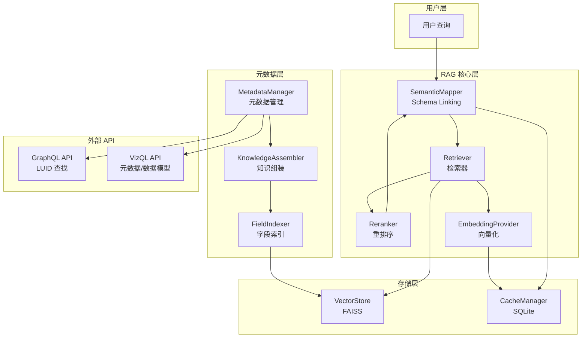
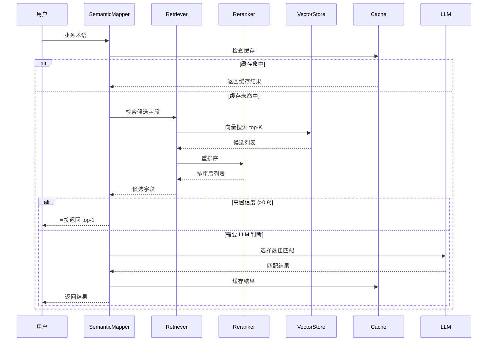

# RAG Enhancement Design Document

## Overview

本设计文档描述了 Tableau Assistant 项目的 RAG (Retrieval-Augmented Generation) 框架增强方案。通过借鉴 DB-GPT 项目的先进设计，构建一个更强大、更灵活的 RAG 系统，专门针对 Tableau Published Datasource 的元数据检索、字段映射和维度层级推断场景进行优化。

### 设计目标

1. **性能提升**：相似查询响应时间从 2-5秒 降至 0.5-1秒
2. **成本降低**：LLM 调用成本降低 50-70%
3. **准确率提升**：字段映射准确率提升 10-20%
4. **可扩展性**：支持多种检索策略和 Rerank 方法

### 核心设计原则

- **混合 API 策略**：GraphQL API 用于 LUID 查找，VizQL API 用于元数据和数据模型
- **两阶段检索**：向量检索 + Rerank 提高准确率
- **智能降级**：高置信度跳过 LLM，失败时自动降级
- **缓存优先**：多级缓存减少重复计算

## Architecture

### 系统架构图



### 数据流



## Components and Interfaces

### 1. MetadataManager（元数据管理器）

负责从 Tableau API 获取和管理元数据。

```python
class MetadataManager:
    """元数据管理器 - 混合 API 策略"""
    
    async def get_datasource_luid(self, name: str) -> str:
        """通过数据源名称获取 LUID（使用 GraphQL API）"""
        pass
    
    async def get_field_metadata(self, luid: str) -> List[FieldMetadata]:
        """获取字段元数据（使用 VizQL /read-metadata API）"""
        pass
    
    async def get_data_model(self, luid: str) -> DataModel:
        """获取数据模型（使用 VizQL /get-datasource-model API）"""
        pass
    
    async def get_full_metadata(self, name: str) -> Metadata:
        """获取完整元数据（组合 LUID 查找 + 字段 + 数据模型）"""
        pass
```

### 2. EmbeddingProvider（向量化提供者）

统一的向量化接口，支持多种提供者。

```python
class EmbeddingProvider(ABC):
    """向量化提供者抽象基类"""
    
    @abstractmethod
    async def embed_documents(self, texts: List[str]) -> List[List[float]]:
        """批量向量化文档"""
        pass
    
    @abstractmethod
    async def embed_query(self, text: str) -> List[float]:
        """向量化查询"""
        pass

class ZhipuEmbedding(EmbeddingProvider):
    """智谱 AI embedding-2（默认提供者）"""
    pass

class EmbeddingProviderFactory:
    """向量化提供者工厂"""
    
    @staticmethod
    def create(provider: str = "zhipu") -> EmbeddingProvider:
        """创建向量化提供者，支持扩展"""
        pass
    
    @staticmethod
    def register(name: str, provider_class: Type[EmbeddingProvider]) -> None:
        """注册新的向量化提供者（用于后期扩展）"""
        pass
```

### 3. KnowledgeAssembler（知识组装器）

将 Tableau 元数据转换为可索引的文档。

```python
class KnowledgeAssembler:
    """知识组装器 - 参考 DB-GPT DBSchemaAssembler"""
    
    def __init__(
        self,
        embedding_provider: EmbeddingProvider,
        chunk_strategy: str = "by-field"  # by-field, by-table, by-category
    ):
        pass
    
    def load_metadata(self, metadata: Metadata) -> List[Document]:
        """将元数据转换为文档列表"""
        pass
    
    def build_index(self, documents: List[Document]) -> VectorStore:
        """构建向量索引"""
        pass
    
    def as_retriever(self, **kwargs) -> BaseRetriever:
        """返回配置好的检索器"""
        pass
    
    def persist(self, path: str) -> None:
        """持久化索引"""
        pass
    
    def load(self, path: str) -> None:
        """加载索引"""
        pass
```

### 4. BaseRetriever（检索器抽象）

统一的检索器接口。

```python
class BaseRetriever(ABC):
    """检索器抽象基类 - 参考 DB-GPT BaseRetriever"""
    
    @abstractmethod
    def retrieve(
        self,
        query: str,
        top_k: int = 10,
        filters: Optional[Dict] = None,
        score_threshold: float = 0.0
    ) -> List[RetrievalResult]:
        """同步检索"""
        pass
    
    @abstractmethod
    async def aretrieve(
        self,
        query: str,
        top_k: int = 10,
        filters: Optional[Dict] = None,
        score_threshold: float = 0.0
    ) -> List[RetrievalResult]:
        """异步检索"""
        pass

class EmbeddingRetriever(BaseRetriever):
    """向量检索器"""
    pass

class KeywordRetriever(BaseRetriever):
    """关键词检索器（BM25）"""
    pass

class HybridRetriever(BaseRetriever):
    """混合检索器"""
    pass
```

### 5. Reranker（重排序器）

对检索结果进行重排序。

```python
class BaseReranker(ABC):
    """重排序器抽象基类"""
    
    @abstractmethod
    def rerank(
        self,
        query: str,
        candidates: List[RetrievalResult],
        top_k: int = 5
    ) -> List[RetrievalResult]:
        """重排序"""
        pass

class CrossEncoderReranker(BaseReranker):
    """交叉编码器重排序"""
    pass

class LLMReranker(BaseReranker):
    """LLM 重排序"""
    pass

class RRFReranker(BaseReranker):
    """RRF 融合重排序"""
    
    def rerank(self, query: str, candidates: List[RetrievalResult], top_k: int = 5) -> List[RetrievalResult]:
        """使用 RRF 公式: score = Σ(1/(k+rank))"""
        pass
```

### 6. SemanticMapper（语义映射器）

Schema Linking 的核心组件。

```python
class SemanticMapper:
    """语义映射器 - 增强版 Schema Linking"""
    
    def __init__(
        self,
        retriever: BaseRetriever,
        reranker: Optional[BaseReranker] = None,
        llm: Optional[BaseLLM] = None,
        cache_manager: Optional[CacheManager] = None
    ):
        pass
    
    async def map_field(
        self,
        term: str,
        context: Optional[str] = None,
        filters: Optional[Dict] = None
    ) -> FieldMappingResult:
        """
        将业务术语映射到字段
        
        智能降级策略：
        1. 检查缓存
        2. 向量检索 top-K
        3. Rerank（如果启用）
        4. 高置信度（>0.9）直接返回
        5. LLM 判断（如果需要）
        6. 缓存结果
        """
        pass
    
    async def map_fields_batch(
        self,
        terms: List[str],
        context: Optional[str] = None
    ) -> List[FieldMappingResult]:
        """批量映射（并发处理）"""
        pass
```

### 7. CacheManager（缓存管理器）

多级缓存管理。

```python
class CacheManager:
    """缓存管理器"""
    
    def __init__(self, db_path: str, ttl_hours: int = 1):
        pass
    
    async def get_mapping(self, term: str, datasource_luid: str) -> Optional[FieldMappingResult]:
        """获取字段映射缓存"""
        pass
    
    async def set_mapping(self, term: str, datasource_luid: str, result: FieldMappingResult) -> None:
        """设置字段映射缓存"""
        pass
    
    async def get_embedding(self, text: str) -> Optional[List[float]]:
        """获取向量缓存"""
        pass
    
    async def set_embedding(self, text: str, embedding: List[float]) -> None:
        """设置向量缓存"""
        pass
```

## Data Models

### FieldMetadata（字段元数据）

```python
class FieldMetadata(BaseModel):
    """字段元数据 - 适配 VizQL API"""
    
    # 基本信息（来自 VizQL /read-metadata）
    fieldName: str  # 底层数据库列名
    fieldCaption: str  # 显示名称
    dataType: str  # STRING/INTEGER/REAL/DATETIME/DATE/BOOLEAN/SPATIAL
    defaultAggregation: Optional[str]  # 默认聚合方式
    columnClass: str  # COLUMN/BIN/GROUP/CALCULATION/TABLE_CALCULATION
    formula: Optional[str]  # 计算字段公式
    logicalTableId: Optional[str]  # 所属逻辑表 ID
    
    # 推断字段
    role: str  # dimension/measure（从 defaultAggregation 推断）
    
    # 增强信息（来自维度层级推断）
    category: Optional[str]  # 维度类别
    level: Optional[int]  # 层级级别
    granularity: Optional[str]  # 粒度描述
    
    # 上下文信息（来自数据模型）
    logicalTableCaption: Optional[str]  # 逻辑表名称
    
    # 样本值
    sample_values: Optional[List[str]]  # 样本值
```

### DataModel（数据模型）

```python
class LogicalTable(BaseModel):
    """逻辑表"""
    logicalTableId: str
    caption: str

class LogicalTableRelationship(BaseModel):
    """逻辑表关系"""
    fromLogicalTableId: str
    toLogicalTableId: str

class DataModel(BaseModel):
    """数据模型 - 来自 VizQL /get-datasource-model"""
    logicalTables: List[LogicalTable]
    logicalTableRelationships: List[LogicalTableRelationship]
    
    def get_table_caption(self, table_id: str) -> Optional[str]:
        """根据 ID 获取表名"""
        pass
```

### RetrievalResult（检索结果）

```python
class RetrievalResult(BaseModel):
    """检索结果"""
    field: FieldMetadata
    score: float  # 相关性分数 [0, 1]
    source: str  # 检索来源: vector/keyword/hybrid
    rank: int  # 排名位置
```

### FieldMappingResult（字段映射结果）

```python
class FieldMappingResult(BaseModel):
    """字段映射结果"""
    term: str  # 原始业务术语
    matched_field: Optional[FieldMetadata]  # 匹配的字段
    confidence: float  # 置信度 [0, 1]
    reasoning: Optional[str]  # LLM 推理过程
    alternatives: List[RetrievalResult]  # 备选字段
    source: str  # 结果来源: cache/vector/llm
    latency_ms: int  # 延迟（毫秒）
```

## Correctness Properties

*A property is a characteristic or behavior that should hold true across all valid executions of a system-essentially, a formal statement about what the system should do. Properties serve as the bridge between human-readable specifications and machine-verifiable correctness guarantees.*

基于验收标准分析，以下是核心正确性属性：

### Property 1: 索引完整性
*For any* 数据源元数据，创建的向量索引应包含所有非隐藏字段，且每个字段的索引文本应包含 fieldCaption、role、dataType、columnClass。
**Validates: Requirements 1.1, 1.2**

### Property 2: 索引持久化往返
*For any* 向量索引，持久化到磁盘后重新加载，应能检索到相同的字段且分数一致。
**Validates: Requirements 1.5, 6.3**

### Property 3: Role 推断正确性
*For any* VizQL API 返回的字段元数据，如果 defaultAggregation 为 null 则 role 应为 dimension，否则为 measure。
**Validates: Requirements 1.7, 14.2**

### Property 4: 检索结果数量
*For any* 查询，向量检索应返回恰好 top-K 个候选（或全部字段如果少于 K）。
**Validates: Requirements 2.1, 3.1**

### Property 5: 分数范围
*For any* 检索结果，相关性分数应在 [0, 1] 范围内。
**Validates: Requirements 5.3**

### Property 6: 元数据过滤
*For any* 带有 role 过滤器的检索，返回的所有字段应匹配指定的 role。
**Validates: Requirements 2.4, 5.4**

### Property 7: Rerank 排序
*For any* 重排序后的结果列表，应按分数降序排列。
**Validates: Requirements 4.5**

### Property 8: RRF 公式正确性
*For any* 多源检索结果，RRF 融合分数应等于 Σ(1/(k+rank))。
**Validates: Requirements 4.4**

### Property 9: 缓存一致性
*For any* 字段映射结果，缓存后再次查询应返回相同结果。
**Validates: Requirements 7.1, 7.2**

### Property 10: 高置信度快速路径
*For any* 向量检索 top-1 置信度 > 0.9 的查询，应跳过 LLM 判断直接返回。
**Validates: Requirements 13.1**

### Property 11: 低置信度备选
*For any* 置信度 < 0.7 的映射结果，应返回 top-3 备选字段。
**Validates: Requirements 3.5**

### Property 12: 数据模型解析
*For any* VizQL /get-datasource-model API 返回，应正确解析所有逻辑表和关系。
**Validates: Requirements 12.2, 12.3**

### Property 13: 字段-表映射
*For any* 带有 logicalTableId 的字段，索引文本应包含对应的逻辑表名称。
**Validates: Requirements 12.4, 1.2**

### Property 14: 向量缓存往返
*For any* 文本，向量化后缓存，再次查询应返回相同的向量。
**Validates: Requirements 11.5**

### Property 15: 批量处理并发
*For any* 批量字段映射请求，应并发处理且结果与串行处理一致。
**Validates: Requirements 7.4, 13.4**

### Property 16: 向量化提供者兼容性
*For any* 文本，不同向量化提供者应返回相同维度的向量。
**Validates: Requirements 11.1**

### Property 17: 维度层级模式存储
*For any* 成功的维度层级推断，结果应被存储为新模式供未来检索。
**Validates: Requirements 9.3**

### Property 18: 查询计划存储
*For any* 成功执行的查询计划，应被存储供未来检索。
**Validates: Requirements 10.3**

### Property 19: 后向兼容性
*For any* 现有 FieldMetadata 模型的使用，迁移后应保持兼容。
**Validates: Requirements 14.5**

## Error Handling

### 错误类型

```python
class RAGError(Exception):
    """RAG 基础错误"""
    pass

class EmbeddingError(RAGError):
    """向量化错误"""
    pass

class RetrievalError(RAGError):
    """检索错误"""
    pass

class MetadataError(RAGError):
    """元数据获取错误"""
    pass

class CacheError(RAGError):
    """缓存错误"""
    pass
```

### 降级策略

| 错误场景 | 降级策略 |
|---------|---------|
| 智谱 API 不可用 | 降级到本地 BCEmbedding |
| VizQL API 不可用 | 降级到 GraphQL API |
| LLM 超时 (>30s) | 返回向量检索 top-1 |
| 缓存损坏 | 自动重建索引 |
| 数据模型 API 失败 | 继续使用字段元数据 |

### 重试策略

- 网络请求：最多 3 次重试，指数退避
- LLM 调用：最多 2 次重试
- 向量化：最多 2 次重试

## Testing Strategy

### 单元测试

- 测试各组件的独立功能
- 使用 mock 隔离外部依赖
- 覆盖边界条件和错误场景

### 属性测试（Property-Based Testing）

使用 Hypothesis 库实现属性测试：

```python
from hypothesis import given, strategies as st

@given(st.lists(st.text(min_size=1), min_size=1, max_size=100))
def test_index_completeness(field_names):
    """Property 1: 索引完整性"""
    # 生成随机字段元数据
    # 创建索引
    # 验证所有字段都被索引
    pass

@given(st.text(min_size=1))
def test_embedding_cache_roundtrip(text):
    """Property 14: 向量缓存往返"""
    # 向量化文本
    # 缓存向量
    # 重新获取
    # 验证一致性
    pass
```

### 集成测试

- 测试完整的数据流
- 使用真实的 Tableau API（测试环境）
- 验证端到端性能

### 测试框架

- **单元测试**：pytest
- **属性测试**：hypothesis
- **Mock**：pytest-mock, unittest.mock
- **异步测试**：pytest-asyncio

### 测试覆盖目标

- 单元测试覆盖率 > 80%
- 属性测试覆盖所有核心正确性属性
- 集成测试覆盖主要用户场景
