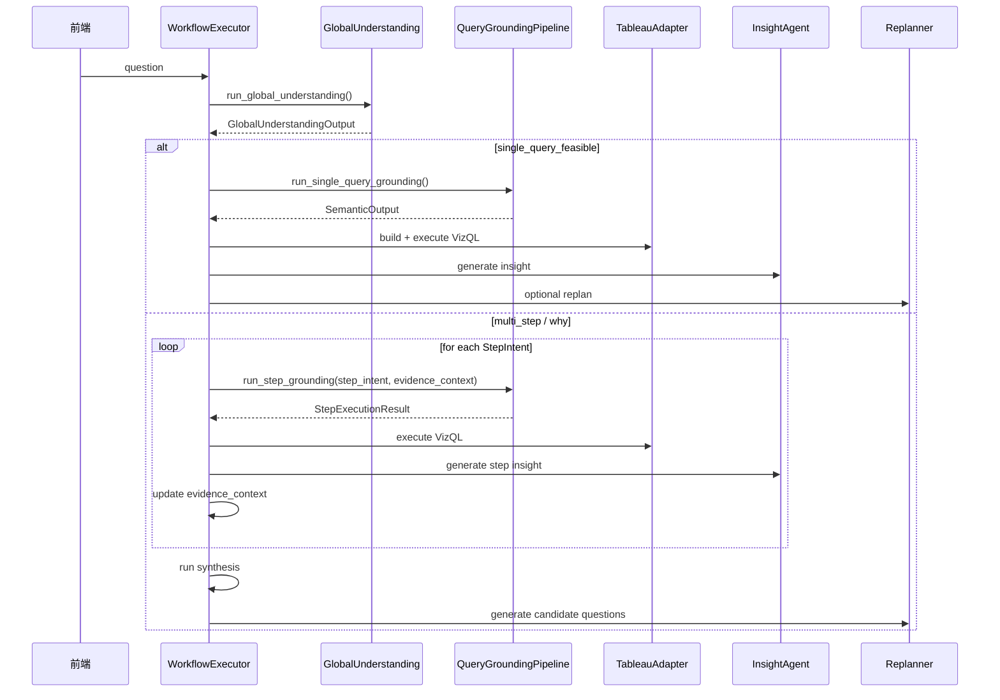

# 设计文档：语义理解、洞察与重规划统一架构 V3

## 概述

本设计定义 Analytics Assistant 的统一分析架构 V3，目标是解决以下根本性问题：

1. 当前复杂问题与 why 问题主要依赖规则化 `planner`，语义理解能力不足。
2. 当前多步执行把自然语言子问题直接回灌执行，缺少每个 step 的字段 grounding。
3. 当前 `insight` 与 `replanner` 代码存在，但尚未真正接入生产主链。
4. 当前前后端对“系统正在做什么”的可见性仍不完整，尤其缺少 step 级语义理解、洞察、重规划的完整可视化。

V3 的核心思想是：

- **LLM 主导理解**：全局问题理解、单查询可行性判断、why 证据链设计、步骤拆分、重规划问题生成都由 LLM 主导。
- **规则只做约束**：规则仅负责时间/TopN 等显式模式、缓存 gating、平台约束校验、fallback 排序。
- **Step 重新 grounding**：所有 `query step` 都必须重新走字段检索、step 级语义理解、校验和 VizQL 构建。
- **SemanticOutput 仍是最终可执行契约**：`AnalysisPlan` 和 `StepIntent` 不直接执行，真正执行的是 step 级 `SemanticOutput`。

## 设计目标

1. 支持简单查询、复杂单查询、多步依赖查询、why 问题、查询后洞察、重规划完整闭环。
2. 让复杂语义理解摆脱规则模板主导，转为 LLM 主导 + 约束校验。
3. 让每个步骤都能追溯到真实字段、真实查询、真实证据。
4. 让前端能清楚展示：理解问题、规划步骤、执行查询、生成洞察、继续分析。
5. 最大化复用已有模块：`FeatureExtractor`、`FieldRetriever`、`DynamicSchemaBuilder`、`SemanticOutput`、`QueryBuilder`、`DataProfiler`、`Insight/Replanner V2 spec`。

## 非目标

1. 不在 V3 中引入任意 SQL/Python 工具调用或 ReAct 工具循环。
2. 不直接让 planner 产出“可执行 query draft”并绕过字段 grounding。
3. 不用大量手写 hints 去替代种子、字段语义和 LLM 的判断。
4. 不在本阶段做前端最终 UI 视觉重构，只定义事件协议和展示模型。

## 当前状态与问题

### 当前后端主链

当前生产主链为：

```text
chat router
  -> WorkflowExecutor.execute_stream()
  -> semantic_parser graph
  -> QueryAdapter / execute_query
  -> data / complete
```

当前 `semantic_parser` 的主要阶段包括：

- `intent_router`
- `query_cache`
- `rule_prefilter`
- `feature_cache`
- `feature_extractor`
- `analysis_planner`（规则版）
- `field_retriever`
- `dynamic_schema_builder`
- `modular_prompt_builder`
- `few_shot_manager`
- `semantic_understanding`
- `output_validator`
- `filter_validator`
- `query_adapter`
- `feedback_learner`

### 当前问题 1：复杂理解与规则 planner 脱节

现有 `analysis_planner` 通过关键词和固定模板生成 `AnalysisPlan`，并不能真正理解问题本身，更不能保证拆出来的步骤在当前数据源和 Tableau builder 中可落地。

### 当前问题 2：多步执行缺少 step 级 grounding

现有多步执行尝试将子问题顺序执行，但子问题本身没有统一的 `StepIntent -> field retrieval -> step semantic understanding -> SemanticOutput` 闭环，因此步骤结果容易脱离真实字段语义。

### 当前问题 3：why 问题没有显式“证据链”

why 问题需要：

1. 验证现象
2. 定位异常
3. 选择解释轴
4. 汇总结论

现有系统没有把这四层建模为结构化链路。

### 当前问题 4：大量手写 hints 侵入语义理解

当前 `understanding.py` 中存在多组手写 hints：

- `_MEASURE_CATEGORY_HINTS`
- `_MEASURE_TECHNICAL_HINTS`
- `_MEASURE_PLACEHOLDER_HINTS`
- `_DIMENSION_CATEGORY_HINTS`
- `_DIMENSION_LEVEL_HINTS`
- `_TOP_N_PATTERNS`

这些可以作为临时 fallback，但不应该继续扩张成主语义来源。V3 需要将语义先验收回到：

- 字段种子
- 字段语义
- 层级信息
- 别名
- 样例值
- LLM 的上下文理解

### 当前问题 5：洞察与重规划未真正接入

已有 `insight-replanner-v2` 设计强调：

- One-Shot Insight
- 渐进式累积洞察
- 多问题重规划
- 用户选择或自动推进

但当前 `WorkflowExecutor` 尚未接入这条循环。

## 核心设计决策

### 决策 1：将“全局语义理解”与“step 级语义理解”拆开

V3 采用两层理解模型：

1. **Global Understanding**
   负责判断问题类型、是否需要澄清、是否能单查、为什么需要拆、多步步骤策略是什么。

2. **Step Semantic Understanding**
   负责将某一个 `query step` grounding 到真实字段，并生成最终可执行 `SemanticOutput`。

这样做的原因是：

- 全局理解更关注“分析结构”
- step 级理解更关注“字段和查询”
- 避免用一个模型同时承担结构设计和字段精配，导致 prompt 过重、职责混乱

### 决策 2：`AnalysisPlan` 不并入 `SemanticOutput`

`SemanticOutput` 的职责仍然是：**单个可执行查询的契约**。

它应该继续保持：

- `restated_question`
- `what`
- `where`
- `how_type`
- `computations`
- `needs_clarification`

而不应该承担：

- 多步拆分
- step 依赖关系
- why 证据链结构

因此 V3 中：

- `AnalysisPlan`：全局规划结构
- `StepIntent`：某一步待 grounding 的意图
- `SemanticOutput`：某一步真正可执行的查询语义结构

### 决策 3：单查询可行性由“LLM 判断 + 能力约束检查”共同决定

不能只问 LLM “要不要拆”，也不能只靠规则判断。

V3 的判定过程是：

1. LLM 给出对问题结构的判断
2. 能力检查器验证当前系统能否用单条 VizQL 落地
3. 若 LLM 认为可单查但能力检查失败，则改为多步
4. 若 LLM 认为多步，但实际上单查可清晰表达，则允许降回单步

### 决策 4：why 问题必须走证据链

why 问题绝不能直接输出“原因”。

V3 规定 why 问题的最小闭环：

1. 现象验证
2. 异常定位
3. 解释轴验证
4. 证据汇总

每一个 `query step` 仍然要生成自己的 `SemanticOutput` 并跑 VizQL。

### 决策 5：解释轴选择由“语义候选 + 数据解释力”共同决定

为什么先省份、再产品、还是先渠道？

不是写死，而是分两步：

1. **语义候选生成**
   LLM 根据问题、对象语义、字段语义、层级信息提出候选解释轴。

2. **解释力验证**
   对候选轴进行 step 级查询，比较哪条轴最能解释异常。

最终选择解释力最高的一条继续深入。

### 决策 6：手写 hints 降级为 fallback

V3 允许保留以下少量规则能力：

- 时间模式
- TopN 模式
- 平台硬性限制
- 置信度阈值
- 兜底排序

但 measure/dimension 的主语义来源应变为：

- `MEASURE_SEEDS`
- `DIMENSION_SEEDS`
- `field_semantic`
- `field_samples`
- LLM 理解结果

## 目标架构

### 整体架构

```mermaid
graph TD
    U[用户问题] --> IR[IntentRouter]
    IR --> GU[Global Understanding Node]
    GU --> DEC{single_query_feasible?}

    DEC -->|Yes| SQ[Single Query Grounding Pipeline]
    DEC -->|No| MP[AnalysisPlan + StepIntent[]]

    SQ --> EXEC1[Execute VizQL]
    EXEC1 --> INS1[Insight Agent]
    INS1 --> REP1[Replanner]

    MP --> LOOP[Executor Multi-Step Loop]
    LOOP --> STEP[StepIntent]
    STEP --> SG[Step Query Grounding Pipeline]
    SG --> EXEC2[Execute VizQL]
    EXEC2 --> INS2[Insight Agent]
    INS2 --> EVC[Evidence / Cumulative Context]
    EVC --> NEXT{继续执行下一步?}
    NEXT -->|Yes| LOOP
    NEXT -->|No| SYN[Synthesis Step]
    SYN --> REP2[Replanner]
```

### 模块分层

```text
chat router
  -> WorkflowExecutor
     -> Global Understanding
     -> Query Grounding Pipeline (single or step-level)
     -> Tableau Execute
     -> Insight Agent
     -> Replanner Agent
     -> SSE Event Projection
```

## 关键模块设计

### 1. Global Understanding Node

#### 职责

- 理解原问题是不是简单、复杂单查、多步、why
- 判断是否需要澄清
- 判断 `single_query_feasible`
- 输出 `AnalysisPlan`
- 生成第一轮 `StepIntent[]`

#### 输入

- `question`
- `chat_history`
- `prefilter_result`
- `feature_extraction_output`
- `datasource semantic overview`
- `QueryBuilder capability summary`
- `analysis_depth`

#### 输出

```python
class GlobalUnderstandingOutput(BaseModel):
    analysis_mode: Literal[
        "single_query",
        "complex_single_query",
        "multi_step_analysis",
        "why_analysis",
    ]
    single_query_feasible: bool
    decomposition_reason: Optional[str]
    needs_clarification: bool
    clarification_question: Optional[str]
    clarification_options: list[str]
    primary_restated_question: str
    risk_flags: list[str]
    analysis_plan: Optional["AnalysisPlan"]
```

#### 实现方式

- 使用 LLM 生成 `GlobalUnderstandingOutput`
- 不直接选择真实字段
- 只使用字段语义概览和系统能力概览作为上下文

### 2. AnalysisPlan 与 StepIntent

#### `AnalysisPlan`

```python
class AnalysisPlan(BaseModel):
    analysis_mode: str
    goal: str
    single_query_feasible: bool
    decomposition_reason: Optional[str]
    execution_strategy: Literal["single_pass", "sequential", "interactive"]
    risk_flags: list[str]
    steps: list["StepIntent"]
```

#### `StepIntent`

```python
class StepIntent(BaseModel):
    step_id: str
    step_type: Literal["query", "synthesis", "replan"]
    title: str
    goal: str
    depends_on: list[str]
    semantic_focus: list[str]
    expected_output: str
    candidate_axes: list[str]
    clarification_if_missing: list[str]
```

#### 设计要求

- `StepIntent` 只能描述意图，不能直接作为执行查询
- `depends_on` 用于表达依赖关系
- `candidate_axes` 用于 why/复杂问题下一步解释轴选择

### 3. Single Query Grounding Pipeline

当 `single_query_feasible=true` 时，系统仍然复用现有语义解析链，但去掉规则 planner 的主导作用。

```text
question
  -> rule_prefilter
  -> feature_extractor
  -> field_retriever
  -> dynamic_schema_builder
  -> modular_prompt_builder
  -> semantic_understanding
  -> output_validator
  -> filter_validator
  -> query_adapter
```

#### 关键调整

- `analysis_planner_node` 不再主导主链
- 全局理解结果只作为 prompt context 和模型选择依据
- `semantic_understanding` 继续产出最终 `SemanticOutput`

### 4. Step Query Grounding Pipeline

对于每个 `query step`，系统必须重新做 grounding。

#### 输入

- `StepIntent`
- `EvidenceContext`
- `chat_history`
- `prefilter_result`（step 级）
- `feature_extraction_output`（step 级）
- `field_semantic`
- `field_samples`

#### 输出

```python
class StepExecutionResult(BaseModel):
    step_id: str
    step_intent: StepIntent
    semantic_output: Optional[SemanticOutput]
    semantic_summary: dict[str, Any]
    table_summary: Optional[str]
    table_data: Optional[dict[str, Any]]
    insights: list[str]
    blocked_by_clarification: bool = False
```

#### 关键原则

- step 级 `query` 必须重新经过 `FieldRetriever`
- step 级 `SemanticOutput` 必须经过 `validate_query()`
- 不能直接执行 planner 的自然语言问题

### 5. Single Query Feasibility Checker

#### 作用

把“能不能单查”从模糊经验变成可解释约束。

#### 输入

- `GlobalUnderstandingOutput`
- `QueryBuilder capability summary`
- `field semantic overview`

#### 判断规则

单查询可行必须同时满足：

1. 结果粒度单一
2. 不依赖上一步结果集合
3. 不需要动态选择解释轴
4. 计算类型属于当前 `QueryBuilder` 支持范围
5. 过滤、排序、时间对比可在单表结果上表达

#### 不可单查的典型原因

- “先找对象，再对对象做下一次查询”
- why 问题需要先验证现象
- 下一步维度需要依赖数据结果决定
- 需要多轮下钻才能定位异常

### 6. Why 问题专用流程

#### 标准四步

1. **Phenomenon Verification**
   - 验证问题前提是否成立
2. **Localization**
   - 定位异常集中在哪些对象上
3. **Axis Validation**
   - 按候选解释轴测试解释力
4. **Synthesis**
   - 汇总证据、结论和残余风险

#### Why 上下文结构

```python
class WhyAnalysisContext(BaseModel):
    baseline_type: Optional[str]          # 同比 / 环比 / 目标差
    phenomenon_confirmed: bool = False
    localized_entities: list[str] = []
    validated_axes: list[str] = []
    unresolved_questions: list[str] = []
```

#### 澄清逻辑

如果以下任一要素缺失，则优先澄清：

- 比较基线
- 关键对象口径
- 时间范围
- 指标口径

### 7. 定位维度与解释轴选择

#### 定位维度

系统先根据关注对象的语义层级选择同层级或下一级定位维度。

例如：

- `华东区` -> 候选定位维度：`省份`、`城市`
- `全国` -> 候选定位维度：`大区`、`省份`
- `渠道大类` -> 候选定位维度：`子渠道`

#### 解释轴

在异常对象已定位后，系统生成解释轴候选：

- 产品
- 渠道
- 客户
- 组织
- 价格/销量/订单量等指标组合

#### 选择过程

1. LLM 基于语义生成候选轴优先级
2. 系统对前 N 个候选轴做验证性查询
3. 用解释力评分选择下一步：

```python
class AxisEvidenceScore(BaseModel):
    axis: str
    explained_share: float
    confidence: float
    reason: str
```

4. 若解释力不足，则进入 replan 或澄清

### 8. 种子、字段语义与 fallback 规则

#### 主语义来源

V3 主语义来源为：

- `MEASURE_SEEDS`
- `DIMENSION_SEEDS`
- `field_semantic`
- `hierarchy`
- `aliases`
- `sample_values`

#### 新增组件建议

```python
class SemanticLexiconBuilder:
    """从 seeds + field_semantic 自动构建查询语义词典。"""
```

该组件输出：

- category -> query terms
- level -> query terms
- entity type -> likely axes

#### 手写 hints 的处理原则

- 时间表达式：保留
- TopN 表达式：保留
- 量词、排序方向等平台模式：保留
- 大量 measure/dimension 词面映射：逐步下线，迁移到 `SemanticLexiconBuilder`

### 9. Insight Agent 集成

V3 采用 `insight-replanner-v2` 的思路，但接入点改为：

- 单步查询成功后立即生成 round 级洞察
- 多步分析中每个 `query step` 完成后生成 step 级洞察
- `synthesis step` 汇总 step 级洞察与证据链

#### 输入

- `table_data`
- `table_summary`
- `step semantic summary`
- `analysis_depth`
- `CumulativeInsightContext`

#### 输出

```python
class InsightRound(BaseModel):
    round_number: int
    step_id: Optional[str]
    summary: str
    findings: list[dict[str, Any]]
    confidence: float
    open_questions: list[str]
```

### 10. Replanner 集成

#### 触发时机

- why 问题完成证据链后
- 多步分析完成后仍有高价值未覆盖方向
- 洞察发现新的异常对象或新解释轴

#### 输出模型

复用并扩展 `insight-replanner-v2`：

```python
class CandidateQuestion(BaseModel):
    question: str
    question_type: str
    priority: int
    expected_info_gain: float
    rationale: str
    estimated_mode: str  # single_query / multi_step / why
```

#### 继续策略

- `user_select`
- `auto_continue`
- `stop`

## Executor 编排设计

### 总体流程



### Executor 内部子流程

1. `run_global_understanding()`
2. `run_single_query_path()` 或 `run_multi_step_path()`
3. `run_insight_round()`
4. `run_replanner()`
5. `project_sse_events()`

## SSE 协议设计

### 事件类型

| 事件 | 用途 |
|------|------|
| `thinking` | 阶段级 running/completed |
| `planner` | 整体分析计划 |
| `plan_step` | 单个 step 的运行状态 |
| `parse_result` | step 级语义理解摘要 |
| `data` | step 或 round 的查询结果 |
| `insight` | 洞察结果 |
| `candidate_questions` | 重规划候选问题 |
| `replan` | 用户选择或自动继续 |
| `clarification` | 全局或 step 级澄清 |
| `complete` | 工作流结束 |
| `error` | 失败 |

### 推荐阶段枚举

```ts
type ProcessingStage =
  | "preparing"
  | "understanding"
  | "planning"
  | "building"
  | "executing"
  | "generating"
  | "replanning"
  | "error"
```

### 关键事件结构

```json
{
  "type": "planner",
  "mode": "why_analysis",
  "goal": "解释华东区3月销售额同比下降",
  "steps": [
    {
      "stepId": "s1",
      "stepType": "query",
      "title": "验证现象",
      "goal": "确认3月同比是否下降"
    }
  ]
}
```

```json
{
  "type": "plan_step",
  "status": "running",
  "step": {
    "stepId": "s2",
    "stepType": "query",
    "title": "定位异常省份"
  }
}
```

```json
{
  "type": "candidate_questions",
  "questions": [
    {
      "question": "江苏省下降是否集中在某些产品线？",
      "priority": 1,
      "expectedInfoGain": 0.81
    }
  ]
}
```

## 典型场景设计

### 场景 1：简单单步查询

问题：`上个月各地区销售额`

流程：

1. Global Understanding -> `single_query`
2. Single Query Grounding -> `SemanticOutput`
3. VizQL 执行
4. 洞察生成（可选）
5. complete

### 场景 2：复杂但单条 VizQL 可完成

问题：`今年各省销售额同比，列出下降最多的前10个省份`

流程：

1. Global Understanding -> `complex_single_query`
2. `single_query_feasible=true`
3. 单步 grounding
4. Tableau table calc / TopN 组合执行
5. 洞察生成

### 场景 3：依赖型多步查询

问题：`找出今年销售额下降最多的5个省份，再看这些省份分别是哪些产品拖累的`

流程：

1. Global Understanding -> `multi_step_analysis`
2. Step 1：找出省份
3. Step 2：将 step1 的对象集注入上下文，重新 grounding 产品分析
4. Step 3：synthesis

### 场景 4：why 问题但口径缺失

问题：`为什么华东区3月销售额下降了？`

若未说明同比/环比/目标差，则：

1. Global Understanding 判定 `why_analysis`
2. 发现 baseline 未闭合
3. 直接发 `clarification`

### 场景 5：why 问题证据链

问题：`为什么华东区3月销售额同比下降了？`

流程：

1. Step 1：验证现象
2. Step 2：按地理子层级定位异常
3. Step 3：对候选解释轴做验证
4. Step 4：汇总证据

### 场景 6：解释轴不是产品而是渠道

问题：`为什么江苏销售额下降？`

流程：

1. 系统生成候选轴：产品、渠道、客户
2. 验证后发现渠道的解释力更强
3. 下一步执行渠道而不是产品

### 场景 7：查询后自动洞察

问题：`各大区利润率`

流程：

1. 单步查询执行
2. 生成 `InsightRound`
3. 若发现某大区显著异常，则 Replanner 给出后续问题

### 场景 8：用户选择重规划问题

问题：`为什么华东区销售额下降`

流程：

1. why 证据链完成
2. Replanner 输出多个问题：
   - 江苏是否集中在某些产品线？
   - 浙江是否是渠道问题？
   - 是否与订单量下降有关？
3. 用户选择其中 1~N 个继续执行

### 场景 9：部分失败降级

流程：

1. step2 grounding 失败 -> 发 step 级 error/clarification
2. 保留 step1 已完成证据链
3. 可结束或等待用户纠正

## 与现有代码的映射

### 复用

- `rule_prefilter`
- `feature_extractor`
- `field_retriever`
- `dynamic_schema_builder`
- `semantic_understanding`
- `output_validator`
- `filter_validator`
- `QueryBuilder`
- `DataProfiler`
- `Insight/Replanner V2 文档设计`

### 需要重构

- `analysis_planner_node`：从规则模板改为退出主路径，或降级为 fallback gating
- `understanding.py`：拆出 Global Understanding 与 Step Semantic Understanding 两个模式
- `executor.py`：改为统一 orchestrator，接管 insight/replanner 和多步 loop
- `understanding.py` 中大量 measure/dimension hints：迁移到 seeds/semantic lexicon

### 推荐新增模块

- `global_understanding.py`
- `semantic_lexicon_builder.py`
- `single_query_feasibility.py`
- `step_context.py`
- `evidence_context.py`
- `executor_round_loop.py`（或内聚在 executor 中）

## 风险与缓解

### 风险 1：Global Understanding prompt 过大

缓解：

- 只注入字段语义概览，不注入全字段清单
- 用 feature seeds 和 semantic overview，而非完整 field list

### 风险 2：多步成本过高

缓解：

- 先做 `single_query_feasible` 判断
- 对 why 问题先澄清口径
- 对候选解释轴只验证 top-N 个

### 风险 3：LLM 拆分不稳定

缓解：

- 引入能力检查器
- 对 step 数量、依赖关系和目标粒度做 schema 约束
- 对 step 结果进行 validator 校验

### 风险 4：种子迁移期效果波动

缓解：

- 先保留现有 hints 作为 fallback
- 逐步将 hints 的主语义迁移到 `SemanticLexiconBuilder`

## 迁移策略

### Phase A：文档与数据结构

- 定义 `GlobalUnderstandingOutput`
- 定义新的 `AnalysisPlan` / `StepIntent`
- 定义 `EvidenceContext`

### Phase B：全局理解接入

- 新增 `global_understanding_node`
- 将规则 `analysis_planner_node` 从主路径移除或降级

### Phase C：step 级 grounding

- 让 executor 对每个 `query step` 重走 grounding pipeline
- 停止直接执行自然语言子问题

### Phase D：洞察与重规划接入

- 接入 Insight Agent V2
- 接入 Replanner V2
- 接入用户选择和自动继续

### Phase E：语义先验收敛

- 新增 `SemanticLexiconBuilder`
- 逐步减少 `understanding.py` 中手写 hints 的主导作用

## 核心结论

V3 不是“把规则 planner 改复杂一点”，也不是“让 planner 直接写查询”。

V3 的正确路径是：

1. **LLM 做全局理解与拆分**
2. **StepIntent 表达分析目标**
3. **每个 query step 重新做字段 grounding**
4. **只有 step 级 SemanticOutput 才能执行 VizQL**
5. **查询结果进入洞察与重规划，形成持续分析闭环**

这套设计既能解释简单问题，也能处理 why、复杂问题和多步依赖问题，并且与当前 Tableau QueryBuilder 的能力边界保持一致。
