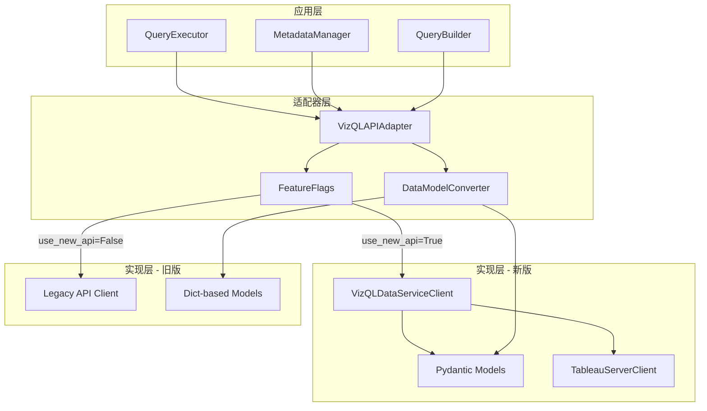
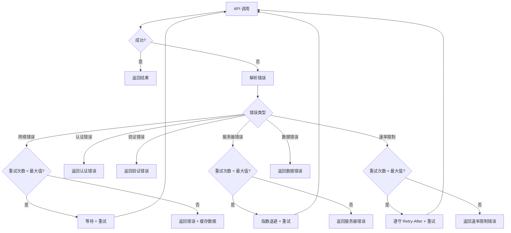

# 设计文档

## 概述

本设计文档描述了将 Tableau Assistant 升级到新版 VizQL Data Service API 的技术方案。Tableau 系统本身的查询接口已升级（Tableau 2025.1+），新版 API 支持表计算等高级功能，使得我们可以在单个查询中解决大部分问题，而不再需要之前的问题分解策略。

### 升级背景

- **Tableau 系统升级**: Tableau 2025.1+ 引入了新版 VizQL Data Service API
- **现有实现**: 我们已经在使用 VizQL Service API，但是旧版本
- **数据模型**: 我们已有基于 Pydantic v2 的数据模型（vizql_types.py）
- **主要变化**: 新版 API 支持表计算，可以在单个查询中完成复杂分析

### 升级目标

1. **API 升级**：从旧版 VizQL API 升级到 Tableau 2025.1+ 的新版 API
2. **功能增强**：支持表计算（TableCalcField），减少问题分解需求
3. **SDK 集成**：使用官方 vizql-data-service-py Python SDK
4. **证书管理**：集成证书管理工具，自动获取 Tableau Cloud 证书
5. **性能优化**：利用官方 SDK 的连接池和异步支持

### 升级策略

采用**直接升级**策略，一次性切换到新版 API：

```
┌─────────────────────────────────────────────────┐
│         Tableau Assistant 应用层                 │
│  (QueryExecutor, MetadataManager, etc.)         │
└─────────────────────────────────────────────────┘
                      │
                      ▼
┌─────────────────────────────────────────────────┐
│           VizQL Client 封装层                    │
│  - 基于官方 Python SDK                           │
│  - 证书管理集成                                  │
│  - 统一错误处理                                  │
└─────────────────────────────────────────────────┘
                      │
                      ▼
┌─────────────────────────────────────────────────┐
│      vizql-data-service-py (官方 SDK)           │
│  - Pydantic v2 模型                             │
│  - 同步/异步支持                                 │
│  - 连接池管理                                    │
└─────────────────────────────────────────────────┘
                      │
                      ▼
┌─────────────────────────────────────────────────┐
│      Tableau 2025.1+ VizQL Data Service         │
│  - 支持表计算                                    │
│  - 高级过滤器                                    │
│  - 参数传递                                      │
└─────────────────────────────────────────────────┘
```

## 架构

### 系统架构图




### 分层架构

#### 1. 应用层 (Application Layer)
- **QueryExecutor**: 查询执行器，负责执行 VizQL 查询
- **MetadataManager**: 元数据管理器，负责获取和缓存数据源元数据
- **QueryBuilder**: 查询构建器，负责将意图转换为 VizQL 查询，支持表计算

#### 2. 客户端封装层 (Client Wrapper Layer)
- **VizQLClient**: 封装官方 SDK，提供简化接口
- **CertificateManager**: 证书管理器，自动获取和更新 Tableau Cloud 证书
- **ErrorHandler**: 统一错误处理，包括重试逻辑

#### 3. SDK 层 (SDK Layer)
- **vizql-data-service-py**: 官方 Python SDK
- **Pydantic v2 模型**: 类型安全的数据模型
- **TableauServerClient**: 身份验证和会话管理

#### 4. API 层 (API Layer)
- **Tableau 2025.1+ VizQL Data Service**: 新版 API，支持表计算等高级功能


## 组件和接口

### 1. VizQLClient (客户端封装)

基于官方 Python SDK 的客户端封装。

```python
from vizql_data_service_py import (
    VizQLDataServiceClient,
    QueryRequest,
    ReadMetadataRequest,
    Datasource,
    Query,
    query_datasource,
    read_metadata
)
import tableauserverclient as TSC

class VizQLClient:
    """
    VizQL Data Service 客户端封装
    
    封装官方 SDK，提供简化的接口
    """
    
    def __init__(
        self,
        server_url: str,
        auth: Union[TSC.PersonalAccessTokenAuth, TSC.JWTAuth],
        site: str = "",
        verify_ssl: Union[bool, str, ssl.SSLContext] = True
    ):
        self.server_url = server_url
        self.auth = auth
        self.site = site
        
        # 创建 Tableau Server 连接
        self.server = TSC.Server(server_url)
        
        # 创建 VizQL Data Service 客户端
        self.client = VizQLDataServiceClient(
            server_url=server_url,
            server=self.server,
            tableau_auth=auth,
            verify_ssl=verify_ssl
        )
    
    async def query_async(
        self,
        datasource_luid: str,
        query: Query
    ) -> QueryOutput:
        """异步查询数据源"""
        request = QueryRequest(
            datasource=Datasource(datasourceLuid=datasource_luid),
            query=query
        )
        
        with self.server.auth.sign_in(self.auth):
            result = await query_datasource.asyncio(
                client=self.client,
                body=request
            )
        
        return result
    
    def query_sync(
        self,
        datasource_luid: str,
        query: Query
    ) -> QueryOutput:
        """同步查询数据源"""
        request = QueryRequest(
            datasource=Datasource(datasourceLuid=datasource_luid),
            query=query
        )
        
        with self.server.auth.sign_in(self.auth):
            result = query_datasource.sync(
                client=self.client,
                body=request
            )
        
        return result
```


### 2. CertificateManager (证书管理器)

集成证书管理工具，自动获取 Tableau Cloud 证书。

```python
import ssl
from pathlib import Path
from typing import Optional

class CertificateManager:
    """
    证书管理器
    
    自动获取和管理 Tableau Cloud 证书
    """
    
    def __init__(self, cert_dir: Path = Path("tableau_assistant/certs")):
        self.cert_dir = cert_dir
        self.tableau_cloud_cert = cert_dir / "tableau_cloud_cert.pem"
    
    def get_ssl_context(self) -> ssl.SSLContext:
        """
        获取 SSL 上下文
        
        Returns:
            配置好的 SSL 上下文
        """
        # 创建默认 SSL 上下文
        ssl_context = ssl.create_default_context()
        
        # 如果证书文件存在，加载它
        if self.tableau_cloud_cert.exists():
            ssl_context.load_verify_locations(cafile=str(self.tableau_cloud_cert))
        else:
            # 如果证书不存在，尝试获取
            self.fetch_tableau_cloud_cert()
            if self.tableau_cloud_cert.exists():
                ssl_context.load_verify_locations(cafile=str(self.tableau_cloud_cert))
        
        return ssl_context
    
    def fetch_tableau_cloud_cert(self) -> bool:
        """
        从 Tableau Cloud 获取证书
        
        使用证书管理工具（cert_manager）获取证书
        
        Returns:
            是否成功获取证书
        """
        try:
            from tableau_assistant.cert_manager import fetcher
            
            # 获取 Tableau Cloud 证书
            cert_content = fetcher.fetch_certificate(
                host="online.tableau.com",
                port=443
            )
            
            # 保存证书
            self.cert_dir.mkdir(parents=True, exist_ok=True)
            self.tableau_cloud_cert.write_text(cert_content)
            
            return True
        except Exception as e:
            logger.error(f"获取 Tableau Cloud 证书失败: {e}")
            return False
    
    def validate_certificate(self) -> bool:
        """
        验证证书是否有效
        
        Returns:
            证书是否有效
        """
        if not self.tableau_cloud_cert.exists():
            return False
        
        try:
            from tableau_assistant.cert_manager import validator
            
            return validator.validate_certificate(
                cert_path=str(self.tableau_cloud_cert)
            )
        except Exception as e:
            logger.error(f"验证证书失败: {e}")
            return False
```


## 数据模型

### 1. 新版 Pydantic 模型 (基于 vizql-data-service-py)

新版 API 使用 Pydantic v2 模型，由 datamodel-codegen 从 OpenAPI 规范自动生成。

#### 查询相关模型

```python
from pydantic import BaseModel, Field
from typing import List, Optional, Union
from enum import Enum

# 字段基类
class FieldBase(BaseModel):
    fieldCaption: str
    fieldAlias: Optional[str] = None
    maxDecimalPlaces: Optional[int] = None
    sortDirection: Optional[str] = None
    sortPriority: Optional[int] = None

# 维度字段
class DimensionField(FieldBase):
    pass

# 度量字段
class MeasureField(FieldBase):
    function: str  # SUM, AVG, COUNT, etc.

# 计算字段
class CalculatedField(FieldBase):
    calculation: str

# 分箱字段
class BinField(FieldBase):
    binSize: float

# 表计算字段
class TableCalcField(FieldBase):
    function: Optional[str] = None
    calculation: Optional[str] = None
    tableCalculation: 'TableCalcSpecification'
    nestedTableCalculations: Optional[List['TableCalcSpecification']] = None

# 字段联合类型
Field = Union[DimensionField, MeasureField, CalculatedField, BinField, TableCalcField]

# 查询对象
class Query(BaseModel):
    fields: List[Field]
    filters: Optional[List['Filter']] = None
    parameters: Optional[List['Parameter']] = None

# 数据源对象
class Datasource(BaseModel):
    datasourceLuid: str
    connections: Optional[List['Connection']] = None

# 查询请求
class QueryRequest(BaseModel):
    datasource: Datasource
    query: Query
    options: Optional['QueryDatasourceOptions'] = None
```

#### 过滤器模型

```python
# 过滤器基类
class Filter(BaseModel):
    field: 'FilterField'
    filterType: str
    context: bool = False

# 过滤器字段
class DimensionFilterField(BaseModel):
    fieldCaption: str

class MeasureFilterField(BaseModel):
    fieldCaption: str
    function: str

class CalculatedFilterField(BaseModel):
    calculation: str

FilterField = Union[DimensionFilterField, MeasureFilterField, CalculatedFilterField]

# 具体过滤器类型
class QuantitativeDateFilter(Filter):
    quantitativeFilterType: str  # RANGE, MIN, MAX, ONLY_NULL, ONLY_NON_NULL
    minDate: Optional[str] = None
    maxDate: Optional[str] = None
    includeNulls: Optional[bool] = None

class QuantitativeNumericalFilter(Filter):
    quantitativeFilterType: str
    min: Optional[float] = None
    max: Optional[float] = None
    includeNulls: Optional[bool] = None

class SetFilter(Filter):
    values: List[str]
    exclude: bool = False

class MatchFilter(Filter):
    contains: Optional[str] = None
    startsWith: Optional[str] = None
    endsWith: Optional[str] = None
    exclude: bool = False

class RelativeDateFilter(Filter):
    relativeDateType: str  # LAST, NEXT, CURRENT, etc.
    rangeType: str  # YEAR, QUARTER, MONTH, WEEK, DAY
    rangeN: Optional[int] = None

class TopNFilter(Filter):
    topType: str  # TOP, BOTTOM
    n: int
    by: 'MeasureFilterField'
```


#### 响应模型

```python
# 字段元数据
class FieldMetadata(BaseModel):
    fieldName: str
    fieldCaption: str
    dataType: str  # INTEGER, REAL, STRING, DATETIME, BOOLEAN, DATE, SPATIAL, UNKNOWN
    defaultAggregation: Optional[str] = None
    columnClass: str  # COLUMN, BIN, GROUP, CALCULATION, TABLE_CALCULATION
    formula: Optional[str] = None
    logicalTableId: Optional[str] = None

# 元数据输出
class MetadataOutput(BaseModel):
    data: List[FieldMetadata]
    extraData: Optional[Dict] = None

# 查询输出
class QueryOutput(BaseModel):
    data: List[Dict]
    extraData: Optional[Dict] = None

# 错误响应
class TableauError(BaseModel):
    errorCode: Optional[str] = None
    message: Optional[str] = None
    messages: Optional[List] = None
    datetime: Optional[str] = None
    debug: Optional[Dict] = None
    tab_error_code: Optional[str] = None
```

### 2. 现有数据模型 (vizql_types.py)

我们已有基于 Pydantic v2 的数据模型，定义在 `tableau_assistant/src/models/vizql_types.py`。

主要模型包括：

- **字段类型**: BasicField, FunctionField, CalculationField
- **过滤器类型**: SetFilter, TopNFilter, MatchFilter, QuantitativeNumericalFilter, QuantitativeDateFilter, RelativeDateFilter
- **查询结构**: VizQLQuery, QueryRequest, QueryOutput
- **元数据**: FieldMetadata, MetadataOutput

**关键差异**：
- 现有模型：BasicField, FunctionField, CalculationField
- 新版 SDK：DimensionField, MeasureField, CalculatedField, BinField, **TableCalcField**

**需要添加的模型**：
- **TableCalcField**: 表计算字段（新功能）
- **TableCalcSpecification**: 表计算规范
- 各种表计算类型：CustomTableCalcSpecification, RunningTotalTableCalcSpecification, MovingTableCalcSpecification 等

### 3. 内部数据模型 (Metadata)

系统内部使用的元数据模型，需要与新版 API 的 FieldMetadata 对齐。

```python
from pydantic import BaseModel
from typing import List, Optional, Dict

class FieldMetadata(BaseModel):
    """字段元数据（内部模型）"""
    name: str  # 映射到 fieldName
    fieldCaption: str
    role: str  # dimension 或 measure
    dataType: str
    dataCategory: Optional[str] = None
    aggregation: Optional[str] = None  # 映射到 defaultAggregation
    formula: Optional[str] = None
    description: Optional[str] = None
    
    # 维度层级相关
    category: Optional[str] = None
    category_detail: Optional[str] = None
    level: Optional[int] = None
    granularity: Optional[str] = None
    parent_dimension: Optional[str] = None
    child_dimension: Optional[str] = None
    valid_max_date: Optional[str] = None

class Metadata(BaseModel):
    """数据源元数据（内部模型）"""
    datasource_luid: str
    datasource_name: str
    datasource_description: Optional[str] = None
    datasource_owner: Optional[str] = None
    fields: List[FieldMetadata]
    field_count: int
    dimension_hierarchy: Optional[Dict] = None
    raw_response: Optional[Dict] = None
```


## 正确性属性

*属性是系统在所有有效执行中应该保持为真的特征或行为——本质上是关于系统应该做什么的形式化陈述。属性作为人类可读规范和机器可验证正确性保证之间的桥梁。*

基于需求分析，以下是系统必须满足的正确性属性：

### 属性 1: 查询对象结构完整性
*对于任何*有效的 Query 对象，序列化后再反序列化应该产生等价的对象，且必须包含 fields 数组
**验证需求: 1.3**

### 属性 2: 字段类型多态性
*对于任何*五种字段类型（DimensionField、MeasureField、CalculatedField、BinField、TableCalcField）的实例，系统应该能够正确序列化、传输和反序列化
**验证需求: 1.4**

### 属性 3: 过滤器类型多态性
*对于任何*六种过滤器类型（QUANTITATIVE_DATE、QUANTITATIVE_NUMERICAL、SET、MATCH、DATE、TOP）的实例，系统应该能够正确序列化、传输和反序列化
**验证需求: 1.5**

### 属性 4: 错误响应结构完整性
*对于任何*TableauError 响应，解析后的对象应该包含 errorCode、message 和 debug 字段（如果原始响应中存在）
**验证需求: 2.5**

### 属性 5: 维度字段构建正确性
*对于任何*有效的维度字段输入，QueryBuilder 生成的 DimensionField 对象应该包含 fieldCaption 必需字段，以及所有提供的可选字段（fieldAlias、sortDirection、sortPriority）
**验证需求: 3.1**

### 属性 6: 度量字段构建正确性
*对于任何*有效的度量字段输入，QueryBuilder 生成的 MeasureField 对象应该包含 fieldCaption 和 function 必需字段，以及所有提供的可选字段
**验证需求: 3.2**

### 属性 7: 计算字段构建正确性
*对于任何*有效的计算字段输入，QueryBuilder 生成的 CalculatedField 对象应该包含 fieldCaption 和 calculation 必需字段
**验证需求: 3.3**

### 属性 8: 过滤器构建正确性
*对于任何*过滤器类型和有效输入，QueryBuilder 生成的过滤器对象应该包含 field 和 filterType 必需字段
**验证需求: 3.4**

### 属性 9: 查询构建完整性
*对于任何*有效的查询输入，QueryBuilder 生成的 Query 对象应该包含 fields 数组，以及所有提供的可选 filters 和 parameters 数组
**验证需求: 3.5**

### 属性 10: 查询请求结构完整性
*对于任何*查询执行请求，请求体应该包含 datasourceLuid 和 query 对象
**验证需求: 4.2**

### 属性 11: 查询响应解析正确性
*对于任何*有效的 QueryOutput 响应，解析后应该包含 data 数组，且如果原始响应包含 extraData，解析后也应该包含
**验证需求: 4.3**

### 属性 12: 错误响应解析正确性
*对于任何*TableauError 响应，系统应该能够提取 errorCode、message 和 debug 信息
**验证需求: 4.4**

### 属性 13: 查询选项支持
*对于任何*提供的 QueryDatasourceOptions（包括 disaggregate 和 returnFormat），这些选项应该被正确包含在请求中
**验证需求: 4.5**

### 属性 14: 元数据请求结构完整性
*对于任何*元数据请求，ReadMetadataRequest 应该包含 datasourceLuid 必需字段
**验证需求: 5.2**

### 属性 15: 元数据响应解析正确性
*对于任何*有效的 MetadataOutput 响应，解析后应该包含 FieldMetadata 对象数组
**验证需求: 5.3**

### 属性 16: 字段元数据提取完整性
*对于任何*FieldMetadata 对象，系统应该能够提取 fieldName、fieldCaption、dataType、defaultAggregation、columnClass，以及可选的 formula
**验证需求: 5.4**

### 属性 17: 参数提取正确性
*对于任何*包含 extraData.parameters 的元数据响应，系统应该能够正确提取参数信息
**验证需求: 5.5**

### 属性 18: 功能标志切换一致性
*对于任何*功能标志设置，切换标志应该改变系统使用的 API 端点（旧版或新版）
**验证需求: 6.1**

### 属性 19: 旧版模式向后兼容性
*对于任何*在旧版模式下的查询，系统应该使用旧版 API 端点并产生与之前相同格式的结果
**验证需求: 6.2**

### 属性 20: 新版模式正确性
*对于任何*在新版模式下的查询，系统应该使用 VizQL Data Service 端点和 Pydantic 模型
**验证需求: 6.3**

### 属性 21: 模式切换输出一致性
*对于任何*相同的查询输入，无论使用旧版还是新版模式，输出格式应该保持一致（数据结构相同）
**验证需求: 6.4**

### 属性 22: API 版本配置支持
*对于任何*API 版本配置（legacy 或 vizql_v1），系统应该根据配置选择相应的实现
**验证需求: 6.5**

### 属性 23: 模型序列化往返一致性
*对于任何*QueryOutput 或 MetadataOutput 对象，序列化为 JSON 后再反序列化应该产生等价的对象
**验证需求: 7.4**

### 属性 24: 错误模型序列化往返一致性
*对于任何*TableauError 对象，序列化为 JSON 后再反序列化应该产生等价的对象
**验证需求: 7.5**

### 属性 25: API 错误解析正确性
*对于任何*API 错误响应，系统应该能够解析 TableauError 并提取结构化错误信息
**验证需求: 8.1**

### 属性 26: 重试逻辑指数退避
*对于任何*服务器错误（500），系统应该实现指数退避重试，每次重试的延迟应该递增
**验证需求: 8.4**

### 属性 27: 网络错误回退行为
*对于任何*网络连接错误，系统应该检测错误并提供适当的回退行为（如返回缓存数据或错误信息）
**验证需求: 8.5**

### 属性 28: 元数据缓存 TTL 一致性
*对于任何*元数据请求，在 TTL 时间内的重复请求应该返回缓存的结果，而不是发起新的 API 调用
**验证需求: 11.1**

### 属性 29: 查询结果缓存一致性
*对于任何*相同的查询，在会话范围内的重复执行应该返回缓存的结果
**验证需求: 11.2**

### 属性 30: 速率限制重试逻辑
*对于任何*速率限制错误（429），系统应该实现指数退避重试逻辑
**验证需求: 11.5**


## 错误处理

### 错误分类

系统将错误分为以下几类：

1. **网络错误** (NetworkError)
   - 连接超时
   - DNS 解析失败
   - 连接被拒绝
   - 处理策略：重试 + 回退到缓存

2. **认证错误** (AuthenticationError)
   - 401 Unauthorized
   - 403 Forbidden
   - Token 过期
   - 处理策略：不重试，返回明确错误信息

3. **验证错误** (ValidationError)
   - 400 Bad Request
   - 字段验证失败
   - 数据类型不匹配
   - 处理策略：不重试，返回字段级错误信息

4. **服务器错误** (ServerError)
   - 500 Internal Server Error
   - 502 Bad Gateway
   - 503 Service Unavailable
   - 处理策略：指数退避重试

5. **速率限制错误** (RateLimitError)
   - 429 Too Many Requests
   - 处理策略：指数退避重试，遵守 Retry-After 头

6. **数据错误** (DataError)
   - 数据源不存在
   - 字段不存在
   - 处理策略：不重试，返回明确错误信息

### 错误处理流程



### 错误响应模型

```python
class ErrorResponse(BaseModel):
    """统一错误响应模型"""
    error_type: str  # 错误类型
    error_code: Optional[str] = None  # Tableau 错误代码
    message: str  # 错误消息
    details: Optional[Dict] = None  # 详细信息
    timestamp: str  # 时间戳
    retry_after: Optional[int] = None  # 重试延迟（秒）
    
class ErrorHandler:
    """错误处理器"""
    
    def __init__(self, max_retries: int = 3, base_delay: float = 1.0):
        self.max_retries = max_retries
        self.base_delay = base_delay
    
    def handle_error(
        self,
        error: Exception,
        attempt: int
    ) -> Tuple[bool, Optional[float]]:
        """
        处理错误
        
        Returns:
            (should_retry, delay_seconds)
        """
        error_type = self._classify_error(error)
        
        if error_type in [ErrorType.AUTH, ErrorType.VALIDATION, ErrorType.DATA]:
            # 不可重试的错误
            return False, None
        
        if attempt >= self.max_retries:
            # 达到最大重试次数
            return False, None
        
        if error_type == ErrorType.RATE_LIMIT:
            # 速率限制：遵守 Retry-After
            delay = self._get_retry_after(error)
            return True, delay
        
        if error_type in [ErrorType.NETWORK, ErrorType.SERVER]:
            # 网络或服务器错误：指数退避
            delay = self.base_delay * (2 ** attempt)
            return True, delay
        
        return False, None
    
    def _classify_error(self, error: Exception) -> ErrorType:
        """分类错误"""
        if isinstance(error, httpx.ConnectError):
            return ErrorType.NETWORK
        elif isinstance(error, httpx.TimeoutException):
            return ErrorType.NETWORK
        elif hasattr(error, 'status_code'):
            status = error.status_code
            if status in [401, 403]:
                return ErrorType.AUTH
            elif status == 400:
                return ErrorType.VALIDATION
            elif status == 429:
                return ErrorType.RATE_LIMIT
            elif status >= 500:
                return ErrorType.SERVER
        
        return ErrorType.UNKNOWN
```


## 测试策略

### 双重测试方法

系统采用**单元测试**和**基于属性的测试**相结合的方法：

- **单元测试**：验证特定示例、边缘情况和错误条件
- **基于属性的测试**：验证应该在所有输入上成立的通用属性

两者互补，共同提供全面的测试覆盖：单元测试捕获具体的 bug，属性测试验证通用的正确性。

### 单元测试

单元测试覆盖以下方面：

1. **API 客户端测试**
   - VizQLDataServiceClient 初始化
   - 身份验证流程
   - SSL 配置

2. **数据模型测试**
   - Pydantic 模型验证
   - 字段类型转换
   - 过滤器类型转换

3. **适配器测试**
   - 功能标志切换
   - 新旧 API 路由
   - 数据模型转换

4. **错误处理测试**
   - 各种错误类型的分类
   - 重试逻辑
   - 错误响应解析

5. **集成点测试**
   - QueryExecutor 与适配器集成
   - MetadataManager 与适配器集成
   - QueryBuilder 与新模型集成

### 基于属性的测试

使用 **Hypothesis** 库进行基于属性的测试。

#### 测试配置

```python
from hypothesis import given, settings, strategies as st
import pytest

# 配置：每个属性测试运行 100 次
@settings(max_examples=100)
```

#### 属性测试示例

```python
# 属性 1: 查询对象序列化往返一致性
@given(query=query_strategy())
@settings(max_examples=100)
def test_query_serialization_roundtrip(query: Query):
    """
    Feature: vizql-api-migration, Property 1: 查询对象结构完整性
    
    对于任何有效的 Query 对象，序列化后再反序列化应该产生等价的对象
    """
    # 序列化
    json_str = query.model_dump_json()
    
    # 反序列化
    restored = Query.model_validate_json(json_str)
    
    # 验证等价性
    assert restored == query
    assert len(restored.fields) == len(query.fields)
    assert restored.fields == query.fields

# 属性 21: 模式切换输出一致性
@given(
    query_input=query_input_strategy(),
    datasource_luid=st.text(min_size=10, max_size=50)
)
@settings(max_examples=100)
def test_api_mode_output_consistency(query_input, datasource_luid):
    """
    Feature: vizql-api-migration, Property 21: 模式切换输出一致性
    
    对于任何相同的查询输入，无论使用旧版还是新版模式，
    输出格式应该保持一致
    """
    # 使用旧版模式
    adapter_legacy = VizQLAPIAdapter(use_new_api=False)
    result_legacy = adapter_legacy.query_datasource(query_input, datasource_luid)
    
    # 使用新版模式
    adapter_new = VizQLAPIAdapter(use_new_api=True)
    result_new = adapter_new.query_datasource(query_input, datasource_luid)
    
    # 验证输出格式一致性
    assert set(result_legacy.keys()) == set(result_new.keys())
    assert "data" in result_legacy
    assert "data" in result_new
    assert isinstance(result_legacy["data"], list)
    assert isinstance(result_new["data"], list)

# 属性 26: 重试逻辑指数退避
@given(
    attempt=st.integers(min_value=0, max_value=5),
    base_delay=st.floats(min_value=0.1, max_value=2.0)
)
@settings(max_examples=100)
def test_exponential_backoff(attempt, base_delay):
    """
    Feature: vizql-api-migration, Property 26: 重试逻辑指数退避
    
    对于任何服务器错误，每次重试的延迟应该递增
    """
    error_handler = ErrorHandler(base_delay=base_delay)
    
    # 模拟服务器错误
    error = ServerError(status_code=500)
    
    should_retry, delay = error_handler.handle_error(error, attempt)
    
    if attempt < error_handler.max_retries:
        assert should_retry is True
        expected_delay = base_delay * (2 ** attempt)
        assert delay == pytest.approx(expected_delay, rel=0.01)
    else:
        assert should_retry is False

# 属性 28: 元数据缓存 TTL 一致性
@given(
    datasource_luid=st.text(min_size=10, max_size=50),
    ttl_seconds=st.integers(min_value=1, max_value=3600)
)
@settings(max_examples=100)
def test_metadata_cache_ttl_consistency(datasource_luid, ttl_seconds):
    """
    Feature: vizql-api-migration, Property 28: 元数据缓存 TTL 一致性
    
    对于任何元数据请求，在 TTL 时间内的重复请求应该返回缓存的结果
    """
    cache = MetadataCache(ttl=ttl_seconds)
    
    # 第一次请求
    metadata1 = cache.get_or_fetch(datasource_luid)
    
    # 第二次请求（在 TTL 内）
    metadata2 = cache.get_or_fetch(datasource_luid)
    
    # 应该返回相同的对象（缓存命中）
    assert metadata1 is metadata2
    
    # 等待 TTL 过期
    time.sleep(ttl_seconds + 0.1)
    
    # 第三次请求（TTL 过期后）
    metadata3 = cache.get_or_fetch(datasource_luid)
    
    # 应该返回新的对象（缓存未命中）
    assert metadata1 is not metadata3
```

#### 测试数据生成策略

```python
from hypothesis import strategies as st
from vizql_data_service_py import *

# 字段生成策略
@st.composite
def dimension_field_strategy(draw):
    return DimensionField(
        fieldCaption=draw(st.text(min_size=1, max_size=50)),
        fieldAlias=draw(st.one_of(st.none(), st.text(min_size=1, max_size=50))),
        sortDirection=draw(st.one_of(st.none(), st.sampled_from(["ASC", "DESC"]))),
        sortPriority=draw(st.one_of(st.none(), st.integers(min_value=1, max_value=10)))
    )

@st.composite
def measure_field_strategy(draw):
    return MeasureField(
        fieldCaption=draw(st.text(min_size=1, max_size=50)),
        function=draw(st.sampled_from(["SUM", "AVG", "COUNT", "MIN", "MAX"])),
        maxDecimalPlaces=draw(st.one_of(st.none(), st.integers(min_value=0, max_value=10)))
    )

@st.composite
def field_strategy(draw):
    return draw(st.one_of(
        dimension_field_strategy(),
        measure_field_strategy(),
        calculated_field_strategy(),
        bin_field_strategy()
    ))

# 查询生成策略
@st.composite
def query_strategy(draw):
    fields = draw(st.lists(field_strategy(), min_size=1, max_size=10))
    filters = draw(st.one_of(st.none(), st.lists(filter_strategy(), max_size=5)))
    
    return Query(
        fields=fields,
        filters=filters
    )

# 过滤器生成策略
@st.composite
def filter_strategy(draw):
    filter_type = draw(st.sampled_from([
        "QUANTITATIVE_DATE",
        "QUANTITATIVE_NUMERICAL",
        "SET",
        "MATCH"
    ]))
    
    if filter_type == "QUANTITATIVE_DATE":
        return draw(quantitative_date_filter_strategy())
    elif filter_type == "QUANTITATIVE_NUMERICAL":
        return draw(quantitative_numerical_filter_strategy())
    elif filter_type == "SET":
        return draw(set_filter_strategy())
    elif filter_type == "MATCH":
        return draw(match_filter_strategy())
```

### 测试覆盖目标

- **单元测试覆盖率**: ≥ 80%
- **属性测试数量**: 每个正确性属性至少一个测试
- **集成测试**: 覆盖所有主要用户流程
- **边缘情况测试**: 覆盖所有已知的边缘情况


## 升级路径

### 阶段 1: 准备阶段

**目标**: 安装依赖，设置基础设施

1. 安装 vizql-data-service-py 包
   ```bash
   pip install vizql-data-service-py
   ```

2. 安装 tableauserverclient 包（如果尚未安装）
   ```bash
   pip install tableauserverclient
   ```

3. 配置环境变量
   ```bash
   export TABLEAU_SERVER_URL=https://your-pod.online.tableau.com
   export TABLEAU_TOKEN_NAME=your-token-name
   export TABLEAU_TOKEN_VALUE=your-token-value
   export TABLEAU_SITE=your-site
   ```

4. 配置证书管理
   ```python
   # 使用证书管理工具获取 Tableau Cloud 证书
   from tableau_assistant.cert_manager import CertificateManager
   
   cert_manager = CertificateManager()
   ssl_context = cert_manager.get_ssl_context()
   ```

### 阶段 2: 扩展数据模型

**目标**: 添加表计算支持到现有 Pydantic 模型

1. 在 vizql_types.py 中添加 TableCalcField 类
2. 添加 TableCalcSpecification 基类
3. 添加各种表计算类型：
   - CustomTableCalcSpecification
   - RunningTotalTableCalcSpecification
   - MovingTableCalcSpecification
   - RankTableCalcSpecification
   - PercentileTableCalcSpecification
   等

4. 更新 VizQLField 联合类型，包含 TableCalcField

**验证**: 
- Pydantic 模型验证通过
- 序列化/反序列化测试通过

### 阶段 3: 实现客户端封装

**目标**: 创建 VizQLClient 封装官方 SDK

1. 实现 CertificateManager 类
2. 实现 VizQLClient 类，封装官方 SDK
3. 实现 ErrorHandler 类，统一错误处理
4. 添加连接池和异步支持

**验证**: 
- 单元测试通过
- 能够成功连接 Tableau Cloud
- 证书验证正常工作

### 阶段 4: 更新 QueryExecutor

**目标**: 使用新版 SDK 执行查询

1. 修改 QueryExecutor 构造函数，使用 VizQLClient
2. 更新 execute_query 方法，调用 SDK 的 query_datasource
3. 更新错误处理逻辑
4. 保持现有接口不变（内部实现升级）

**验证**:
- 单元测试通过
- 查询执行成功
- 错误处理正确

### 阶段 5: 更新 MetadataManager

**目标**: 使用新版 SDK 获取元数据

1. 修改 MetadataManager，使用 VizQLClient
2. 更新 get_metadata_async 方法，调用 SDK 的 read_metadata
3. 确保元数据格式与现有 Metadata 模型兼容
4. 保持缓存机制不变

**验证**:
- 单元测试通过
- 元数据获取成功
- 缓存正常工作

### 阶段 6: 更新 QueryBuilder

**目标**: 支持表计算字段构建

1. 添加 build_table_calc_field 方法
2. 更新 build_query 方法，支持表计算
3. 添加表计算相关的辅助方法
4. 更新文档和示例

**验证**:
- 单元测试通过
- 能够构建包含表计算的查询
- 查询执行成功

### 阶段 7: 全面测试

**目标**: 确保所有功能正常

1. 运行所有单元测试
2. 运行所有属性测试（Hypothesis）
3. 运行集成测试
4. 性能测试
5. 错误处理测试
6. 表计算功能测试

**验证**:
- 所有测试通过
- 性能满足要求
- 表计算功能正常

### 阶段 8: 部署和监控

**目标**: 部署到生产环境并监控

1. 部署到生产环境
2. 监控关键指标：
   - API 调用成功率
   - 响应时间
   - 错误率
   - 缓存命中率
3. 收集用户反馈
4. 优化性能

**验证**:
- 系统稳定运行
- 所有功能正常
- 性能满足要求

## 监控指标

在升级后，持续监控以下指标：

1. **成功率**: API 调用成功率应 ≥ 99%
2. **响应时间**: P95 响应时间应保持在合理范围
3. **错误率**: 错误率应 ≤ 1%
4. **缓存命中率**: 应保持在 80% 以上
5. **表计算使用率**: 监控表计算功能的使用情况

## 性能优化

### 连接池

使用 httpx 的连接池功能：

```python
import httpx

# 创建连接池
limits = httpx.Limits(
    max_keepalive_connections=20,
    max_connections=100,
    keepalive_expiry=30.0
)

client = httpx.Client(limits=limits)
```

### 异步支持

使用异步方法提高并发性能：

```python
# 并发执行多个查询
results = await asyncio.gather(
    client.query_async(datasource_luid, query1),
    client.query_async(datasource_luid, query2),
    client.query_async(datasource_luid, query3)
)
```

### 缓存策略

- **元数据缓存**: TTL = 1 小时
- **查询结果缓存**: TTL = 会话范围（可配置）
- **缓存键**: 基于 datasource_luid + query hash

### 批量操作

支持批量查询以减少网络往返：

```python
# 批量执行查询
results = await client.batch_query_async(
    datasource_luid,
    [query1, query2, query3]
)
```

## 安全考虑

### SSL/TLS 配置

1. **生产环境**: 必须启用 SSL 验证
   ```python
   client = VizQLDataServiceClient(
       server_url=server_url,
       server=server,
       tableau_auth=auth,
       verify_ssl=True  # 使用系统默认 CA 证书
   )
   ```

2. **自定义证书**: 使用自定义 CA 证书
   ```python
   client = VizQLDataServiceClient(
       server_url=server_url,
       server=server,
       tableau_auth=auth,
       verify_ssl="/path/to/ca-bundle.pem"
   )
   ```

3. **开发环境**: 可以禁用验证（仅用于开发）
   ```python
   client = VizQLDataServiceClient(
       server_url=server_url,
       server=server,
       tableau_auth=auth,
       verify_ssl=False  # 仅用于开发/测试
   )
   ```

### 凭据管理

1. **不要硬编码凭据**: 使用环境变量或密钥管理服务
2. **Token 轮换**: 定期轮换 PAT
3. **最小权限原则**: 只授予必要的权限

### 日志安全

1. **不记录敏感信息**: Token、密码等
2. **脱敏处理**: 对敏感字段进行脱敏
   ```python
   logger.info(f"Using token: {token[:4]}****{token[-4:]}")
   ```

## 文档和培训

### 开发者文档

1. **API 迁移指南**: 详细的迁移步骤和示例
2. **API 对比表**: 新旧 API 的功能对比
3. **代码示例**: 常见用例的代码示例
4. **故障排查指南**: 常见问题和解决方案

### 用户文档

1. **功能变更说明**: 对用户可见的功能变更
2. **性能改进**: 新 API 带来的性能提升
3. **已知限制**: 新 API 的限制和注意事项

### 培训计划

1. **技术分享会**: 介绍新 API 的特性和优势
2. **代码审查**: 审查迁移后的代码
3. **问答环节**: 解答开发者的疑问

