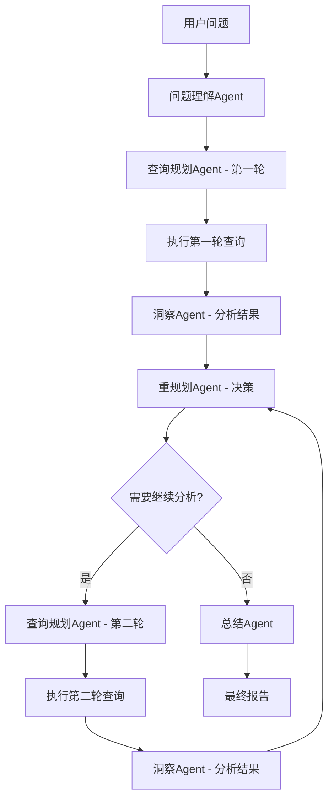

# 动态规划策略（Tableau Pulse 风格）

## 概述

本文档描述如何实现类似 Tableau Pulse 的动态规划策略，通过**查询结果驱动的多轮规划**实现智能根因分析。

## 核心思想

```
静态规划：一次性生成所有查询 → 执行 → 分析
动态规划：生成第一批查询 → 执行 → 分析结果 → 生成第二批查询 → ...
```

## 工作流设计

### 完整流程



### 三个关键阶段

#### 阶段1：初始规划（Query Planner - Round 1）

**输入**：
- 问题理解结果
- 元数据
- 维度层级

**输出**：
- 第一批查询（通常1-2个）
- 目标：找出分析对象

**示例**：
```python
问题："为什么门店A利润最高？"

第一轮查询：
q1: 找出利润最高的门店（如果问题中没有明确指定）
或
q1: 门店A的基本指标（利润、销售额、客流量）
```

#### 阶段2：结果驱动的规划（Query Planner - Round 2+）

**输入**：
- 原始问题
- 问题理解结果
- **前一轮的查询结果**（关键！）
- **洞察Agent的分析**（关键！）
- 元数据
- 维度层级

**输出**：
- 第二批查询（通常3-4个）
- 目标：多维度贡献度分析

**示例**：
```python
基于q1结果（门店A利润=$50万）

第二轮查询（并行执行）：
q2: 门店A按产品一级分类的利润分布
q3: 门店A按时间（日/周）的利润趋势
q4: 门店A按客户类型的利润分布
q5: 门店A按渠道的利润分布

策略：Tableau Pulse 的"维度穷举"
- 选择3-4个最相关的粗粒度维度（level=1或2）
- 并行查询，快速定位贡献最大的维度
```

#### 阶段3：智能下钻（Query Planner - Round 3+）

**输入**：
- 原始问题
- **第二轮的查询结果**（关键！）
- **贡献度分析**（关键！）
- 元数据
- 维度层级

**输出**：
- 第三批查询（通常1-2个）
- 目标：在贡献最大的维度上下钻

**示例**：
```python
基于q2-q5结果：
- q2发现：产品A贡献80%利润（最大贡献）
- q3发现：周末贡献60%利润
- q4发现：会员贡献70%利润
- q5发现：线上渠道贡献55%利润

第三轮查询（下钻）：
q6: 门店A的产品A按产品二级分类的利润（下钻到level=2）
q7: 门店A的产品A在周末的销售情况（交叉分析）

策略：只对贡献度>50%的维度进行下钻
```

## 重规划Agent的决策逻辑

### 决策树

```python
def should_replan(insights, replan_count, max_replan_rounds):
    """
    决定是否需要继续规划
    
    Args:
        insights: 当前轮次的洞察结果
        replan_count: 已经重规划的次数
        max_replan_rounds: 最大重规划轮数
    
    Returns:
        (should_replan, replan_type, new_question)
    """
    
    # 1. 检查重规划次数限制
    if replan_count >= max_replan_rounds:
        return False, None, None
    
    # 2. 检查是否有高贡献度的维度值（>50%）
    top_contributor = find_top_contributor(insights)
    if top_contributor and top_contributor.contribution > 0.5:
        # 下钻到下一级
        if can_drill_down(top_contributor.dimension):
            return True, "drill_down", generate_drill_down_question(top_contributor)
    
    # 3. 检查是否有显著的交叉效应
    interaction = find_interaction_effect(insights)
    if interaction and interaction.significance > 0.8:
        return True, "cross_analysis", generate_cross_question(interaction)
    
    # 4. 检查是否有异常值需要解释
    anomaly = find_anomaly(insights)
    if anomaly and anomaly.severity > 0.7:
        return True, "anomaly_investigation", generate_anomaly_question(anomaly)
    
    # 5. 默认：不需要重规划
    return False, None, None
```

### 重规划类型

| 类型 | 触发条件 | 示例 |
|------|---------|------|
| `drill_down` | 某个维度值贡献度>50% | "产品A贡献80%" → 下钻到产品二级分类 |
| `drill_up` | 当前粒度过细，数据分散 | "100个SKU各贡献1%" → 上卷到产品类别 |
| `cross_analysis` | 发现两个维度的交叉效应 | "产品A在周末特别好" → 产品×时间交叉 |
| `time_series` | 发现时间趋势 | "利润持续增长" → 按日/周分析趋势 |
| `anomaly_investigation` | 发现异常值 | "华东地区利润率异常低" → 分析华东地区 |
| `comparative` | 需要对比分析 | "门店A vs 平均水平" → 生成对比查询 |

## 查询规划Agent的增强

### 输入结构变化

```python
# 原来（静态规划）
class QueryPlannerInput:
    understanding: dict
    metadata: dict
    dimension_hierarchy: dict

# 现在（动态规划）
class QueryPlannerInput:
    understanding: dict
    metadata: dict
    dimension_hierarchy: dict
    
    # 新增字段
    previous_results: Optional[List[QueryResult]] = None  # 前一轮的查询结果
    previous_insights: Optional[List[Insight]] = None     # 前一轮的洞察
    replan_decision: Optional[ReplanDecision] = None      # 重规划决策
    replan_count: int = 0                                 # 当前是第几轮
```

### 提示词增强

```python
# 添加到查询规划提示词中

## 动态规划模式

### 第一轮规划（replan_count=0）
- 目标：找出分析对象或获取基本指标
- 查询数量：1-2个
- 示例：找出利润最高的门店

### 第二轮规划（replan_count=1，有previous_results）
- 目标：多维度贡献度分析
- 查询数量：3-4个（并行）
- 策略：选择3-4个粗粒度维度（level=1或2）
- 示例：按产品、时间、客户、渠道分别分析

### 第三轮规划（replan_count=2+，有previous_insights）
- 目标：智能下钻或交叉分析
- 查询数量：1-2个
- 策略：基于贡献度分析结果
- 示例：对贡献度>50%的维度下钻到下一级

### 使用previous_results的方法

如果提供了previous_results，说明这是第二轮或更高轮次的规划：

1. **分析前一轮结果**
   - 识别贡献度最高的维度值
   - 识别异常值和趋势
   - 识别交叉效应

2. **基于结果生成新查询**
   - 如果某个维度值贡献>50%，下钻到下一级
   - 如果发现交叉效应，生成交叉分析查询
   - 如果发现异常，生成针对性查询

3. **引用前一轮结果**
   - 使用depends_on引用前一轮的query_id
   - 在filters中使用前一轮的结果值

示例：
```json
{
  "question_id": "q3",
  "question_text": "门店A的产品A按产品二级分类的利润",
  "stage": 3,
  "depends_on": ["q2"],  // 依赖第二轮的q2
  "dims": ["产品二级分类"],
  "filters": [
    {
      "type": "dimension",
      "field": "门店名称",
      "values": ["门店A"]  // 来自q1结果
    },
    {
      "type": "dimension",
      "field": "产品一级分类",
      "values": ["产品A"]  // 来自q2结果，贡献度80%
    }
  ]
}
```
```

## 洞察Agent的增强

### 贡献度分析

```python
class ContributionAnalysis(BaseModel):
    """贡献度分析结果"""
    dimension: str  # 维度名称
    dimension_value: str  # 维度值
    contribution_absolute: float  # 绝对贡献（如+$10万）
    contribution_percentage: float  # 相对贡献（如60%）
    statistical_significance: float  # 统计显著性（p-value）
    can_drill_down: bool  # 是否可以下钻
    next_level_dimension: Optional[str]  # 下一级维度名称
```

### 输出增强

```python
class InsightResult(BaseModel):
    """洞察结果"""
    # 原有字段
    key_findings: List[str]
    anomalies: List[str]
    trends: List[str]
    
    # 新增字段
    contribution_analysis: List[ContributionAnalysis]  # 贡献度分析
    top_contributor: Optional[ContributionAnalysis]    # 最大贡献者
    recommended_drill_down: Optional[str]              # 推荐下钻的维度
```

## 状态管理

### VizQLState 增强

```python
class VizQLState(BaseModel):
    """VizQL工作流状态"""
    # 原有字段
    question: str
    understanding: dict
    metadata: dict
    dimension_hierarchy: dict
    query_plan: dict
    
    # 新增字段（支持动态规划）
    replan_count: int = 0  # 重规划次数
    all_query_results: List[QueryResult] = []  # 所有查询结果
    all_insights: List[InsightResult] = []  # 所有洞察
    replan_history: List[ReplanDecision] = []  # 重规划历史
```

## 性能考虑

### Token消耗

```python
# 静态规划（1轮）
查询规划: 8,250 tokens × 1 = 8,250 tokens

# 动态规划（3轮）
第一轮规划: 8,250 tokens
第二轮规划: 8,250 + 2,000(previous_results) = 10,250 tokens
第三轮规划: 8,250 + 4,000(previous_results) = 12,250 tokens
总计: 30,750 tokens

增加: 22,500 tokens（约3.7倍）
```

### 时间消耗

```python
# 静态规划（1轮）
规划: 2秒
执行: 5秒（并行）
洞察: 2秒
总计: 9秒

# 动态规划（3轮）
第一轮: 2 + 2 + 1 = 5秒
第二轮: 2 + 3 + 2 = 7秒
第三轮: 2 + 2 + 1 = 5秒
重规划决策: 2秒 × 2 = 4秒
总计: 21秒

增加: 12秒（约2.3倍）
```

### 优化策略

1. **智能终止**
   - 如果第二轮没有发现高贡献度维度（>50%），直接终止
   - 减少不必要的第三轮

2. **并行执行**
   - 第二轮的多个维度查询并行执行
   - 洞察分析并行执行

3. **缓存复用**
   - 缓存查询结果
   - 相似查询复用结果

4. **采样策略**
   - 大数据集使用采样
   - 第一轮使用采样，第二轮使用全量

## 实现优先级

### MVP（最小可行产品）
- ✅ 实现两轮规划（第一轮找对象，第二轮多维度分析）
- ✅ 重规划Agent的基本决策逻辑
- ✅ 洞察Agent的贡献度分析

### 增强版
- ⏳ 实现三轮规划（增加智能下钻）
- ⏳ 完整的重规划类型支持
- ⏳ 交叉分析和异常调查

### 高级版
- ⏳ 自适应规划（根据数据特征调整策略）
- ⏳ 学习用户偏好（记录用户的下钻习惯）
- ⏳ 预测性规划（提前生成可能的下钻查询）

## 总结

动态规划策略的核心优势：
1. ✅ **智能化**：根据结果动态调整
2. ✅ **高效性**：只执行必要的查询
3. ✅ **可解释性**：分层分析，逻辑清晰
4. ✅ **符合人类思维**：模拟分析师的分析过程

这正是 Tableau Pulse 的核心竞争力！
