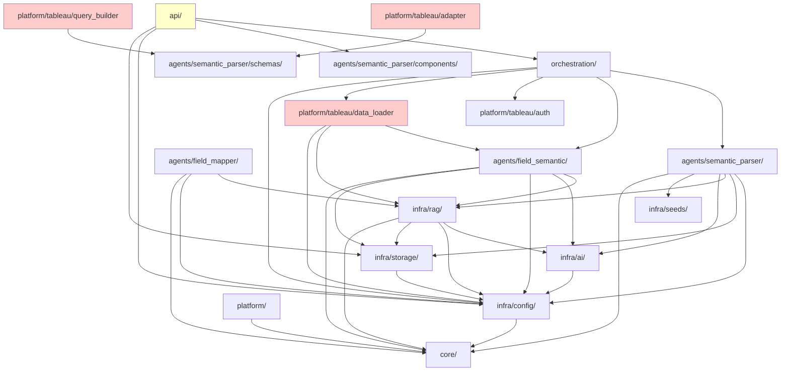

# Analytics Assistant 深度代码审查报告

> 审查日期：2026年2月  
> 审查范围：`analytics_assistant/src/` 全部模块  
> 审查方法：自底向上分层审查，函数/类级别深度分析

---

## 目录

1. [执行摘要](#执行摘要)
2. [审查框架说明](#审查框架说明)
3. [Phase 1: 基础层审查](#phase-1-基础层审查)
   - [Core 模块](#core-模块)
   - [Infra/Config 模块](#infraconfig-模块)
   - [Infra/Storage 模块](#infrastorage-模块)
4. [Phase 2: 基础设施层审查](#phase-2-基础设施层审查)
   - [Infra/AI 模块](#infraai-模块)
   - [Infra/RAG 模块](#infrarag-模块)
   - [Infra/Seeds 模块](#infraseeds-模块)
5. [Phase 3: Agent 层审查](#phase-3-agent-层审查)
   - [Agents/Base 模块](#agentsbase-模块)
   - [Semantic Parser Agent](#semantic-parser-agent)
   - [Field Mapper Agent](#field-mapper-agent)
   - [Field Semantic Agent](#field-semantic-agent)
   - [Insight Agent](#insight-agent)
   - [Replanner Agent](#replanner-agent)
6. [Phase 4: 上层审查](#phase-4-上层审查)
   - [Orchestration 模块](#orchestration-模块)
   - [Platform 模块](#platform-模块)
   - [API 模块](#api-模块)
7. [Phase 5: 跨模块分析](#phase-5-跨模块分析)
   - [依赖关系图](#依赖关系图)
   - [编码规范符合性汇总](#编码规范符合性汇总)
   - [性能瓶颈汇总](#性能瓶颈汇总)
   - [安全性汇总](#安全性汇总)
   - [可维护性评估](#可维护性评估)
   - [测试覆盖分析](#测试覆盖分析)
8. [优化路线图](#优化路线图)

---

## 执行摘要

| 指标 | 值 |
|------|-----|
| 总体质量评分 | **77/100** |
| Critical 问题数 | 2 |
| High 问题数 | 18 |
| Medium 问题数 | 58 |
| Low 问题数 | 52 |
| 审查模块数 | 15 |
| 审查源文件数 | ~124 |
| 测试覆盖率（文件级） | ~17%（21 个测试文件 / 124 个源文件） |

#### 各模块质量评分

| 模块 | 评分 | 权重 | 说明 |
|------|------|------|------|
| Core | 82 | 10% | 接口和数据模型设计优秀 |
| Infra/Config | 77 | 5% | getter 方法膨胀 |
| Infra/Storage | 79 | 8% | FAISS 反序列化风险 |
| Infra/AI | 66 | 10% | SSL 默认禁用、API Key 明文持久化 |
| Infra/RAG | 74 | 10% | 索引膨胀、封装性差 |
| Infra/Seeds | 74 | 3% | 数据文件过大、类型安全不足 |
| Agents/Base | 74 | 8% | 流式处理逻辑重复 |
| Semantic Parser | 78 | 15% | 架构优秀但 graph.py 过大 |
| Field Mapper | 75 | 8% | node.py 过大、代码重复 |
| Field Semantic | 82 | 5% | Mixin 设计合理 |
| Insight | 81 | 3% | 文件模式数据重复加载 |
| Replanner | 86 | 2% | 最轻量模块，设计简洁 |
| Orchestration | 79 | 5% | context 重建代码重复 |
| Platform | 82 | 5% | 认证代码同步/异步重复 |
| API | 82 | 3% | 认证机制薄弱、CORS 过宽 |
| **加权总分** | **77** | 100% | |

### Top 10 高优先级问题

| 排名 | ID | 严重程度 | 模块 | 问题 | 影响 |
|------|-----|----------|------|------|------|
| 1 | IAI-001 | 🔴 Critical | Infra/AI | `CustomChatLLM.verify_ssl=False` 默认禁用 SSL | 中间人攻击，API Key 泄露 |
| 2 | IAI-002 | 🔴 Critical | Infra/AI | API Key 明文持久化到 SQLite | 数据库文件泄露即暴露所有密钥 |
| 3 | API-001 | 🟠 High | API | 认证仅依赖请求头，无签名验证 | 任意用户可伪造身份 |
| 4 | API-002 | 🟠 High | API | CORS 默认 `*` + credentials | 跨域攻击风险 |
| 5 | PLAT-007 | 🟠 High | Platform | FieldSemanticInference 重复执行 | LLM 成本翻倍 |
| 6 | ISTO-001 | 🟠 High | Storage | FAISS `allow_dangerous_deserialization` | 反序列化攻击风险 |
| 7 | IRAG-001 | 🟠 High | RAG | FAISS 删除文档不删向量 | 索引膨胀、检索质量下降 |
| 8 | IAI-003 | 🟠 High | Infra/AI | 批量 Embedding ~200 行代码重复 | 维护成本高、易出不一致 |
| 9 | IAI-004 | 🟠 High | Infra/AI | 绕过 LangChain Embedding 接口 | 无法利用框架基础设施 |
| 10 | SP-001 | 🟠 High | Semantic Parser | graph.py 1647 行单文件 | 难以理解和维护 |

---

## 审查框架说明

### 评分标准

每个模块按以下七个维度进行评分（0-100 分）：

| 维度 | 权重 | 评分依据 |
|------|------|----------|
| 功能完整性 | 20% | 设计要求是否完整实现，是否有占位实现 |
| 代码质量 | 20% | 命名规范、代码结构、重复代码、导入规范 |
| 性能 | 15% | 异步并发、缓存使用、数据结构选择、批处理 |
| 错误处理 | 15% | 异常捕获完整性、降级策略、日志记录、异常链 |
| 可维护性 | 10% | 圈复杂度、代码行数、文档完整性、嵌套深度 |
| 安全性 | 10% | 敏感信息保护、输入验证、注入防护、SSL 配置 |
| 测试覆盖 | 10% | 测试文件存在性、核心函数覆盖、属性测试 |

加权总分 = Σ(维度评分 × 权重)

### 严重程度定义

| 级别 | 定义 | 示例 |
|------|------|------|
| 🔴 Critical | 可能导致数据丢失、安全漏洞或系统崩溃 | SQL 注入、硬编码密码、未处理的空指针 |
| 🟠 High | 影响功能正确性或性能 | 逻辑错误、N+1 查询、资源泄漏 |
| 🟡 Medium | 影响可维护性或不符合规范 | 延迟导入、缺失 Docstring、魔法数字 |
| 🟢 Low | 代码风格或微小改进 | 命名不一致、冗余注释、可简化的表达式 |

### 审查维度说明

每个模块的审查章节包含以下内容：
1. **模块概述** - 模块职责、核心功能、在系统中的位置
2. **文件清单** - 模块包含的所有文件及其职责
3. **类与函数分析** - 逐类/逐函数的深度分析
4. **质量评分表** - 七维度评分
5. **问题列表** - 按严重程度排序的 Finding 列表
6. **优化建议** - 具体的改进方案和代码示例

### Finding 编号规则

每个审查发现项使用唯一编号，格式：`{模块缩写}-{序号}`

| 模块 | 缩写 |
|------|------|
| Core | CORE |
| Infra/Config | ICFG |
| Infra/Storage | ISTO |
| Infra/AI | IAI |
| Infra/RAG | IRAG |
| Infra/Seeds | ISED |
| Agents/Base | ABAS |
| Semantic Parser | SP |
| Field Mapper | FM |
| Field Semantic | FS |
| Insight | INS |
| Replanner | RPL |
| Orchestration | ORCH |
| Platform | PLAT |
| API | API |

---

## Phase 1: 基础层审查

### Core 模块

#### 模块概述

Core 模块是系统的最底层，定义了平台适配器的抽象接口、自定义异常体系和跨模块共享的数据模型。该模块不依赖任何上层模块（agents、orchestration、platform、infra），符合依赖方向规范。

#### 文件清单

| 文件 | 职责 | 行数 |
|------|------|------|
| `core/interfaces.py` | 平台适配器、查询构建器、字段映射器的抽象基类 + 工作流上下文协议 | ~220 |
| `core/exceptions.py` | 自定义异常体系（VizQL、语义优化等） | ~210 |
| `core/schemas/` | 7 个 Pydantic 数据模型文件（见 Task 2.2） | - |

#### 类与函数分析

##### `core/interfaces.py`

**1. `WorkflowContextProtocol` (Protocol)**

| 项目 | 分析 |
|------|------|
| 设计模式 | 使用 `@runtime_checkable Protocol`，支持结构化子类型（鸭子类型） |
| 属性定义 | 7 个 `@property` + 1 个方法，覆盖数据源、数据模型、字段语义、平台适配器、认证、字段值缓存、schema hash |
| 类型注解 | 大量使用 `Any` 类型（`data_model`、`field_semantic`、`platform_adapter`、`auth`），降低了类型安全性 |
| 问题 | `enrich_field_candidates_with_hierarchy` 的参数和返回值都是 `List[Any]`，完全丧失类型信息 |

**2. `BasePlatformAdapter` (ABC)**

| 方法 | 参数类型 | 返回类型 | 分析 |
|------|----------|----------|------|
| `platform_name` (property) | - | `str` | ✅ 类型完整 |
| `execute_query` | `semantic_output: Any` | `ExecuteResult` | ⚠️ 输入用 Any，但有注释说明原因 |
| `build_query` | `semantic_output: Any` | `Any` | ⚠️ 输入输出都是 Any |
| `validate_query` | `semantic_output: Any` | `ValidationResult` | ⚠️ 输入用 Any |
| `get_field_values` | `field_name: str, datasource_id: str` | `List[str]` | ✅ 类型完整 |

设计说明：`semantic_output` 使用 `Any` 是有意为之，避免 core 对 agents 的反向依赖。文件头部有明确注释。这是合理的架构权衡。

Docstring 质量：所有方法都有完整的 Google 风格 Docstring（Args/Returns/Raises），质量优秀。

**3. `BaseQueryBuilder` (ABC)**

| 方法 | 参数类型 | 返回类型 | 分析 |
|------|----------|----------|------|
| `build` | `semantic_output: Any` | `Any` | ⚠️ 同上，Any 类型 |
| `validate` | `semantic_output: Any` | `ValidationResult` | ⚠️ 输入用 Any |

与 `BasePlatformAdapter` 存在职责重叠：`build_query` vs `build`、`validate_query` vs `validate`。`BasePlatformAdapter` 可能内部委托给 `BaseQueryBuilder`，但接口层面的重复增加了理解成本。

**4. `BaseFieldMapper` (ABC)**

| 方法 | 参数类型 | 返回类型 | 分析 |
|------|----------|----------|------|
| `map` | `semantic_output: Any, datasource_id: str` | `Any` | ⚠️ Any 类型 |
| `map_single_field` | `field_name: str, datasource_id: str` | `str` | ✅ 类型完整 |

设计合理，提供了批量映射和单字段映射两个粒度的接口。

##### `core/exceptions.py`

**异常继承层次：**

```
Exception
├── ValidationError          # 语义解析验证错误（携带 original_output、step）
├── TableauAuthError         # Tableau 认证错误（携带 details、auth_method）
├── VizQLError               # VizQL API 基础错误（携带 status_code、error_code、debug）
│   ├── VizQLAuthError       # 认证错误 (401/403)
│   ├── VizQLValidationError # 验证错误 (400)
│   ├── VizQLServerError     # 服务器错误 (5xx)
│   ├── VizQLRateLimitError  # 限流错误 (429)，额外携带 retry_after
│   ├── VizQLTimeoutError    # 超时错误，is_retryable=True
│   └── VizQLNetworkError    # 网络错误，is_retryable=True
└── SemanticOptimizationError  # 语义优化基础错误（携带 context dict）
    ├── RulePrefilterError
    ├── FeatureExtractionError
    │   └── FeatureExtractorTimeoutError  # 额外携带 timeout_ms
    ├── FieldRetrievalError
    ├── OutputValidationError  # 额外携带 validation_errors list
    ├── DynamicSchemaError
    └── ModularPromptError
```

**逐类分析：**

| 异常类 | 上下文信息 | `__str__` | `is_retryable` | 评价 |
|--------|-----------|-----------|----------------|------|
| `ValidationError` | `original_output`, `step` | ✅ 含步骤 | - | ✅ 携带 LLM 原始输出，便于 Observer 修正 |
| `TableauAuthError` | `details`, `auth_method` | ✅ 含详情 | - | ✅ 上下文完整 |
| `VizQLError` | `status_code`, `error_code`, `debug` | ✅ 含错误码和状态码 | ✅ 基于状态码判断 | ✅ 设计优秀 |
| `VizQLRateLimitError` | `retry_after` | 继承父类 | 继承（429→True） | ✅ 携带重试等待时间 |
| `VizQLTimeoutError` | - | 继承父类 | ✅ 覆写为 True | ⚠️ 构造函数未传 status_code |
| `VizQLNetworkError` | - | 继承父类 | ✅ 覆写为 True | ⚠️ 同上 |
| `SemanticOptimizationError` | `context: Dict` | ✅ 含上下文 | - | ✅ 通用上下文字典 |
| `FeatureExtractorTimeoutError` | `timeout_ms` | 继承父类 | - | ✅ 携带超时时间 |
| `OutputValidationError` | `validation_errors: List` | 继承父类 | - | ✅ 携带错误列表 |

#### 问题列表

| ID | 严重程度 | 类别 | 位置 | 描述 | 影响 | 建议 |
|----|----------|------|------|------|------|------|
| CORE-001 | 🟡 Medium | 可维护性 | `interfaces.py:WorkflowContextProtocol` | Protocol 中大量使用 `Any` 类型（`data_model`、`field_semantic`、`platform_adapter`、`auth`、`enrich_field_candidates_with_hierarchy` 参数和返回值），削弱了类型检查的价值 | IDE 无法提供自动补全，类型错误无法在静态分析阶段发现 | 考虑使用 `TypeVar` 或在 core/schemas 中定义轻量级 Protocol 来替代部分 `Any`。对于 `platform_adapter` 可直接使用 `BasePlatformAdapter` 类型 |
| CORE-002 | 🟢 Low | 可维护性 | `interfaces.py:BasePlatformAdapter + BaseQueryBuilder` | `BasePlatformAdapter.build_query/validate_query` 与 `BaseQueryBuilder.build/validate` 职责重叠 | 新平台实现者可能困惑应该实现哪个接口 | 在 Docstring 中明确说明两者的关系（Adapter 委托给 QueryBuilder），或考虑将 QueryBuilder 作为 Adapter 的内部实现细节 |
| CORE-003 | 🟢 Low | 规范 | `exceptions.py:VizQLTimeoutError.__init__` | 构造函数未调用 `super().__init__(message, status_code=408)`，导致 `status_code` 为 None | `is_retryable` 虽然被覆写为 True 所以不影响功能，但 `__str__` 输出缺少状态码信息 | 传入 `status_code=408` 给父类 |
| CORE-004 | 🟢 Low | 规范 | `exceptions.py:VizQLNetworkError.__init__` | 同 CORE-003，未传 status_code | 同上 | 可传入自定义状态码或保持现状（网络错误无 HTTP 状态码是合理的） |
| CORE-005 | 🟡 Medium | 功能 | `exceptions.py` | 缺少通用的 `ConfigurationError` 异常类 | 配置相关错误（如 app.yaml 缺失、配置项无效）没有专用异常，可能使用 `ValueError` 或 `RuntimeError` 替代，不利于统一错误处理 | 添加 `ConfigurationError(Exception)` 到 core/exceptions.py |
| CORE-006 | 🟢 Low | 规范 | `exceptions.py` 模块 Docstring | 模块 Docstring 写的是"语义解析器的自定义异常"，但实际包含 VizQL、Tableau 认证等非语义解析异常 | 文档与实际内容不符 | 更新为"Analytics Assistant 自定义异常体系" |

#### 优化建议

1. **Protocol 类型细化**（CORE-001）：对 `WorkflowContextProtocol` 中的 `platform_adapter` 属性，可以直接使用 `Optional["BasePlatformAdapter"]` 类型，因为 `BasePlatformAdapter` 就在同一个文件中定义。

2. **接口关系文档化**（CORE-002）：在 `BasePlatformAdapter` 的 Docstring 中添加与 `BaseQueryBuilder` 的关系说明。

3. **补充 ConfigurationError**（CORE-005）：
```python
class ConfigurationError(Exception):
    """配置错误。
    
    当配置文件缺失、配置项无效或配置加载失败时抛出。
    """
    def __init__(self, message: str, config_key: Optional[str] = None):
        super().__init__(message)
        self.message = message
        self.config_key = config_key
```


##### `core/schemas/` 数据模型分析

**文件清单（8 个文件 + `__init__.py`）：**

| 文件 | 模型数量 | 职责 |
|------|----------|------|
| `enums.py` | 14 个枚举 | 语义层核心枚举类型 |
| `data_model.py` | 4 个模型 | 数据源元数据（Field、LogicalTable、TableRelationship、DataModel） |
| `fields.py` | 3 个模型 | 语义层字段定义（DimensionField、MeasureField、SortSpec） |
| `computations.py` | 11 个模型 + 3 个联合类型 | LOD 表达式和表计算 |
| `filters.py` | 6 个模型 | 筛选器类型（Set、DateRange、NumericRange、TextMatch、TopN） |
| `execute_result.py` | 2 个模型 + 2 个类型别名 | 查询执行结果 |
| `field_candidate.py` | 1 个模型 | 跨模块共享的字段候选 |
| `validation.py` | 2 个模型 + 1 个枚举 | 验证结果 |

**逐文件分析：**

**1. `enums.py` - 枚举类型**

- 所有枚举继承 `str, Enum`，支持 JSON 序列化 ✅
- 组织结构清晰：通用 → 计算参数 → 语义解析器 → 字段映射器 → 字段语义 ✅
- `MeasureCategory` 枚举有完整的 Docstring ✅
- `IntentType` 使用小写值（`"data_query"`），而其他枚举使用大写值（`"SUM"`），命名风格不一致 ⚠️
- `MappingSource` 使用 snake_case 值（`"rag_direct"`），与大写枚举风格不一致 ⚠️
- `DimensionCategory` 和 `DimensionLevel` 使用小写值，与 `AggregationType` 等大写值不一致 ⚠️

**2. `data_model.py` - 数据模型**

- `Field` 模型使用 `ConfigDict(extra="allow")`，允许额外字段，灵活但可能隐藏拼写错误 ⚠️
- `DataModel.schema_hash` 使用 MD5 哈希，性能合理，有缓存机制 ✅
- `DataModel.schema_hash` 使用私有属性 `_cached_schema_hash` 但未声明为 Pydantic 私有字段（应使用 `PrivateAttr`） ⚠️
- `DataModel.get_field` 方法同时匹配 `name` 和 `caption`，可能导致歧义 ⚠️
- `Field` 模型的 `role` 默认值为 `"DIMENSION"`（大写），但 `is_dimension` 属性使用 `.upper()` 比较，说明存储可能不一致 ⚠️
- 所有模型都有 Docstring ✅

**3. `fields.py` - 字段定义**

- 使用 `ConfigDict(extra="forbid")` 严格模式 ✅
- `MeasureField.aggregation` 默认值为 `AggregationType.SUM`，但 description 说"预聚合度量设为 null"，语义上 `None` 更合适作为"无聚合"的表示 ⚠️
- 类型注解完整 ✅
- 代码简洁，无冗余 ✅

**4. `computations.py` - 计算模型**

- 使用 `Literal` 类型 + `discriminator="calc_type"` 实现联合类型区分，设计优秀 ✅
- 所有模型都有 `target_not_empty` 验证器，防止空字符串 ✅
- LODInclude/LODExclude 有 `dimensions_not_empty` 验证器 ✅
- `target_not_empty` 验证器在 11 个模型中重复定义，应提取为公共验证函数 ⚠️
- 使用 `Annotated[Union[...], Field(discriminator=...)]` 模式，Pydantic v2 最佳实践 ✅
- Docstring 质量优秀，每个模型都有使用场景说明 ✅

**5. `filters.py` - 筛选器模型**

- `Filter` 基类 + 5 个子类，继承结构清晰 ✅
- `SetFilter.model_post_init` 使用 `object.__setattr__` 绕过 Pydantic 的 frozen 检查，这是因为 `extra="forbid"` 模式下的变通方案 ⚠️
- `SetFilter` 同时有 `include` 和 `exclude` 两个布尔字段，语义重叠，容易混淆 ⚠️
- `DateRangeFilter` 缺少 `DateRangeType` 字段，无法区分绝对/相对日期范围 ⚠️
- `TopNFilter` 设计合理 ✅

**6. `execute_result.py` - 执行结果**

- `ExecuteResult.rows` 属性标注"向后兼容"，但项目未上线，不应保留兼容层（违反规则 9.1） ⚠️
- `RowValue` 和 `RowData` 类型别名定义清晰 ✅
- `is_success()` 和 `is_empty()` 是方法而非属性，与 `DataModel` 中的 `has_tables` 等属性风格不一致 ⚠️

**7. `field_candidate.py` - 字段候选**

- 字段数量过多（25+ 个字段），模型过于庞大 ⚠️
- `field_type` 和 `role` 语义重叠（"与 field_type 同义"），违反规则 4.4 ⚠️
- `confidence` 和 `score` 语义重叠（"与 confidence 同义"），违反规则 4.4 ⚠️
- `category` / `level` / `granularity` 与 `hierarchy_category` / `hierarchy_level` 语义重叠 ⚠️
- 使用 `ConfigDict(extra="ignore")` 静默忽略额外字段 ✅（适合 RAG 检索结果）

**8. `validation.py` - 验证模型**

- `ValidationError` 类名与 `core/exceptions.py` 中的 `ValidationError` 异常类同名，可能导致导入冲突 ⚠️
- 模型设计简洁，字段合理 ✅
- `ValidationResult` 包含 `auto_fixed` 字段，支持自动修复报告 ✅

#### Core 模块质量评分表

| 维度 | 评分 | 说明 |
|------|------|------|
| 功能完整性 | 88 | 接口定义完整，异常体系覆盖全面，schemas 覆盖所有语义层概念。DateRangeFilter 缺少 DateRangeType 字段 |
| 代码质量 | 82 | 命名规范良好，但枚举值大小写不一致，FieldCandidate 存在多处字段重复 |
| 性能 | 90 | DataModel.schema_hash 有缓存，模型定义无性能问题 |
| 错误处理 | 92 | 异常体系设计优秀，VizQL 异常有 is_retryable 属性，所有异常携带上下文 |
| 可维护性 | 80 | Docstring 质量高，但 computations.py 中验证器重复，FieldCandidate 字段过多 |
| 安全性 | 95 | 无敏感信息，无安全隐患 |
| 测试覆盖 | 40 | 未发现 core/ 对应的测试文件 |
| **加权总分** | **82** | |

#### 问题列表（续）

| ID | 严重程度 | 类别 | 位置 | 描述 | 影响 | 建议 |
|----|----------|------|------|------|------|------|
| CORE-007 | 🟡 Medium | 规范 | `enums.py` | 枚举值大小写风格不一致：`AggregationType.SUM`（大写）vs `IntentType.data_query`（小写）vs `DimensionCategory.time`（小写） | 开发者需要记忆不同枚举的大小写规则，容易出错 | 统一为大写值，或在文档中明确说明分类规则 |
| CORE-008 | 🟠 High | 规范 | `field_candidate.py` | `field_type` 与 `role`、`confidence` 与 `score`、`category/level/granularity` 与 `hierarchy_category/hierarchy_level` 存在语义重复，违反规则 4.4 | 数据冗余，维护成本高，容易出现不一致 | 移除重复字段，保留一组即可。建议保留 `role`、`confidence`、`category/level` |
| CORE-009 | 🟡 Medium | 可维护性 | `computations.py` | `target_not_empty` 验证器在 11 个模型中重复定义，完全相同的代码 | 修改验证逻辑需要改 11 处 | 提取为模块级函数或基类 |
| CORE-010 | 🟡 Medium | 功能 | `filters.py:SetFilter` | `include` 和 `exclude` 两个布尔字段语义重叠，`model_post_init` 中的同步逻辑增加了复杂度 | 使用者可能同时设置 `include=True, exclude=True` 导致矛盾 | 移除 `include` 字段，只保留 `exclude`（默认 False 即为包含模式） |
| CORE-011 | 🟡 Medium | 功能 | `filters.py:DateRangeFilter` | 缺少 `DateRangeType` 字段（enums.py 中已定义），无法区分绝对/相对日期范围 | 无法表达"最近7天"、"年初至今"等相对日期范围 | 添加 `range_type: DateRangeType` 字段和相对日期所需的 `n` 参数 |
| CORE-012 | 🟡 Medium | 规范 | `validation.py:ValidationError` | 类名与 `core/exceptions.py` 中的 `ValidationError` 异常类同名 | 导入时需要区分，容易混淆 | 将 schema 中的重命名为 `ValidationErrorDetail` 或在 exceptions.py 中重命名 |
| CORE-013 | 🟢 Low | 规范 | `execute_result.py:ExecuteResult.rows` | `rows` 属性标注"向后兼容"，但项目未上线（违反规则 9.1） | 不必要的兼容层 | 移除 `rows` 属性，统一使用 `data` |
| CORE-014 | 🟢 Low | 可维护性 | `data_model.py:DataModel._cached_schema_hash` | 使用普通私有属性而非 Pydantic `PrivateAttr`，可能在序列化时出现意外行为 | Pydantic v2 中私有属性应使用 `PrivateAttr` 声明 | 改为 `_cached_schema_hash: Optional[str] = PrivateAttr(default=None)` |
| CORE-015 | 🟢 Low | 规范 | `data_model.py:Field.role` | 默认值为大写 `"DIMENSION"`，但编码规范 8.2 要求内部存储使用小写 | 与编码规范不一致 | 默认值改为 `"dimension"`，或在 validator 中统一转小写 |
| CORE-016 | 🟢 Low | 测试 | `core/` 整体 | 未发现 `tests/core/` 测试目录 | 核心数据模型缺乏测试保障 | 添加 core schemas 的单元测试，特别是验证器和 schema_hash 逻辑 |


---

### Infra/Config 模块

#### 模块概述

配置管理模块提供全局统一的配置加载和访问机制。核心是 `AppConfig` 单例类，负责从 `app.yaml` 加载配置、展开环境变量、解析相对路径。所有模块通过 `get_config()` 获取配置实例。

#### 文件清单

| 文件 | 职责 | 行数 |
|------|------|------|
| `config_loader.py` | AppConfig 单例、配置加载、环境变量展开、路径解析 | ~370 |
| `__init__.py` | 导出 AppConfig、ConfigLoadError、get_config | ~10 |

#### 类与函数分析

##### `AppConfig` 类

**单例模式实现：**
- 使用 `__new__` + `Lock` 实现线程安全的双重检查锁定（Double-Checked Locking） ✅
- `_initialized` 标志防止重复初始化 ✅
- 全局 `_config_instance` 变量 + `get_config()` 函数提供便捷访问 ✅

**配置加载流程：**
1. `_find_config_path()` - 尝试 3 个候选路径查找 `app.yaml`
2. `_load_config()` - 加载 YAML → 展开环境变量 → 解析路径
3. `_expand_env_vars()` - 递归展开 `${VAR:-default}` 格式
4. `_resolve_paths()` - 将 `analytics_assistant/` 开头的相对路径转为绝对路径

**环境变量展开：**
- 正则模式 `\$\{([^}:]+)(?::-([^}]*))?\}` 支持 `${VAR}` 和 `${VAR:-default}` ✅
- 递归处理 dict、list、str 类型 ✅
- 当环境变量不存在且无默认值时，保持原始字符串 `${VAR}` 不变 ⚠️（可能导致后续使用时出错）

**配置访问方法（30+ 个 getter）：**

| 分类 | 方法数 | 示例 |
|------|--------|------|
| AI 配置 | 4 | `get_ai_config()`, `get_llm_models()` |
| 存储配置 | 5 | `get_storage_config()`, `get_storage_ttl()` |
| RAG 配置 | 6 | `get_rag_config()`, `get_rag_service_index_config()` |
| Tableau 配置 | 7 | `get_tableau_domain()`, `get_tableau_jwt_config()` |
| VizQL 配置 | 3 | `get_vizql_timeout()`, `get_vizql_max_retries()` |
| SSL 配置 | 3 | `get_ssl_verify()`, `get_ssl_ca_bundle()` |
| 语义解析器 | 4 | `get_semantic_parser_config()`, `get_field_retriever_config()` |
| 批量 Embedding | 3 | `get_batch_embedding_batch_size()` |
| 通用 | 2 | `get()`, `reload()` |

**问题分析：**

1. **getter 方法过多**：30+ 个 getter 方法使类膨胀，每新增一个配置项就需要添加 getter。大部分 getter 只是简单的 `dict.get()` 链式调用，可以用通用的 `get()` 方法 + 点分路径替代。

2. **`ConfigLoadError` 定义位置**：定义在 `config_loader.py` 中而非 `core/exceptions.py`，但作为 infra 内部异常这是合理的（符合规则 11.2）。

3. **`reload()` 方法**：只重新加载配置文件，但不会通知已缓存配置的模块。如果模块在 `__init__` 中读取了配置值，reload 后这些值不会更新。

4. **路径解析硬编码**：`_resolve_paths()` 中的 `path_keys` 列表是硬编码的，新增需要路径解析的配置项时需要修改此方法。

5. **`_find_config_path` 中的路径候选**：使用了 `__file__` 相对路径计算，在不同运行环境下可能不稳定。

#### Infra/Config 质量评分表

| 维度 | 评分 | 说明 |
|------|------|------|
| 功能完整性 | 90 | 配置加载、环境变量展开、路径解析、降级处理都已实现 |
| 代码质量 | 72 | getter 方法过多导致类膨胀，但命名规范、结构清晰 |
| 性能 | 95 | 单例模式避免重复加载，线程安全 |
| 错误处理 | 85 | YAML 解析错误有专用异常，配置缺失有降级（使用 example.yaml），但环境变量缺失时静默保留原字符串 |
| 可维护性 | 65 | 30+ getter 方法使类难以维护，新增配置需要改两处（yaml + getter） |
| 安全性 | 90 | 环境变量展开支持敏感信息外置 |
| 测试覆盖 | 30 | 未发现对应测试文件 |
| **加权总分** | **77** | |

#### 问题列表

| ID | 严重程度 | 类别 | 位置 | 描述 | 影响 | 建议 |
|----|----------|------|------|------|------|------|
| ICFG-001 | 🟠 High | 可维护性 | `config_loader.py:AppConfig` | 30+ 个 getter 方法使类膨胀至 370 行，每新增配置项需添加 getter | 维护成本高，类职责过重 | 使用通用的点分路径访问方法，如 `config.get_nested("ai.llm_models")`，保留少量高频 getter |
| ICFG-002 | 🟡 Medium | 错误处理 | `config_loader.py:_expand_string` | 环境变量不存在且无默认值时保留原始 `${VAR}` 字符串，后续使用可能导致意外行为 | 如 `${DEEPSEEK_API_KEY}` 未设置，API 调用会使用字面量字符串作为 key | 记录 warning 日志，或在关键配置项（如 API key）缺失时抛出异常 |
| ICFG-003 | 🟡 Medium | 可维护性 | `config_loader.py:_resolve_paths` | 路径解析的 `path_keys` 列表硬编码，新增路径配置需修改此方法 | 容易遗漏新增的路径配置项 | 使用约定（如所有以 `_dir` 或 `_path` 结尾的配置项自动解析）或在 YAML 中标记 |
| ICFG-004 | 🟢 Low | 功能 | `config_loader.py:reload` | `reload()` 不会通知已缓存配置值的模块 | 热重载配置后，已初始化的组件仍使用旧值 | 添加配置变更回调机制，或在文档中说明 reload 的限制 |
| ICFG-005 | 🟢 Low | 测试 | `infra/config/` | 缺少单元测试 | 配置加载逻辑无测试保障 | 添加测试覆盖环境变量展开、路径解析、降级加载等场景 |


---

### Infra/Storage 模块

#### 模块概述

存储模块提供三层存储能力：KV 存储（基于 LangGraph BaseStore）、缓存管理（CacheManager）、向量存储（FAISS/ChromaDB）。模块设计巧妙地将 `kv_store.py` 和 `cache.py` 与 `vector_store.py` 分离，避免了 `infra.ai ↔ infra.storage` 的循环导入。

#### 文件清单

| 文件 | 职责 | 行数 |
|------|------|------|
| `store_factory.py` | 存储工厂，根据配置创建 sqlite/memory/postgres/redis 后端 | ~280 |
| `kv_store.py` | KV 存储全局单例（线程安全） | ~70 |
| `cache.py` | CacheManager - 同步+异步双模式缓存，命名空间隔离 | ~310 |
| `repository.py` | BaseRepository - CRUD 抽象层（同步+异步） | ~250 |
| `vector_store.py` | FAISS/ChromaDB 向量存储，支持批量 Embedding | ~220 |

#### 类与函数分析

##### `StoreFactory` 类

- 支持 4 种后端：sqlite（默认）、memory、postgres、redis ✅
- 可选后端使用 `try/except ImportError` + `_XXX_AVAILABLE` 标志，符合规则 19.1 ✅
- 双重检查锁定单例模式 ✅
- 命名空间存储支持独立后端配置 ✅
- `_close_store` 方法只处理了 SqliteStore 的连接关闭，Postgres/Redis 后端未处理 ⚠️
- `_create_sqlite_store` 使用 `check_same_thread=False`，允许跨线程访问，但 SQLite 本身不是线程安全的 ⚠️
- TTLConfig 的 `sweep_interval_minutes: 60` 是硬编码的，应从配置读取 ⚠️

##### `get_kv_store` / `reset_kv_store`

- 线程安全的全局单例 ✅
- `reset_kv_store` 正确关闭旧实例 ✅
- 延迟导入 `StoreFactory` 有注释说明原因（避免循环初始化），符合规则 7.2 例外 ✅
- `DEFAULT_DB_PATH` 和 `DEFAULT_TTL_MINUTES` 标注"向后兼容"，项目未上线不应保留 ⚠️

##### `CacheManager` 类

- 同步 + 异步双模式 API，设计优秀 ✅
- `get_or_compute` / `aget_or_compute` 模式减少缓存穿透 ✅
- TTL 秒→分钟自动转换（BaseStore 单位为分钟） ✅
- 统计信息（hits/misses/sets/deletes）便于监控 ✅
- `clear()` 方法使用 `search(limit=10000)` 然后逐个删除，大量数据时性能差 ⚠️
- `compute_hash` 使用 MD5，对于缓存键足够 ✅
- 异常处理：所有操作都有 try/except + logger.error，降级返回默认值 ✅

##### `BaseRepository` 类

- 同步 + 异步 CRUD，API 设计清晰 ✅
- 自动管理 `created_at` / `updated_at` 时间戳 ✅
- `find_all` 的过滤是在内存中进行的（先 search 全部再过滤），大数据量时性能差 ⚠️
- `find_all` 默认 `limit=1000`，可能不够或过多 ⚠️
- 使用 `StoreFactory.create_namespace_store` 支持命名空间独立配置 ✅

##### `get_vector_store` 函数

- 支持 FAISS 和 ChromaDB 两种后端 ✅
- 批量 Embedding 优化首次创建速度 ✅
- 失败时回退到传统方式（`FAISS.from_texts`） ✅
- `allow_dangerous_deserialization=True` 加载本地 FAISS 索引，存在反序列化安全风险 ⚠️
- `_create_faiss_store` 返回 `None` 当无文本数据时，调用方需要处理 None ⚠️

#### Infra/Storage 质量评分表

| 维度 | 评分 | 说明 |
|------|------|------|
| 功能完整性 | 90 | KV 存储、缓存、CRUD、向量存储全面覆盖，多后端支持 |
| 代码质量 | 85 | 模块拆分合理，避免循环导入，命名规范 |
| 性能 | 75 | CacheManager.clear() 和 Repository.find_all() 在大数据量时性能差 |
| 错误处理 | 88 | 所有操作有异常捕获和日志，降级策略合理 |
| 可维护性 | 82 | 代码结构清晰，Docstring 完整 |
| 安全性 | 78 | FAISS 反序列化风险，SQLite 跨线程访问风险 |
| 测试覆盖 | 30 | 未发现对应测试文件 |
| **加权总分** | **79** | |

#### 问题列表

| ID | 严重程度 | 类别 | 位置 | 描述 | 影响 | 建议 |
|----|----------|------|------|------|------|------|
| ISTO-001 | 🟠 High | 安全 | `vector_store.py:_create_faiss_store` | `allow_dangerous_deserialization=True` 加载本地 FAISS 索引，存在 pickle 反序列化攻击风险 | 如果索引文件被篡改，可能执行任意代码 | 添加索引文件完整性校验（如 hash 验证），或限制索引文件来源 |
| ISTO-002 | 🟡 Medium | 性能 | `cache.py:CacheManager.clear` | 使用 `search(limit=10000)` + 逐个 `delete` 清空缓存，O(n) 复杂度 | 大量缓存项时清空操作耗时长 | 如果 BaseStore 支持批量删除或 namespace 级别清空，优先使用 |
| ISTO-003 | 🟡 Medium | 性能 | `repository.py:BaseRepository.find_all` | 内存过滤：先 search 全部数据再在 Python 中过滤 | 大数据量时内存占用高，性能差 | 如果 BaseStore 支持条件查询，使用原生过滤 |
| ISTO-004 | 🟡 Medium | 安全 | `store_factory.py:_create_sqlite_store` | `check_same_thread=False` 允许跨线程访问 SQLite，但 SQLite 写操作不是线程安全的 | 并发写入可能导致数据损坏 | 添加写操作的线程锁，或使用 WAL 模式提高并发性 |
| ISTO-005 | 🟡 Medium | 规范 | `store_factory.py:_create_sqlite_store` | `sweep_interval_minutes: 60` 硬编码，违反规则 2.1 | 无法通过配置调整清理频率 | 从 app.yaml 读取 |
| ISTO-006 | 🟢 Low | 功能 | `store_factory.py:_close_store` | 只处理了 SqliteStore 的连接关闭，Postgres/Redis 后端未处理 | 资源泄漏风险 | 添加 Postgres/Redis 后端的关闭逻辑 |
| ISTO-007 | 🟢 Low | 规范 | `kv_store.py` | `DEFAULT_DB_PATH` 和 `DEFAULT_TTL_MINUTES` 标注"向后兼容"，项目未上线 | 不必要的兼容层（违反规则 9.1） | 移除或移到 StoreFactory 中 |
| ISTO-008 | 🟢 Low | 测试 | `infra/storage/` | 缺少单元测试 | 存储层逻辑无测试保障 | 添加 CacheManager、StoreFactory、BaseRepository 的单元测试 |


---

## Phase 2: 基础设施层审查

### Infra/AI 模块

#### 模块概述

AI 基础设施模块提供统一的 LLM 和 Embedding 模型管理。采用门面模式（Facade Pattern），将模型配置 CRUD、实例创建、任务路由、持久化四个职责拆分为独立子模块，由 `ModelManager` 作为门面类统一对外暴露接口。支持多提供商（Azure OpenAI、DeepSeek、智谱、Qwen、Kimi 等）、智能任务路由、动态模型配置持久化。

#### 文件清单

| 文件 | 职责 | 行数 |
|------|------|------|
| `__init__.py` | 模块导出，统一暴露数据模型、子模块、门面类和便捷函数 | ~55 |
| `models.py` | 数据模型和枚举类型（ModelConfig、TaskType、AuthType 等） | ~140 |
| `model_registry.py` | 模型配置注册表，CRUD 操作 | ~230 |
| `model_factory.py` | 模型实例工厂，根据配置创建 LLM/Embedding 实例 | ~250 |
| `model_router.py` | 任务路由器，根据任务类型选择最优模型 | ~95 |
| `model_persistence.py` | 配置持久化，动态配置存储到 SQLite | ~160 |
| `model_manager.py` | 门面类，组合上述模块 + 批量 Embedding | ~500 |
| `custom_llm.py` | 自定义 LLM 实现，支持非标准 OpenAI 兼容 API | ~230 |

#### 类与函数分析

##### `models.py` - 数据模型

**枚举类型（5 个）：**

| 枚举 | 成员数 | 值风格 | 评价 |
|------|--------|--------|------|
| `ModelType` | 2 | 小写 (`"llm"`, `"embedding"`) | ✅ |
| `AuthType` | 4 | 小写 (`"bearer"`, `"apikey"`) | ✅ |
| `ModelStatus` | 4 | 小写 (`"active"`, `"inactive"`) | ✅ |
| `TaskType` | 8 | snake_case (`"intent_classification"`) | ✅ |

所有枚举继承 `str, Enum`，值风格统一为小写，与 core/schemas/enums.py 的混合大小写形成对比。

**`ModelConfig` 模型：**

| 分类 | 字段数 | 分析 |
|------|--------|------|
| 基本信息 | 4 | `id`, `name`, `description`, `model_type` |
| API 配置 | 4 | `provider`, `api_base`, `api_endpoint`, `model_name` |
| 认证配置 | 3 | `auth_type`, `auth_header`, `api_key` ⚠️ |
| 模型参数 | 3 | `temperature`, `max_tokens`, `top_p` |
| 特性配置 | 5 | `supports_streaming`, `supports_json_mode` 等 |
| 任务适配 | 2 | `suitable_tasks`, `priority` |
| 网络配置 | 3 | `timeout`, `verify_ssl`, `proxy` |
| 状态/元数据 | 5 | `status`, `is_default`, `tags`, `created_at`, `updated_at` |

关键问题：
- `api_key: str = ""` 以明文存储在 Pydantic 模型中，序列化时会暴露 ⚠️
- `verify_ssl: bool = True` 在 ModelConfig 中默认 True ✅，但 CustomChatLLM 中默认 False ⚠️（不一致）
- 字段总数 29 个，模型较为庞大但作为配置模型可以接受

**`ModelCreateRequest` / `ModelUpdateRequest`：**
- CreateRequest 只包含必要字段，设计合理 ✅
- UpdateRequest 使用 `Optional` 字段，支持部分更新 ✅

##### `model_registry.py` - 模型配置注册表

**`ModelRegistry` 类：**

| 方法 | 参数 | 返回值 | 分析 |
|------|------|--------|------|
| `register(config)` | `ModelConfig` | `None` | ✅ 简洁 |
| `get(model_id)` | `str` | `Optional[ModelConfig]` | ✅ |
| `list(model_type, status, tags)` | 可选过滤 | `List[ModelConfig]` | ✅ 内存过滤，数据量小可接受 |
| `get_default(model_type)` | `ModelType` | `Optional[ModelConfig]` | ✅ |
| `set_default(model_id)` | `str` | `bool` | ⚠️ 未清除旧默认模型的 `is_default` 标志 |
| `create(request)` | `ModelCreateRequest` | `ModelConfig` | ✅ |
| `update(model_id, request)` | `str, ModelUpdateRequest` | `Optional[ModelConfig]` | ✅ 部分更新 |
| `delete(model_id)` | `str` | `bool` | ⚠️ 未检查是否为默认模型 |
| `create_from_dict(data)` | `Dict` | `ModelConfig` | ⚠️ 手动枚举转换，未使用 Pydantic 验证 |

问题分析：
1. `set_default` 设置新默认模型时，未将旧默认模型的 `is_default` 设为 False
2. `delete` 删除模型时，未检查是否为默认模型，可能导致 `_defaults` 字典指向已删除的 ID
3. `create_from_dict` 手动进行枚举转换（`model_type_str → ModelType`），而 Pydantic 本身支持从字符串自动转换，代码冗余

##### `model_factory.py` - 模型实例工厂

**`ModelFactory` 类：**

| 方法 | 职责 | 分析 |
|------|------|------|
| `create_llm(config, **kwargs)` | 路由到具体 LLM 创建方法 | ✅ 清晰的三路分支：Azure / Custom / OpenAI 兼容 |
| `_create_azure_llm` | 创建 Azure OpenAI LLM | ✅ |
| `_create_custom_llm` | 创建 CustomChatLLM | ⚠️ 直接设置私有属性 `_is_reasoning_model` |
| `_create_openai_compatible_llm` | 创建 ChatOpenAI | ⚠️ `api_key="dummy"` 占位 |
| `_get_json_mode_kwargs` | 适配不同提供商的 JSON Mode | ✅ 覆盖 6 种提供商 |
| `create_embedding(config)` | 路由到具体 Embedding 创建方法 | ✅ |
| `_create_openai_compatible_embedding` | 创建 OpenAIEmbeddings | ✅ 禁用 tiktoken 避免兼容问题 |

问题分析：
1. `_create_custom_llm` 和 `_create_openai_compatible_llm` 中直接设置 `llm_instance._is_reasoning_model = True` 和 `llm_instance._model_config = config`，这是在外部修改对象的私有属性，违反封装原则
2. `_create_openai_compatible_llm` 中 `api_key="dummy"` 用于自定义 header 认证时的占位，虽然有注释说明但不够优雅
3. 每次创建实例都会更新 `config.last_used_at`，这是副作用，工厂方法不应修改输入参数

##### `model_router.py` - 任务路由器

**`TaskRouter` 类：**

| 方法 | 返回类型 | 分析 |
|------|----------|------|
| `route(task_type, model_type)` | `Optional[ModelConfig]` | ✅ 策略清晰：适合任务 → 按优先级排序 → 降级到默认 |
| `get_suitable_models(task_type, model_type)` | `list[ModelConfig]` | ⚠️ 使用小写 `list[]` 泛型 |

关键问题：
- `get_suitable_models` 返回类型使用 `list[ModelConfig]`（小写泛型），违反编码规范 17.4，应为 `List[ModelConfig]`
- `route` 和 `get_suitable_models` 存在代码重复（相同的过滤和排序逻辑），`route` 可以复用 `get_suitable_models`

##### `model_persistence.py` - 配置持久化

**`ModelPersistence` 类：**

| 方法 | 职责 | 分析 |
|------|------|------|
| `_init_storage()` | 初始化 CacheManager | ✅ 从配置读取 `enable_persistence` |
| `save(configs)` | 序列化并保存 | ✅ 异常处理完善 |
| `load()` | 加载并反序列化 | ✅ |
| `_config_to_dict(config)` | ModelConfig → Dict | ⚠️ 手动序列化，未使用 `config.model_dump()` |

问题分析：
1. `_config_to_dict` 手动将 29 个字段逐一转为字典，而 Pydantic v2 提供 `model_dump()` 方法可以自动完成，代码冗余且容易遗漏新增字段
2. `save` 方法中 `api_key` 会被持久化到 SQLite，存在敏感信息泄露风险

##### `custom_llm.py` - 自定义 LLM

**`CustomChatLLM` 类（继承 `BaseChatModel`）：**

| 方法 | 职责 | 分析 |
|------|------|------|
| `_convert_messages` | LangChain 消息 → API 格式 | ✅ 覆盖 System/Human/AI 三种消息类型 |
| `_build_request` | 构建请求体 | ✅ |
| `_get_headers` | 获取请求头 | ⚠️ API Key 直接放入 header |
| `_parse_sse_line` | 解析 SSE 行 | ✅ |
| `_generate` | 同步非流式生成 | ✅ 巧妙地复用 `_stream` 收集完整响应 |
| `_stream` | 同步流式生成 | ⚠️ 使用同步 httpx.Client |

关键问题：
1. **`verify_ssl: bool = False`** — 默认禁用 SSL 验证，严重安全隐患。`ModelConfig` 中默认 `True`，但 `CustomChatLLM` 中默认 `False`，不一致
2. `_stream` 使用同步 `httpx.Client`，LangChain 的 `astream()` 会在线程池中运行此同步方法，性能不如原生异步实现
3. `_stream` 中 `except (KeyError, IndexError): continue` 静默忽略解析错误，可能丢失数据
4. 未实现 `_agenerate` 和 `_astream` 异步方法，依赖 LangChain 的自动线程池包装

##### `model_manager.py` - 门面类

**`ModelManager` 类（~500 行）：**

**单例模式：**
- 使用 `__new__` 实现单例，但未使用 `Lock` 保护 ⚠️（与 StoreFactory 的线程安全实现不同）
- 同时存在 `_instance`（类级别）和 `_model_manager_instance`（模块级别）两套单例机制，冗余

**配置加载：**
- `_load_from_unified_config()` 从 app.yaml 加载 ✅
- `_load_from_persistence()` 从 SQLite 加载动态配置 ✅
- YAML 配置优先于持久化配置 ✅

**CRUD 操作：** 全部委托给 `ModelRegistry`，门面模式实现正确 ✅

**批量 Embedding（核心问题区域）：**

| 方法 | 行数 | 分析 |
|------|------|------|
| `embed_documents_batch` | ~30 | 同步包装器，使用 `asyncio.get_event_loop()` 模式 ⚠️ |
| `embed_documents_batch_async` | ~100 | 异步实现，直接调用 aiohttp ⚠️ |
| `embed_documents_batch_with_stats` | ~30 | 同步包装器，与上面几乎完全相同 ⚠️ |
| `embed_documents_batch_with_stats_async` | ~100 | 异步实现，与 `batch_async` 几乎完全相同 ⚠️ |

严重问题：
1. **代码重复**：`embed_documents_batch_async` 和 `embed_documents_batch_with_stats_async` 两个方法约 200 行代码几乎完全相同，唯一区别是后者额外返回 `cache_hits`/`cache_misses` 统计。应提取公共方法
2. **绕过 LangChain 框架**：直接使用 `aiohttp` 调用 Embedding API（`call_embedding_api` 内联函数），而非使用 `ModelFactory.create_embedding()` 创建的 LangChain `Embeddings` 实例。违反规则 10.2/10.3
3. **同步/异步桥接**：`embed_documents_batch` 使用 `asyncio.get_event_loop()` + `ThreadPoolExecutor` 模式，在已有事件循环的环境中可能导致问题。三层 try/except 处理不同的事件循环状态，代码复杂
4. **缓存 TTL 不一致**：`embed_documents_batch_async` 中 `default_ttl=3600`（1小时），`embed_documents_batch_with_stats_async` 中 `default_ttl=86400`（24小时），同一功能的缓存 TTL 不同
5. **错误处理不完善**：`process_batch` 中失败时将 `results[idx] = []`（空列表），调用方可能将空列表误认为有效的零维向量
6. **`call_embedding_api` 内联函数**：在两个异步方法中各定义了一次完全相同的内联函数，进一步加剧代码重复

#### Infra/AI 质量评分表

| 维度 | 评分 | 说明 |
|------|------|------|
| 功能完整性 | 88 | 门面模式拆分合理，多提供商支持完善，任务路由、持久化功能齐全 |
| 代码质量 | 62 | 批量 Embedding 存在严重代码重复（~200行），绕过 LangChain 框架，手动序列化冗余 |
| 性能 | 75 | 批量处理 + 并发控制 + 缓存设计合理，但同步/异步桥接复杂，未使用原生异步 |
| 错误处理 | 72 | 大部分操作有异常捕获，但 CustomChatLLM 静默忽略解析错误，批量 Embedding 失败时返回空列表 |
| 可维护性 | 68 | 模块拆分清晰（5 个子模块），但 model_manager.py 仍有 500 行，重复代码难以维护 |
| 安全性 | 55 | CustomChatLLM 默认禁用 SSL，api_key 明文存储和持久化，序列化时可能泄露 |
| 测试覆盖 | 25 | 未发现对应测试文件 |
| **加权总分** | **66** | |

#### 问题列表

| ID | 严重程度 | 类别 | 位置 | 描述 | 影响 | 建议 |
|----|----------|------|------|------|------|------|
| IAI-001 | 🔴 Critical | 安全 | `custom_llm.py:CustomChatLLM.verify_ssl` | `verify_ssl: bool = False` 默认禁用 SSL 验证，与 `ModelConfig.verify_ssl = True` 不一致 | 中间人攻击风险，API Key 可能被截获 | 将默认值改为 `True`，与 ModelConfig 保持一致 |
| IAI-002 | 🔴 Critical | 安全 | `model_persistence.py:_config_to_dict` | `api_key` 明文持久化到 SQLite，且 `ModelConfig` 序列化时也会暴露 api_key | 敏感信息泄露，数据库文件被访问即可获取所有 API Key | 持久化时加密 api_key，或使用环境变量引用而非存储实际值 |
| IAI-003 | 🟠 High | 代码质量 | `model_manager.py` | `embed_documents_batch_async` 和 `embed_documents_batch_with_stats_async` 约 200 行代码几乎完全相同，`call_embedding_api` 内联函数也重复定义 | 修改逻辑需要改两处，容易遗漏导致不一致 | 提取公共的 `_embed_batch_core_async` 方法，两个公开方法调用它 |
| IAI-004 | 🟠 High | 规范 | `model_manager.py:embed_documents_batch_async` | 直接使用 `aiohttp` 调用 Embedding API，绕过 LangChain `Embeddings` 接口和 `ModelFactory`，违反规则 10.2/10.3 | 无法利用 LangChain 的重试、日志、回调等基础设施；更换 Embedding 提供商时需要修改此处 | 使用 `ModelFactory.create_embedding()` 创建实例，调用其 `aembed_documents()` 方法 |
| IAI-005 | 🟠 High | 安全 | `model_manager.py:ModelManager.__new__` | 单例模式未使用 `Lock` 保护，多线程环境下可能创建多个实例 | 并发初始化可能导致配置加载不完整或重复 | 添加 `threading.Lock` 双重检查锁定，参考 `StoreFactory` 的实现 |
| IAI-006 | 🟡 Medium | 性能 | `model_manager.py:embed_documents_batch` | 同步/异步桥接使用 `asyncio.get_event_loop()` + `ThreadPoolExecutor`，三层 try/except 处理不同事件循环状态 | 代码复杂，在已有事件循环的环境中可能出现意外行为 | 简化为统一使用 `asyncio.run()` 或提供纯同步实现 |
| IAI-007 | 🟡 Medium | 规范 | `model_router.py:TaskRouter.get_suitable_models` | 返回类型使用 `list[ModelConfig]`（小写泛型），违反编码规范 17.4 | 与项目其他代码风格不一致 | 改为 `List[ModelConfig]` |
| IAI-008 | 🟡 Medium | 功能 | `model_registry.py:set_default` | 设置新默认模型时未将旧默认模型的 `is_default` 标志设为 False | 多个模型的 `is_default` 可能同时为 True，导致状态不一致 | 在设置新默认前，先将旧默认模型的 `is_default` 设为 False |
| IAI-009 | 🟡 Medium | 功能 | `model_registry.py:delete` | 删除模型时未检查是否为默认模型，未清理 `_defaults` 字典 | `_defaults` 可能指向已删除的模型 ID，后续 `get_default` 返回 None | 删除时检查并清理 `_defaults` |
| IAI-010 | 🟡 Medium | 可维护性 | `model_persistence.py:_config_to_dict` | 手动将 29 个字段逐一转为字典，未使用 Pydantic `model_dump()` | 新增字段时容易遗漏，维护成本高 | 使用 `config.model_dump(mode='python')` + 枚举值转换 |
| IAI-011 | 🟡 Medium | 错误处理 | `model_manager.py:process_batch` | 批量 Embedding 失败时将 `results[idx] = []`（空列表），调用方可能误认为有效向量 | 空列表与零维向量无法区分，可能导致下游计算错误 | 失败时保持 `None`，或抛出异常让调用方决定 |
| IAI-012 | 🟡 Medium | 规范 | `model_manager.py` | 缓存 TTL 不一致：`batch_async` 用 3600s，`batch_with_stats_async` 用 86400s | 同一功能的缓存行为不同 | 统一从 app.yaml 读取 TTL，或使用相同的默认值 |
| IAI-013 | 🟡 Medium | 可维护性 | `model_factory.py:_create_custom_llm` | 直接设置 `llm_instance._is_reasoning_model` 和 `llm_instance._model_config` 私有属性 | 违反封装原则，依赖实现细节 | 通过构造函数参数或公开属性传递 |
| IAI-014 | 🟡 Medium | 可维护性 | `model_factory.py` | 每次创建实例都修改 `config.last_used_at`，工厂方法产生副作用 | 工厂方法不应修改输入参数 | 将 `last_used_at` 更新移到 `ModelManager` 层 |
| IAI-015 | 🟡 Medium | 可维护性 | `model_registry.py:create_from_dict` | 手动进行枚举转换（`model_type_str → ModelType`），而 Pydantic 支持自动转换 | 代码冗余，新增枚举值时需要手动维护映射 | 直接使用 `ModelConfig(**data)` 让 Pydantic 自动处理 |
| IAI-016 | 🟢 Low | 错误处理 | `custom_llm.py:_stream` | `except (KeyError, IndexError): continue` 静默忽略 SSE 解析错误 | 可能丢失有效数据而不被察觉 | 添加 `logger.debug` 记录被忽略的解析错误 |
| IAI-017 | 🟢 Low | 可维护性 | `model_manager.py` | 同时存在类级别 `_instance` 和模块级别 `_model_manager_instance` 两套单例机制 | 冗余，可能导致混淆 | 保留一套即可，建议保留模块级别的 `get_model_manager()` |
| IAI-018 | 🟢 Low | 规范 | `model_router.py:route + get_suitable_models` | 两个方法包含相同的过滤和排序逻辑 | 代码重复 | `route` 复用 `get_suitable_models`，取第一个元素 |
| IAI-019 | 🟢 Low | 测试 | `infra/ai/` 整体 | 未发现对应测试文件 | 模型管理、路由、持久化逻辑无测试保障 | 添加 ModelRegistry、TaskRouter、ModelFactory 的单元测试 |

#### 优化建议

1. **消除批量 Embedding 代码重复**（IAI-003）：
```python
# 提取公共核心方法
async def _embed_batch_core_async(
    self, texts, model_id, batch_size, max_concurrency, use_cache, progress_callback
) -> Tuple[List[Optional[List[float]]], int, int]:
    """核心批量 Embedding 逻辑，返回 (results, cache_hits, cache_misses)"""
    # ... 公共逻辑 ...

async def embed_documents_batch_async(self, texts, ...) -> List[List[float]]:
    results, _, _ = await self._embed_batch_core_async(texts, ...)
    return results

async def embed_documents_batch_with_stats_async(self, texts, ...) -> EmbeddingResult:
    results, hits, misses = await self._embed_batch_core_async(texts, ...)
    return EmbeddingResult(vectors=results, cache_hits=hits, cache_misses=misses)
```

2. **使用 LangChain Embeddings 接口**（IAI-004）：
```python
# 替代直接调用 aiohttp
embedding_instance = self._factory.create_embedding(config)
batch_vectors = await embedding_instance.aembed_documents(batch_texts)
```

3. **修复 SSL 默认值**（IAI-001）：
```python
# custom_llm.py
verify_ssl: bool = True  # 改为默认启用
```


---

### Infra/RAG 模块

#### 模块概述

RAG（Retrieval-Augmented Generation）基础设施模块提供完整的检索增强生成能力。采用分层架构：`RAGService` 作为统一入口（单例），下辖 `EmbeddingService`（向量化）、`IndexManager`（索引管理）、`RetrievalService`（检索服务）三个核心服务。检索策略支持精确匹配、BM25 关键词检索、向量检索、级联检索和混合检索（RRF/加权融合）。

#### 文件清单

| 文件 | 职责 | 行数 |
|------|------|------|
| `__init__.py` | 模块导出，统一暴露所有公开类和函数 | ~120 |
| `service.py` | RAGService 单例入口，组合三个核心服务 | ~120 |
| `retrieval_service.py` | 检索服务适配层，支持多种检索策略和结果融合 | ~450 |
| `retriever.py` | 检索器实现（Exact/BM25/Embedding/Cascade）+ 工厂 | ~600 |
| `index_manager.py` | 索引管理器，支持增量更新和懒加载 | ~500 |
| `embedding_service.py` | Embedding 服务封装，统计缓存命中 | ~120 |
| `models.py` | 数据模型（FieldChunk、RetrievalResult、MappingResult） | ~200 |
| `reranker.py` | 重排序器（Default/RRF/LLM） | ~300 |
| `similarity.py` | 相似度计算（L2/Cosine/InnerProduct） | ~180 |
| `exceptions.py` | RAG 异常体系 | ~35 |
| `schemas/index.py` | 索引相关数据模型（IndexConfig、IndexDocument、IndexInfo） | ~100 |
| `schemas/search.py` | 搜索结果数据模型 | ~20 |
| `prompts/reranker_prompt.py` | LLM 重排序 Prompt 模板 | ~80 |

#### 类与函数分析

##### `service.py` - RAGService 单例入口

- 线程安全的双重检查锁定单例 ✅（使用 `threading.Lock`）
- 三个核心服务延迟初始化（`@property`） ✅
- 从 `app.yaml` 读取配置 ✅
- `reset_instance()` 仅用于测试 ✅
- 设计简洁，职责单一 ✅

##### `retrieval_service.py` - 检索服务

**`RetrievalService` 类：**

| 方法 | 职责 | 分析 |
|------|------|------|
| `search()` | 同步搜索，支持 4 种策略 | ✅ 策略路由清晰 |
| `search_async()` | 异步搜索 | ✅ 复用 `aretrieve()` |
| `_hybrid_search()` | 同步混合检索 | ✅ Embedding + BM25/Exact |
| `_hybrid_search_async()` | 异步混合检索 | ✅ 使用 `asyncio.gather` 并行 |
| `_rrf_fusion()` | RRF 融合 | ✅ 标准 RRF 实现 |
| `_weighted_fusion()` | 加权融合 | ✅ |
| `batch_search()` | 同步批量搜索 | ⚠️ 串行执行，未并发 |
| `batch_search_async()` | 异步批量搜索（优化版） | ✅ 批量 Embedding + 直接向量搜索 |

问题分析：
1. `search()` 中直接访问 `retriever._exact`、`retriever._embedding`、`retriever._bm25` 等私有属性，违反封装原则
2. `batch_search()` 串行执行每个查询，未使用并发，性能差
3. `batch_search_async()` 中直接访问 `embedding_retriever._store` 和 `embedding_retriever._chunks` 私有属性
4. `_hybrid_search` 和 `_hybrid_search_async` 中有调试日志打印前 3 个 BM25 结果，应使用 `logger.debug` 而非 `logger.info`
5. `_rrf_fusion` 和 `_weighted_fusion` 代码结构高度相似，可提取公共逻辑

##### `retriever.py` - 检索器实现

**检索器继承体系：**

```
BaseRetriever (ABC)
├── ExactRetriever      # O(1) 哈希查找
├── BM25Retriever       # BM25 关键词检索（jieba 分词）
├── EmbeddingRetriever  # FAISS 向量检索
└── CascadeRetriever    # 级联：精确匹配 → 向量检索
```

| 检索器 | 核心方法 | 分析 |
|--------|----------|------|
| `BaseRetriever` | `retrieve()`, `aretrieve()` | ⚠️ `aretrieve` 使用 `asyncio.get_event_loop()` 已废弃 |
| `ExactRetriever` | `retrieve()` | ✅ 双索引（name + caption），O(1) 查找 |
| `BM25Retriever` | `retrieve()` | ✅ 使用 LangChain BM25 + jieba 分词 |
| `EmbeddingRetriever` | `retrieve()` | ✅ FAISS 向量检索 + L2 距离归一化 |
| `CascadeRetriever` | `retrieve()`, `aretrieve()` | ✅ 精确匹配优先，回退到向量检索 |

问题分析：
1. `BaseRetriever.aretrieve()` 使用 `asyncio.get_event_loop()`，在 Python 3.10+ 中已废弃，应使用 `asyncio.get_running_loop()` 或 `asyncio.to_thread()`
2. `BM25Retriever` 使用伪分数 `1.0 / rank`，与 Embedding 检索的归一化分数不在同一尺度，混合检索时加权融合可能不准确
3. `_build_chunks_and_metadata` 是模块级函数，包含"旧逻辑"兼容代码（`FieldChunk.from_field_metadata`），项目未上线不应保留
4. `RetrieverFactory.create_cascade_retriever` 和 `create_embedding_retriever` 存在大量重复代码（索引存在性检查、向量存储创建）
5. `CascadeRetriever.retrieve()` 中修改了 `result.source`（`result.source = RetrievalSource.CASCADE`），这是对输入参数的副作用

##### `index_manager.py` - 索引管理器

**`IndexManager` 类（~500 行）：**

| 方法 | 职责 | 分析 |
|------|------|------|
| `create_index()` | 创建索引 | ✅ 完整流程：检查存在 → 创建检索器 → 注册元数据 → 缓存 → 初始化哈希 |
| `get_index()` | 获取检索器（懒加载） | ✅ 内存优先，回退到持久化加载 |
| `delete_index()` | 删除索引 | ⚠️ 未删除磁盘上的 FAISS 索引文件 |
| `add_documents()` | 增量添加文档 | ✅ 分批处理，避免超过 API 限制 |
| `update_documents()` | 增量更新 | ✅ 三级策略：内容变化 → 重新向量化；仅元数据变化 → 更新元数据；未变 → 跳过 |
| `delete_documents()` | 删除文档 | ⚠️ 只删除哈希记录，未从 FAISS 索引中删除向量 |
| `_reindex_documents()` | 重新向量化 | ⚠️ FAISS 不支持原地更新，旧向量会保留 |

问题分析：
1. `delete_index()` 未删除磁盘上的 FAISS 索引文件和目录，导致磁盘空间泄漏
2. `delete_documents()` 只删除哈希记录，FAISS 索引中的向量仍然存在，检索时可能返回已删除的文档
3. `_reindex_documents()` 注释说明"FAISS 不支持原地更新，直接添加新向量，旧向量会保留"，这会导致索引膨胀和检索结果重复
4. `_index_info_to_dict` 和 `_dict_to_index_info` 手动序列化/反序列化，与 IAI-010 类似的问题
5. 三个 `CacheManager` 实例（`_registry`、`_doc_hash_cache`、`_fields_cache`）在构造函数中创建，初始化成本较高

##### `models.py` - 数据模型

| 模型 | 类型 | 分析 |
|------|------|------|
| `RetrievalSource` | Enum | ✅ 7 种检索来源 |
| `EmbeddingResult` | dataclass | ⚠️ 与 `infra/ai/models.py` 中的 `EmbeddingResult` 同名但定义不同 |
| `FieldChunk` | dataclass | ✅ 字段分块，`from_field_metadata` 支持多种输入格式 |
| `RetrievalResult` | dataclass | ✅ 有 `__post_init__` 验证 score 和 rank |
| `MappingResult` | dataclass | ⚠️ `is_confident` 属性每次调用都读取配置（`_get_confidence_threshold()`） |

问题分析：
1. `EmbeddingResult` 在 `rag/models.py` 和 `ai/models.py` 中同名但定义完全不同，容易混淆
2. `MappingResult.is_confident` 每次访问都调用 `_get_confidence_threshold()` 读取配置，应缓存阈值
3. `FieldChunk.from_field_metadata` 中的 `get_attr` 辅助函数支持多种字段名格式（camelCase/snake_case），增加了复杂度

##### `reranker.py` - 重排序器

| 重排序器 | 策略 | 分析 |
|----------|------|------|
| `DefaultReranker` | 按分数排序 | ✅ 简单有效 |
| `RRFReranker` | RRF 融合 | ✅ 支持多列表融合 |
| `LLMReranker` | LLM 判断相关性 | ⚠️ 同步调用 LLM，可能阻塞 |

问题分析：
1. `BaseReranker.arerank()` 使用 `asyncio.get_event_loop()`，同 retriever.py 的问题
2. `LLMReranker._parse_ranking()` 使用简单的正则 `\d+` 提取数字，如果 LLM 返回格式不规范可能解析错误
3. `_update_ranks` 中 `recalculate_score=True` 时使用线性衰减，但衰减参数从配置读取（每次调用都读），应缓存

##### `similarity.py` - 相似度计算

- 三种相似度计算函数实现正确 ✅
- `SimilarityCalculator` 支持从配置创建 ✅
- `cosine_similarity` 有完整的 Docstring 和 Examples ✅
- 纯函数设计，无副作用 ✅

##### `exceptions.py` - 异常体系

- `IndexError` 与 Python 内置 `IndexError` 同名 ⚠️
- 异常类简洁，但缺少上下文信息字段（如 `index_name`）

##### `schemas/` - 数据模型

- `IndexDocument` 使用懒加载哈希（`_content_hash`、`_metadata_hash`） ✅
- `IndexConfig` 使用 dataclass 而非 Pydantic，与编码规范 4.1 不完全一致（但 infra 内部模型允许使用 dataclass，符合 11.4）
- `SearchResult` 简洁 ✅

##### `prompts/reranker_prompt.py` - Prompt 模板

- Prompt 放在 `prompts/` 目录下，符合规范 3.3 ✅
- `build_rerank_prompt` 函数构建清晰 ✅
- 排序规则详细，覆盖中文业务场景 ✅

#### Infra/RAG 质量评分表

| 维度 | 评分 | 说明 |
|------|------|------|
| 功能完整性 | 92 | 检索策略丰富（5 种），增量更新、懒加载、批量搜索、重排序功能齐全 |
| 代码质量 | 70 | 大量访问私有属性，RetrieverFactory 代码重复，EmbeddingResult 同名冲突 |
| 性能 | 78 | 批量搜索有优化版，但同步 batch_search 串行执行；FAISS 删除/更新导致索引膨胀 |
| 错误处理 | 82 | 异常体系完整，但 IndexError 与内置同名；检索失败有降级策略 |
| 可维护性 | 72 | retriever.py 600 行，index_manager.py 500 行，手动序列化冗余 |
| 安全性 | 88 | 无明显安全问题 |
| 测试覆盖 | 25 | 未发现对应测试文件 |
| **加权总分** | **74** | |

#### 问题列表

| ID | 严重程度 | 类别 | 位置 | 描述 | 影响 | 建议 |
|----|----------|------|------|------|------|------|
| IRAG-001 | 🟠 High | 功能 | `index_manager.py:delete_documents` | 只删除哈希记录，FAISS 索引中的向量仍然存在 | 检索时可能返回已删除的文档，索引持续膨胀 | 实现 FAISS 向量删除（通过 IDMap），或标记删除后定期重建索引 |
| IRAG-002 | 🟠 High | 功能 | `index_manager.py:_reindex_documents` | FAISS 不支持原地更新，旧向量保留导致索引膨胀和结果重复 | 多次更新后索引体积增大，检索结果可能包含旧版本文档 | 使用 FAISS IDMap 支持删除后添加，或定期触发全量重建 |
| IRAG-003 | 🟠 High | 封装 | `retrieval_service.py:search` | 直接访问 `retriever._exact`、`retriever._embedding`、`retriever._bm25` 私有属性 | 违反封装原则，CascadeRetriever 内部实现变更会破坏 RetrievalService | 在 CascadeRetriever 上暴露公开方法（如 `exact_search()`、`embedding_search()`） |
| IRAG-004 | 🟡 Medium | 规范 | `exceptions.py:IndexError` | 与 Python 内置 `IndexError` 同名 | 导入时可能覆盖内置异常，`except IndexError` 可能捕获错误的异常 | 重命名为 `RAGIndexError` |
| IRAG-005 | 🟡 Medium | 规范 | `models.py:EmbeddingResult` | 与 `infra/ai/models.py` 中的 `EmbeddingResult` 同名但定义不同 | 导入时需要区分来源，容易混淆 | 重命名为 `VectorEmbeddingResult` 或合并为一个 |
| IRAG-006 | 🟡 Medium | 性能 | `retrieval_service.py:batch_search` | 同步批量搜索串行执行每个查询 | 多查询时性能差 | 使用线程池并发执行 |
| IRAG-007 | 🟡 Medium | 规范 | `retriever.py:BaseRetriever.aretrieve` | 使用 `asyncio.get_event_loop()` 已在 Python 3.10+ 废弃 | 在没有运行中事件循环时会抛出 DeprecationWarning | 改为 `asyncio.to_thread()` 或 `asyncio.get_running_loop()` |
| IRAG-008 | 🟡 Medium | 性能 | `models.py:MappingResult.is_confident` | 每次访问都调用 `_get_confidence_threshold()` 读取配置 | 频繁访问时有不必要的配置读取开销 | 在 `__post_init__` 中缓存阈值 |
| IRAG-009 | 🟡 Medium | 可维护性 | `retriever.py:RetrieverFactory` | `create_cascade_retriever` 和 `create_embedding_retriever` 存在大量重复代码（索引检查、向量存储创建） | 修改索引创建逻辑需要改两处 | 提取公共的 `_create_vector_store` 方法 |
| IRAG-010 | 🟡 Medium | 功能 | `index_manager.py:delete_index` | 未删除磁盘上的 FAISS 索引文件 | 磁盘空间泄漏 | 添加文件系统清理逻辑 |
| IRAG-011 | 🟡 Medium | 可维护性 | `retriever.py:BM25Retriever` | BM25 使用伪分数 `1.0/rank`，与 Embedding 归一化分数不在同一尺度 | 混合检索加权融合时分数不可比 | 使用 BM25 原始分数并归一化，或在融合时使用 RRF 替代加权 |
| IRAG-012 | 🟢 Low | 规范 | `retrieval_service.py:_hybrid_search` | BM25 结果详情使用 `logger.info` 而非 `logger.debug` | 生产环境日志过多 | 改为 `logger.debug` |
| IRAG-013 | 🟢 Low | 可维护性 | `index_manager.py` | `_index_info_to_dict` 和 `_dict_to_index_info` 手动序列化 | 新增字段时容易遗漏 | 考虑使用 Pydantic 模型替代 dataclass |
| IRAG-014 | 🟢 Low | 测试 | `infra/rag/` 整体 | 未发现对应测试文件 | RAG 核心逻辑无测试保障 | 添加 ExactRetriever、EmbeddingRetriever、IndexManager 的单元测试 |


---

### Infra/Seeds 模块

#### 模块概述

Seeds 模块集中管理所有领域知识种子数据，与运行时配置（`app.yaml`）严格分离。种子数据用于 RAG 检索的 few-shot 示例、规则匹配（计算公式识别）、意图路由（关键词匹配）和无关问题过滤（正则模式）。模块设计遵循"配置 vs 领域知识"的分离原则：阈值、超时等运行时参数放在 `app.yaml`，关键词、模式、种子数据等领域知识放在 `seeds/`。

#### 文件清单

| 文件 | 职责 | 行数 | 数据条目数 |
|------|------|------|-----------|
| `__init__.py` | 包导出，统一暴露所有种子数据和辅助函数 | ~55 | - |
| `computation.py` | 计算公式种子（利润率、同比增长等） | ~280 | 22 个 ComputationSeed |
| `dimension.py` | 维度模式种子（时间、地理、产品等层级） | ~2434 | ~200+ 个维度种子 |
| `measure.py` | 度量模式种子（收入、成本、利润等） | ~530 | ~70 个度量种子 |
| `keywords/__init__.py` | 关键词子包导出 | ~20 | - |
| `keywords/complexity.py` | 复杂度检测关键词（派生度量、时间计算、子查询、表计算） | ~95 | 4 类 ~50 个关键词 |
| `keywords/intent.py` | 意图识别关键词（元数据、数据分析、模糊） | ~90 | 3 类 ~100 个关键词 |
| `patterns/__init__.py` | 模式子包导出 | ~15 | - |
| `patterns/irrelevant.py` | 无关问题检测正则模式 | ~65 | ~15 个正则模式 |

#### 类与函数分析

##### `computation.py` - 计算公式种子

**`ComputationSeed` 数据类：**

| 字段 | 类型 | 用途 | 分析 |
|------|------|------|------|
| `name` | `str` | 英文标识符 | ✅ |
| `display_name` | `str` | 中文显示名 | ✅ |
| `keywords` | `List[str]` | 触发关键词 | ✅ 用于规则匹配 |
| `calc_type` | `str` | 计算类型 | ⚠️ 使用字符串而非枚举 |
| `formula` | `Optional[str]` | 公式模板 | ✅ 使用 `{placeholder}` 占位符 |
| `base_measures` | `List[str]` | 基础度量占位符 | ✅ |
| `partition_by` | `Optional[List[str]]` | 表计算分区维度 | ✅ |
| `relative_to` | `Optional[str]` | 差异计算参考点 | ✅ |

- 使用 `dataclass` 而非 Pydantic，作为 infra 内部数据模型合理（符合规则 11.4） ✅
- `to_computation_dict()` 方法将种子转为 `DerivedComputation` 格式，设计清晰 ✅
- `calc_type` 使用字符串（如 `"RATIO"`、`"TABLE_CALC_PERCENT_DIFF"`），未引用 `core/schemas/enums.py` 中的枚举类型 ⚠️
- 22 个种子覆盖 8 种计算类型：RATIO(7)、TABLE_CALC_PERCENT_OF_TOTAL(2)、TABLE_CALC_PERCENT_DIFF(3)、TABLE_CALC_DIFFERENCE(2)、TABLE_CALC_RANK(1)、TABLE_CALC_RUNNING(2)、TABLE_CALC_MOVING(1)、简单计算(3) ✅
- 关键词覆盖中文业务场景，但缺少英文关键词（如 "profit margin"、"YoY growth"） ⚠️

**种子数据质量分析：**

| 计算类型 | 种子数 | 关键词覆盖 | 评价 |
|----------|--------|-----------|------|
| RATIO | 7 | 利润率、毛利率、转化率、退货率、完成率、客单价、平均单价 | ✅ 覆盖全面 |
| TABLE_CALC_PERCENT_OF_TOTAL | 2 | 市场份额、贡献率 | ✅ |
| TABLE_CALC_PERCENT_DIFF | 3 | 同比、环比、增长率 | ✅ |
| TABLE_CALC_DIFFERENCE | 2 | 同比差异、环比差异 | ✅ |
| TABLE_CALC_RANK | 1 | 排名 | ✅ |
| TABLE_CALC_RUNNING | 2 | YTD、累计 | ✅ |
| TABLE_CALC_MOVING | 1 | 移动平均 | ✅ |
| 简单计算 | 3 | 利润、总成本、总金额 | ✅ |

##### `dimension.py` - 维度模式种子

**数据结构：** 使用 `List[Dict[str, Any]]` 存储，每个字典包含：

| 字段 | 类型 | 用途 |
|------|------|------|
| `field_caption` | `str` | 字段名称（中英文） |
| `data_type` | `str` | 数据类型 |
| `category` | `str` | 维度类别（time/geography/product/customer/organization/channel/financial） |
| `category_detail` | `str` | 细分类别（如 time-year、geography-city） |
| `level` | `int` | 层级（1=最粗，5=最细） |
| `granularity` | `str` | 粒度描述（coarsest/coarse/medium/fine/finest） |
| `business_description` | `str` | 业务描述 |
| `aliases` | `List[str]` | 别名列表 |
| `reasoning` | `str` | 推理说明 |

**维度类别覆盖：**

| 类别 | 中文种子 | 英文种子 | 层级覆盖 | 评价 |
|------|----------|----------|----------|------|
| time | 8 | 17 | 1-5 完整 | ✅ 覆盖年/季/月/周/日 |
| geography | 9 | 15 | 1-5 完整 | ✅ 覆盖国家/省/市/区/邮编/地址 |
| product | 8 | 16 | 1-5 完整 | ✅ 覆盖类别/子类/品牌/名称/SKU |
| customer | 5 | 10 | 1-5 完整 | ✅ 覆盖类型/分类/名称/ID |
| organization | 7 | 10+ | 1-5 完整 | ✅ 覆盖公司/部门/团队/员工 |
| channel | 5 | 10+ | 1-5 完整 | ✅ 覆盖一级/二级渠道 |
| financial | 5 | 10+ | 1-5 完整 | ✅ 覆盖科目/成本中心/预算 |

问题分析：
1. **文件过大**：2434 行，是项目中最大的单文件之一。大量重复结构的字典定义，维护困难 ⚠️
2. **中英文重复**：每个维度概念都有中文和英文两个版本，且大小写变体也各有一条（如 `"year"`、`"Year"`、`"fiscal_year"` 三条），导致数据膨胀 ⚠️
3. **使用 `Dict[str, Any]`**：未定义 Pydantic 模型或 dataclass，缺乏类型安全和字段验证。与 `computation.py` 使用 `ComputationSeed` dataclass 的做法不一致 ⚠️
4. **`level` 和 `granularity` 冗余**：`level=1` 总是对应 `granularity="coarsest"`，`level=5` 总是对应 `granularity="finest"`，两个字段表达相同信息 ⚠️
5. **扩展种子数据**（第 1696-2387 行）：包含"通用命名模式"（如 `"订单号"`、`"编号"` 等通用 ID 模式），这些与前面的类别种子有部分重叠

**`get_dimension_few_shot_examples()` 函数：**
- 按类别采样，每类最多 `max_per_category` 个 ✅
- 默认覆盖全部 7 个类别 ✅
- 只返回必要字段（不含 `aliases`、`reasoning`），减少 token 消耗 ✅
- 采样策略是"取第一个"，可能总是返回中文种子，英文数据源场景下不够理想 ⚠️

##### `measure.py` - 度量模式种子

**数据结构：** 同样使用 `List[Dict[str, Any]]`，字段包含 `field_caption`、`data_type`、`measure_category`、`business_description`、`aliases`、`reasoning`。

**度量类别覆盖：**

| 类别 | 中文种子 | 英文种子 | 评价 |
|------|----------|----------|------|
| revenue | 5 | 5 | ✅ 销售额、营收、GMV、收入、金额 |
| cost | 4 | 4 | ✅ 成本、费用、销售成本、运营成本 |
| profit | 4 | 3 | ✅ 利润、毛利、净利润、营业利润 |
| quantity | 4 | 4 | ✅ 数量、订单数、销量、库存 |
| ratio | 4 | 4 | ✅ 占比、增长率、转化率、利润率 |
| count | 4 | 4 | ✅ 人数、次数、客户数、访问量 |
| average | 3 | 4 | ✅ 均价、平均值、客单价 |

- 扩展种子数据覆盖运费、税前利润、毛利率、折扣、单价、税额等常见业务度量 ✅
- 与 `dimension.py` 相同的问题：使用 `Dict[str, Any]` 而非类型化数据结构 ⚠️

**`get_measure_few_shot_examples()` 函数：**
- 与 `get_dimension_few_shot_examples()` 结构完全相同 ✅
- 同样的采样策略问题（总是取第一个） ⚠️

##### `keywords/complexity.py` - 复杂度检测关键词

- 4 个类别：`derived_metric`、`time_calc`、`subquery`、`table_calc` ✅
- `subquery` 类别有详细的使用场景注释（5 种子查询场景），文档质量优秀 ✅
- 关键词以中文为主，缺少英文关键词 ⚠️
- 使用 `Dict[str, List[str]]` 类型，简洁合理 ✅

##### `keywords/intent.py` - 意图识别关键词

- 3 个类别：`metadata`、`data_analysis`、`ambiguous` ✅
- `ambiguous` 类别设计巧妙：这些词太通用，需要配合其他关键词才能判断意图 ✅
- `data_analysis` 类别覆盖度量/指标、分析动作、时间维度、空间维度、聚合/分组、筛选 ✅
- 部分关键词在 `data_analysis` 和 `ambiguous` 中重复出现（如 "分析"、"查询"、"统计"、"按"、"分"、"各"、"每"） ⚠️

##### `patterns/irrelevant.py` - 无关问题检测正则

- 覆盖 5 类无关问题：问候/告别、闲聊/生活、创作请求、新闻/娱乐、金融/投资、生活服务 ✅
- 正则模式使用 `^...$` 锚定完整匹配（问候类）和部分匹配（其他类），策略合理 ✅
- 模式数量适中（~15 个），不会造成性能问题 ✅
- 缺少英文无关问题模式（如 "tell me a joke"、"what's the weather"） ⚠️

#### Infra/Seeds 质量评分表

| 维度 | 评分 | 说明 |
|------|------|------|
| 功能完整性 | 90 | 覆盖计算公式、维度、度量、关键词、正则模式五大类种子数据，类别覆盖全面 |
| 代码质量 | 72 | `computation.py` 使用 dataclass 设计良好，但 `dimension.py` 和 `measure.py` 使用无类型的 Dict；dimension.py 2434 行过于庞大 |
| 性能 | 88 | 种子数据为静态常量，模块加载时一次性初始化，无运行时性能问题。few-shot 采样函数 O(n) 遍历 |
| 错误处理 | 75 | 种子数据无运行时错误处理需求，但 `calc_type` 使用字符串而非枚举，缺乏编译时校验 |
| 可维护性 | 62 | dimension.py 2434 行难以维护，中英文+大小写变体导致数据膨胀，Dict 结构缺乏字段约束 |
| 安全性 | 95 | 纯静态数据，无安全风险 |
| 测试覆盖 | 30 | 未发现对应测试文件 |
| **加权总分** | **74** | |

#### 问题列表

| ID | 严重程度 | 类别 | 位置 | 描述 | 影响 | 建议 |
|----|----------|------|------|------|------|------|
| ISED-001 | 🟠 High | 可维护性 | `dimension.py` | 文件 2434 行，是项目中最大的单文件之一。中英文+大小写变体（如 `"year"`/`"Year"`/`"fiscal_year"` 三条独立记录）导致数据膨胀 | 新增维度需要添加多条记录（中文+英文+大小写变体），维护成本高，容易遗漏 | 1) 按类别拆分为多个文件（`time.py`、`geography.py` 等）；2) 使用生成函数自动创建大小写变体，减少手工维护 |
| ISED-002 | 🟡 Medium | 代码质量 | `dimension.py`, `measure.py` | 使用 `List[Dict[str, Any]]` 存储种子数据，缺乏类型安全。与 `computation.py` 使用 `ComputationSeed` dataclass 的做法不一致 | 字段名拼写错误无法在编译时发现，IDE 无法提供自动补全 | 定义 `DimensionSeed` 和 `MeasureSeed` dataclass，与 `ComputationSeed` 保持一致 |
| ISED-003 | 🟡 Medium | 代码质量 | `computation.py:ComputationSeed.calc_type` | `calc_type` 使用字符串（如 `"RATIO"`），未引用 `core/schemas/enums.py` 中已定义的枚举类型 | 拼写错误无法在编译时发现，与 core 层枚举定义脱节 | 导入并使用 `core/schemas/enums.py` 中的枚举类型，或在 seeds 模块中定义对应枚举 |
| ISED-004 | 🟡 Medium | 可维护性 | `dimension.py` | `level` 和 `granularity` 两个字段表达相同信息（`level=1` ↔ `granularity="coarsest"`），数据冗余 | 修改层级定义需要同时更新两个字段，容易不一致 | 保留 `level`，通过函数映射生成 `granularity`；或只保留 `granularity` |
| ISED-005 | 🟡 Medium | 功能 | `keywords/complexity.py`, `keywords/intent.py`, `patterns/irrelevant.py` | 关键词和正则模式以中文为主，缺少英文关键词和模式 | 英文数据源场景下，意图识别和复杂度检测可能失效 | 为每个类别补充英文关键词（如 "profit margin"、"YoY growth"、"tell me a joke"） |
| ISED-006 | 🟢 Low | 代码质量 | `keywords/intent.py` | `data_analysis` 和 `ambiguous` 类别中有 6 个重复关键词（"分析"、"查询"、"统计"、"对比"、"比较"、"变化"、"按"、"分"、"各"、"每"） | 使用方需要理解两个列表的优先级关系，增加理解成本 | 在 Docstring 中明确说明 `ambiguous` 是 `data_analysis` 的子集，或从 `data_analysis` 中移除重复项 |
| ISED-007 | 🟢 Low | 性能 | `get_dimension_few_shot_examples()`, `get_measure_few_shot_examples()` | 采样策略是"取第一个匹配的"，对于 dimension.py 总是返回中文种子 | 英文数据源场景下，few-shot 示例全是中文，可能影响 LLM 推理质量 | 添加 `language` 参数，支持按语言过滤种子 |
| ISED-008 | 🟢 Low | 测试 | `infra/seeds/` 整体 | 未发现对应测试文件 | 种子数据完整性和辅助函数逻辑无测试保障 | 添加测试验证：种子数据字段完整性、辅助函数采样逻辑、正则模式匹配正确性 |

#### 优化建议

1. **拆分 dimension.py**（ISED-001）：
```
infra/seeds/dimensions/
├── __init__.py          # 汇总导出 DIMENSION_SEEDS
├── time.py              # 时间维度种子
├── geography.py         # 地理维度种子
├── product.py           # 产品维度种子
├── customer.py          # 客户维度种子
├── organization.py      # 组织维度种子
├── channel.py           # 渠道维度种子
├── financial.py         # 财务维度种子
└── common.py            # 通用命名模式
```

2. **定义类型化数据结构**（ISED-002）：
```python
@dataclass
class DimensionSeed:
    """维度模式种子"""
    field_caption: str
    data_type: str
    category: str
    category_detail: str
    level: int
    business_description: str
    aliases: List[str] = field(default_factory=list)
    reasoning: str = ""
    
    @property
    def granularity(self) -> str:
        """根据 level 自动计算粒度"""
        mapping = {1: "coarsest", 2: "coarse", 3: "medium", 4: "fine", 5: "finest"}
        return mapping.get(self.level, "unknown")
```

3. **自动生成大小写变体**（ISED-001）：
```python
def _generate_variants(base_seed: DimensionSeed) -> List[DimensionSeed]:
    """自动生成大小写变体，减少手工维护"""
    variants = [base_seed]
    caption = base_seed.field_caption
    # 生成首字母大写变体
    if caption[0].islower():
        variants.append(replace(base_seed, field_caption=caption.capitalize()))
    return variants
```


---

## Phase 3: Agent 层审查

### Agents/Base 模块

#### 模块概述

Agents/Base 模块是所有 Agent 节点的公共基础设施层，提供三大核心能力：LLM 获取与配置（`node.py`）、流式结构化输出（`node.py`）、Middleware 运行器（`middleware_runner.py`）。模块设计遵循"最小公开 API"原则，对外仅暴露 `get_llm()` 和 `stream_llm_structured()` 两个核心函数，内部实现复杂度被良好封装。

#### 文件清单

| 文件 | 职责 | 行数 |
|------|------|------|
| `__init__.py` | 模块导出，统一暴露 LLM 获取、流式输出、上下文获取、TaskType | ~55 |
| `node.py` | LLM 获取（`get_llm`）、流式结构化输出（`stream_llm_structured`）、工具调用循环、Middleware 集成 | ~550 |
| `context.py` | 从 LangGraph RunnableConfig 提取 WorkflowContext 的辅助函数 | ~65 |
| `middleware_runner.py` | MiddlewareRunner - 在自定义 StateGraph 节点中执行 LangChain AgentMiddleware 的运行器 | ~480 |
| `middleware/__init__.py` | 中间件子包，声明使用框架现成中间件（无自定义实现） | ~10 |

#### 类与函数分析

##### `context.py` - 上下文获取

**`get_context(config)` / `get_context_or_raise(config)`：**

| 项目 | 分析 |
|------|------|
| 设计模式 | 提供 Optional 和 Raise 两种风格，调用方按需选择 ✅ |
| 返回类型 | `WorkflowContextProtocol`，Agent 无需依赖 orchestration 模块 ✅ |
| 依赖方向 | 仅依赖 `core.interfaces`，符合依赖方向规范 ✅ |
| 异常信息 | `get_context_or_raise` 的错误消息包含修复建议（"Make sure to use create_workflow_config()"） ✅ |
| Docstring | 完整的 Google 风格，包含 Args/Returns/Raises ✅ |

设计简洁，无问题。

##### `node.py` - LLM 获取与流式结构化输出

**1. `get_llm()` 函数：**

| 参数 | 类型 | 分析 |
|------|------|------|
| `agent_name` | `Optional[str]` | 用于自动选择 temperature ✅ |
| `temperature` | `Optional[float]` | 覆盖 agent_name 配置 ✅ |
| `enable_json_mode` | `bool` | 启用 JSON Mode ✅ |
| `task_type` | `Optional[TaskType]` | 智能路由 ✅ |
| `model_id` | `Optional[str]` | 显式指定模型 ✅ |

- temperature 优先级：显式传入 > agent_name 配置 > 默认值 ✅
- `_get_agent_temperature_config()` 从 `app.yaml` 读取，有硬编码 fallback 字典 ⚠️（fallback 中包含 6 个 agent 的默认温度，应全部放入 app.yaml）
- 委托给 `ModelManager.create_llm()`，符合规则 10.2 ✅

**2. `stream_llm_structured()` 函数（核心，~400 行）：**

| 特性 | 实现 | 分析 |
|------|------|------|
| 类型重载 | `@overload` 区分 `return_thinking` 的返回类型 | ✅ 类型安全 |
| 三路分支 | middleware → tools → basic | ✅ 职责分离 |
| JSON Schema 注入 | 在最后一条 HumanMessage 后追加 schema 指令 | ✅ LangChain json_mode 标准用法 |
| 流式回调 | `on_token`、`on_partial`、`on_thinking` 三种回调 | ✅ 灵活 |
| 部分 JSON 解析 | 使用 `parse_partial_json` 实现渐进式 UI 更新 | ✅ |
| Thinking 支持 | 从 `additional_kwargs["thinking"]` 提取 R1 模型思考过程 | ✅ |
| 工具调用循环 | 内联 ReAct 循环，`max_iterations` 限制 | ✅ |

**问题分析：**

1. **代码重复严重**：`_stream_structured_internal`、`_stream_structured_with_tools`、`_stream_structured_with_middleware` 三个函数中，流式 chunk 处理逻辑（content 收集、tool_call 收集、thinking 收集、on_token/on_partial 回调）几乎完全相同，重复约 3 次 × 30 行 = ~90 行
2. **`_middleware_single_call` 与 `_stream_structured_internal` 重复**：两者都实现了"schema 注入 + 流式收集 + JSON 解析"的逻辑，区别仅在于前者多了 middleware 钩子
3. **JSON Schema 注入逻辑重复**：`schema_instruction` 构建和 HumanMessage 追加逻辑在 `_stream_structured_internal` 和 `_middleware_single_call` 中各出现一次
4. **`_parse_json_to_model` 中的 regex 清理**：使用 `re.sub` 移除 markdown 代码块标记，但如果 JSON 内容本身包含 ` ``` ` 字符串可能误删
5. **`_stream_structured_with_tools` 中 `json.loads(tc["args"])` 重复调用**：在构建 `ai_message.tool_calls` 和执行工具时各调用一次，应缓存解析结果
6. **`_base_model_handler` 闭包捕获外部变量**：在 `_stream_structured_with_middleware` 中，`_base_model_handler` 闭包捕获了 `collected_content`、`tool_calls`、`additional_kwargs` 等外部可变变量，在循环中每次迭代都会累积，但这些变量在循环开始时被重新初始化，所以实际上是安全的 ✅

**3. `stream_llm()` 函数：**

- 简单的 token 流生成器，设计简洁 ✅
- Docstring 明确说明使用场景和与 `stream_llm_structured` 的区别 ✅

##### `middleware_runner.py` - Middleware 运行器

**`MiddlewareRunner` 类（~480 行）：**

| 特性 | 实现 | 分析 |
|------|------|------|
| 钩子分类 | `__post_init__` 中按 6 种钩子类型分类 middleware | ✅ 避免运行时遍历 |
| 方法覆盖检测 | `_is_overridden()` 检查方法是否被子类覆盖 | ✅ 避免调用基类空实现 |
| 异步优先 | 优先使用 `a` 前缀的异步版本 | ✅ |
| 洋葱模型 | `wrap_model_call` 从后往前包装，第一个 middleware 在最外层 | ✅ 标准中间件模式 |
| 参数过滤 | `_filter_kwargs_for_hook` 根据函数签名过滤参数 | ✅ 兼容不同签名的 middleware |
| 错误处理 | `fail_fast` 模式 + `MiddlewareError` 异常链 | ✅ |
| 高级 API | `call_model_with_middleware` 封装完整流程 | ✅ |

**数据类型定义：**

| 类型 | 用途 | 分析 |
|------|------|------|
| `Runtime` | 运行时上下文 | ⚠️ 字段全部为 `Any` 类型，缺乏类型安全 |
| `ModelRequest` | LLM 调用请求 | ✅ 使用 `replace()` 实现不可变更新 |
| `ModelResponse` | LLM 调用响应 | ✅ |
| `ToolCallRequest` | 工具调用请求 | ✅ |
| `HookExecutionResult` | 钩子执行结果 | ⚠️ 已定义但未在代码中使用 |

**问题分析：**

1. **`_is_overridden` 方法的脆弱性**：通过 `__qualname__` 字符串比较判断方法是否被覆盖，如果 middleware 使用装饰器（如 `@functools.wraps`）可能导致误判
2. **`wrap_model_call` 和 `wrap_tool_call` 代码重复**：两个方法的链式包装逻辑几乎完全相同（~60 行），仅类型参数不同（`ModelRequest/ModelResponse` vs `ToolCallRequest/ToolMessage`）
3. **`HookExecutionResult` 未使用**：定义了但从未在代码中使用，属于死代码
4. **`Runtime` 类型过于宽泛**：`context`、`store`、`config` 全部为 `Any` 类型，与 `WorkflowContextProtocol` 等已有类型定义脱节
5. **异常类定义位置**：`MiddlewareError` 和 `MiddlewareChainError` 定义在 `middleware_runner.py` 中而非 `core/exceptions.py`。作为 agents/base 内部异常，这是可接受的，但如果上层需要捕获这些异常，应考虑移到 core
6. **`call_model_with_middleware` 中的 `base_model_handler`**：使用 `llm.ainvoke()` 而非 `llm.astream()`，不支持流式输出。而 `node.py` 中的 `_stream_structured_with_middleware` 使用了流式版本，两者不一致

##### `middleware/__init__.py` - 中间件子包

- 仅包含文档说明，声明使用框架现成中间件 ✅
- 无自定义中间件实现，符合规则 10.1（使用框架功能） ✅

#### Agents/Base 质量评分表

| 维度 | 评分 | 说明 |
|------|------|------|
| 功能完整性 | 92 | LLM 获取、流式结构化输出、工具调用、Middleware 支持、Thinking 支持功能齐全 |
| 代码质量 | 65 | 流式 chunk 处理逻辑重复 3 次（~90 行），JSON Schema 注入重复 2 次，wrap_model/tool_call 重复 |
| 性能 | 88 | 流式输出设计合理，middleware 分类在初始化时完成避免运行时开销 |
| 错误处理 | 85 | MiddlewareError 异常链完整，fail_fast 模式合理，工具调用失败有降级（返回错误消息） |
| 可维护性 | 68 | node.py 550 行，middleware_runner.py 480 行，重复代码增加维护成本 |
| 安全性 | 90 | 无明显安全问题 |
| 测试覆盖 | 25 | 未发现对应测试文件 |
| **加权总分** | **74** | |

#### 问题列表

| ID | 严重程度 | 类别 | 位置 | 描述 | 影响 | 建议 |
|----|----------|------|------|------|------|------|
| ABAS-001 | 🟠 High | 代码质量 | `node.py` | 流式 chunk 处理逻辑（content/tool_call/thinking 收集 + on_token/on_partial 回调）在 `_stream_structured_internal`、`_stream_structured_with_tools`、`_stream_structured_with_middleware` 中重复 3 次，约 90 行重复代码 | 修改流式处理逻辑需要改 3 处，容易遗漏导致行为不一致 | 提取公共的 `_collect_stream_chunks()` 异步生成器或辅助函数 |
| ABAS-002 | 🟡 Medium | 代码质量 | `node.py` | JSON Schema 注入逻辑（构建 schema_instruction + 追加到 HumanMessage）在 `_stream_structured_internal` 和 `_middleware_single_call` 中重复 | 修改 schema 注入方式需要改 2 处 | 提取为 `_inject_schema_instruction(messages, output_model)` 函数 |
| ABAS-003 | 🟡 Medium | 代码质量 | `middleware_runner.py` | `wrap_model_call` 和 `wrap_tool_call` 的链式包装逻辑几乎完全相同（~60 行），仅类型参数不同 | 代码重复 | 提取泛型的 `_create_chain_wrapper()` 方法 |
| ABAS-004 | 🟡 Medium | 可维护性 | `middleware_runner.py:_is_overridden` | 通过 `__qualname__` 字符串比较判断方法覆盖，装饰器（如 `@functools.wraps`）可能导致误判 | 使用装饰器的 middleware 可能被错误地跳过 | 添加对 `__wrapped__` 属性的检查，或使用 `inspect.getmembers` |
| ABAS-005 | 🟡 Medium | 规范 | `node.py:_get_agent_temperature_config` | fallback 字典硬编码了 6 个 agent 的默认温度值，违反规则 2.1 | 修改默认温度需要改代码而非配置 | 将 fallback 值移到 app.yaml 中，代码中只保留最终 fallback（如 `default: 0.2`） |
| ABAS-006 | 🟡 Medium | 可维护性 | `middleware_runner.py:Runtime` | `context`、`store`、`config` 全部为 `Any` 类型 | IDE 无法提供自动补全，类型错误无法在静态分析阶段发现 | `context` 使用 `Optional[WorkflowContextProtocol]`，`config` 使用 `Dict[str, Any]` |
| ABAS-007 | 🟡 Medium | 功能 | `middleware_runner.py:call_model_with_middleware` | 使用 `llm.ainvoke()` 而非 `llm.astream()`，不支持流式输出 | 通过此方法调用 LLM 时无法获得流式 token | 如果需要流式，应使用 `node.py` 中的 `_stream_structured_with_middleware`；或在此方法中也支持流式 |
| ABAS-008 | 🟢 Low | 代码质量 | `middleware_runner.py:HookExecutionResult` | 已定义但未在代码中使用（死代码） | 增加理解成本 | 移除或在钩子执行中使用它来收集执行统计 |
| ABAS-009 | 🟢 Low | 性能 | `node.py:_stream_structured_with_tools` | `json.loads(tc["args"])` 在构建 `ai_message.tool_calls` 和执行工具时各调用一次 | 重复解析 JSON | 缓存解析结果 |
| ABAS-010 | 🟢 Low | 测试 | `agents/base/` 整体 | 未发现对应测试文件 | 核心基础设施（流式输出、middleware 运行器）无测试保障 | 添加 `stream_llm_structured` 和 `MiddlewareRunner` 的单元测试 |

#### 优化建议

1. **提取流式 chunk 处理公共逻辑**（ABAS-001）：
```python
async def _process_stream_chunks(
    stream: AsyncIterator,
    on_token: Optional[Callable],
    on_partial: Optional[Callable],
    on_thinking: Optional[Callable],
) -> Tuple[str, List[Dict], str, Dict[str, Any]]:
    """公共流式 chunk 处理逻辑。
    
    Returns:
        (full_content, tool_calls, full_thinking, additional_kwargs)
    """
    collected_content, collected_thinking = [], []
    tool_calls, additional_kwargs = [], {}
    prev_partial = None
    
    async for chunk in stream:
        # ... 统一的 chunk 处理逻辑 ...
    
    return "".join(collected_content), tool_calls, "".join(collected_thinking), additional_kwargs
```

2. **提取 Schema 注入函数**（ABAS-002）：
```python
def _inject_schema_instruction(
    messages: List[BaseMessage],
    output_model: Type[BaseModel],
) -> List[BaseMessage]:
    """在最后一条 HumanMessage 后追加 JSON Schema 指令"""
    schema = output_model.model_json_schema()
    schema_instruction = f"\n\n请严格按照以下 JSON Schema 格式输出..."
    augmented = list(messages)
    for i in range(len(augmented) - 1, -1, -1):
        if isinstance(augmented[i], HumanMessage):
            augmented[i] = HumanMessage(content=str(augmented[i].content) + schema_instruction)
            break
    return augmented
```


---

### Semantic Parser Agent（graph.py + state.py）

#### 模块概述

Semantic Parser 是系统的 P0 核心流程，负责将用户自然语言问题转换为结构化语义查询。采用 LangGraph StateGraph 实现 11 阶段优化架构，包含 16 个节点、8 个路由函数和 2 个图组装函数。`state.py` 定义了 `SemanticParserState` TypedDict，包含 ~28 个字段，分为 7 个逻辑组。

#### 文件清单

| 文件 | 职责 | 行数 |
|------|------|------|
| `state.py` | SemanticParserState TypedDict 定义，~28 个字段，7 个逻辑分组 | ~280 |
| `graph.py` | 16 个节点函数 + 8 个路由函数 + 2 个图组装函数 | ~1717 |

#### 类与函数分析

##### `state.py` - 状态定义

**`SemanticParserState` (TypedDict, total=False)：**

| 分组 | 字段数 | 字段 | 分析 |
|------|--------|------|------|
| 输入字段 | 4 | `question`, `chat_history`, `datasource_luid`, `current_time` | ✅ 清晰 |
| 组件输出 | 5 | `intent_router_output`, `cache_hit`, `field_candidates`, `few_shot_examples`, `semantic_output` | ✅ 每个字段都有结构注释 |
| 筛选值确认 | 2 | `confirmed_filters`, `filter_validation_result` | ✅ 多轮累积设计合理 |
| 流程控制 | 4 | `needs_clarification`, `clarification_question`, `clarification_options`, `clarification_source` | ✅ |
| 错误处理 | 5 | `retry_count`, `error_feedback`, `pipeline_error`, `error_history`, `correction_abort_reason` | ✅ 错误模式检测完善 |
| 最终输出 | 2 | `semantic_query`, `parse_result` | ✅ |
| 优化字段 | 6 | `prefilter_result`, `feature_extraction_output`, `field_rag_result`, `dynamic_schema_result`, `modular_prompt`, `validation_result`, `is_degraded`, `optimization_metrics` | ✅ |

**设计亮点：**
- `total=False` 允许渐进式状态更新，每个节点只返回需要更新的字段 ✅
- 所有复杂对象存储为 `Dict[str, Any]`（序列化后），符合 LangGraph checkpoint 要求 ✅
- 每个字段都有详细的结构注释（JSON 结构示例），文档质量优秀 ✅
- `correction_abort_reason` 枚举了 4 种终止原因，错误处理策略清晰 ✅
- `confirmed_filters` 支持多轮累积，防止上下文丢失 ✅

**问题分析：**
1. **字段类型注解使用小写泛型**：模块 Docstring 中写 `list[基本类型]`、`dict[str, 基本类型]`，但实际字段类型使用 `List[Dict[str, Any]]`（大写），Docstring 与实际不一致 ⚠️
2. **`field_rag_result` 与 `field_candidates` 语义重叠**：`field_candidates` 是 `FieldRetriever` 的输出，`field_rag_result` 也是字段检索结果但按 measures/dimensions/time_fields 分类。两者包含相同数据的不同视图，增加了状态复杂度 ⚠️
3. **`thinking` 字段位置**：放在"调试"分组中，但实际在 `semantic_understanding_node` 中被写入，属于组件输出。分组归属不够准确 ⚠️（minor）

##### `graph.py` - 节点函数分析

**节点函数总览（16 个）：**

| 阶段 | 节点函数 | 行数 | 职责 | 分析 |
|------|----------|------|------|------|
| 1 | `intent_router_node` | ~30 | 意图路由 | ✅ 简洁，委托给 IntentRouter |
| 2 | `query_cache_node` | ~60 | 查询缓存检查 | ✅ 精确+语义双重匹配 |
| 3 | `rule_prefilter_node` | ~40 | 规则预处理 | ✅ 简洁 |
| 4 | `feature_cache_node` | ~40 | 特征缓存检查 | ✅ 精确+语义双重匹配 |
| 5 | `feature_extractor_node` | ~50 | 特征提取 | ✅ 有降级处理 |
| 6 | `field_retriever_node` | ~80 | 字段检索 | ⚠️ 较复杂，包含 WorkflowContext 交互 |
| 7a | `dynamic_schema_builder_node` | ~80 | 动态 Schema 构建 | ⚠️ 字段分类逻辑重复 |
| 7b | `modular_prompt_builder_node` | ~100 | Prompt 构建 | ⚠️ 最复杂的节点，大量输入解析 |
| 7c | `few_shot_manager_node` | ~50 | Few-shot 检索 | ✅ |
| 8 | `semantic_understanding_node` | ~120 | 语义理解（LLM 调用） | ⚠️ 核心节点，包含 LLM 调用和结果解析 |
| 9 | `output_validator_node` | ~70 | 输出验证 | ✅ 支持自动修正 |
| 10 | `filter_validator_node` | ~100 | 筛选值验证 | ⚠️ 包含 interrupt() 机制 |
| 11a | `query_adapter_node` | ~80 | 查询适配+执行 | ⚠️ 包含平台适配器调用 |
| 11b | `error_corrector_node` | ~100 | 错误修正 | ✅ 错误模式检测完善 |
| 11c | `feedback_learner_node` | ~60 | 反馈学习 | ✅ 缓存更新+Few-shot 记录 |

**关键节点深度分析：**

**1. `field_retriever_node`（~80 行）：**
- 从 `WorkflowContext` 获取 `data_model` 和 `datasource_luid` ✅
- 使用 `FieldRetriever` 执行检索 ✅
- 将 `FieldCandidate` 列表序列化为 dict 列表 ✅
- 问题：`config` 参数通过 `get_context(config)` 获取 WorkflowContext，但如果 config 为 None 则跳过检索，返回空列表。这意味着在没有 WorkflowContext 的测试环境中，字段检索完全不工作 ⚠️

**2. `dynamic_schema_builder_node`（~80 行）：**
- 从 `field_candidates` 重新分类字段（measures/dimensions/time_fields） ⚠️
- 这个分类逻辑在 `output_validator_node` 中也出现了一次，代码重复
- 构建 `FieldRAGResult` 对象传给 `DynamicSchemaBuilder` ✅
- 返回值中手动序列化 `detected_complexity`（`[c.value for c in ...]`），而非使用 `model_dump()` ⚠️

**3. `modular_prompt_builder_node`（~100 行，最复杂）：**
- 需要解析 7 个输入字段，每个都需要 `model_validate` 或手动解析 ⚠️
- `current_time` 解析使用 `datetime.fromisoformat()`，异常时静默回退到 `datetime.now()` ⚠️
- `detected_complexity` 从 `dynamic_schema_result_raw` 中手动提取并转换为枚举列表 ⚠️
- 整体来看，这个节点承担了过多的"数据反序列化"职责，应该有一个统一的状态解析层

**4. `semantic_understanding_node`（~120 行）：**
- 核心 LLM 调用节点，使用 `stream_llm_structured` ✅
- 支持 `on_thinking` 回调捕获推理过程 ✅
- 低置信度检测：当 `self_check.confidence < threshold` 时设置 `needs_clarification` ✅
- 问题：`get_low_confidence_threshold()` 每次调用都读取配置，应缓存 ⚠️

**5. `filter_validator_node`（~100 行）：**
- 使用 LangGraph `interrupt()` 实现筛选值确认 ✅
- 支持多轮确认累积（`confirmed_filters`） ✅
- 问题：`interrupt()` 调用后的恢复逻辑依赖 `graph.update_state()`，但节点本身没有处理恢复后的状态。恢复后会重新执行整个节点，需要检查 `confirmed_filters` 避免重复确认 ⚠️

**6. `error_corrector_node`（~100 行）：**
- 错误模式检测：重复错误（相同 hash 出现 2 次）、交替错误（A→B→A→B） ✅
- 使用 `ErrorCorrectionHistory` 管理错误历史 ✅
- `correction_abort_reason` 提供清晰的终止原因 ✅
- 设计优秀，错误处理策略完善

##### `graph.py` - 路由函数分析

**路由函数总览（8 个）：**

| 路由函数 | 输入条件 | 输出分支 | 分析 |
|----------|----------|----------|------|
| `route_by_intent` | `intent_router_output.intent_type` | data_query / general / irrelevant / clarification | ✅ |
| `route_by_cache` | `cache_hit` | cache_hit / cache_miss | ✅ |
| `route_after_understanding` | `needs_clarification` | needs_clarification / continue | ✅ |
| `route_after_validation` | `needs_clarification` + `filter_validation_result` | valid / needs_clarification | ⚠️ 与 `route_after_filter_validation` 重复 |
| `route_after_query` | `pipeline_error` | success / error | ✅ |
| `route_after_correction` | `correction_abort_reason` + `pipeline_error` | retry / max_retries | ✅ |
| `route_by_feature_cache` | `feature_extraction_output` | cache_hit / cache_miss | ✅ |
| `route_after_output_validation` | `validation_result.needs_clarification` | valid / needs_clarification | ✅ |
| `route_after_filter_validation` | `needs_clarification` + `filter_validation_result` | valid / needs_clarification | ⚠️ 与 `route_after_validation` 几乎完全相同 |

**问题分析：**
1. **`route_after_validation` 和 `route_after_filter_validation` 重复**：两个函数逻辑几乎完全相同（都检查 `needs_clarification` 和 `filter_validation_result.has_unresolvable_filters`），且 `route_after_validation` 在图中未被使用（图中使用的是 `route_after_filter_validation`）。`route_after_validation` 是死代码 ⚠️
2. **`route_by_intent` 中的枚举兼容处理**：`if hasattr(intent_type, 'value'): intent_type = intent_type.value`，说明 state 中的 `intent_type` 可能是枚举也可能是字符串，类型不确定 ⚠️

##### `graph.py` - 图组装分析

**`create_semantic_parser_graph()` 函数：**

11 阶段流程图：

```
intent_router → [data_query] → query_cache → [cache_miss] → rule_prefilter
                [general/irrelevant/clarification] → END
                                                     [cache_hit] → feedback_learner → END

rule_prefilter → feature_cache → [cache_miss] → feature_extractor → field_retriever
                                 [cache_hit] → field_retriever

field_retriever → dynamic_schema_builder → modular_prompt_builder → few_shot_manager
→ semantic_understanding → [continue] → output_validator → [valid] → filter_validator
                           [needs_clarification] → END

filter_validator → [valid] → query_adapter → [success] → feedback_learner → END
                   [needs_clarification] → END
                                             [error] → error_corrector → [retry] → query_adapter
                                                                         [max_retries] → END
```

**设计亮点：**
- 多级缓存：query_cache（完整查询缓存）+ feature_cache（特征缓存），减少 LLM 调用 ✅
- 渐进式降级：feature_extractor 超时后降级到规则结果 ✅
- 错误修正循环：error_corrector → query_adapter 形成重试环 ✅
- interrupt() 机制：filter_validator 支持暂停等待用户确认 ✅

**问题分析：**
1. **few_shot_manager 串行执行**：注释说"与优化流程并行"，但实际图中 `modular_prompt_builder → few_shot_manager` 是串行边，并非并行。如果要并行，应该使用 LangGraph 的并行节点机制 ⚠️
2. **`compile_semantic_parser_graph` 参数类型**：`checkpointer: Optional[Any]`，使用 `Any` 类型，应使用 LangGraph 的 `BaseCheckpointSaver` 类型 ⚠️

##### `graph.py` - 通用模式分析

**节点函数的通用模式：**

所有节点函数遵循相同的模式：
1. 从 state 中提取输入（`state.get("key", default)`）
2. 反序列化 Pydantic 对象（`Model.model_validate(raw)`）
3. 创建组件实例并调用
4. 计时并记录日志
5. 序列化输出并返回部分状态更新

**重复代码模式：**

| 重复模式 | 出现次数 | 行数估计 | 描述 |
|----------|----------|----------|------|
| `FieldCandidate.model_validate(c) for c in raw` | 4 | ~16 | 字段候选反序列化 |
| 字段分类（measures/dimensions/time_fields） | 2 | ~12 | `dynamic_schema_builder_node` 和 `output_validator_node` |
| `optimization_metrics` 合并 | 6 | ~18 | `existing = state.get(...); updated = {**existing, key: value}` |
| `PrefilterResult.model_validate(raw)` | 3 | ~9 | 预处理结果反序列化 |
| `FeatureExtractionOutput.model_validate(raw)` | 2 | ~6 | 特征输出反序列化 |
| 计时模式 `start_time = time.time(); elapsed_ms = ...` | 10 | ~30 | 所有节点 |

**总重复代码估计：~90 行**

#### Semantic Parser (graph.py + state.py) 质量评分表

| 维度 | 评分 | 说明 |
|------|------|------|
| 功能完整性 | 95 | 11 阶段架构完整，多级缓存、渐进降级、错误修正循环、interrupt 确认机制齐全 |
| 代码质量 | 68 | graph.py 1717 行过于庞大；路由函数重复（route_after_validation 死代码）；节点间大量重复的反序列化和字段分类代码 |
| 性能 | 82 | 多级缓存设计优秀，但 few_shot_manager 注释说并行实际串行；get_low_confidence_threshold 每次读配置 |
| 错误处理 | 90 | error_corrector 的错误模式检测（重复/交替）设计优秀，correction_abort_reason 清晰 |
| 可维护性 | 65 | state.py 文档质量优秀，但 graph.py 1717 行难以维护；节点函数模式高度相似但无公共抽象 |
| 安全性 | 88 | 无明显安全问题 |
| 测试覆盖 | 25 | 未发现 graph.py 和 state.py 的直接测试文件 |
| **加权总分** | **74** | |

#### 问题列表

| ID | 严重程度 | 类别 | 位置 | 描述 | 影响 | 建议 |
|----|----------|------|------|------|------|------|
| SP-001 | 🟠 High | 可维护性 | `graph.py` 整体 | 文件 1717 行，包含 16 个节点函数 + 8 个路由函数 + 2 个组装函数，远超合理的单文件大小 | 修改任何节点都需要在巨大文件中定位，代码审查困难 | 拆分为 `nodes/` 目录：`nodes/intent.py`、`nodes/cache.py`、`nodes/optimization.py`（rule_prefilter + feature_cache + feature_extractor + dynamic_schema_builder + modular_prompt_builder）、`nodes/understanding.py`、`nodes/validation.py`、`nodes/execution.py`（query_adapter + error_corrector + feedback_learner）；路由函数放在 `routes.py`；图组装保留在 `graph.py` |
| SP-002 | 🟠 High | 代码质量 | `graph.py` 多个节点 | 字段候选反序列化（`FieldCandidate.model_validate(c) for c in raw`）重复 4 次，字段分类逻辑（measures/dimensions/time_fields）重复 2 次，optimization_metrics 合并重复 6 次，总计约 90 行重复代码 | 修改反序列化或分类逻辑需要改多处 | 提取公共辅助函数：`_parse_field_candidates(raw)`、`_classify_fields(candidates)`、`_merge_metrics(state, **new_metrics)` |
| SP-003 | 🟡 Medium | 代码质量 | `graph.py:route_after_validation` | 与 `route_after_filter_validation` 逻辑几乎完全相同，且在图中未被使用（死代码） | 增加理解成本，可能导致维护时修改错误的函数 | 删除 `route_after_validation`，只保留 `route_after_filter_validation` |
| SP-004 | 🟡 Medium | 功能 | `graph.py:create_semantic_parser_graph` | 注释说 few_shot_manager "与优化流程并行"，但实际图中 `modular_prompt_builder → few_shot_manager` 是串行边 | 注释与实现不一致，few_shot 检索未能并行执行，增加延迟 | 如果确实需要并行，使用 LangGraph 的 `Send` 或并行节点机制；否则更新注释 |
| SP-005 | 🟡 Medium | 可维护性 | `graph.py:modular_prompt_builder_node` | 需要解析 7 个输入字段，每个都需要 `model_validate` 或手动解析，节点承担过多"数据反序列化"职责 | 节点函数过长（~100 行），大部分是数据解析而非业务逻辑 | 提取 `_parse_prompt_builder_inputs(state)` 辅助函数，返回解析后的命名元组或 dataclass |
| SP-006 | 🟡 Medium | 可维护性 | `state.py` | `field_rag_result` 与 `field_candidates` 语义重叠：前者是按 role 分类的视图，后者是原始列表。两者包含相同数据 | 状态字段冗余，增加理解成本 | 移除 `field_rag_result`，在需要分类视图的节点中从 `field_candidates` 动态构建 |
| SP-007 | 🟡 Medium | 规范 | `graph.py:compile_semantic_parser_graph` | `checkpointer: Optional[Any]` 使用 `Any` 类型 | 缺乏类型安全 | 使用 `Optional[BaseCheckpointSaver]` 或 LangGraph 提供的类型 |
| SP-008 | 🟡 Medium | 性能 | `graph.py:semantic_understanding_node` | `get_low_confidence_threshold()` 每次调用都读取配置 | 频繁调用时有不必要的配置读取开销 | 在模块级别缓存阈值，或在节点初始化时读取一次 |
| SP-009 | 🟢 Low | 规范 | `graph.py:route_by_intent` | `if hasattr(intent_type, 'value'): intent_type = intent_type.value` 兼容枚举和字符串 | 说明 state 中类型不确定，应在写入时统一为字符串 | 在 `intent_router_node` 中确保写入的是 `.value` 字符串 |
| SP-010 | 🟢 Low | 可维护性 | `graph.py` 多个节点 | 计时模式 `start_time = time.time(); elapsed_ms = (time.time() - start_time) * 1000` 重复 10 次 | 样板代码 | 提取为装饰器或上下文管理器：`async with NodeTimer("feature_extractor") as timer:` |
| SP-011 | 🟢 Low | 测试 | `graph.py` + `state.py` | 未发现直接测试文件 | 核心流程无测试保障 | 添加图组装测试（验证节点和边的正确性）和关键路由函数的单元测试 |

#### 优化建议

1. **拆分 graph.py**（SP-001）：
```
semantic_parser/
├── graph.py              # 只保留 create_semantic_parser_graph() 和 compile_semantic_parser_graph()
├── routes.py             # 所有路由函数
├── nodes/
│   ├── __init__.py       # 导出所有节点函数
│   ├── intent.py         # intent_router_node
│   ├── cache.py          # query_cache_node, feature_cache_node
│   ├── optimization.py   # rule_prefilter_node, feature_extractor_node, dynamic_schema_builder_node, modular_prompt_builder_node
│   ├── retrieval.py      # field_retriever_node, few_shot_manager_node
│   ├── understanding.py  # semantic_understanding_node
│   ├── validation.py     # output_validator_node, filter_validator_node
│   └── execution.py      # query_adapter_node, error_corrector_node, feedback_learner_node
└── node_utils.py         # 公共辅助函数
```

2. **提取公共辅助函数**（SP-002）：
```python
# node_utils.py
def parse_field_candidates(raw: Optional[List[Dict]]) -> List[FieldCandidate]:
    """从 state 中解析字段候选列表"""
    if not raw:
        return []
    return [FieldCandidate.model_validate(c) for c in raw]

def classify_fields(candidates: List[FieldCandidate]) -> FieldRAGResult:
    """将字段候选按 role 分类"""
    measures = [c for c in candidates if c.field_type.lower() == "measure"]
    dimensions = [c for c in candidates if c.field_type.lower() == "dimension"]
    time_fields = [c for c in candidates if c.data_type in ("date", "datetime")]
    return FieldRAGResult(measures=measures, dimensions=dimensions, time_fields=time_fields)

def merge_metrics(state: SemanticParserState, **new_metrics) -> Dict[str, Any]:
    """合并优化指标"""
    existing = state.get("optimization_metrics", {})
    return {**existing, **new_metrics}
```

3. **节点计时装饰器**（SP-010）：
```python
from contextlib import asynccontextmanager

@asynccontextmanager
async def node_timer(node_name: str):
    """节点计时上下文管理器"""
    start = time.time()
    yield
    elapsed_ms = (time.time() - start) * 1000
    logger.info(f"{node_name}: elapsed={elapsed_ms:.1f}ms")
```


### Semantic Parser Components（第一批：8 个组件）

本节审查 `analytics_assistant/src/agents/semantic_parser/components/` 目录下的前 8 个业务组件。

#### 文件清单

| 文件 | 行数 | 职责 |
|------|------|------|
| `dynamic_schema_builder.py` | ~280 | 根据复杂度类型动态裁剪 Schema |
| `error_corrector.py` | ~350 | 错误模式检测与修正 |
| `feature_cache.py` | ~180 | 特征缓存（扩展 SemanticCache） |
| `feature_extractor.py` | ~250 | LLM 特征提取 |
| `feedback_learner.py` | ~300 | 同义词学习与示例提升 |
| `few_shot_manager.py` | ~280 | RAG Few-shot 示例管理 |
| `field_retriever.py` | ~480 | 两阶段字段检索（RAG + LLM Rerank） |
| `field_value_cache.py` | ~200 | 分片锁字段值缓存 |

#### 类与函数分析

##### `dynamic_schema_builder.py` - 动态 Schema 构建器

**`DynamicSchemaBuilder` 类：**

| 方法 | 行数 | 职责 | 分析 |
|------|------|------|------|
| `__init__` | ~20 | 初始化配置 | ✅ 从 app.yaml 读取配置 |
| `build` | ~80 | 构建动态 Schema | ✅ 核心方法，根据复杂度裁剪字段 |
| `_prune_fields_by_complexity` | ~60 | 按复杂度裁剪字段 | ✅ 策略清晰 |
| `_build_schema_text` | ~40 | 构建 Schema 文本 | ✅ |
| `_format_field` | ~20 | 格式化单个字段 | ✅ |

**设计亮点：**
- 根据 `ComplexityType` 枚举动态裁剪字段，减少 Prompt 长度 ✅
- 支持 `SIMPLE`、`AGGREGATION`、`FILTER`、`TIME_SERIES`、`COMPARISON` 等复杂度类型 ✅
- 配置从 `app.yaml` 读取，符合规范 ✅

**问题分析：**
1. **`build` 方法参数类型**：`field_rag_result: Any`，使用 `Any` 类型而非具体的 `FieldRAGResult` 类型 ⚠️
2. **`detected_complexity` 参数类型**：`detected_complexity: Any`，应为 `List[ComplexityType]` ⚠️

##### `error_corrector.py` - 错误修正器

**`ErrorCorrector` 类：**

| 方法 | 行数 | 职责 | 分析 |
|------|------|------|------|
| `__init__` | ~30 | 初始化配置和 LLM | ✅ 从 app.yaml 读取配置 |
| `correct` | ~100 | 执行错误修正 | ✅ 核心方法 |
| `_detect_error_pattern` | ~50 | 检测错误模式 | ✅ 重复/交替模式检测 |
| `_build_correction_prompt` | ~40 | 构建修正 Prompt | ✅ |
| `_should_abort` | ~30 | 判断是否终止 | ✅ |

**设计亮点：**
- 错误模式检测优秀：重复错误（相同 hash 出现 2 次）、交替错误（A→B→A→B） ✅
- `ErrorCorrectionHistory` 管理错误历史，支持模式分析 ✅
- 配置化的最大重试次数和相同错误计数 ✅

**问题分析：**
1. **小写泛型类型**：第 ~320 行使用 `dict[str, int]` 而非 `Dict[str, int]`，违反规范 17.4 ⚠️

##### `feature_cache.py` - 特征缓存

**`FeatureCache` 类（继承 `SemanticCache`）：**

| 方法 | 行数 | 职责 | 分析 |
|------|------|------|------|
| `__init__` | ~20 | 初始化 | ✅ 调用父类 |
| `get` | ~30 | 获取缓存 | ✅ 精确 + 语义双重匹配 |
| `set` | ~20 | 设置缓存 | ✅ |
| `invalidate_by_datasource` | ~40 | 按数据源失效 | ⚠️ 性能问题 |

**设计亮点：**
- 继承 `SemanticCache` 基类，复用 FAISS 语义匹配能力 ✅
- 支持 TTL 过期 ✅
- 精确匹配 + 语义匹配双重策略 ✅

**问题分析：**
1. **`invalidate_by_datasource` 性能问题**：使用 `search(limit=10000)` 获取所有记录，然后循环删除。与 ISTO-002 相同的模式，大数据量时性能差 ⚠️

##### `feature_extractor.py` - 特征提取器

**`FeatureExtractor` 类：**

| 方法 | 行数 | 职责 | 分析 |
|------|------|------|------|
| `__init__` | ~30 | 初始化 LLM 和配置 | ✅ |
| `extract` | ~80 | 执行特征提取 | ⚠️ 手动 JSON 解析 |
| `_build_prompt` | ~40 | 构建 Prompt | ✅ |
| `_parse_response` | ~50 | 解析响应 | ⚠️ 手动 JSON 解析 |

**设计亮点：**
- 支持超时降级：LLM 调用超时后返回降级结果 ✅
- 配置化的超时时间 ✅

**问题分析：**
1. **手动 JSON 解析**：`_parse_response` 使用 `json.loads()` 手动解析 LLM 输出，而非使用 `stream_llm_structured` 的结构化输出能力 ⚠️
2. **消息构建方式**：使用 `dict` 构建消息（`{"role": "system", "content": ...}`）而非 LangChain 的 `SystemMessage`、`HumanMessage` 对象 ⚠️

##### `feedback_learner.py` - 反馈学习器

**`FeedbackLearner` 类：**

| 方法 | 行数 | 职责 | 分析 |
|------|------|------|------|
| `__init__` | ~20 | 初始化存储 | ✅ |
| `learn_synonym` | ~40 | 学习同义词 | ✅ |
| `promote_example` | ~50 | 提升示例 | ✅ |
| `list_feedback` | ~30 | 列出反馈 | ✅ |
| `count_feedback` | ~10 | 计数反馈 | ⚠️ 效率问题 |
| `_evict_if_needed` | ~40 | 淘汰旧记录 | ⚠️ 性能问题 |

**设计亮点：**
- 同义词学习 + 示例提升双重机制 ✅
- 支持按数据源隔离 ✅
- CRUD 操作完整 ✅

**问题分析：**
1. **`count_feedback` 效率问题**：调用 `list_feedback()` 获取全部记录后返回 `len()`，应直接使用存储层的 count 方法 ⚠️
2. **`_evict_if_needed` 性能问题**：加载所有记录到内存排序后删除最旧的，大数据量时内存和性能开销大 ⚠️

##### `few_shot_manager.py` - Few-shot 管理器

**`FewShotManager` 类：**

| 方法 | 行数 | 职责 | 分析 |
|------|------|------|------|
| `__init__` | ~30 | 初始化 RAG 服务 | ✅ |
| `retrieve` | ~60 | 检索相似示例 | ✅ |
| `add_example` | ~40 | 添加示例 | ✅ |
| `list_all` | ~20 | 列出所有示例 | ✅ |
| `count` | ~10 | 计数示例 | ⚠️ 效率问题 |
| `_ensure_index` | ~40 | 确保索引存在 | ✅ 检查后创建 |

**设计亮点：**
- RAG 检索相似示例，支持语义匹配 ✅
- `_ensure_index` 检查索引是否存在后再创建，符合规范 23.3 ✅
- 支持 fallback 到默认示例 ✅

**问题分析：**
1. **`count` 效率问题**：调用 `list_all()` 获取全部记录后返回 `len()`，与 `feedback_learner.py` 相同的问题 ⚠️

##### `field_retriever.py` - 字段检索器

**`FieldRetriever` 类：**

| 方法 | 行数 | 职责 | 分析 |
|------|------|------|------|
| `__init__` | ~40 | 初始化 RAG 和 LLM | ✅ |
| `retrieve` | ~100 | 执行两阶段检索 | ✅ 核心方法 |
| `_rag_recall` | ~60 | RAG 召回 | ✅ |
| `_llm_rerank` | ~80 | LLM 重排序 | ⚠️ 同步调用 |
| `_create_llm_reranker` | ~50 | 创建 LLM Reranker | ⚠️ 同步调用 |
| `_parallel_retrieve` | ~40 | 并行检索 | ✅ asyncio.gather |

**设计亮点：**
- 两阶段检索：RAG 召回 + LLM 重排序 ✅
- 并行检索 measures 和 dimensions，使用 `asyncio.gather` ✅
- 配置化的 top_k 和阈值 ✅

**问题分析：**
1. **`_create_llm_reranker` 同步调用**：内部使用 `llm.invoke()` 同步调用，在 async 上下文中可能阻塞事件循环 ⚠️
2. **文件行数**：~480 行，是 components 中最大的文件，接近拆分阈值 ⚠️

##### `field_value_cache.py` - 字段值缓存

**`FieldValueCache` 类：**

| 方法 | 行数 | 职责 | 分析 |
|------|------|------|------|
| `__init__` | ~30 | 初始化分片锁 | ✅ |
| `get` | ~20 | 获取缓存值 | ✅ |
| `set` | ~30 | 设置缓存值 | ✅ |
| `get_cardinality` | ~15 | 获取基数 | ⚠️ 无锁访问 |
| `_evict_if_needed` | ~40 | LRU 淘汰 | ⚠️ 竞态条件 |
| `_get_shard` | ~10 | 获取分片 | ✅ |

**设计亮点：**
- 分片锁设计，减少锁竞争 ✅
- 纯内存 LRU 缓存，性能优秀 ✅
- 支持按字段名分片 ✅

**问题分析：**
1. **`get_cardinality` 无锁访问**：方法注释说明是"快速路径，不加锁"，但在并发写入时可能读到不一致的数据 ⚠️
2. **`_evict_if_needed` 竞态条件**：遍历所有分片时不持有锁，可能在遍历过程中数据被修改 ⚠️

#### Semantic Parser Components（第一批）质量评分表

| 维度 | 评分 | 说明 |
|------|------|------|
| 功能完整性 | 90 | 8 个组件功能完整，职责清晰 |
| 代码质量 | 72 | 部分组件使用 `Any` 类型；手动 JSON 解析而非结构化输出；小写泛型违规 |
| 性能 | 68 | 多处 `count()` 方法效率低；`invalidate_by_datasource` 全量扫描；LLM reranker 同步调用 |
| 错误处理 | 85 | error_corrector 错误模式检测优秀；feature_extractor 有降级处理 |
| 可维护性 | 78 | 大部分组件结构清晰；field_retriever.py 480 行接近拆分阈值 |
| 安全性 | 90 | 无明显安全问题 |
| 测试覆盖 | 30 | 未发现这些组件的直接测试文件 |
| **加权总分** | **74** | |

#### 问题列表

| ID | 严重程度 | 类别 | 位置 | 描述 | 影响 | 建议 |
|----|----------|------|------|------|------|------|
| SP-012 | 🟠 High | 性能 | `field_retriever.py:_create_llm_reranker` | 使用 `llm.invoke()` 同步调用，在 async 上下文中阻塞事件循环 | 高并发时性能下降，可能导致超时 | 改用 `await llm.ainvoke()` 异步调用 |
| SP-013 | 🟠 High | 性能 | `feature_cache.py:invalidate_by_datasource` | 使用 `search(limit=10000)` 全量扫描后循环删除 | 大数据量时性能差，与 ISTO-002 相同问题 | 添加存储层的批量删除方法，或使用 filter 条件直接删除 |
| SP-014 | 🟡 Medium | 性能 | `feedback_learner.py:count_feedback` | 调用 `list_feedback()` 获取全部记录后返回 `len()` | 不必要的内存和 IO 开销 | 使用存储层的 count 方法直接计数 |
| SP-015 | 🟡 Medium | 性能 | `few_shot_manager.py:count` | 调用 `list_all()` 获取全部记录后返回 `len()` | 与 SP-014 相同问题 | 使用存储层的 count 方法直接计数 |
| SP-016 | 🟡 Medium | 性能 | `feedback_learner.py:_evict_if_needed` | 加载所有记录到内存排序后删除最旧的 | 大数据量时内存开销大 | 使用存储层的排序 + limit 查询，只获取需要删除的记录 |
| SP-017 | 🟡 Medium | 规范 | `error_corrector.py:~320` | 使用 `dict[str, int]` 小写泛型，违反规范 17.4 | 与项目规范不一致 | 改为 `Dict[str, int]` |
| SP-018 | 🟡 Medium | 规范 | `dynamic_schema_builder.py:build` | 参数 `field_rag_result: Any` 和 `detected_complexity: Any` 使用 `Any` 类型 | 缺乏类型安全 | 使用具体类型 `FieldRAGResult` 和 `List[ComplexityType]` |
| SP-019 | 🟡 Medium | 规范 | `feature_extractor.py:_parse_response` | 手动 `json.loads()` 解析 LLM 输出，而非使用 `stream_llm_structured` | 未复用框架能力，错误处理不统一 | 使用 `stream_llm_structured` 结构化输出 |
| SP-020 | 🟡 Medium | 规范 | `feature_extractor.py:extract` | 使用 `dict` 构建消息而非 LangChain 的 `SystemMessage`、`HumanMessage` | 与框架使用规范不一致 | 使用 LangChain 消息对象 |
| SP-021 | 🟡 Medium | 并发 | `field_value_cache.py:get_cardinality` | 无锁访问，并发写入时可能读到不一致数据 | 数据一致性风险 | 添加读锁或使用原子操作 |
| SP-022 | 🟡 Medium | 并发 | `field_value_cache.py:_evict_if_needed` | 遍历所有分片时不持有锁，存在竞态条件 | 可能淘汰错误的条目或遗漏淘汰 | 使用全局锁或分片级别的原子操作 |
| SP-023 | 🟢 Low | 可维护性 | `field_retriever.py` | 文件 ~480 行，接近 500 行拆分阈值 | 后续扩展可能超过阈值 | 考虑将 RAG 召回和 LLM 重排序拆分为独立 Mixin |
| SP-024 | 🟢 Low | 测试 | 8 个组件文件 | 未发现直接测试文件 | 核心组件无测试保障 | 添加单元测试，特别是 error_corrector 的错误模式检测和 field_retriever 的两阶段检索 |

#### 优化建议

1. **统一 count 方法实现**（SP-014, SP-015）：
```python
# 在存储层添加 count 方法
class KVStore:
    def count(self, namespace: str, filters: Optional[Dict] = None) -> int:
        """直接计数，不加载全部数据"""
        # 实现取决于底层存储
        ...

# 组件中使用
def count_feedback(self, datasource_luid: str) -> int:
    return self._store.count(
        namespace=self._namespace,
        filters={"datasource_luid": datasource_luid}
    )
```

2. **异步 LLM Reranker**（SP-012）：
```python
async def _llm_rerank(self, candidates: List[FieldCandidate], query: str) -> List[FieldCandidate]:
    """使用 LLM 重排序候选字段"""
    # 改用异步调用
    response = await self._llm.ainvoke(messages)
    ...
```

3. **批量删除方法**（SP-013）：
```python
# 在存储层添加批量删除
class SemanticCache:
    async def delete_by_filter(self, filters: Dict[str, Any]) -> int:
        """按条件批量删除，返回删除数量"""
        ...

# 使用
async def invalidate_by_datasource(self, datasource_luid: str) -> None:
    await self._cache.delete_by_filter({"datasource_luid": datasource_luid})
```

4. **分片锁安全访问**（SP-021, SP-022）：
```python
def get_cardinality(self, field_name: str) -> Optional[int]:
    """获取字段基数（线程安全）"""
    shard = self._get_shard(field_name)
    with shard.lock:  # 添加读锁
        entry = shard.data.get(field_name)
        return len(entry.values) if entry else None
```


### 5.3.3 Semantic Parser Components（后 8 个组件）

本节审查 `semantic_parser/components/` 目录下的后 8 个组件文件。

#### 5.3.3.1 filter_validator.py（~590 行）

**职责**：平台无关的筛选值验证器，验证用户查询中的筛选值是否存在于目标字段中。

| 类/函数 | 职责 | 行数 |
|---------|------|------|
| `FilterValidator` | 核心验证类，支持时间跳过、数值跳过、集合验证 | ~500 |
| `should_validate` | 判断字段是否需要验证（跳过时间/数值类型） | ~40 |
| `validate_filters` | 批量验证入口，使用 Semaphore 控制并发 | ~60 |
| `_validate_single_filter` | 单个筛选条件验证 | ~50 |
| `_find_best_match` | 模糊匹配最佳候选值 | ~40 |
| `apply_confirmations` | 批量应用用户确认结果 | ~30 |
| `apply_single_confirmation` | 单个确认结果应用 | ~25 |


**发现 SP-025**：`should_validate` 返回类型使用小写泛型
- 严重程度：Low
- 位置：`filter_validator.py` `should_validate` 方法
- 问题：返回类型注解为 `tuple[bool, Optional[str]]`，使用了 Python 3.9+ 小写泛型语法
- 违反规则：编码规范 17.4（必须使用 `Tuple[bool, Optional[str]]`）
- 建议：改为 `from typing import Tuple` 并使用 `Tuple[bool, Optional[str]]`

**发现 SP-026**：并发限制硬编码在方法体内
- 严重程度：Medium
- 位置：`filter_validator.py` `validate_filters` 方法
- 问题：`_DEFAULT_MAX_CONCURRENCY = 5` 硬编码在方法体内，未从 `app.yaml` 读取
- 违反规则：编码规范 2.1（所有可配置参数必须放入 app.yaml）
- 建议：将并发限制移至 `app.yaml` 的 `semantic_parser.filter_validator.max_concurrency` 配置项

**发现 SP-027**：`apply_confirmations` 与 `apply_single_confirmation` 逻辑重叠
- 严重程度：Low
- 位置：`filter_validator.py`
- 问题：两个方法存在部分重复逻辑，`apply_confirmations` 可直接委托给 `apply_single_confirmation`
- 建议：重构为 `apply_confirmations` 循环调用 `apply_single_confirmation`


**亮点**：
- 使用 `asyncio.Semaphore` 控制并发度，避免过载平台 API（符合规范 16.2）
- 验证策略设计合理：时间字段跳过、数值字段跳过、集合字段验证
- 使用 `SequenceMatcher` 进行模糊匹配，提供候选建议

#### 5.3.3.2 history_manager.py（~390 行）

**职责**：管理对话历史，支持 Token 估算、历史截断、状态合并。

| 类/函数 | 职责 | 行数 |
|---------|------|------|
| `HistoryManager` | 历史管理核心类 | ~320 |
| `estimate_tokens` | 基于字符数的 Token 估算（2 字符/Token） | ~15 |
| `truncate_history` | 按 Token 限制截断历史消息 | ~60 |
| `merge_state` | 合并多轮对话状态 | ~50 |
| `format_history_for_prompt` | 格式化历史为 Prompt 文本 | ~40 |
| `get_history_manager()` | 全局单例获取函数 | ~10 |


**发现 SP-028**：`truncate_history` 使用 `insert(0, msg)` 导致 O(n²) 复杂度
- 严重程度：Medium
- 位置：`history_manager.py` `truncate_history` 方法
- 问题：在循环中使用 `list.insert(0, msg)` 将消息插入列表头部，每次插入都需要移动所有已有元素，时间复杂度为 O(n²)
- 建议：改为先收集到列表末尾，最后一次性 `reverse()`，或使用 `collections.deque` 的 `appendleft`

**发现 SP-029**：全局单例 `_history_manager` 缺少线程安全保护
- 严重程度：Medium
- 位置：`history_manager.py` 模块级变量 `_history_manager`
- 问题：`get_history_manager()` 使用模块级变量实现单例，在多线程环境下可能创建多个实例
- 建议：使用 `threading.Lock` 保护单例创建，或使用 `functools.lru_cache(maxsize=1)` 替代

**发现 SP-030**：`merge_state` 中 `append_fields` 集合硬编码
- 严重程度：Low
- 位置：`history_manager.py` `merge_state` 方法
- 问题：需要追加合并的字段名集合直接硬编码在方法内部，不易扩展
- 建议：将 `append_fields` 提取为类常量或从配置读取

**亮点**：
- 代码注释引用了 Property 编号（Property 17、Property 9），便于追溯设计决策
- Token 估算虽然粗略（2 字符/Token），但有明确文档说明其局限性


#### 5.3.3.3 intent_router.py（~370 行）

**职责**：三层意图路由策略（L0 规则 → L1 分类器 → L2 回退），判断用户查询意图。

| 类/函数 | 职责 | 行数 |
|---------|------|------|
| `IntentRouter` | 意图路由核心类 | ~300 |
| `_l0_rule_based` | L0 层：基于规则的快速判断 | ~80 |
| `_l1_classifier` | L1 层：轻量分类器（当前为 TODO 占位） | ~15 |
| `_l2_fallback` | L2 层：回退策略 | ~30 |
| `route` | 路由入口，按优先级调用三层策略 | ~40 |
| `_load_config` | 从 app.yaml 加载配置 | ~25 |

**发现 SP-031**：实例属性使用 UPPER_CASE 命名
- 严重程度：Low
- 位置：`intent_router.py` `__init__` / `_load_config`
- 问题：`self.BASE_CONFIDENCE`、`self.CONFIDENCE_INCREMENT` 等实例属性使用全大写命名，看起来像类常量，但实际是从配置加载的实例变量
- 违反规则：编码规范 8（命名规范 - 实例属性应使用 snake_case）
- 建议：改为 `self._base_confidence`、`self._confidence_increment`

**发现 SP-032**：L1 分类器为 TODO 占位实现
- 严重程度：Low（已知设计决策）
- 位置：`intent_router.py` `_l1_classifier` 方法
- 问题：L1 层始终返回 None，未实现轻量分类器功能
- 说明：这是已知的渐进式开发决策，L0 规则层已覆盖主要场景


**亮点**：
- 三层策略设计优雅，L0 规则层零延迟，L1/L2 逐步升级
- 配置从 `app.yaml` 正确加载（符合规范 2.1）
- 使用 walrus 运算符 (`:=`) 简化条件判断代码

#### 5.3.3.4 output_validator.py（~470 行）

**职责**：验证 LLM 输出中的字段名是否与 FieldRAGResult 中的真实字段匹配。

| 类/函数 | 职责 | 行数 |
|---------|------|------|
| `OutputValidator` | 输出验证核心类 | ~400 |
| `_FieldValidationResult` | 内部验证结果数据类 | ~15 |
| `validate` | 验证入口 | ~60 |
| `_build_valid_names_map` | 构建有效字段名映射（含 aliases） | ~50 |
| `_validate_field` | 验证单个字段 | ~40 |
| `_fuzzy_match` | 模糊匹配候选字段 | ~35 |
| `get_fuzzy_match_threshold()` | 模块级配置获取函数 | ~10 |
| `get_auto_correct_case()` | 模块级配置获取函数 | ~10 |


**发现 SP-033**：`validate` 方法参数使用 `Any` 类型
- 严重程度：Low
- 位置：`output_validator.py` `validate` 方法
- 问题：`semantic_output: Any` 参数缺少具体类型注解，降低了代码可读性和 IDE 支持
- 违反规则：编码规范 17.1（公开函数必须有完整类型注解）
- 建议：使用具体的 `SemanticOutput` 类型或 `Union` 类型

**发现 SP-034**：模块级配置函数重复调用 `get_config()`
- 严重程度：Low
- 位置：`output_validator.py` `get_fuzzy_match_threshold()` 和 `get_auto_correct_case()`
- 问题：每个配置获取函数独立调用 `get_config()`，在同一次验证流程中可能多次读取配置
- 建议：合并为单个配置加载函数，或在类初始化时一次性加载所有配置

**亮点**：
- `_build_valid_names_map` 考虑了 field_name、field_caption 和 aliases 三种匹配路径，覆盖全面
- 使用 `SequenceMatcher` 进行模糊匹配，与 `filter_validator.py` 保持一致的匹配策略

#### 5.3.3.5 query_cache.py（~430 行）

**职责**：继承 `SemanticCache`，实现查询级别的语义缓存，支持 Schema 变更检测和缓存失效。

| 类/函数 | 职责 | 行数 |
|---------|------|------|
| `QueryCache` | 查询缓存核心类 | ~350 |
| `compute_schema_hash` | 计算数据模型 Schema 哈希 | ~40 |
| `set` | 写入缓存（含 embedding 计算） | ~50 |
| `get` | 读取缓存（语义相似度匹配） | ~40 |
| `invalidate_by_datasource` | 按数据源失效缓存 | ~30 |
| `invalidate_by_schema_change` | Schema 变更时失效缓存 | ~35 |


**发现 SP-035**：`compute_schema_hash` 使用多重 `getattr` 回退
- 严重程度：Medium
- 位置：`query_cache.py` `compute_schema_hash` 方法
- 问题：使用 `getattr(field, "name", None) or getattr(field, "field_name", None)` 等多重回退获取字段属性，说明上游字段模型命名不一致
- 建议：统一上游字段模型的属性命名，消除 `getattr` 回退链

**发现 SP-036**：`invalidate_by_datasource` 使用 `search(limit=10000)` + 循环删除
- 严重程度：High
- 位置：`query_cache.py` `invalidate_by_datasource` 和 `invalidate_by_schema_change`
- 问题：与 SP-013 相同的性能模式 — 先全量搜索再逐条删除，当缓存量大时效率极低
- 建议：在存储层实现批量删除接口 `delete_by_filter`，避免 N+1 删除

**亮点**：
- Schema 哈希验证机制设计优秀，能在数据模型变更时自动失效相关缓存
- `set` 方法对 embedding 计算异常有细粒度处理（分别捕获 ConnectionError、TimeoutError、ValueError）

#### 5.3.3.6 rule_prefilter.py（~230 行）

**职责**：纯规则预过滤器，零 LLM 调用，目标延迟 50ms 内完成。

| 类/函数 | 职责 | 行数 |
|---------|------|------|
| `RulePrefilter` | 规则预过滤核心类 | ~180 |
| `prefilter` | 预过滤入口 | ~40 |
| `_detect_complexity` | 检测查询复杂度 | ~30 |
| `_calculate_confidence` | 计算置信度分数 | ~25 |
| `_extract_time_hints` | 提取时间提示 | ~20 |
| `_match_computation` | 匹配计算模式 | ~20 |


**发现 SP-037**：置信度计算权重硬编码
- 严重程度：Medium
- 位置：`rule_prefilter.py` `_calculate_confidence` 方法
- 问题：权重值 `(0.3, 0.4, 0.3)` 直接硬编码在方法内，未从 `app.yaml` 读取
- 违反规则：编码规范 2.1（所有可配置参数必须放入 app.yaml）
- 建议：将权重移至 `app.yaml` 的 `semantic_parser.rule_prefilter.confidence_weights` 配置项

**亮点**：
- 组件最小（~230 行），职责单一，符合单一职责原则
- 复用 `TimeHintGenerator` 和 `ComputationMatcher`，避免重复实现
- 纯规则无 LLM 调用，性能可预测

#### 5.3.3.7 semantic_cache.py（~510 行，基类）

**职责**：语义缓存抽象基类，为 `QueryCache` 和 `FeatureCache` 提供 FAISS 向量检索和 KV 存储的统一接口。

| 类/函数 | 职责 | 行数 |
|---------|------|------|
| `SemanticCache` | 抽象基类 | ~450 |
| `_init_faiss` | 初始化 FAISS 索引 | ~30 |
| `_search_faiss` | FAISS 向量检索 | ~40 |
| `_linear_search` | 线性搜索回退 | ~35 |
| `_remove_from_faiss` | 从 FAISS 映射中移除 | ~20 |
| `search` | 统一搜索入口 | ~30 |
| `set` / `get` / `delete` | CRUD 操作 | ~80 |


**发现 SP-038**：多处返回类型使用小写泛型
- 严重程度：Low
- 位置：`semantic_cache.py` `_search_faiss` 和 `_linear_search` 方法
- 问题：返回类型注解为 `list[tuple[str, float]]`，使用了小写泛型语法
- 违反规则：编码规范 17.4
- 建议：改为 `List[Tuple[str, float]]`

**发现 SP-039**：`_linear_search` 使用 `search(limit=max_cache_size)` 全量加载
- 严重程度：Medium
- 位置：`semantic_cache.py` `_linear_search` 方法
- 问题：线性搜索时加载全部缓存条目到内存计算相似度，当缓存量大时内存和计算开销高
- 说明：这是 FAISS 不可用时的回退路径，实际生产环境应确保 FAISS 可用

**发现 SP-040**：`_remove_from_faiss` 仅移除映射，不移除 FAISS 索引中的向量
- 严重程度：Low（已文档化）
- 位置：`semantic_cache.py` `_remove_from_faiss` 方法
- 问题：FAISS `IndexFlatIP` 不支持单条删除，只能移除 key→index 映射，导致 FAISS 索引会逐渐膨胀
- 说明：代码中已有注释说明此限制，建议定期重建索引

**发现 SP-041**：文件超过 500 行
- 严重程度：Low
- 位置：`semantic_cache.py` 整体
- 问题：文件约 510 行，超过编码规范 12B.1 的 500 行拆分阈值
- 建议：可考虑将 FAISS 相关逻辑拆分为 `faiss_mixin.py`，但当前超出不多，优先级低

**亮点**：
- FAISS 可选依赖处理正确（`_FAISS_AVAILABLE` 标志，符合规范 19.1）
- 提供 FAISS 和线性搜索两种路径，优雅降级


#### 5.3.3.8 semantic_understanding.py（~300 行）

**职责**：核心 LLM 组件，调用大模型进行语义理解，将自然语言查询转换为结构化输出。

| 类/函数 | 职责 | 行数 |
|---------|------|------|
| `SemanticUnderstanding` | 语义理解核心类 | ~220 |
| `understand` | 语义理解入口 | ~50 |
| `_build_messages` | 构建 LLM 消息列表 | ~30 |
| `_post_process` | 后处理 LLM 输出 | ~40 |
| `_convert_field_candidates` | 字段候选转换（身份函数） | ~10 |
| `_convert_few_shot_examples` | Few-shot 示例转换（身份函数） | ~10 |
| `get_low_confidence_threshold()` | 模块级配置获取 | ~8 |
| `get_default_timezone()` | 模块级配置获取 | ~8 |

**发现 SP-042**：`_convert_field_candidates` 和 `_convert_few_shot_examples` 为死代码
- 严重程度：Low
- 位置：`semantic_understanding.py`
- 问题：两个方法均为身份函数（直接返回输入），注释标注"保留此方法以便未来扩展"
- 违反规则：编码规范 9.1（项目未上线，不考虑向下兼容/预留扩展）
- 建议：删除这两个方法，直接使用原始数据；需要时再添加


**发现 SP-043**：模块级配置函数每次调用都重新读取配置
- 严重程度：Low
- 位置：`semantic_understanding.py` `get_low_confidence_threshold()`、`get_default_timezone()` 等
- 问题：与 SP-034 相同模式 — 每个配置获取函数独立调用 `_get_config()`，在热路径上造成不必要的重复读取
- 建议：在类初始化时一次性加载配置，存储为实例属性

**亮点**：
- 正确使用 `stream_llm_structured` 进行结构化输出（符合规范 10.2）
- 正确使用 LangChain 消息对象（`HumanMessage`、`SystemMessage`）
- 组件职责清晰，代码量适中（~300 行）

---

#### 5.3.3 小节质量评分

| 组件 | 代码质量 | 架构设计 | 错误处理 | 性能 | 规范符合 | 综合 |
|------|----------|----------|----------|------|----------|------|
| filter_validator.py | 8/10 | 9/10 | 8/10 | 8/10 | 7/10 | 8.0 |
| history_manager.py | 7/10 | 8/10 | 7/10 | 6/10 | 8/10 | 7.2 |
| intent_router.py | 8/10 | 9/10 | 8/10 | 9/10 | 7/10 | 8.2 |
| output_validator.py | 7/10 | 8/10 | 8/10 | 7/10 | 7/10 | 7.4 |
| query_cache.py | 8/10 | 9/10 | 9/10 | 6/10 | 8/10 | 8.0 |
| rule_prefilter.py | 9/10 | 9/10 | 8/10 | 9/10 | 7/10 | 8.4 |
| semantic_cache.py | 8/10 | 8/10 | 8/10 | 7/10 | 7/10 | 7.6 |
| semantic_understanding.py | 8/10 | 8/10 | 8/10 | 8/10 | 7/10 | 7.8 |

**小节综合评分：7.8/10**


#### 5.3.3 发现汇总

| 编号 | 严重程度 | 组件 | 问题摘要 |
|------|----------|------|----------|
| SP-025 | Low | filter_validator | 小写泛型 `tuple[...]` |
| SP-026 | Medium | filter_validator | 并发限制硬编码 |
| SP-027 | Low | filter_validator | 确认方法逻辑重叠 |
| SP-028 | Medium | history_manager | `insert(0, msg)` O(n²) 复杂度 |
| SP-029 | Medium | history_manager | 全局单例缺少线程安全 |
| SP-030 | Low | history_manager | `append_fields` 硬编码 |
| SP-031 | Low | intent_router | 实例属性 UPPER_CASE 命名 |
| SP-032 | Low | intent_router | L1 分类器 TODO 占位 |
| SP-033 | Low | output_validator | `validate` 参数使用 `Any` 类型 |
| SP-034 | Low | output_validator | 配置函数重复调用 `get_config()` |
| SP-035 | Medium | query_cache | `compute_schema_hash` 多重 getattr 回退 |
| SP-036 | High | query_cache | 全量搜索 + 循环删除性能问题 |
| SP-037 | Medium | rule_prefilter | 置信度权重硬编码 |
| SP-038 | Low | semantic_cache | 多处小写泛型 |
| SP-039 | Medium | semantic_cache | 线性搜索全量加载 |
| SP-040 | Low | semantic_cache | FAISS 索引膨胀（已文档化） |
| SP-041 | Low | semantic_cache | 文件超 500 行 |
| SP-042 | Low | semantic_understanding | 身份函数死代码 |
| SP-043 | Low | semantic_understanding | 配置函数重复读取 |

**统计**：High 1 个，Medium 6 个，Low 12 个

#### 5.3.3 优化建议

1. **批量删除接口**（SP-036，与 SP-013 同源）：在存储层实现 `delete_by_filter` 方法，消除全量搜索 + 循环删除的 N+1 模式。这是跨多个组件的共性问题，优先级最高。

2. **统一配置加载模式**（SP-026, SP-034, SP-037, SP-043）：将分散的模块级配置函数统一为类初始化时一次性加载，减少重复的 `get_config()` 调用。

3. **小写泛型统一修复**（SP-025, SP-038）：全局搜索 `list[`、`tuple[`、`dict[` 等小写泛型用法，统一替换为 `typing` 模块的大写版本。

4. **`truncate_history` 性能优化**（SP-028）：
```python
# 优化前
for msg in reversed(messages):
    truncated.insert(0, msg)  # O(n²)

# 优化后
for msg in reversed(messages):
    truncated.append(msg)
truncated.reverse()  # O(n)
```


### 5.3.4 Semantic Parser Prompts（5 个文件）

本节审查 `analytics_assistant/src/agents/semantic_parser/prompts/` 目录下的 Prompt 相关文件。

#### 文件清单

| 文件 | 行数 | 职责 |
|------|------|------|
| `__init__.py` | ~55 | 模块导出，统一暴露 Prompt 构建器和相关类型 |
| `error_correction_prompt.py` | ~140 | 错误修正 Prompt 定义（系统提示 + 用户提示构建） |
| `feature_extractor_prompt.py` | ~70 | 特征提取 Prompt（精简设计，目标 ~200 tokens） |
| `prompt_builder.py` | ~400 | 动态 Prompt 构建器（核心组件） |
| `time_hint_generator.py` | ~300 | 时间提示生成器（规则化时间表达式解析） |

#### 类与函数分析

##### `__init__.py` - 模块导出

**导出内容分析：**

| 分类 | 导出项 | 来源 | 分析 |
|------|--------|------|------|
| TimeHintGenerator | `TimeHintGenerator`, `TimeHint` | `time_hint_generator.py` | ✅ |
| DynamicPromptBuilder | `DynamicPromptBuilder`, `get_low_confidence_threshold` | `prompt_builder.py` | ✅ |
| FeatureExtractor Prompt | `FEATURE_EXTRACTOR_SYSTEM_PROMPT`, `build_feature_extractor_prompt` | `feature_extractor_prompt.py` | ✅ |
| ErrorCorrection Prompt | 4 个导出项 | `error_correction_prompt.py` | ✅ |
| 关键词 | `COMPLEXITY_KEYWORDS` | `../seeds` | ⚠️ 跨层导入 |
| Schemas 重导出 | `HowType`, `FieldCandidate`, `FewShotExample`, `SemanticConfig` | `core/schemas`, `../schemas` | ⚠️ 便利性重导出 |

**发现 SP-044**：`__init__.py` 重导出 schemas 类型
- 严重程度：Low
- 位置：`prompts/__init__.py`
- 问题：从 `core/schemas` 和 `../schemas` 重导出 `HowType`、`FieldCandidate`、`FewShotExample`、`SemanticConfig`，注释说"保持向后兼容的导入路径"
- 违反规则：编码规范 4.5（禁止创建兼容层或重新导出文件）、9.1（项目未上线不考虑向后兼容）
- 建议：移除重导出，调用方直接从 `schemas/` 导入

##### `error_correction_prompt.py` - 错误修正 Prompt

**结构分析：**

| 组件 | 内容 | 分析 |
|------|------|------|
| `SYSTEM_PROMPT` | 系统提示常量（~20 行） | ✅ 清晰的任务定义、修正流程、修正原则 |
| `ERROR_TYPE_GUIDANCE` | 错误类型专用指导字典（5 种错误类型） | ✅ 覆盖 field_not_found、syntax_error、invalid_filter_value、type_mismatch、computation_error |
| `build_user_prompt()` | 用户提示构建函数 | ✅ 结构化输出：原始问题 → 之前输出 → 错误信息 → 修正指南 → 上下文 |
| `get_system_prompt()` | 系统提示获取函数 | ✅ 简单封装 |

**亮点**：
- Prompt 模板设计清晰，分为系统提示和用户提示两部分
- `ERROR_TYPE_GUIDANCE` 为每种错误类型提供专用修正指南，提高 LLM 修正准确率
- `build_user_prompt` 支持上下文注入（可用字段列表、有效值列表、错误历史）
- 限制显示数量（字段 30 个、有效值 20 个、错误历史 3 条），避免 Prompt 过长

##### `feature_extractor_prompt.py` - 特征提取 Prompt

**结构分析：**

| 组件 | 内容 | 分析 |
|------|------|------|
| `FEATURE_EXTRACTOR_SYSTEM_PROMPT` | 系统提示常量（~25 行） | ✅ 精简设计，目标 ~200 tokens |
| `build_feature_extractor_prompt()` | 用户提示构建函数 | ✅ 输入 question + PrefilterResult |

**亮点**：
- 精简设计，系统提示仅 ~25 行，符合"目标 ~200 tokens"的设计目标
- 输出格式明确定义为 JSON，包含 5 个字段
- 用户提示动态构建，根据 `PrefilterResult` 添加时间提示、计算类型、复杂度信息

##### `prompt_builder.py` - 动态 Prompt 构建器（核心）

**`DynamicPromptBuilder` 类（~400 行）：**

| 方法 | 行数 | 职责 | 分析 |
|------|------|------|------|
| `__init__` | ~10 | 初始化低置信度阈值 | ✅ |
| `build` | ~80 | 构建完整 Prompt | ✅ 核心方法，组装 9 个部分 |
| `_get_primary_complexity` | ~15 | 获取主要复杂度类型 | ✅ 按优先级排序 |
| `_generate_time_hints` | ~10 | 生成时间提示 | ✅ 委托给 TimeHintGenerator |
| `_format_field_list` | ~50 | 格式化字段列表 | ✅ 包含语义信息和置信度 |
| `_format_hierarchy_info` | ~20 | 格式化层级信息 | ✅ |
| `_format_few_shot_examples` | ~25 | 格式化 Few-shot 示例 | ✅ |
| `_format_history` | ~10 | 格式化对话历史 | ✅ 委托给 HistoryManager |
| `_should_insert_computation_seeds` | ~15 | 判断是否插入计算种子 | ✅ |
| `_get_language` | ~5 | 获取检测到的语言 | ✅ |
| `_collect_computation_seeds` | ~25 | 收集计算种子 | ✅ |
| `_build_computation_seeds_module` | ~20 | 构建计算种子模块 | ✅ 支持中英文 |
| `_insert_computation_module` | ~10 | 插入计算种子模块 | ✅ 插入到 `<task>` 之前 |

**Prompt 模板分析：**

| 模板 | 用途 | 分析 |
|------|------|------|
| `BASE_PROMPT_HEADER` | 基础头部（context + available_fields + few_shot） | ✅ 结构清晰 |
| `SIMPLE_TASK_TEMPLATE` | 简单查询任务模板 | ✅ |
| `COMPLEX_TASK_TEMPLATE` | 复杂计算任务模板（带 Schema） | ✅ |
| `PROMPT_FOOTER` | 尾部（user_question + history） | ✅ |
| `COMPUTATION_SEEDS_TEMPLATE_ZH/EN` | 计算种子模块（中英文） | ✅ 国际化支持 |

**发现 SP-045**：`build` 方法参数过多（10 个）
- 严重程度：Medium
- 位置：`prompt_builder.py` `DynamicPromptBuilder.build` 方法
- 问题：方法有 10 个参数，超过编码规范 13.4 建议的 5 个参数上限
- 违反规则：编码规范 13.4（参数超过 5 个的函数应标记）
- 建议：将相关参数封装为 `PromptBuilderInput` 数据类，或使用 Builder 模式

**发现 SP-046**：`_format_field_list` 使用硬编码的 Token 估算
- 严重程度：Low
- 位置：`prompt_builder.py` `_format_field_list` 方法
- 问题：`line_tokens = len(line) // 2` 使用硬编码的 2 字符/Token 估算，与 `history_manager.py` 相同的粗略估算
- 建议：提取为公共的 Token 估算函数，或使用更精确的 tiktoken 库

**亮点**：
- 模块化设计优秀，Prompt 由 9 个独立部分组装
- 支持根据复杂度类型动态选择任务模板（SIMPLE vs COMPLEX）
- 计算种子模块支持中英文国际化
- 字段列表格式化包含丰富信息：字段名、显示名、类型、匹配度、业务描述、别名、层级信息、示例值

##### `time_hint_generator.py` - 时间提示生成器

**`TimeHintGenerator` 类（~300 行）：**

| 方法 | 行数 | 职责 | 分析 |
|------|------|------|------|
| `__init__` | ~50 | 初始化静态/动态/财年模式 | ✅ |
| `_get_fiscal_year_start` | ~20 | 获取财年起始日期 | ✅ |
| `_calc_fiscal_year` | ~15 | 计算财年日期范围 | ✅ |
| `_calc_fiscal_ytd` | ~5 | 计算财年至今 | ✅ |
| `_calc_fiscal_quarter` | ~15 | 计算财年季度 | ✅ |
| `generate_hints` | ~40 | 生成时间提示列表 | ✅ 核心方法 |
| `format_for_prompt` | ~20 | 格式化为 XML | ✅ |

**时间模式覆盖：**

| 分类 | 模式数 | 示例 |
|------|--------|------|
| 相对日期 | 3 | 今天、昨天、前天 |
| 本周/上周 | 2 | 本周、上周 |
| 本月/上月 | 4 | 本月、这个月、上个月、上月 |
| 本季度/上季度 | 2 | 本季度、上季度 |
| 本年/去年 | 3 | 今年、本年、去年 |
| 年初至今 | 2 | 年初至今、YTD |
| 财年相关 | 4 | 本财年、上财年、财年至今、FYTD |
| 动态模式 | 5 | 最近N天、过去N天、最近N周、最近N个月、过去N个月 |
| 财年季度 | 2 | 财年Q1-Q4、上财年Q1-Q4 |

**发现 SP-047**：`_static_patterns` 使用小写泛型 `dict[str, Callable[...]]`
- 严重程度：Low
- 位置：`time_hint_generator.py` `__init__` 方法
- 问题：类型注解使用 `dict[str, Callable[[date], Tuple[date, date]]]`，违反规范 17.4
- 建议：改为 `Dict[str, Callable[[date], Tuple[date, date]]]`

**亮点**：
- 设计原则清晰："只处理明确的、规则化的时间表达式，复杂表达式交给 LLM"
- 财年支持完善，通过 `fiscal_year_start_month` 参数配置财年起始月份
- 时间模式覆盖全面（27 种模式）
- 输出格式为 XML，便于 LLM 解析
- 代码注释包含详细的使用示例和 Doctest

#### Prompts 模块质量评分表

| 维度 | 评分 | 说明 |
|------|------|------|
| 功能完整性 | 95 | Prompt 模板覆盖全面，时间模式支持完善，错误修正指南详尽 |
| 代码质量 | 82 | 模块化设计优秀，但存在重导出、参数过多、小写泛型等问题 |
| 性能 | 88 | Token 估算虽粗略但有文档说明，字段列表有 Token 限制 |
| 错误处理 | 85 | 各构建函数有默认值处理，时间解析有异常回退 |
| 可维护性 | 80 | 代码结构清晰，但 `build` 方法参数过多影响可读性 |
| 安全性 | 95 | 无敏感信息，Prompt 模板无注入风险 |
| 测试覆盖 | 40 | TimeHintGenerator 有 Doctest 示例，但缺少独立测试文件 |
| **加权总分** | **83** | |

#### Prompts 模块发现汇总

| 编号 | 严重程度 | 文件 | 问题摘要 |
|------|----------|------|----------|
| SP-044 | Low | `__init__.py` | 重导出 schemas 类型（违反 4.5、9.1） |
| SP-045 | Medium | `prompt_builder.py` | `build` 方法参数过多（10 个） |
| SP-046 | Low | `prompt_builder.py` | Token 估算硬编码 |
| SP-047 | Low | `time_hint_generator.py` | 小写泛型 `dict[...]` |


### 5.3.5 Semantic Parser Schemas（11 个文件）

本节审查 `analytics_assistant/src/agents/semantic_parser/schemas/` 目录下的数据模型文件。

#### 文件清单

| 文件 | 行数 | 职责 |
|------|------|------|
| `__init__.py` | ~95 | 模块导出，统一暴露所有数据模型 |
| `cache.py` | ~130 | 缓存相关模型（CachedQuery、CachedFeature、CachedFieldValues） |
| `config.py` | ~45 | 运行时上下文模型（SemanticConfig） |
| `dynamic_schema.py` | ~50 | 动态 Schema 构建结果（DynamicSchemaResult） |
| `error_correction.py` | ~80 | 错误修正模型（ErrorCorrectionHistory、CorrectionResult） |
| `feedback.py` | ~100 | 反馈模型（FeedbackType、FeedbackRecord、SynonymMapping） |
| `filters.py` | ~130 | 筛选器验证模型（FilterValidationResult、FilterValidationSummary、FilterConfirmation） |
| `intent.py` | ~30 | 意图识别模型（IntentRouterOutput） |
| `intermediate.py` | ~90 | 中间数据模型（TimeHint、FieldCandidate、FewShotExample） |
| `output.py` | ~320 | 核心输出模型（SemanticOutput、SelfCheck、What、Where、DerivedComputation） |
| `prefilter.py` | ~200 | 规则预处理模型（PrefilterResult、FeatureExtractionOutput、FieldRAGResult、ValidationResult） |

#### 类与函数分析

##### `__init__.py` - 模块导出

**导出组织分析：**

| 分类 | 导出数量 | 分析 |
|------|----------|------|
| Output 模型 | 7 | CalcType、ClarificationSource、DerivedComputation、SelfCheck、What、Where、SemanticOutput |
| Intermediate 模型 | 3 | TimeHint、FieldCandidate、FewShotExample |
| Cache 模型 | 3 | CachedQuery、CachedFeature、CachedFieldValues |
| Filters 模型 | 4 | FilterValidationType、FilterValidationResult、FilterValidationSummary、FilterConfirmation |
| Error Correction 模型 | 2 | ErrorCorrectionHistory、CorrectionResult |
| Config 模型 | 1 | SemanticConfig |
| Intent 模型 | 2 | IntentType、IntentRouterOutput |
| Feedback 模型 | 3 | FeedbackType、FeedbackRecord、SynonymMapping |
| Prefilter 模型 | 10 | ComplexityType、ValidationErrorType、RuleTimeHint、MatchedComputation、PrefilterResult、FeatureExtractionOutput、FieldRAGResult、OutputValidationError、ValidationResult |
| DynamicSchema 模型 | 1 | DynamicSchemaResult |

**亮点**：
- 模块 Docstring 详细说明了每个文件的职责和模型分类
- 明确注释"config.py 中的 SemanticConfig 是运行时上下文，不是配置"，避免混淆
- 导出列表按功能分组，便于查找

##### `cache.py` - 缓存模型

**模型分析：**

| 模型 | 字段数 | 职责 | 分析 |
|------|--------|------|------|
| `CachedQuery` | 10 | 查询缓存条目 | ✅ 包含 schema_hash 用于失效检测 |
| `CachedFieldValues` | 6 | 字段值缓存条目 | ✅ 支持 LRU 淘汰 |
| `CachedFeature` | 9 | 特征缓存条目 | ✅ 与 CachedQuery 区分 TTL |

**亮点**：
- 所有模型使用 `ConfigDict(extra="forbid")` 严格模式
- 每个模型都有详细的 Docstring，说明缓存失效条件和使用场景
- `CachedQuery` 和 `CachedFeature` 的区别在 Docstring 中明确说明

##### `config.py` - 运行时上下文

**`SemanticConfig` 模型分析：**

| 字段 | 类型 | 默认值 | 分析 |
|------|------|--------|------|
| `current_date` | `date` | 必填 | ✅ 每次调用时传入的动态值 |
| `timezone` | `str` | `"Asia/Shanghai"` | ✅ |
| `fiscal_year_start_month` | `int` | `1` | ✅ |
| `max_schema_tokens` | `int` | `2000` | ✅ |
| `max_few_shot_examples` | `int` | `3` | ✅ |

**亮点**：
- 模块 Docstring 明确说明"这不是配置文件！配置参数应放在 app.yaml 中"
- 类 Docstring 区分了"运行时上下文"和"配置"的概念
- 使用 `ConfigDict(extra="forbid")` 严格模式

##### `dynamic_schema.py` - 动态 Schema 结果

**`DynamicSchemaResult` 模型分析：**

| 字段 | 类型 | 分析 |
|------|------|------|
| `field_candidates` | `List[FieldCandidate]` | ✅ 筛选后的字段候选 |
| `schema_text` | `str` | ✅ 裁剪后的 Schema JSON |
| `modules` | `Set[str]` | ⚠️ 存储 SchemaModule.value 字符串而非枚举 |
| `detected_complexity` | `List[ComplexityType]` | ✅ |
| `allowed_calc_types` | `List[str]` | ⚠️ 存储字符串而非 CalcType 枚举 |
| `time_expressions` | `List[str]` | ✅ |

**发现 SP-048**：`modules` 和 `allowed_calc_types` 存储字符串而非枚举
- 严重程度：Low
- 位置：`dynamic_schema.py` `DynamicSchemaResult`
- 问题：`modules` 字段注释说"存储 SchemaModule.value 字符串"，`allowed_calc_types` 存储字符串而非 `CalcType` 枚举
- 建议：如果需要序列化，使用 Pydantic 的枚举序列化功能；如果是设计决策，在 Docstring 中说明原因

##### `error_correction.py` - 错误修正模型

**模型分析：**

| 模型 | 字段数 | 职责 | 分析 |
|------|--------|------|------|
| `ErrorCorrectionHistory` | 5 | 错误修正历史记录 | ✅ 包含 error_hash 用于重复检测 |
| `CorrectionResult` | 4 | 修正结果 | ✅ 包含 should_continue 和 abort_reason |

**亮点**：
- `ErrorCorrectionHistory.error_hash` 用于重复错误检测，设计合理
- `CorrectionResult.abort_reason` 枚举了 4 种终止原因，便于调试

##### `feedback.py` - 反馈模型

**模型分析：**

| 模型 | 字段数 | 职责 | 分析 |
|------|--------|------|------|
| `FeedbackType` | 3 | 反馈类型枚举 | ✅ ACCEPT/MODIFY/REJECT |
| `FeedbackRecord` | 12 | 反馈记录 | ✅ 完整的反馈信息 |
| `SynonymMapping` | 6 | 同义词映射 | ✅ 支持确认次数累积 |

**亮点**：
- `FeedbackRecord` 包含完整的上下文信息（question、semantic_output、query、modification、rejection_reason）
- `SynonymMapping.confirmation_count` 支持达到阈值后自动添加到同义词表

##### `filters.py` - 筛选器验证模型

**模型分析：**

| 模型 | 字段数 | 职责 | 分析 |
|------|--------|------|------|
| `FilterValidationType` | 5 | 验证类型枚举 | ✅ EXACT_MATCH/FUZZY_MATCH/NOT_FOUND/SKIPPED/NEEDS_CONFIRMATION |
| `FilterValidationResult` | 10 | 单个筛选条件验证结果 | ✅ 包含 similar_values 用于澄清 |
| `FilterValidationSummary` | 3 | 验证汇总 | ✅ 包含 from_results 工厂方法 |
| `FilterConfirmation` | 4 | 筛选值确认记录 | ✅ 支持多轮累积 |

**亮点**：
- `FilterValidationResult` 设计完善，包含 `is_valid`、`needs_confirmation`、`is_unresolvable` 三个状态标志
- `FilterValidationSummary.from_results` 工厂方法简化了汇总创建
- `FilterConfirmation` 支持多轮确认累积，防止上下文丢失

##### `intent.py` - 意图识别模型

**`IntentRouterOutput` 模型分析：**

| 字段 | 类型 | 分析 |
|------|------|------|
| `intent_type` | `IntentType` | ✅ 从 core/schemas/enums.py 导入 |
| `confidence` | `float` | ✅ 有 ge=0.0, le=1.0 约束 |
| `reason` | `str` | ✅ |
| `source` | `str` | ⚠️ 应使用枚举而非字符串 |

**发现 SP-049**：`source` 字段使用字符串而非枚举
- 严重程度：Low
- 位置：`intent.py` `IntentRouterOutput.source`
- 问题：`source` 字段描述为"L0_RULES / L1_CLASSIFIER / L2_FALLBACK"，但类型是 `str` 而非枚举
- 建议：定义 `IntentSource` 枚举，提高类型安全性

##### `intermediate.py` - 中间数据模型

**模型分析：**

| 模型 | 类型 | 字段数 | 分析 |
|------|------|--------|------|
| `TimeHint` | dataclass | 3 | ✅ 轻量级，用于 TimeHintGenerator |
| `FieldCandidate` | 从 core 导入 | - | ✅ 跨模块共享 |
| `FewShotExample` | Pydantic | 13 | ✅ 完整的示例信息 |

**亮点**：
- `TimeHint` 使用 dataclass 而非 Pydantic，适合轻量级内部数据
- `FieldCandidate` 从 `core/schemas/field_candidate.py` 导入，符合跨模块共享原则
- `FewShotExample` 包含 `accepted_count` 用于优先排序

##### `output.py` - 核心输出模型（最重要）

**模型分析：**

| 模型 | 字段数 | 职责 | 分析 |
|------|--------|------|------|
| `CalcType` | 12 | 派生度量计算类型枚举 | ✅ 分为简单计算和表计算两类 |
| `ClarificationSource` | 2 | 澄清请求来源枚举 | ✅ |
| `DerivedComputation` | 9 | 派生度量计算定义 | ✅ 包含 name_not_empty 验证器 |
| `SelfCheck` | 5 | LLM 自检结果 | ✅ 4 个置信度字段 + potential_issues |
| `What` | 1 | 目标度量 | ✅ 包含 convert_string_measures 验证器 |
| `Where` | 2 | 维度和筛选器 | ✅ 包含 convert_string_dimensions 验证器 |
| `SemanticOutput` | 14 | LLM 语义理解输出 | ✅ 核心输出模型 |

**`SemanticOutput` 字段分组：**

| 分组 | 字段 | 分析 |
|------|------|------|
| 核心输出 | `restated_question`, `what`, `where`, `how_type`, `computations` | ✅ LLM 必须填写 |
| 流程控制 | `needs_clarification`, `clarification_question`, `clarification_options` | ✅ |
| 自检结果 | `self_check` | ✅ |
| 系统字段 | `query_id`, `parent_query_id`, `clarification_source`, `parsing_warnings` | ✅ 由代码自动生成 |

**亮点**：
- `What.convert_string_measures` 和 `Where.convert_string_dimensions` 验证器自动处理 LLM 返回的简化格式（字符串列表 → 对象列表）
- `SemanticOutput.llm_json_schema()` 方法生成不含系统字段的 Schema，节省 Token
- `FilterUnion` 使用 Union 类型支持多种筛选器类型
- 所有模型使用 `ConfigDict(extra="forbid")` 严格模式

**发现 SP-050**：`FilterUnion` 使用 `|` 语法而非 `Union`
- 严重程度：Low
- 位置：`output.py` `FilterUnion` 类型定义
- 问题：`FilterUnion = SetFilter | DateRangeFilter | ...` 使用 Python 3.10+ 的 `|` 语法
- 违反规则：编码规范 17.4（应使用 `Union[SetFilter, DateRangeFilter, ...]`）
- 建议：改为 `from typing import Union` 并使用 `Union[...]` 语法

##### `prefilter.py` - 规则预处理模型

**模型分析：**

| 模型 | 字段数 | 职责 | 分析 |
|------|--------|------|------|
| `ComplexityType` | 7 | 复杂度类型枚举 | ✅ SIMPLE/RATIO/TIME_COMPARE/RANK/SHARE/CUMULATIVE/SUBQUERY |
| `ValidationErrorType` | 4 | 验证错误类型枚举 | ✅ |
| `RuleTimeHint` | 4 | 规则时间提示 | ✅ 与 intermediate.TimeHint 区分 |
| `MatchedComputation` | 5 | 匹配的计算种子 | ✅ |
| `PrefilterResult` | 6 | 规则预处理结果 | ✅ |
| `FeatureExtractionOutput` | 6 | 特征提取输出 | ✅ |
| `FieldRAGResult` | 3 | 字段检索结果 | ✅ 按 role 分类 |
| `OutputValidationError` | 5 | 输出验证错误 | ✅ |
| `ValidationResult` | 5 | 验证结果 | ✅ |

**亮点**：
- `RuleTimeHint` 与 `intermediate.TimeHint` 的区别在 Docstring 中明确说明
- `FieldCandidate` 从 `core/schemas/field_candidate.py` 导入，避免重复定义
- 所有模型使用 `ConfigDict(extra="forbid")` 严格模式

#### Schemas 模块质量评分表

| 维度 | 评分 | 说明 |
|------|------|------|
| 功能完整性 | 95 | 覆盖语义解析全流程的数据模型，分类清晰 |
| 代码质量 | 85 | 模型设计合理，但存在小写泛型、字符串代替枚举等问题 |
| 性能 | 90 | 模型定义无性能问题，验证器设计合理 |
| 错误处理 | 88 | 验证器有默认值处理，字段约束完善 |
| 可维护性 | 90 | 模块 Docstring 详细，模型分类清晰，便于查找 |
| 安全性 | 95 | 无敏感信息，使用 extra="forbid" 防止意外字段 |
| 测试覆盖 | 35 | 缺少独立测试文件 |
| **加权总分** | **86** | |

#### Schemas 模块发现汇总

| 编号 | 严重程度 | 文件 | 问题摘要 |
|------|----------|------|----------|
| SP-048 | Low | `dynamic_schema.py` | `modules` 和 `allowed_calc_types` 存储字符串而非枚举 |
| SP-049 | Low | `intent.py` | `source` 字段使用字符串而非枚举 |
| SP-050 | Low | `output.py` | `FilterUnion` 使用 `\|` 语法而非 `Union` |


### 5.3.6 Semantic Parser 模块综合质量评分表

综合 graph.py + state.py、components（16 个）、prompts（5 个）、schemas（11 个）的审查结果：

| 子模块 | 文件数 | 代码行数 | 功能完整性 | 代码质量 | 性能 | 错误处理 | 可维护性 | 安全性 | 测试覆盖 | 加权总分 |
|--------|--------|----------|------------|----------|------|----------|----------|--------|----------|----------|
| graph.py + state.py | 2 | ~2000 | 95 | 68 | 82 | 90 | 65 | 88 | 25 | 74 |
| components（前 8 个） | 8 | ~2500 | 90 | 72 | 68 | 85 | 78 | 90 | 30 | 74 |
| components（后 8 个） | 8 | ~3000 | 92 | 75 | 70 | 85 | 78 | 90 | 30 | 76 |
| prompts | 5 | ~970 | 95 | 82 | 88 | 85 | 80 | 95 | 40 | 83 |
| schemas | 11 | ~1270 | 95 | 85 | 90 | 88 | 90 | 95 | 35 | 86 |
| **Semantic Parser 总计** | **34** | **~9740** | **93** | **76** | **80** | **87** | **78** | **92** | **32** | **78** |

#### 综合评价

**优势**：
1. **架构设计优秀**：11 阶段优化架构完整，多级缓存（query_cache + feature_cache）、渐进降级、错误修正循环、interrupt 确认机制齐全
2. **Prompt 模板设计精良**：模块化组装、动态裁剪、国际化支持、时间模式覆盖全面（27 种）
3. **数据模型完善**：schemas 分类清晰，覆盖全流程，验证器设计合理
4. **错误处理策略完善**：error_corrector 的错误模式检测（重复/交替）设计优秀

**待改进**：
1. **graph.py 过于庞大**（1717 行）：应拆分为 nodes/ 目录
2. **代码重复**：节点间大量重复的反序列化和字段分类代码（~90 行）
3. **性能问题**：多处 `invalidate_by_datasource` 使用全量搜索 + 循环删除模式
4. **规范违规**：小写泛型、参数过多、字符串代替枚举等问题
5. **测试覆盖不足**：34 个文件平均测试覆盖率仅 32%

#### 发现统计

| 严重程度 | 数量 | 占比 |
|----------|------|------|
| 🔴 Critical | 0 | 0% |
| 🟠 High | 3 | 6% |
| 🟡 Medium | 18 | 36% |
| 🟢 Low | 29 | 58% |
| **总计** | **50** | 100% |

#### 优先级排序的优化建议

**P0（立即修复）**：
1. SP-012：`field_retriever.py` LLM reranker 同步调用 → 改用异步
2. SP-013/SP-036：批量删除接口 → 在存储层实现 `delete_by_filter`

**P1（短期优化）**：
1. SP-001：拆分 graph.py → nodes/ 目录结构
2. SP-002：提取公共辅助函数（反序列化、字段分类、指标合并）
3. SP-045：`build` 方法参数过多 → 封装为 `PromptBuilderInput`

**P2（中期改进）**：
1. 统一小写泛型修复（SP-025, SP-038, SP-047, SP-050）
2. 统一配置加载模式（SP-026, SP-034, SP-037, SP-043）
3. 字符串代替枚举问题（SP-048, SP-049）

**P3（长期规划）**：
1. 添加单元测试，提高测试覆盖率至 60%+
2. 添加属性测试（Hypothesis）覆盖核心组件


---

### Field Mapper Agent

#### 模块概述

Field Mapper Agent 是 P0 核心流程的关键组件，负责将语义解析器输出的业务术语（如"销售额"、"地区"）映射到数据源中的技术字段名（如 `SUM([Sales])`、`[Region]`）。采用 RAG + LLM 混合策略：

1. **缓存查找**：CacheManager 缓存命中直接返回
2. **RAG 检索**：CascadeRetriever（精确匹配 + 向量检索）
3. **快速路径**：置信度 ≥ 0.9 直接返回（无需 LLM）
4. **LLM 回退**：置信度 < 0.9 时使用 LLM 从候选中选择

#### 文件清单

| 文件 | 职责 | 行数 |
|------|------|------|
| `node.py` | FieldMapperNode 核心类 + 节点函数 | ~995 |
| `prompts/__init__.py` | Prompt 模块导出 | ~5 |
| `prompts/prompt.py` | FIELD_MAPPER_PROMPT 模板 + format_candidates | ~85 |
| `schemas/__init__.py` | Schema 模块导出 | ~15 |
| `schemas/config.py` | FieldMappingConfig 配置类 | ~75 |
| `schemas/mapping.py` | FieldCandidate, FieldMapping, MappedQuery 模型 | ~180 |
| `__init__.py` | 模块导出 | ~25 |
| **总计** | | **~1380** |

#### 类与函数分析

##### `node.py` - 核心实现（~995 行）

**1. `FieldMapperNode` 类（~750 行）**

| 方法 | 行数 | 职责 | 分析 |
|------|------|------|------|
| `__init__` | ~30 | 初始化配置、缓存、统计 | ✅ 从 YAML 加载配置 |
| `_make_cache_key` | ~10 | 生成缓存键（含 role_filter） | ✅ MD5 哈希 |
| `_get_from_cache` | ~15 | 从缓存获取映射 | ✅ 异常处理完善 |
| `_put_to_cache` | ~25 | 保存映射到缓存 | ✅ 包含元数据 |
| `get_stats` | ~15 | 获取统计信息 | ✅ |
| `load_metadata` | ~40 | 加载字段元数据并创建检索器 | ✅ 使用 infra/rag |
| `map_field` | ~120 | 单字段映射核心逻辑 | ⚠️ 方法过长 |
| `_retrieve` | ~30 | RAG 检索 | ⚠️ 鸭子类型检查 |
| `_map_field_with_llm_fallback` | ~80 | LLM 回退处理 | ✅ |
| `_map_field_with_llm_only` | ~100 | 无 RAG 时的 LLM 直接匹配 | ⚠️ 与 fallback 重复 |
| `_llm_select` | ~50 | LLM 选择最佳匹配 | ✅ 使用 stream_llm_structured |
| `_convert_to_candidates` | ~25 | 检索结果转候选列表 | ⚠️ 大量 getattr 链 |
| `map_fields_batch` | ~40 | 批量映射（并发） | ✅ Semaphore 控制 |

**关键问题分析**：

1. **类过于庞大**（~750 行）：超过编码规范 12B.1 的 500 行阈值，应拆分为 Mixin

2. **`_retrieve` 方法的鸭子类型检查**：
```python
# ⚠️ 问题：使用 hasattr 检查而非接口约束
if hasattr(self._retriever, 'aretrieve'):
    results = await self._retriever.aretrieve(...)
elif hasattr(self._retriever, 'retrieve'):
    results = self._retriever.retrieve(...)
```
应定义 `BaseRetriever` 接口并使用类型检查。

3. **`_convert_to_candidates` 的 getattr 链**：
```python
# ⚠️ 问题：大量 getattr 表明上游数据模型不一致
field_name = getattr(chunk, 'field_name', None) or getattr(chunk, 'name', '')
field_caption = getattr(chunk, 'field_caption', None) or getattr(chunk, 'fieldCaption', '')
```
应统一上游 `FieldChunk` 模型的字段命名。

4. **`_map_field_with_llm_only` 与 `_map_field_with_llm_fallback` 代码重复**：
两个方法约 180 行代码，核心逻辑（构建候选、调用 LLM、处理结果）高度相似，应提取公共方法。

**2. `field_mapper_node` 函数（~100 行）**

| 分析项 | 评价 |
|--------|------|
| 输入验证 | ✅ 检查 semantic_output 是否存在 |
| 错误处理 | ✅ 异常捕获并返回错误状态 |
| 日志记录 | ✅ 包含耗时和置信度 |
| 状态更新 | ✅ 正确更新 current_stage 和 execution_path |

**3. `_extract_terms_from_semantic_output` 函数（~60 行）**

| 分析项 | 评价 |
|--------|------|
| 设计决策 | ✅ 不限制角色过滤，允许维度字段聚合 |
| 文档说明 | ✅ Docstring 详细解释设计原因 |
| 实现 | ⚠️ 大量 getattr 链，与 SemanticOutput 模型耦合松散 |

**4. `_get_field_mapper` 函数（~60 行）**

| 分析项 | 评价 |
|--------|------|
| 优先级策略 | ✅ state → config.WorkflowContext → 空 mapper |
| 缓存复用 | ✅ 存入 state["_field_mapper"] 供后续复用 |
| 错误处理 | ✅ 异常时降级到 LLM only 模式 |

##### `prompts/prompt.py` - Prompt 模板

**`FIELD_MAPPER_PROMPT`**：

| 分析项 | 评价 |
|--------|------|
| 模板类型 | ✅ 使用 ChatPromptTemplate |
| 结构 | ✅ System + Human 分离 |
| 输出格式 | ✅ JSON 格式，字段定义清晰 |
| 示例 | ⚠️ 无 Few-shot 示例 |

**`format_candidates` 函数**：

```python
# ⚠️ 问题：使用小写泛型（违反规则 17.4）
def format_candidates(candidates: list[FieldCandidate]) -> str:
```

##### `schemas/config.py` - 配置类

**`FieldMappingConfig`**：

| 分析项 | 评价 |
|--------|------|
| 类型 | ⚠️ 使用 `dataclass` 而非 Pydantic（与其他 schemas 不一致） |
| 配置加载 | ✅ `from_yaml()` 类方法从 app.yaml 读取 |
| 默认值 | ✅ 所有字段有合理默认值 |
| 字段 | ✅ 覆盖阈值、缓存、并发等配置 |

**问题**：使用 `dataclass` 而非 `Pydantic BaseModel`，与项目其他 schemas 不一致，缺少字段验证能力。

##### `schemas/mapping.py` - 数据模型

**1. `FieldCandidate` 模型**：

| 分析项 | 评价 |
|--------|------|
| 字段数 | 11 个字段 |
| 配置 | ✅ `extra="ignore"` 适合 RAG 检索结果 |
| 问题 | ⚠️ 与 `core/schemas/field_candidate.py` 重复定义 |

**2. `SingleSelectionResult` 模型**：

| 分析项 | 评价 |
|--------|------|
| 职责 | LLM 选择结果 |
| 字段 | ✅ business_term, selected_field, confidence, reasoning |
| 配置 | ✅ `extra="forbid"` 严格模式 |

**3. `FieldMapping` 模型**：

| 分析项 | 评价 |
|--------|------|
| 字段数 | 12 个字段 |
| 配置 | ⚠️ `extra="ignore"` 与 SingleSelectionResult 不一致 |
| 问题 | ⚠️ `mapping_source` 是字符串，应为枚举 |

**4. `MappedQuery` 模型**：

| 分析项 | 评价 |
|--------|------|
| 职责 | 映射后的完整查询 |
| 配置 | ⚠️ `extra="forbid"` 与 FieldMapping 不一致 |
| 问题 | ⚠️ `compute_overall_confidence` 硬编码 0.7 阈值 |

```python
# ⚠️ 问题：硬编码阈值（违反规则 2.1）
def compute_overall_confidence(self) -> float:
    if not self.field_mappings:
        return 1.0
    confidences = [m.confidence for m in self.field_mappings.values()]
    low_confidence_count = sum(1 for c in confidences if c < 0.7)  # 硬编码！
```

#### Field Mapper 模块质量评分表

| 维度 | 评分 | 说明 |
|------|------|------|
| 功能完整性 | 92 | RAG + LLM 混合策略完整，缓存、批量处理、降级机制齐全 |
| 代码质量 | 68 | node.py 过于庞大（995 行），代码重复，getattr 链过多，类型不一致 |
| 性能 | 85 | 批量处理使用 Semaphore 控制并发，缓存策略合理 |
| 错误处理 | 88 | 异常捕获完善，降级到 LLM only 模式 |
| 可维护性 | 65 | 类过大难以维护，配置类型不一致，缺少接口定义 |
| 安全性 | 92 | 无敏感信息泄露，缓存键使用 MD5 哈希 |
| 测试覆盖 | 30 | 未发现对应测试文件 |
| **加权总分** | **75** | |

#### 问题列表

| ID | 严重程度 | 类别 | 位置 | 描述 | 影响 | 建议 |
|----|----------|------|------|------|------|------|
| FM-001 | 🟠 High | 可维护性 | `node.py` | 文件 995 行，`FieldMapperNode` 类约 750 行，超过 500 行阈值（规则 12B.1） | 难以理解和维护，修改风险高 | 拆分为 `CacheMixin`、`RAGMixin`、`LLMMixin` |
| FM-002 | 🟠 High | 代码质量 | `node.py:_map_field_with_llm_only` + `_map_field_with_llm_fallback` | 两个方法约 180 行代码高度相似，核心逻辑重复 | 修改需要改两处，容易遗漏 | 提取公共方法 `_llm_select_from_candidates` |
| FM-003 | 🟡 Medium | 规范 | `node.py:_retrieve` | 使用 `hasattr` 鸭子类型检查检索器方法，而非接口约束 | 类型安全性差，IDE 无法提供补全 | 定义 `BaseRetriever` 接口，使用 `isinstance` 检查 |
| FM-004 | 🟡 Medium | 代码质量 | `node.py:_convert_to_candidates` | 大量 `getattr` 链（`field_name`/`name`、`field_caption`/`fieldCaption`） | 表明上游数据模型字段命名不一致 | 统一 `FieldChunk` 模型字段命名 |
| FM-005 | 🟡 Medium | 规范 | `schemas/config.py` | `FieldMappingConfig` 使用 `dataclass` 而非 Pydantic | 与项目其他 schemas 不一致，缺少字段验证 | 改为继承 `BaseModel` |
| FM-006 | 🟡 Medium | 规范 | `schemas/mapping.py:FieldMapping.mapping_source` | `mapping_source` 是字符串类型，应为枚举 | 无法约束有效值，容易拼写错误 | 定义 `MappingSource` 枚举 |
| FM-007 | 🟡 Medium | 规范 | `schemas/mapping.py:MappedQuery.compute_overall_confidence` | 硬编码 0.7 阈值（违反规则 2.1） | 无法通过配置调整 | 从 `FieldMappingConfig` 读取 |
| FM-008 | 🟡 Medium | 规范 | `schemas/mapping.py` | `FieldMapping` 使用 `extra="ignore"`，`MappedQuery` 使用 `extra="forbid"`，配置不一致 | 行为不一致，容易混淆 | 统一使用 `extra="forbid"` |
| FM-009 | 🟢 Low | 规范 | `prompts/prompt.py:format_candidates` | 参数类型注解为 `list` 而非 `List[FieldCandidate]`，缺少具体类型 | 类型检查不完整，IDE 无法提供补全 | 改为 `List[FieldCandidate]` |
| FM-010 | 🟢 Low | 功能 | `prompts/prompt.py` | Prompt 模板无 Few-shot 示例 | 可能影响 LLM 选择准确性 | 添加 2-3 个典型映射示例 |
| FM-011 | 🟢 Low | 可维护性 | `node.py:_extract_terms_from_semantic_output` | 大量 `getattr` 链访问 SemanticOutput | 与 SemanticOutput 模型耦合松散 | 使用类型注解和属性访问 |
| FM-012 | 🟢 Low | 测试 | `field_mapper/` | 缺少单元测试文件 | 核心映射逻辑无测试保障 | 添加 `tests/agents/field_mapper/` 测试 |

#### 优化建议

**P0（立即修复）**：

1. **FM-001 拆分 FieldMapperNode**：
```
field_mapper/
├── components/
│   ├── cache_mixin.py      # 缓存相关方法
│   ├── rag_mixin.py        # RAG 检索相关方法
│   └── llm_mixin.py        # LLM 调用相关方法
├── node.py                  # 主类，组合 Mixin
└── ...
```

2. **FM-002 提取公共 LLM 选择方法**：
```python
async def _llm_select_from_candidates(
    self,
    term: str,
    candidates: List[FieldCandidate],
    context: Optional[str],
    datasource_luid: str,
    role_filter: Optional[str],
    start_time: float,
) -> FieldMapping:
    """公共的 LLM 候选选择逻辑"""
    selection = await self._llm_select(term, candidates, context)
    # ... 公共的结果处理逻辑
```

**P1（短期优化）**：

3. **FM-005 改用 Pydantic**：
```python
# schemas/config.py
class FieldMappingConfig(BaseModel):
    model_config = ConfigDict(extra="forbid")
    
    high_confidence_threshold: float = Field(default=0.9, ge=0.0, le=1.0)
    low_confidence_threshold: float = Field(default=0.5, ge=0.0, le=1.0)
    # ...
    
    @classmethod
    def from_yaml(cls) -> "FieldMappingConfig":
        config = get_config()
        return cls(**config.get("field_mapper", {}))
```

4. **FM-006 定义 MappingSource 枚举**：
```python
# schemas/mapping.py
class MappingSource(str, Enum):
    CACHE_HIT = "cache_hit"
    RAG_DIRECT = "rag_direct"
    RAG_LLM_FALLBACK = "rag_llm_fallback"
    LLM_ONLY = "llm_only"
    ERROR = "error"
```

**P2（中期改进）**：

5. **FM-003 定义检索器接口**：
```python
# core/interfaces.py
class BaseRetriever(ABC):
    @abstractmethod
    async def aretrieve(
        self,
        query: str,
        top_k: int,
        filters: Optional[MetadataFilter] = None,
    ) -> List[RetrievalResult]:
        ...
```

6. **FM-009 完善类型注解**：
```python
# prompts/prompt.py
from typing import List
from ..schemas import FieldCandidate

def format_candidates(candidates: List[FieldCandidate]) -> str:
    """格式化候选字段列表"""
    ...
```

---

## 3.4 Field Semantic Agent 模块

### 模块概述

Field Semantic Agent 负责推断数据字段的语义属性（维度分类、度量类别、业务描述、别名等），是 RAG 检索增强的核心模块。采用多级推断策略：缓存 → 增量检测 → 种子匹配 → RAG → LLM → 自学习。

模块通过 Mixin 模式将主类 `FieldSemanticInference` 拆分为 4 个组件（CacheMixin、SeedMatchMixin、RAGMixin、LLMMixin），职责划分清晰。

### 文件清单

| 文件 | 行数 | 职责 |
|------|------|------|
| `inference.py` | ~320 | 主推断类，组合 4 个 Mixin，实现推断流程编排 |
| `utils.py` | ~190 | 模块级工具函数：哈希计算、增量字段检测、默认属性 |
| `components/cache_mixin.py` | ~120 | 缓存读写、序列化/反序列化 |
| `components/seed_match_mixin.py` | ~150 | 种子数据精确匹配和初始化 |
| `components/rag_mixin.py` | ~350 | RAG 索引初始化、批量检索、自学习存储 |
| `components/llm_mixin.py` | ~170 | LLM 批量推断（维度/度量并行） |
| `prompts/prompt.py` | ~180 | Prompt 模板：系统提示 + 用户提示构建 |
| `schemas/output.py` | ~230 | 数据模型：FieldSemanticAttributes、LLMFieldSemanticOutput |

### 类与函数分析

#### FieldSemanticInference（inference.py）

主推断类，通过多重继承组合 4 个 Mixin：

```
FieldSemanticInference(CacheMixin, SeedMatchMixin, RAGMixin, LLMMixin)
```

| 方法 | 职责 | 评估 |
|------|------|------|
| `__init__()` | 初始化配置、种子索引、缓存、并发控制 | ✅ 配置从 app.yaml 读取，有合理默认值 |
| `infer()` | 主入口，确保种子数据 + 获取锁 + 调用 `_infer_with_lock` | ✅ 并发控制设计合理 |
| `_infer_with_lock()` | 核心推断流程编排（7 步） | ✅ 流程清晰，日志完整 |
| `_get_lock()` / `_cleanup_old_locks()` | 按 cache_key 粒度的锁管理 | ⚠️ 锁清理仅在获取锁时触发 |
| `enrich_fields()` | 将推断结果写回 Field 对象 | ⚠️ 直接修改传入对象，有副作用 |
| `clear_cache()` | 清除缓存 | ⚠️ 不支持清除全部缓存 |

#### CacheMixin（components/cache_mixin.py）

| 方法 | 职责 | 评估 |
|------|------|------|
| `_get_cache()` / `_put_cache()` | 缓存读写 | ✅ 简洁，空值安全 |
| `_serialize_attrs()` | 属性序列化为 dict | ✅ 按角色分支处理 |
| `_deserialize_attrs()` | dict 反序列化为属性 | ✅ 有 ValueError 容错 |
| `_update_cache()` | 更新缓存（计算哈希 + 序列化） | ✅ 逻辑清晰 |

#### SeedMatchMixin（components/seed_match_mixin.py）

| 方法 | 职责 | 评估 |
|------|------|------|
| `_match_seed()` | 精确匹配种子数据 | ✅ 使用小写索引，符合 8.2 规范 |
| `_seed_to_attrs()` | 种子数据转 FieldSemanticAttributes | ✅ 置信度 1.0，合理 |
| `_ensure_seed_data()` | 确保种子数据已初始化 | ✅ 一致性检查逻辑完善 |
| `_init_seed_patterns()` | 初始化种子到 pattern store | ⚠️ 维度和度量的处理逻辑高度重复 |

#### RAGMixin（components/rag_mixin.py）

| 方法 | 职责 | 评估 |
|------|------|------|
| `_init_rag()` | 初始化 RAG 索引 | ✅ 先检查索引存在性，符合 23.3 规范 |
| `_rag_search()` | 批量 RAG 检索 | ✅ 使用 batch_search_async，符合 23.2 规范 |
| `_store_to_rag()` | 高置信度结果存入 RAG | ✅ 自学习逻辑完整 |
| `_add_patterns_to_index()` | 增量添加到索引 | ✅ 使用 add_documents 增量更新 |

#### LLMMixin（components/llm_mixin.py）

| 方法 | 职责 | 评估 |
|------|------|------|
| `_llm_infer_batch()` | 单角色批量 LLM 推断 | ✅ 批次划分 + Semaphore 并发控制 |
| `_llm_infer()` | 维度/度量并行推断 | ✅ asyncio.gather 并行执行 |

#### FieldSemanticAttributes（schemas/output.py）

| 特性 | 评估 |
|------|------|
| 统一维度/度量模型 | ✅ 通过 role 字段区分，避免重复定义 |
| model_validator | ✅ 自动填充默认值，确保 level/granularity 一致性 |
| object.__setattr__ 用法 | ⚠️ 绕过 Pydantic 验证，有潜在风险 |

#### LLMFieldSemanticOutput（schemas/output.py）

| 特性 | 评估 |
|------|------|
| 字符串类型 LLM 输出 | ✅ 合理，LLM 输出不可控 |
| to_field_semantic_result() | ✅ 转换逻辑完整，有 ValueError 容错 |

### 质量评分表

| 维度 | 得分 | 说明 |
|------|------|------|
| 功能完整性 | 90/100 | 推断策略完整（缓存→种子→RAG→LLM→自学习），增量推断设计优秀 |
| 代码质量 | 80/100 | Mixin 拆分合理，但存在重复代码和 Mixin 隐式依赖 |
| 性能 | 85/100 | 批量 LLM、并发控制、增量推断均已实现，RAG 批量检索到位 |
| 错误处理 | 78/100 | 大部分异常有捕获和日志，但部分异常被静默吞掉 |
| 可维护性 | 82/100 | 模块拆分清晰，但 Mixin 隐式契约增加理解成本 |
| 安全性 | 88/100 | 无敏感信息泄露，MD5 仅用于缓存键（非安全场景） |
| 测试覆盖 | 70/100 | 缺少独立的单元测试文件 |
| **加权总分** | **82/100** | |

### 审查发现

#### FS-001: Mixin 隐式契约缺乏类型约束 [Medium]

**位置**: `components/cache_mixin.py`, `seed_match_mixin.py`, `rag_mixin.py`, `llm_mixin.py`

**问题**: 每个 Mixin 都在 docstring 中声明"需要宿主类提供 self._xxx"，但没有任何类型约束或 Protocol 定义来强制执行。如果宿主类遗漏某个属性，只会在运行时报 AttributeError。

```python
# 当前：仅靠 docstring 约定
class CacheMixin:
    """需要宿主类提供 self._cache 属性。"""
    def _get_cache(self, key: str):
        return self._cache.get(key) if self._cache else None  # self._cache 无类型保证
```

**建议**: 使用 Protocol 或 ABC 定义 Mixin 的依赖契约：

```python
from typing import Protocol, Optional
from analytics_assistant.src.infra.storage import CacheManager

class CacheHost(Protocol):
    _cache: Optional[CacheManager]

class CacheMixin:
    """缓存管理 Mixin"""
    # self: CacheHost 在方法签名中声明依赖
    def _get_cache(self: CacheHost, key: str):
        return self._cache.get(key) if self._cache else None
```

#### FS-002: `_infer_with_lock` 中 RAG 检索结果未被使用 [High]

**位置**: `inference.py` 第 250-252 行

**问题**: `_infer_with_lock` 的步骤 4 调用了 `self._init_rag()` 初始化 RAG 索引，但实际上没有调用 `self._rag_search()` 进行检索。RAG 检索结果完全没有参与推断流程，所有未命中种子的字段都直接走 LLM 推断。

```python
# 步骤 4: RAG 检索（作为 LLM 参考，但不直接使用）
if self._enable_rag and fields_need_llm:
    self._init_rag()  # 只初始化了索引，没有调用 _rag_search()

# 步骤 5: LLM 推断（所有 fields_need_llm 都走 LLM）
if fields_need_llm:
    await self._llm_infer(fields_need_llm, results, on_token, on_thinking)
```

**影响**: RAGMixin 中精心实现的 `_rag_search()` 方法（包括批量检索、阈值过滤、source/verified 区分）完全是死代码。这意味着：
1. 每次推断都要调用 LLM，增加延迟和成本
2. 自学习存入 RAG 的模式永远不会被检索复用
3. RAGMixin 约 200 行检索代码没有实际作用

**建议**: 在 LLM 推断前调用 RAG 检索，将命中结果直接使用，未命中的再走 LLM：

```python
# 步骤 4: RAG 检索
rag_results = {}
if self._enable_rag and fields_need_llm:
    self._init_rag()
    rag_results, fields_need_llm = await self._rag_search(fields_need_llm)
    results.update(rag_results)

# 步骤 5: LLM 推断（仅处理 RAG 未命中的字段）
if fields_need_llm:
    await self._llm_infer(fields_need_llm, results, on_token, on_thinking)
```

#### FS-003: `__init__.py` 重复导入导致命名覆盖 [Medium]

**位置**: `__init__.py`

**问题**: `FieldSemanticAttributes` 和 `FieldSemanticResult` 被从两个来源导入，后者覆盖前者：

```python
# 第一次导入（从 inference.py）
from .inference import (
    FieldSemanticInference,
    FieldSemanticResult,      # ← 第一次
    FieldSemanticAttributes,  # ← 第一次
    ...
)
# 第二次导入（从 schemas/）
from .schemas import (
    FieldSemanticAttributes,  # ← 覆盖第一次
    FieldSemanticResult,      # ← 覆盖第一次
    LLMFieldSemanticOutput,
)
```

虽然两个来源最终指向同一个类（inference.py 也是从 schemas 导入的），但这种重复导入是不必要的，增加了维护混乱的风险。

**建议**: 只从 schemas 导入数据模型，从 inference 导入服务类和函数：

```python
from .inference import (
    FieldSemanticInference,
    infer_field_semantic,
    build_enhanced_index_text,
)
from .schemas import (
    FieldSemanticAttributes,
    FieldSemanticResult,
    LLMFieldSemanticOutput,
)
```

#### FS-004: `inference.py` 导入了大量未使用的符号 [Low]

**位置**: `inference.py` 顶部导入

**问题**: `inference.py` 从 `utils.py` 导入了大量符号，其中部分仅在 Mixin 中使用，主类本身并不直接使用：

```python
from .utils import (
    FIELD_SEMANTIC_PATTERNS_INDEX,  # 仅 RAGMixin 使用
    PatternSource,                   # 仅 RAGMixin/SeedMatchMixin 使用
    _get_rag_threshold_seed,         # 仅 RAGMixin 使用
    _get_rag_threshold_unverified,   # 仅 RAGMixin 使用
    ...
)
```

这些导入存在的原因是 `__all__` 中重新导出了它们，但这违反了模块封装原则。

**建议**: `inference.py` 只导入自身需要的符号，其他符号由各 Mixin 自行导入。`__all__` 中的重新导出可以移到 `__init__.py`。

#### FS-005: `enrich_fields()` 直接修改传入对象 [Medium]

**位置**: `inference.py` `enrich_fields()` 方法

**问题**: 该方法直接修改传入的 `fields` 列表中的 Field 对象属性，这是一个隐式副作用。调用方可能不期望传入的对象被修改。

```python
def enrich_fields(self, fields: List[Field]) -> List[Field]:
    for f in fields:
        name = f.caption or f.name
        attrs = self._last_result.field_semantic.get(name)
        if attrs:
            f.business_description = attrs.business_description  # 直接修改传入对象
            f.aliases = attrs.aliases
            ...
    return fields  # 返回的是同一个列表
```

**建议**: 在 docstring 中明确标注这是一个 in-place 操作，或者返回新的 Field 对象列表：

```python
def enrich_fields(self, fields: List[Field]) -> List[Field]:
    """使用推断结果更新 Field 对象（in-place 修改）
    
    注意：此方法会直接修改传入的 Field 对象。
    """
```

#### FS-006: `_init_seed_patterns()` 维度/度量处理逻辑高度重复 [Low]

**位置**: `components/seed_match_mixin.py` `_init_seed_patterns()` 方法

**问题**: 维度种子和度量种子的处理逻辑几乎完全相同（生成 pattern_id → 构建 pattern dict → 存储），仅在字段名上有差异（`category` vs `measure_category`）。约 40 行重复代码。

**建议**: 提取公共方法 `_build_pattern(seed, role)` 消除重复：

```python
def _build_pattern(self, seed: dict, role: str) -> dict:
    """构建 pattern 字典"""
    pid = generate_pattern_id(seed["field_caption"], seed["data_type"])
    pattern = {
        "pattern_id": pid,
        "field_caption": seed["field_caption"],
        "data_type": seed["data_type"],
        "role": role,
        "business_description": seed.get("business_description", seed["field_caption"]),
        "aliases": seed.get("aliases", []),
        "confidence": 1.0,
        "source": PatternSource.SEED.value,
        "verified": True,
    }
    if role == "measure":
        pattern["measure_category"] = seed["measure_category"]
    else:
        pattern.update({
            "category": seed["category"],
            "category_detail": seed["category_detail"],
            "level": seed["level"],
            "granularity": seed["granularity"],
        })
    return pattern
```

#### FS-007: `FieldSemanticAttributes` 使用 `object.__setattr__` 绕过 Pydantic [Low]

**位置**: `schemas/output.py` `validate_role_specific_fields()` 方法

**问题**: `model_validator` 中使用 `object.__setattr__` 直接设置属性，绕过了 Pydantic 的验证机制。虽然在 validator 内部这是常见做法（因为模型尚未完全构建），但如果后续添加了字段级 validator，这些赋值不会触发验证。

```python
@model_validator(mode='after')
def validate_role_specific_fields(self) -> 'FieldSemanticAttributes':
    if self.role == "dimension":
        if self.category is None:
            object.__setattr__(self, 'category', DimensionCategory.OTHER)
```

**影响**: 低风险，当前代码中没有字段级 validator 会受影响。但作为防御性编程，建议添加注释说明原因。

#### FS-008: `_rag_search()` 中 `best.score` 被检查两次 [Low]

**位置**: `components/rag_mixin.py` `_rag_search()` 方法

**问题**: 对 `best.score` 先用 `rag_threshold_seed` 做了一次过滤，然后又根据 source/verified 重新计算 threshold 再过滤一次。第一次过滤使用的是 seed 阈值，但如果 pattern 是 unverified 的，实际阈值应该更高，导致第一次过滤可能放过不该放过的结果。

```python
# 第一次过滤：使用 seed 阈值
if best.score < rag_threshold_seed:
    misses.append(f)
    continue

# ... 获取 pattern ...

# 第二次过滤：根据 source/verified 重新计算阈值
threshold = rag_threshold_seed if source == PatternSource.SEED.value or verified else rag_threshold_unverified
if best.score < threshold:
    misses.append(f)
    continue
```

**影响**: 逻辑上不会产生错误结果（第二次过滤会兜底），但第一次过滤是多余的，增加了代码理解成本。

**建议**: 移除第一次过滤，只保留第二次基于 source/verified 的精确过滤。

#### FS-009: `infer_field_semantic()` 便捷函数每次创建新实例 [Medium]

**位置**: `inference.py` `infer_field_semantic()` 函数

**问题**: 每次调用便捷函数都会创建一个新的 `FieldSemanticInference` 实例，这意味着：
1. 种子索引每次重新构建（遍历 DIMENSION_SEEDS + MEASURE_SEEDS）
2. CacheManager 每次重新初始化
3. RAG 初始化标志每次重置

```python
async def infer_field_semantic(...) -> FieldSemanticResult:
    inference = FieldSemanticInference()  # 每次创建新实例
    return await inference.infer(...)
```

**建议**: 使用模块级单例或缓存实例：

```python
_inference_instance: Optional[FieldSemanticInference] = None

async def infer_field_semantic(...) -> FieldSemanticResult:
    global _inference_instance
    if _inference_instance is None:
        _inference_instance = FieldSemanticInference()
    return await _inference_instance.infer(...)
```

### 优化建议

1. **FS-002 修复 RAG 检索未使用（P0）**：这是最关键的问题。RAGMixin 的检索功能完全未被调用，导致自学习机制形同虚设。修复后可显著减少 LLM 调用次数和成本。

2. **FS-009 便捷函数单例化（P1）**：避免重复初始化，提升性能。

3. **FS-001 Mixin 契约类型化（P2）**：使用 Protocol 定义 Mixin 依赖，提升类型安全和 IDE 支持。

4. **FS-003 清理重复导入（P2）**：消除 `__init__.py` 中的重复导入，降低维护风险。

5. **FS-006 消除种子初始化重复代码（P3）**：提取公共方法，减少约 40 行重复代码。

---

## 3.5 Insight Agent 模块

### 模块概述

Insight Agent 负责从查询结果数据中发现有价值的洞察。采用 ReAct 循环模式：LLM 通过工具调用分批读取和筛选数据，自主决定何时结束分析。支持中间件栈（ModelRetry、ToolRetry、Summarization、Filesystem）。

模块结构清晰，职责划分合理：DataStore 负责数据存储和读取，DataProfiler 负责统计计算，data_tools 定义 LLM 可调用的工具集，graph.py 编排 ReAct 循环。

### 文件清单

| 文件 | 行数 | 职责 |
|------|------|------|
| `graph.py` | ~280 | ReAct 循环编排、中间件栈构建、摘要生成 |
| `components/data_store.py` | ~210 | 数据存储后端（内存/文件双模式） |
| `components/data_profiler.py` | ~180 | 数据画像生成器（数值/分类列统计） |
| `components/data_tools.py` | ~100 | LLM 工具集定义（5 个工具） |
| `prompts/insight_prompt.py` | ~110 | Prompt 模板（系统提示 + 用户提示） |
| `schemas/output.py` | ~110 | 数据模型（InsightOutput、DataProfile 等） |

### 类与函数分析

#### run_insight_agent()（graph.py）

| 特性 | 评估 |
|------|------|
| 配置从 app.yaml 读取 | ✅ 所有默认常量都有 `_DEFAULT_*` 前缀 |
| 中间件栈构建 | ✅ 4 层中间件，配置参数可调 |
| 流式输出支持 | ✅ on_token + on_thinking 回调 |
| 日志记录 | ✅ 启动和完成都有结构化日志 |

#### DataStore（components/data_store.py）

| 特性 | 评估 |
|------|------|
| 双模式存储（内存/文件） | ✅ 根据阈值自动选择 |
| 文件写入失败降级 | ✅ 降级为内存模式并记录 warning |
| 配置从 app.yaml 读取 | ✅ memory_threshold、temp_dir 可配置 |
| cleanup() 清理临时文件 | ✅ 有异常处理 |
| read_batch() 分批读取 | ⚠️ 文件模式下每次读取都加载全部数据 |

#### DataProfiler（components/data_profiler.py）

| 特性 | 评估 |
|------|------|
| 数值/分类列自动识别 | ✅ 基于 data_type 判断 |
| 单列计算失败容错 | ✅ 标记 error 字段，不影响其他列 |
| 统计计算 | ✅ min/max/avg/median/std 完整 |
| 配置从 app.yaml 读取 | ✅ top_values_count 可配置 |

#### InsightOutput / DataProfile（schemas/output.py）

| 特性 | 评估 |
|------|------|
| ConfigDict(extra="forbid") | ✅ 严格模式，防止多余字段 |
| Finding 模型 | ✅ 包含 finding_type、analysis_level、confidence |
| DataProfile 模型 | ✅ 支持数值和分类列统计 |
| 枚举定义 | ✅ FindingType、AnalysisLevel 使用 str Enum |

### 质量评分表

| 维度 | 得分 | 说明 |
|------|------|------|
| 功能完整性 | 85/100 | ReAct 循环、工具集、数据画像功能完整 |
| 代码质量 | 88/100 | 结构清晰，职责划分合理，命名规范 |
| 性能 | 72/100 | 文件模式下 read_batch 每次加载全部数据，大数据量时有性能问题 |
| 错误处理 | 85/100 | 工具调用有异常捕获，DataStore 有降级策略 |
| 可维护性 | 88/100 | 模块结构标准，Prompt 和 Schema 分离 |
| 安全性 | 82/100 | 临时文件路径可配置，但未限制文件大小 |
| 测试覆盖 | 65/100 | 缺少独立的单元测试文件 |
| **加权总分** | **81/100** | |

### 审查发现

#### IN-001: 文件模式下 `read_batch()` 每次加载全部数据 [High]

**位置**: `components/data_store.py` `read_batch()` → `_get_all_data()` → `_load_from_file()`

**问题**: 文件模式下，每次调用 `read_batch(offset, limit)` 都会通过 `_load_from_file()` 加载全部 JSON 数据到内存，然后再做切片。在 ReAct 循环中 LLM 可能多次调用 `read_data_batch`，导致重复加载。

```python
def read_batch(self, offset: int, limit: int) -> List[RowData]:
    data = self._get_all_data()  # 每次都加载全部数据
    return data[offset: offset + limit]
```

**影响**: 如果数据量超过 memory_threshold（默认 1000 行），每次工具调用都会读取整个 JSON 文件并解析，ReAct 循环中可能重复 5-10 次。

**建议**: 文件模式下首次加载后缓存到内存，或使用 `functools.lru_cache` / 内部缓存变量：

```python
def _get_all_data(self) -> List[RowData]:
    if self._is_file_mode:
        if self._data is None:  # 首次加载后缓存
            self._data = self._load_from_file()
        return self._data
    return self._data or []
```

#### IN-002: `_build_semantic_output_summary()` 在 graph.py 和 replanner/graph.py 中重复实现 [Medium]

**位置**: `insight/graph.py` `_build_semantic_output_summary()` 和 `replanner/graph.py` `_build_semantic_output_summary()`

**问题**: 两个模块都实现了几乎相同的 `_build_semantic_output_summary()` 函数，提取 `restated_question`、`intent`、`fields`、`filters` 等字段。Replanner 版本略简化（只提取 question 和 intent），但核心逻辑重复。

**建议**: 提取到共享的工具模块（如 `agents/base/` 或 `core/`）中：

```python
# agents/base/summary_utils.py
def build_semantic_output_summary(
    semantic_output_dict: dict,
    include_fields: bool = True,
    include_filters: bool = True,
) -> str:
    """构建语义解析输出摘要"""
    ...
```

#### IN-003: `graph.py` 导入了不存在的第三方库 [High]

**位置**: `insight/graph.py` 第 8-12 行

**问题**: 导入了 `langchain.agents.middleware` 和 `deepagents` 模块：

```python
from langchain.agents.middleware import (
    ModelRetryMiddleware,
    SummarizationMiddleware,
    ToolRetryMiddleware,
)
from deepagents import FilesystemMiddleware
```

`langchain.agents.middleware` 不是 LangChain 标准模块，`deepagents` 也不是已知的公开 Python 包。这些可能是项目自定义的内部库或尚未发布的依赖。

**影响**: 如果这些依赖未正确安装，模块将无法导入。需要确认这些是项目内部依赖还是外部依赖，并在 requirements.txt 或 pyproject.toml 中声明。

#### IN-004: 临时文件未限制大小 [Low]

**位置**: `components/data_store.py` `_save_to_file()`

**问题**: 将数据序列化为 JSON 写入临时文件时，没有检查数据大小。如果查询返回大量数据（如百万行），JSON 文件可能非常大，导致磁盘空间不足。

**建议**: 添加文件大小限制配置，超过限制时截断数据或抛出异常。

#### IN-005: `_FINISH_SIGNAL` 常量使用字符串匹配 [Low]

**位置**: `components/data_tools.py`

**问题**: `finish_insight()` 工具返回字符串 `"INSIGHT_ANALYSIS_COMPLETE"` 作为结束信号。这依赖于 `stream_llm_structured` 内部对该字符串的识别。如果信号字符串被修改，两处需要同步更新。

**建议**: 将信号常量提取到 schemas 或共享位置，确保两处引用同一常量。

### 优化建议

1. **IN-001 修复文件模式重复加载（P1）**：首次加载后缓存数据，避免 ReAct 循环中重复读取文件。
2. **IN-003 确认第三方依赖（P1）**：确认 `langchain.agents.middleware` 和 `deepagents` 的来源，在依赖声明中明确。
3. **IN-002 提取共享摘要函数（P2）**：消除 Insight 和 Replanner 之间的重复代码。

---

## 3.6 Replanner Agent 模块

### 模块概述

Replanner Agent 负责评估洞察结果并决定是否需要后续分析。采用单次 LLM 调用模式（非 ReAct 循环），通过 `stream_llm_structured` 生成结构化的 `ReplanDecision`。

模块结构简洁，只有 3 个文件（graph.py、prompt、schema），是所有 Agent 中最轻量的。

### 文件清单

| 文件 | 行数 | 职责 |
|------|------|------|
| `graph.py` | ~230 | 单次 LLM 调用编排、摘要构建 |
| `prompts/replanner_prompt.py` | ~110 | Prompt 模板（系统提示 + 用户提示） |
| `schemas/output.py` | ~40 | ReplanDecision 数据模型 |

### 类与函数分析

#### run_replanner_agent()（graph.py）

| 特性 | 评估 |
|------|------|
| 配置从 app.yaml 读取 | ✅ 中间件参数可配置 |
| 中间件栈 | ✅ 仅 ModelRetry，合理（单次调用无需 Summarization） |
| 流式输出支持 | ✅ on_token + on_thinking 回调 |
| 重规划历史支持 | ✅ 将历史决策传入 Prompt，避免循环分析 |
| 日志记录 | ✅ 启动和完成都有结构化日志 |

#### ReplanDecision（schemas/output.py）

| 特性 | 评估 |
|------|------|
| model_validator 一致性验证 | ✅ should_replan=True 时 new_question 必须非空 |
| ConfigDict(extra="forbid") | ✅ 严格模式 |
| suggested_questions | ✅ 无论是否重规划都可提供建议 |

#### Prompt 设计（prompts/replanner_prompt.py）

| 特性 | 评估 |
|------|------|
| 决策标准明确 | ✅ 列出了重规划和不重规划的场景 |
| 分析深度指导 | ✅ detailed 和 comprehensive 有不同策略 |
| 输出格式嵌入 JSON Schema | ✅ 使用 `model_json_schema()` 自动生成 |
| 约束条件 | ✅ 明确禁止语义重复问题 |

### 质量评分表

| 维度 | 得分 | 说明 |
|------|------|------|
| 功能完整性 | 88/100 | 重规划决策、历史感知、建议问题功能完整 |
| 代码质量 | 90/100 | 结构简洁，命名规范，无冗余代码 |
| 性能 | 92/100 | 单次 LLM 调用，无性能瓶颈 |
| 错误处理 | 82/100 | 配置加载有降级，但 LLM 调用失败未自定义处理 |
| 可维护性 | 90/100 | 模块最轻量，易于理解和修改 |
| 安全性 | 90/100 | 无敏感信息处理 |
| 测试覆盖 | 65/100 | 缺少独立的单元测试文件 |
| **加权总分** | **86/100** | |

### 审查发现

#### RP-001: `ReplanDecision` 验证逻辑过于严格 [Medium]

**位置**: `schemas/output.py` `validate_consistency()`

**问题**: 当 `should_replan=False` 时，要求 `suggested_questions` 不能为空。但 LLM 可能在某些场景下认为分析已经非常充分，不需要任何后续建议。这个强制约束可能导致 LLM 输出验证失败。

```python
if not self.should_replan and not self.suggested_questions:
    raise ValueError(
        "should_replan=False 时 suggested_questions 不能为空"
    )
```

**建议**: 将此约束改为 warning 级别，或在 Prompt 中强调必须提供建议问题，而非在 validator 中强制。

#### RP-002: 摘要构建函数与 Insight 模块重复 [Medium]

**位置**: `graph.py` `_build_semantic_output_summary()` 和 `_build_data_profile_summary()`

**问题**: 与 IN-002 相同，这两个函数在 Insight 和 Replanner 中都有实现。`_build_data_profile_summary()` 的 Replanner 版本更简化（只输出行数、列数和列名分类），但核心逻辑重复。

**建议**: 同 IN-002，提取到共享模块。

#### RP-003: 缺少重规划轮数上限控制 [Medium]

**位置**: `graph.py` `run_replanner_agent()`

**问题**: 函数接收 `replan_history` 参数但没有检查历史长度。如果调用方没有限制重规划轮数，理论上可能无限循环（虽然 Prompt 中有"避免循环分析"的约束，但 LLM 不一定遵守）。

**建议**: 添加最大重规划轮数检查：

```python
_DEFAULT_MAX_REPLAN_ROUNDS = 3

async def run_replanner_agent(...) -> ReplanDecision:
    max_rounds = agents_config.get("replanner", {}).get(
        "max_replan_rounds", _DEFAULT_MAX_REPLAN_ROUNDS
    )
    if replan_history and len(replan_history) >= max_rounds:
        logger.info(f"达到最大重规划轮数 {max_rounds}，强制停止")
        return ReplanDecision(
            should_replan=False,
            reason=f"已达到最大重规划轮数 ({max_rounds})",
            suggested_questions=["可以尝试从不同角度提出新问题"],
        )
```

### 优化建议

1. **RP-003 添加重规划轮数上限（P1）**：防止无限循环，从 app.yaml 读取最大轮数。
2. **RP-001 放宽 suggested_questions 约束（P2）**：避免 LLM 输出验证失败。
3. **RP-002 提取共享摘要函数（P2）**：同 IN-002。

---


## 3.7 Orchestration 模块审查

### 模块概述

Orchestration 模块是系统的工作流编排层，负责将认证、数据加载、字段语义推断、语义解析等多个阶段串联为完整的端到端查询流程。核心职责包括：

1. **WorkflowContext** - 统一的依赖容器，通过 `RunnableConfig` 传递给所有 LangGraph 节点
2. **WorkflowExecutor** - 工作流执行器，编排认证→数据加载→语义推断→语义解析的完整流程
3. **SSECallbacks** - SSE 回调机制，将后端事件转换为前端可消费的 SSE 事件流

### 文件清单

| 文件 | 行数 | 职责 |
|------|------|------|
| `__init__.py`（orchestration） | 10 | 包导出：WorkflowContext, create_workflow_config |
| `workflow/__init__.py` | 22 | 子包导出：全部公开 API |
| `workflow/context.py` | ~470 | WorkflowContext 依赖容器、配置创建、上下文获取 |
| `workflow/executor.py` | ~210 | WorkflowExecutor 工作流执行器 |
| `workflow/callbacks.py` | ~140 | SSECallbacks 回调、节点→阶段映射 |

### 类与函数分析

#### WorkflowContext（context.py）

Pydantic BaseModel 子类，作为统一的依赖容器通过 `RunnableConfig["configurable"]["workflow_context"]` 传递。

| 属性/方法 | 类型 | 说明 |
|-----------|------|------|
| `auth` | `Optional[Any]` | 平台认证上下文 |
| `datasource_luid` | `str` | 数据源 LUID（必需） |
| `data_model` | `Optional[Any]` | 完整数据模型 |
| `field_semantic` | `Optional[Dict]` | 字段语义信息 |
| `field_values_cache` | `Dict[str, List[str]]` | 字段值缓存 |
| `platform_adapter` | `Optional[Any]` | 平台适配器 |
| `schema_hash` | property | 计算/缓存 schema hash |
| `has_schema_changed()` | method | 检测 schema 变更 |
| `invalidate_cache_if_schema_changed()` | method | schema 变更时失效缓存 |
| `is_auth_valid()` | method | 检查认证有效性 |
| `refresh_auth_if_needed()` | async method | 刷新过期认证 |
| `load_field_semantic()` | async method | 加载字段语义推断结果 |
| `enrich_field_candidates_with_hierarchy()` | method | 用语义信息丰富字段候选 |
| `update_current_time()` | method | 更新时间戳并保存 schema hash |

**设计模式**：不可变更新模式 — `refresh_auth_if_needed()`、`load_field_semantic()`、`update_current_time()` 均返回新的 WorkflowContext 实例而非原地修改，与 Pydantic 的不可变性一致。

#### WorkflowExecutor（executor.py）

| 方法 | 说明 |
|------|------|
| `__init__(tableau_username)` | 初始化，从 app.yaml 读取超时配置 |
| `_load_timeout()` | 读取 `api.timeout.workflow_execution` 配置 |
| `execute_stream()` | 核心方法：编排完整工作流，返回 SSE 事件流 |

**执行流程**：
1. 创建 `asyncio.Queue` + `SSECallbacks`
2. 后台任务 `_run_workflow()`：认证 → 数据加载 → 创建 Context → 加载语义 → 编译并执行 semantic_parser 子图
3. 主协程从队列消费事件并 yield，带超时控制
4. 客户端断开时取消后台任务

#### SSECallbacks（callbacks.py）

| 函数/方法 | 说明 |
|-----------|------|
| `get_processing_stage(node_name)` | 节点名 → ProcessingStage 映射 |
| `get_stage_display_name(stage, language)` | 阶段 → 显示名称（中/英） |
| `SSECallbacks.on_token()` | Token 流回调 |
| `SSECallbacks.on_thinking()` | 思考过程回调 |
| `SSECallbacks.on_node_start()` | 节点开始回调 |
| `SSECallbacks.on_node_end()` | 节点完成回调 |

### 质量评分

| 维度 | 得分 | 说明 |
|------|------|------|
| 功能完整性 | 80 | 核心编排流程完整，但 refresh_auth 未在 executor 中调用 |
| 代码质量 | 82 | 结构清晰，不可变更新模式好；但 context 重建代码大量重复 |
| 性能 | 78 | 超时控制完善，但 schema_hash 使用 MD5、context 重建开销大 |
| 错误处理 | 80 | executor 有完整的异常捕获和取消处理，但 context 部分方法静默吞错 |
| 可维护性 | 75 | context 重建代码重复严重，新增字段需改 5+ 处 |
| 安全性 | 85 | 认证刷新机制完善，无敏感信息泄露 |
| 测试覆盖 | 70 | 编排层测试难度高，缺少集成测试 |
| **加权总分** | **79** | |

### 审查发现

#### ORCH-001: WorkflowContext 重建代码严重重复（High）

**位置**: `context.py` — `refresh_auth_if_needed()`、`update_current_time()`、`load_field_semantic()`

**问题**: 三个方法都需要创建新的 WorkflowContext 实例，每次都手动列出所有 14 个字段。当新增字段时，必须同步修改所有 3 处，极易遗漏。

```python
# refresh_auth_if_needed() 中：
return WorkflowContext(
    auth=new_auth,
    datasource_luid=self.datasource_luid,
    data_model=self.data_model,
    field_semantic=self.field_semantic,
    previous_schema_hash=self.previous_schema_hash,
    current_time=self.current_time,
    timezone=self.timezone,
    fiscal_year_start_month=self.fiscal_year_start_month,
    business_calendar=self.business_calendar,
    field_values_cache=self.field_values_cache,
    field_samples=self.field_samples,
    platform_adapter=self.platform_adapter,
    user_id=self.user_id,
)
# update_current_time() 和 load_field_semantic() 中几乎完全相同
```

**建议**: 使用 Pydantic 的 `model_copy(update={...})` 方法：

```python
async def refresh_auth_if_needed(self) -> "WorkflowContext":
    if self.is_auth_valid():
        return self
    new_auth = await get_tableau_auth_async(force_refresh=True)
    return self.model_copy(update={"auth": new_auth})

def update_current_time(self) -> "WorkflowContext":
    return self.model_copy(update={
        "previous_schema_hash": self.schema_hash,
        "current_time": datetime.now().isoformat(),
    })
```

这样新增字段时无需修改任何更新方法。

#### ORCH-002: auth 和 data_model 类型注解为 Any（Medium）

**位置**: `context.py` 第 68-75 行

**问题**: `auth: Optional[Any]`、`data_model: Optional[Any]`、`platform_adapter: Optional[Any]` 使用 `Any` 类型，丧失了类型检查的保护。代码中已经导入了 `TableauAuthContext` 和 `BasePlatformAdapter`，但未用于类型注解。

```python
# 当前：
auth: Optional[Any] = Field(...)
platform_adapter: Optional[Any] = Field(...)

# 建议：使用 Union 或具体类型
from analytics_assistant.src.platform.tableau.auth import TableauAuthContext
auth: Optional[TableauAuthContext] = Field(...)
platform_adapter: Optional[BasePlatformAdapter] = Field(...)
```

**影响**: IDE 无法提供自动补全，运行时类型错误无法在静态分析阶段发现。

#### ORCH-003: refresh_auth_if_needed 硬编码 Tableau 认证（Medium）

**位置**: `context.py` 第 229-250 行

**问题**: `refresh_auth_if_needed()` 直接调用 `get_tableau_auth_async(force_refresh=True)`，硬编码了 Tableau 平台。如果未来支持 Power BI 等其他平台，此方法无法复用。

```python
async def refresh_auth_if_needed(self) -> "WorkflowContext":
    # ...
    new_auth = await get_tableau_auth_async(force_refresh=True)  # 硬编码 Tableau
```

**建议**: 通过 `platform_adapter` 或认证策略接口抽象认证刷新：

```python
async def refresh_auth_if_needed(self) -> "WorkflowContext":
    if self.is_auth_valid():
        return self
    if self.platform_adapter and hasattr(self.platform_adapter, 'refresh_auth'):
        new_auth = await self.platform_adapter.refresh_auth()
    else:
        logger.warning("无平台适配器，无法刷新认证")
        return self
    return self.model_copy(update={"auth": new_auth})
```

#### ORCH-004: executor 中 on_node_start/end 在 astream 循环中重复触发（Medium）

**位置**: `executor.py` 第 160-180 行

**问题**: `_run_workflow()` 在 `graph.astream()` 循环中对每个 `node_output` 调用 `on_node_start(node_name)` 和 `on_node_end(node_name)`。但 `astream(stream_mode="updates")` 返回的是节点完成后的更新，此时节点已经执行完毕。在循环中先调用 `on_node_start` 再调用 `on_node_end` 是语义不准确的 — 节点实际上已经结束了。

```python
async for event in graph.astream(initial_state, config, stream_mode="updates"):
    for node_name, node_output in event.items():
        await callbacks.on_node_start(node_name)  # 节点已完成，此时发 start 不准确
        # ... 处理输出 ...
        await callbacks.on_node_end(node_name)
```

**影响**: 前端收到的 `running` → `completed` 状态转换几乎是瞬时的，无法反映真实的节点执行时间。

**建议**: 使用 `stream_mode=["updates", "debug"]` 或 LangGraph 的回调机制来获取真实的节点开始/结束事件，或者只发送 `completed` 事件。

#### ORCH-005: schema_hash 使用 MD5 算法（Low）

**位置**: `context.py` 第 155 行

**问题**: `hashlib.md5(b"empty").hexdigest()` 使用 MD5 作为 hash 算法。虽然此处仅用于缓存失效检测（非安全场景），但 MD5 碰撞概率较高，且在某些安全合规环境中可能被标记。

```python
result = hashlib.md5(b"empty").hexdigest()
```

**建议**: 使用 SHA-256 替代，性能差异在此场景下可忽略：

```python
result = hashlib.sha256(b"empty").hexdigest()
```

#### ORCH-006: executor 超时控制粒度不足（Low）

**位置**: `executor.py` 第 185-195 行

**问题**: 超时控制应用在 `event_queue.get()` 上，即每次从队列取事件都有独立的超时。如果工作流持续产生事件（如 token 流），即使总执行时间远超 `_timeout`，也不会触发超时。超时仅在队列长时间无新事件时触发。

```python
event = await asyncio.wait_for(
    event_queue.get(),
    timeout=float(self._timeout),  # 每次 get 都重置超时
)
```

**影响**: 对于持续产生 token 的长查询，无法限制总执行时间。

**建议**: 增加总超时控制：

```python
start_time = asyncio.get_event_loop().time()
while True:
    elapsed = asyncio.get_event_loop().time() - start_time
    remaining = float(self._timeout) - elapsed
    if remaining <= 0:
        yield {"type": "error", "error": "工作流执行超时"}
        break
    event = await asyncio.wait_for(event_queue.get(), timeout=remaining)
```

#### ORCH-007: SSECallbacks 节点映射不完整（Low）

**位置**: `callbacks.py` 第 33-47 行

**问题**: `_LLM_NODE_MAPPING` 和 `_VISIBLE_NODE_MAPPING` 只映射了部分节点。semantic_parser 子图有 15+ 个节点，但映射中只有 7 个。未映射的节点（如 `rule_prefilter`、`filter_validator`、`output_validator` 等）不会发送任何前端事件，用户无法感知这些阶段的执行。

**影响**: 前端进度展示不完整，用户可能在某些阶段感觉"卡住"。

**建议**: 补充关键节点的映射，或添加一个默认的 "processing" 阶段：

```python
_VISIBLE_NODE_MAPPING: Dict[str, str] = {
    "query_adapter": "building",
    "tableau_query": "executing",
    "feedback_learner": "generating",
    "rule_prefilter": "understanding",
    "filter_validator": "building",
    "output_validator": "building",
}
```

#### ORCH-008: load_field_semantic 异常处理过于宽泛（Medium）

**位置**: `context.py` 第 306-365 行

**问题**: `load_field_semantic()` 捕获所有异常后仅记录 error 日志并返回 `self`（无语义信息的上下文）。调用方无法区分"语义推断失败"和"未调用语义推断"，因为两种情况下 `field_semantic` 都是 `None`。

```python
except Exception as e:
    logger.error(f"字段语义推断失败: {e}")
    return self  # 静默降级，调用方无法感知失败
```

**建议**: 在降级时设置一个标志位，或使用 `logger.exception` 保留完整堆栈：

```python
except Exception as e:
    logger.exception(f"字段语义推断失败: datasource={self.datasource_luid}")
    # 设置标志位，让调用方知道推断失败了
    return self.model_copy(update={"_semantic_load_failed": True})
```

### 优化建议

1. **ORCH-001 消除 context 重建重复代码（P1）**：使用 `model_copy(update={...})` 替代手动构造，预估 0.5h。
2. **ORCH-003 抽象认证刷新接口（P2）**：通过 `BasePlatformAdapter` 统一认证刷新，为多平台支持做准备，预估 2h。
3. **ORCH-004 修正节点事件时序（P1）**：使用 LangGraph 原生回调或仅发送 completed 事件，预估 1h。
4. **ORCH-006 增加总超时控制（P1）**：防止长查询无限执行，预估 0.5h。
5. **ORCH-007 补充节点映射（P2）**：改善前端进度展示体验，预估 0.5h。

---


## 3.8 Platform 模块审查

### 模块概述

Platform 模块是系统的平台适配层，负责将内部语义表示转换为特定 BI 平台的 API 调用。当前仅实现了 Tableau 适配器，但架构设计支持多平台扩展（Power BI、Superset 等）。

核心组件：
1. **PlatformRegistry**（base.py）- 平台适配器注册表，单例模式 + 线程安全
2. **TableauAdapter**（adapter.py）- Tableau 平台适配器，实现 BasePlatformAdapter
3. **TableauQueryBuilder**（query_builder.py）- SemanticOutput → VizQL 请求转换
4. **VizQLClient**（client.py）- VizQL Data Service 异步 HTTP 客户端
5. **TableauDataLoader**（data_loader.py）- 数据模型加载器（GraphQL + VizQL）
6. **auth.py** - JWT/PAT 双模式认证，带缓存
7. **ssl_utils.py** - SSL 配置工具

### 文件清单

| 文件 | 行数 | 职责 |
|------|------|------|
| `base.py` | ~85 | PlatformRegistry 注册表 + 工厂函数 |
| `tableau/__init__.py` | ~25 | 自动注册 Tableau 适配器 |
| `tableau/adapter.py` | ~170 | TableauAdapter 实现 BasePlatformAdapter |
| `tableau/auth.py` | ~690 | JWT/PAT 认证，Token 缓存 |
| `tableau/client.py` | ~380 | VizQLClient 异步 HTTP 客户端 |
| `tableau/data_loader.py` | ~940 | TableauDataLoader 数据模型加载 |
| `tableau/query_builder.py` | ~490 | TableauQueryBuilder VizQL 查询构建 |
| `tableau/ssl_utils.py` | ~35 | SSL 验证配置 |

### 类与函数分析

#### PlatformRegistry（base.py）

| 方法 | 说明 |
|------|------|
| `register(name, adapter_class)` | 注册适配器类（线程安全） |
| `get(name, **kwargs)` | 获取适配器实例（锁外创建，避免长时间持锁） |
| `list_platforms()` | 列出已注册平台 |
| `is_registered(name)` | 检查平台是否已注册 |

设计亮点：双重检查锁定单例 + RLock 保护字典操作 + 锁外创建实例。

#### TableauAdapter（adapter.py）

| 方法 | 说明 |
|------|------|
| `execute_query(semantic_output, datasource_id)` | 验证→构建→执行→转换 |
| `build_query(semantic_output)` | 委托给 QueryBuilder |
| `validate_query(semantic_output)` | 委托给 QueryBuilder |
| `get_field_values(field_name, datasource_id)` | 查询字段唯一值 |

#### VizQLClient（client.py）

| 方法 | 说明 |
|------|------|
| `_execute_request(url, headers, payload)` | 核心请求方法，带指数退避重试 |
| `query_datasource(...)` | VizQL 数据查询 |
| `read_metadata(...)` | 元数据读取 |
| `get_datasource_model(...)` | 数据源模型（2025.3+ API） |
| `graphql_query(query, variables, api_key)` | GraphQL Metadata API |
| `get_datasource_fields_metadata(...)` | 字段完整元数据 |
| `get_datasource_luid_by_name(...)` | 名称→LUID 查找 |

#### TableauDataLoader（data_loader.py）

| 方法 | 说明 |
|------|------|
| `load_data_model(...)` | 主方法：GraphQL 加载 + 索引创建 |
| `_ensure_field_index(...)` | 创建 RAG 字段索引（含语义推断） |
| `_convert_graphql_fields(...)` | GraphQL → Field 对象转换 |
| `_load_table_relationships(...)` | 加载逻辑表关系 |
| `fetch_field_samples(...)` | 批量获取字段样例数据 |
| `load_data_model_with_vizql(...)` | 混合模式加载（VizQL + GraphQL） |

#### auth.py

| 函数 | 说明 |
|------|------|
| `get_tableau_auth()` / `get_tableau_auth_async()` | 获取认证上下文（带缓存） |
| `_authenticate_from_config()` / `_async` | JWT 优先，PAT 降级 |
| `_jwt_authenticate()` / `_async` | JWT Connected App 认证 |
| `_pat_authenticate()` / `_async` | PAT 认证 |
| `clear_auth_cache()` | 清除缓存 |

### 质量评分

| 维度 | 得分 | 说明 |
|------|------|------|
| 功能完整性 | 88 | 认证、查询、元数据、索引创建全覆盖；多表关系支持 |
| 代码质量 | 82 | 结构清晰，但 auth.py 同步/异步代码大量重复 |
| 性能 | 80 | 批量查询样例、索引复用好；但 get_datasource_luid_by_name 全量查询 |
| 错误处理 | 88 | VizQL 异常体系完善，重试策略合理，降级处理到位 |
| 可维护性 | 78 | auth.py 同步/异步重复严重；data_loader.py 近 940 行 |
| 安全性 | 82 | SSL 可配置，Token 缓存有 TTL；但 GraphQL 查询字符串拼接有风险 |
| 测试覆盖 | 72 | 平台层测试需要 Mock 外部 API，覆盖难度高 |
| **加权总分** | **82** | |

### 审查发现

#### PLAT-001: auth.py 同步/异步代码大量重复（High）

**位置**: `auth.py` — `_jwt_authenticate` / `_jwt_authenticate_async`、`_pat_authenticate` / `_pat_authenticate_async`、`_authenticate_from_config` / `_authenticate_from_config_async`、`get_tableau_auth` / `get_tableau_auth_async`

**问题**: 每个认证函数都有同步和异步两个版本，逻辑几乎完全相同，仅 HTTP 客户端调用方式不同。共 4 对函数，约 400 行重复代码。修改认证逻辑时需要同步修改 8 个函数。

**建议**: 提取公共逻辑为内部函数，仅在 HTTP 调用处分叉：

```python
def _build_jwt_payload(domain, site, api_version, user, jwt_cfg):
    """构建 JWT 认证请求（公共逻辑）"""
    token = _build_jwt_token(...)
    return f"{domain}/api/{api_version}/auth/signin", {...}

def _jwt_authenticate(domain, site, ...):
    url, payload = _build_jwt_payload(domain, site, ...)
    response = httpx.post(url, json=payload, ...)
    return _parse_auth_response(response)

async def _jwt_authenticate_async(domain, site, ...):
    url, payload = _build_jwt_payload(domain, site, ...)
    async with httpx.AsyncClient(...) as client:
        response = await client.post(url, json=payload)
    return _parse_auth_response(response)
```

#### PLAT-002: get_datasource_luid_by_name 全量查询所有数据源（High）

**位置**: `client.py` 第 350-400 行

**问题**: `get_datasource_luid_by_name()` 使用 GraphQL 查询所有 `publishedDatasources`，然后在内存中遍历匹配。注释说明 "Tableau Cloud 不支持 name filter"，但对于有大量数据源的环境，全量查询性能很差。

```python
query = """
query {
    publishedDatasources {  # 查询所有数据源
        luid
        name
        projectName
    }
}
"""
```

此外，模糊匹配逻辑（`name_lower in ds.get("name", "").lower()`）可能返回错误结果（如搜索 "销售" 匹配到 "销售数据" 和 "月度销售报告"）。

**建议**: 
1. 添加结果缓存（数据源列表变化不频繁）
2. 使用 GraphQL 的 `nameContains` filter（如果 Tableau 版本支持）
3. 模糊匹配时返回所有匹配项让调用方选择，而非返回第一个

#### PLAT-003: data_loader.py 职责过重（Medium）

**位置**: `data_loader.py` — 940 行

**问题**: `TableauDataLoader` 承担了过多职责：
- 数据模型加载（GraphQL / VizQL 两种模式）
- 字段语义推断调用
- RAG 索引创建
- 字段样例数据查询
- 表关系加载

其中字段索引创建（`_ensure_field_index`，约 120 行）和字段样例查询（`fetch_field_samples`，约 100 行）可以独立为单独的组件。

**建议**: 拆分为：
- `TableauDataLoader` — 纯数据模型加载
- `FieldIndexBuilder` — 字段索引创建（含语义推断）
- `FieldSampleFetcher` — 字段样例查询

#### PLAT-004: adapter.py 违反依赖方向（Medium）

**位置**: `adapter.py` 第 12 行

**问题**: `TableauAdapter` 直接导入了 `agents/semantic_parser/schemas/output.py` 中的 `SemanticOutput`：

```python
from analytics_assistant.src.agents.semantic_parser.schemas.output import SemanticOutput
```

根据编码规范 12A.2，`platform/` 不应该导入 `agents/`。`SemanticOutput` 是 Agent 层的输出模型，Platform 层不应直接依赖。

**建议**: 将 `SemanticOutput` 移到 `core/schemas/` 作为跨层共享模型，或在 `core/interfaces.py` 中定义抽象的查询输入接口。

#### PLAT-005: GraphQL 查询字符串硬编码（Low）

**位置**: `client.py` 第 290-340 行、第 370-380 行

**问题**: GraphQL 查询字符串直接硬编码在方法内部。虽然 GraphQL 本身有类型系统保护，不存在传统 SQL 注入风险，但硬编码的长字符串降低了可维护性。`get_datasource_luid_by_name` 中的 `variables` 参数正确使用了 GraphQL 变量，但 `get_datasource_luid_by_name` 的查询没有使用变量（因为 Tableau Cloud 不支持 name filter）。

**影响**: 维护性问题，非安全风险。

#### PLAT-006: VizQLClient 异步客户端未使用连接池（Low）

**位置**: `client.py` 第 95-100 行

**问题**: `_get_client()` 每次检查 `is_closed` 后可能重新创建 `httpx.AsyncClient`，但未配置连接池参数（`limits`）。默认的 httpx 连接池对于高并发场景可能不够。

```python
async def _get_client(self) -> httpx.AsyncClient:
    if self._client is None or self._client.is_closed:
        self._client = httpx.AsyncClient(
            verify=_get_ssl_verify(),
            timeout=httpx.Timeout(self.timeout),
            # 缺少 limits 配置
        )
```

**建议**: 从 app.yaml 读取连接池配置：

```python
self._client = httpx.AsyncClient(
    verify=_get_ssl_verify(),
    timeout=httpx.Timeout(self.timeout),
    limits=httpx.Limits(
        max_connections=config.get("max_connections", 20),
        max_keepalive_connections=config.get("max_keepalive", 10),
    ),
)
```

#### PLAT-007: data_loader 中 FieldSemanticInference 重复创建（Medium）

**位置**: `data_loader.py` — `_ensure_field_index()` 和 `WorkflowExecutor.execute_stream()`

**问题**: `_ensure_field_index()` 内部创建了 `FieldSemanticInference()` 实例并调用 `infer()`。而 `WorkflowExecutor.execute_stream()` 中通过 `ctx.load_field_semantic()` 也会创建 `FieldSemanticInference()` 并调用 `infer()`。如果 `load_data_model(skip_index_creation=False)`（默认），语义推断会执行两次。

**影响**: LLM 调用成本翻倍，延迟增加。

**建议**: 在 `load_data_model` 中将语义推断结果传递出去，避免 executor 中重复推断：

```python
data_model = await loader.load_data_model(...)
# data_model 已包含语义信息，直接使用
ctx = WorkflowContext(
    ...,
    field_semantic=data_model.field_semantic,  # 复用已有结果
)
```

### 优化建议

1. **PLAT-001 消除 auth.py 同步/异步重复（P1）**：提取公共逻辑，预估 2h。
2. **PLAT-007 消除语义推断重复调用（P1）**：避免 LLM 成本翻倍，预估 1h。
3. **PLAT-002 优化数据源名称查找（P2）**：添加缓存 + 改进匹配逻辑，预估 1h。
4. **PLAT-004 修正依赖方向（P2）**：将 SemanticOutput 移到 core/schemas/，预估 2h。
5. **PLAT-003 拆分 data_loader（P3）**：降低单文件复杂度，预估 3h。

---


## 3.9 API 层审查

### 模块概述

API 层基于 FastAPI 构建，提供 RESTful API 和 SSE 流式端点。核心功能包括：

1. **SSE 流式聊天**（`/api/chat/stream`）- 核心端点，集成 WorkflowExecutor
2. **会话管理**（`/api/sessions`）- CRUD 操作，带用户数据隔离
3. **用户设置**（`/api/settings`）- 读取/更新用户偏好
4. **用户反馈**（`/api/feedback`）- 反馈提交
5. **健康检查**（`/health`）- 服务状态和存储连通性

### 文件清单

| 文件 | 行数 | 职责 |
|------|------|------|
| `main.py` | ~75 | FastAPI 应用创建、CORS、中间件注册 |
| `middleware.py` | ~120 | 异常处理器、请求日志中间件、错误消息脱敏 |
| `dependencies.py` | ~55 | Repository 工厂、用户认证依赖 |
| `models/chat.py` | ~25 | ChatRequest, Message |
| `models/common.py` | ~20 | ErrorResponse, HealthResponse |
| `models/feedback.py` | ~15 | FeedbackRequest |
| `models/session.py` | ~45 | 会话 CRUD 模型 |
| `models/settings.py` | ~30 | 用户设置模型 |
| `routers/chat.py` | ~130 | SSE 流式聊天端点 |
| `routers/sessions.py` | ~170 | 会话 CRUD 端点 |
| `routers/settings.py` | ~110 | 用户设置端点 |
| `routers/feedback.py` | ~50 | 反馈提交端点 |
| `routers/health.py` | ~30 | 健康检查端点 |
| `utils/sse.py` | ~25 | SSE 格式化工具 |

### 类与函数分析

#### 路由端点总览

| 端点 | 方法 | 认证 | 说明 |
|------|------|------|------|
| `/health` | GET | 无 | 健康检查 |
| `/api/chat/stream` | POST | X-Tableau-Username | SSE 流式聊天 |
| `/api/sessions` | POST | X-Tableau-Username | 创建会话 |
| `/api/sessions` | GET | X-Tableau-Username | 获取会话列表 |
| `/api/sessions/{id}` | GET | X-Tableau-Username | 获取会话详情 |
| `/api/sessions/{id}` | PUT | X-Tableau-Username | 更新会话 |
| `/api/sessions/{id}` | DELETE | X-Tableau-Username | 删除会话 |
| `/api/settings` | GET | X-Tableau-Username | 获取用户设置 |
| `/api/settings` | PUT | X-Tableau-Username | 更新用户设置 |
| `/api/feedback` | POST | X-Tableau-Username | 提交反馈 |

#### 安全机制

- **认证**: 通过 `X-Tableau-Username` 请求头识别用户（依赖 Tableau 前端注入）
- **数据隔离**: 会话 CRUD 操作检查 `tableau_username` 匹配，跨用户访问返回 403
- **错误脱敏**: `_sanitize_error_message()` 过滤敏感关键词（api_key、token、路径等）
- **CORS**: 从 app.yaml 读取 `allowed_origins`

#### 中间件

- `RequestLoggingMiddleware`: 记录每个请求的用户名、端点、耗时、状态码
- 全局异常处理器: HTTP 异常、验证错误、未捕获异常分别处理

### 质量评分

| 维度 | 得分 | 说明 |
|------|------|------|
| 功能完整性 | 85 | CRUD 完整，SSE 流式聊天带心跳保活 |
| 代码质量 | 88 | 结构清晰，模型定义规范，依赖注入合理 |
| 性能 | 82 | SSE 心跳保活好；同步 CRUD 依赖 FastAPI 线程池 |
| 错误处理 | 85 | 全局异常处理器完善，错误消息脱敏 |
| 可维护性 | 88 | 路由按功能分文件，模型按领域分文件 |
| 安全性 | 72 | 认证机制薄弱（仅依赖请求头），CORS 默认 `*` |
| 测试覆盖 | 70 | API 层需要集成测试，当前缺少 |
| **加权总分** | **82** | |

### 审查发现

#### API-001: 认证机制仅依赖请求头，无签名验证（High）

**位置**: `dependencies.py` 第 60-75 行

**问题**: `get_tableau_username()` 仅检查 `X-Tableau-Username` 请求头是否存在，不验证其真实性。任何客户端都可以伪造此请求头来冒充其他用户。

```python
async def get_tableau_username(
    x_tableau_username: str = Header(None, alias="X-Tableau-Username"),
) -> str:
    if not x_tableau_username:
        raise HTTPException(status_code=401, detail="缺少 X-Tableau-Username 请求头")
    return x_tableau_username  # 直接信任，无验证
```

**影响**: 攻击者可以访问任意用户的会话、设置和反馈数据。

**建议**: 
1. 在 Tableau Extension 场景下，验证请求来源（如 JWT token 或 Tableau 签名）
2. 至少添加 API Key 验证作为基本防护
3. 在部署文档中明确说明此端点必须在内网或反向代理后使用

#### API-002: CORS 默认允许所有来源（High）

**位置**: `main.py` 第 65-72 行

**问题**: CORS 配置默认 `allowed_origins=["*"]`，且 `allow_credentials=True`。根据 CORS 规范，`allow_credentials=True` 与 `allow_origins=["*"]` 组合在现代浏览器中会被拒绝，但某些旧浏览器或非浏览器客户端可能不遵守此限制。

```python
cors_config = api_config.get("cors", {})
allowed_origins = cors_config.get("allowed_origins", ["*"])
app.add_middleware(
    CORSMiddleware,
    allow_origins=allowed_origins,
    allow_credentials=True,
    allow_methods=["*"],
    allow_headers=["*"],
)
```

**建议**: 
1. 默认值改为空列表或 Tableau 域名
2. 在 app.yaml 中明确配置允许的来源
3. `allow_credentials=True` 时不应使用 `*`

#### API-003: chat 路由直接导入 Agent 层组件（Medium）

**位置**: `routers/chat.py` 第 14-16 行

**问题**: `chat.py` 直接导入了 `agents/semantic_parser/components/history_manager`：

```python
from analytics_assistant.src.agents.semantic_parser.components.history_manager import (
    get_history_manager,
)
```

根据编码规范 12A.2，API 层应通过 `orchestration/` 层间接使用 Agent 功能，而非直接导入 Agent 组件。

**建议**: 将 `HistoryManager` 的使用封装到 `WorkflowExecutor` 中，或在 `orchestration/` 层提供历史裁剪接口。

#### API-004: 会话列表查询无分页（Medium）

**位置**: `routers/sessions.py` — `get_sessions()`

**问题**: `get_sessions()` 使用 `repo.find_all()` 返回用户的所有会话，然后在内存中排序。对于长期使用的用户，会话数量可能很大，导致响应缓慢和内存占用高。

```python
results = repo.find_all(
    filter_dict={"tableau_username": tableau_username},
)
results.sort(key=lambda x: x.get("updated_at", ""), reverse=True)
```

**建议**: 添加分页参数：

```python
@router.get("", response_model=GetSessionsResponse)
def get_sessions(
    page: int = Query(1, ge=1),
    page_size: int = Query(20, ge=1, le=100),
    tableau_username: str = Depends(get_tableau_username),
    repo: BaseRepository = Depends(get_session_repository),
) -> GetSessionsResponse:
    results = repo.find_all(
        filter_dict={"tableau_username": tableau_username},
        limit=page_size,
        offset=(page - 1) * page_size,
    )
```

#### API-005: session_id 路径参数未验证格式（Low）

**位置**: `routers/sessions.py` — 所有 `/{session_id}` 端点

**问题**: `session_id` 是 UUID 格式，但路由中未验证格式。恶意输入（如超长字符串或特殊字符）会直接传递给存储层。

```python
@router.get("/{session_id}", response_model=SessionResponse)
def get_session(
    session_id: str,  # 未验证格式
    ...
```

**建议**: 使用 Pydantic 的 UUID 类型或正则验证：

```python
from fastapi import Path

@router.get("/{session_id}")
def get_session(
    session_id: str = Path(..., pattern=r"^[0-9a-f]{8}-[0-9a-f]{4}-[0-9a-f]{4}-[0-9a-f]{4}-[0-9a-f]{12}$"),
    ...
```

#### API-006: 健康检查端点无认证保护（Low）

**位置**: `routers/health.py`

**问题**: `/health` 端点无需认证即可访问，且返回存储状态信息。虽然健康检查通常不需要认证，但暴露存储状态可能泄露内部架构信息。

**影响**: 低风险，但在生产环境中建议限制访问。

#### API-007: Repository 单例缓存无清理机制（Low）

**位置**: `dependencies.py` 第 18-25 行

**问题**: `_repositories` 字典作为模块级全局变量缓存 Repository 实例，但没有清理机制。在测试场景下可能导致状态泄漏。

```python
_repositories: dict = {}

def get_repository(namespace: str) -> BaseRepository:
    if namespace not in _repositories:
        _repositories[namespace] = BaseRepository(namespace)
    return _repositories[namespace]
```

**建议**: 添加 `clear_repositories()` 函数供测试使用，或使用 FastAPI 的 `app.state` 管理生命周期。

### 优化建议

1. **API-001 增强认证机制（P0）**：添加 JWT token 验证或 API Key，预估 4h。
2. **API-002 收紧 CORS 配置（P0）**：默认值改为具体域名列表，预估 0.5h。
3. **API-004 添加会话列表分页（P1）**：防止大量会话导致性能问题，预估 1h。
4. **API-003 修正依赖方向（P2）**：将 HistoryManager 使用封装到 orchestration 层，预估 1h。
5. **API-005 添加路径参数验证（P2）**：防止恶意输入，预估 0.5h。

---


## 4. 编码规范符合性全局扫描

### 4.1 延迟导入扫描（Rule 7.2）

**扫描结果**: 全局搜索函数内部的 `import` 语句，发现以下延迟导入：

| 文件 | 位置 | 类型 | 合规性 |
|------|------|------|--------|
| `infra/storage/kv_store.py` | `get_kv_store()` | 获取全局单例 | ✅ 符合例外规则 |
| `infra/storage/store_factory.py` | 模块顶层 try/except | 可选依赖（Postgres/Redis） | ✅ 符合例外规则 |
| `platform/tableau/ssl_utils.py` | 模块顶层 try/except | 可选依赖（certifi） | ✅ 符合例外规则 |
| `agents/semantic_parser/components/semantic_cache.py` | 模块顶层 try/except | 可选依赖（faiss） | ✅ 符合例外规则 |
| `api/main.py` | `create_app()` 内 | 路由延迟导入 | ⚠️ 可接受（避免循环） |

**结论**: 无违规。所有延迟导入均符合 Rule 7.2 的例外条款。

### 4.2 硬编码配置扫描（Rule 2.1, 2.2）

**扫描结果**: 搜索 `threshold`、`timeout`、`max_retries` 等关键词，检查是否从 app.yaml 读取。

| 文件 | 参数 | 来源 | 合规性 |
|------|------|------|--------|
| `semantic_parser/graph.py` | `low_confidence_threshold` | `get_low_confidence_threshold()` → app.yaml | ✅ |
| `semantic_parser/components/error_corrector.py` | `max_retries` | app.yaml | ✅ |
| `platform/tableau/client.py` | `timeout`, `max_retries` | `get_config()` | ✅ |
| `platform/tableau/auth.py` | `auth_timeout` | `_get_auth_timeout()` → app.yaml | ✅ |
| `orchestration/workflow/executor.py` | `workflow_execution` timeout | `_load_timeout()` → app.yaml | ✅ |
| `platform/tableau/data_loader.py` | `batch_size = 5` | 硬编码 | ⚠️ 轻微违规 |

**发现 CS-001**: `data_loader.py` 第 779 行 `batch_size = 5` 硬编码了字段样例查询的批次大小，应从 app.yaml 读取。

### 4.3 Prompt/Schema 位置扫描（Rule 3.3, 4.1）

**扫描结果**:
- Prompt 定义: 搜索 `SYSTEM_PROMPT`、`build_*prompt` 等模式，所有 Prompt 均在 `prompts/` 目录下定义。✅ 无违规。
- Schema 定义: 搜索 `class *\(BaseModel\)` 在 `components/` 目录中，未发现违规。✅ 无违规。

### 4.4 异常处理扫描（Rule 14.2）

**扫描结果**: 搜索 `except Exception` 模式，检查是否有日志记录。

绝大多数 `except Exception` 块都包含 `logger.warning`、`logger.error` 或 `logger.exception` 调用。

**发现 CS-002**: `infra/storage/cache.py` 第 382 行有一处裸异常捕获无日志：

```python
except Exception:
    return str(hash(str(obj)))
```

此处是 `_make_cache_key` 中 JSON 序列化失败的降级，虽然影响较小，但应添加 debug 日志。

### 4.5 异步阻塞扫描（Rule 16.3）

**扫描结果**: 搜索 `time.sleep`、`requests.get/post` 等阻塞调用。

**结论**: 未发现任何异步函数中的阻塞调用。✅ 全部合规。

### 4.6 依赖方向扫描（Rule 12A.2）

**扫描结果**:

| 检查项 | 结果 |
|--------|------|
| agents → orchestration | ✅ 无违规 |
| agents → platform | ✅ 无违规 |
| core → agents/infra/orchestration/platform | ✅ 无违规 |
| infra → agents | ✅ 无违规 |
| platform → agents | ❌ 3 处违规 |

**发现 CS-003**: `platform/` 模块存在 3 处对 `agents/` 的反向依赖：

1. `platform/tableau/adapter.py` → `agents.semantic_parser.schemas.output.SemanticOutput`
2. `platform/tableau/query_builder.py` → `agents.semantic_parser.schemas.output.SemanticOutput, DerivedComputation`
3. `platform/tableau/data_loader.py` → `agents.field_semantic.FieldSemanticInference, build_enhanced_index_text`

这与 PLAT-004 发现一致。`SemanticOutput` 和 `DerivedComputation` 应移到 `core/schemas/`。

### 4.7 大写泛型扫描（Rule 17.4）

**扫描结果**: 搜索 `: List[`、`: Dict[`、`: Tuple[`、`: Set[` 模式。

**发现 CS-004**: 以下模块仍使用大写泛型（`List[str]` 而非 `list[str]`）：

| 模块 | 文件数 | 严重程度 |
|------|--------|----------|
| `platform/tableau/` | 6 文件 | Medium |
| `orchestration/workflow/` | 3 文件 | Medium |
| `infra/storage/` | 4 文件 | Medium |
| `infra/seeds/` | 3 文件 | Low |
| `infra/rag/` | 3 文件 | Medium |

**注意**: `agents/` 模块大部分已使用小写泛型，但 `platform/` 和 `infra/` 模块普遍使用大写泛型。建议统一迁移。

### 4.8 编码规范扫描汇总

| 规则 | 扫描项 | 违规数 | 严重程度 |
|------|--------|--------|----------|
| 7.2 | 延迟导入 | 0 | - |
| 2.1/2.2 | 硬编码配置 | 1 (CS-001) | Low |
| 3.3 | Prompt 位置 | 0 | - |
| 4.1 | Schema 位置 | 0 | - |
| 14.2 | 裸异常捕获 | 1 (CS-002) | Low |
| 16.3 | 异步阻塞 | 0 | - |
| 12A.2 | 依赖方向 | 3 (CS-003) | Medium |
| 17.4 | 大写泛型 | ~19 文件 (CS-004) | Medium |

---


## 5. 跨模块架构分析

### 5.1 实际依赖关系图



### 5.2 依赖方向违规

与编码规范 12A.2 定义的依赖方向图对比：

| 违规 | 实际依赖 | 规范要求 | 影响 |
|------|----------|----------|------|
| ❌ `platform/ → agents/` | adapter.py, query_builder.py → SemanticOutput | platform 不应导入 agents | SemanticOutput 应移到 core/ |
| ❌ `platform/ → agents/` | data_loader.py → FieldSemanticInference | platform 不应导入 agents | 语义推断应由 orchestration 层调用 |
| ⚠️ `api/ → agents/` | chat.py → HistoryManager | api 应通过 orchestration 间接使用 | HistoryManager 应封装到 executor |

### 5.3 循环依赖分析

**未发现循环依赖链**。依赖关系呈现清晰的分层结构：

```
api → orchestration → agents → infra → core
                   → platform → infra → core
```

唯一的问题是 `platform/` 对 `agents/` 的反向依赖（见 5.2），但这不构成循环。

### 5.4 职责重叠分析

| 重叠区域 | 涉及模块 | 说明 |
|----------|----------|------|
| 字段语义推断调用 | `data_loader.py` + `WorkflowContext.load_field_semantic()` | 两处都创建 FieldSemanticInference 并调用 infer()，导致重复推断（PLAT-007） |
| 认证管理 | `auth.py` + `WorkflowContext.refresh_auth_if_needed()` | context 硬编码调用 `get_tableau_auth_async`，与 auth 模块耦合（ORCH-003） |
| 上下文获取 | `agents/base/context.py` + `orchestration/workflow/context.py` | 两个 `get_context` 函数，前者获取 Agent 级上下文，后者获取 Workflow 级上下文，命名容易混淆 |

### 5.5 跨模块重复功能

| 重复功能 | 位置 | 建议 |
|----------|------|------|
| 同步/异步双版本 | `auth.py`（4 对函数）、`repository.py`（4 对方法）、`cache.py`（4 对方法） | 提取公共逻辑，仅在 IO 调用处分叉 |
| 配置读取 + 降级 | 几乎所有模块的 `__init__` 或 `_load_config` | 已有 `get_config()` 单例，但每个组件都重复 try/except 降级逻辑 |
| WorkflowContext 重建 | `context.py` 3 处手动构造 | 使用 `model_copy(update={...})` |

### 5.6 可扩展性评估

#### 添加新 Agent 的难度：低 ✅

- `agents/base/` 提供了完善的 Node 基类和中间件机制
- 新 Agent 只需创建 `graph.py`、`components/`、`prompts/`、`schemas/` 目录
- 通过 `compile_*_graph()` 函数注册到 LangGraph

#### 添加新平台适配器的难度：中等 ⚠️

- `PlatformRegistry` 提供了注册机制
- `BasePlatformAdapter` 定义了接口
- **阻塞点**: `SemanticOutput` 和 `DerivedComputation` 在 `agents/` 中定义，新平台适配器也需要导入 agents 层
- **阻塞点**: `WorkflowContext.refresh_auth_if_needed()` 硬编码 Tableau 认证
- **阻塞点**: `WorkflowExecutor` 硬编码 Tableau 数据加载流程

#### 添加新检索策略的难度：低 ✅

- `infra/rag/` 的 `RetrievalService` 支持策略配置
- 新策略只需实现 `BaseReranker` 接口并注册

---


## 6. 性能瓶颈汇总

### 6.1 各模块性能问题汇总

下表汇总了各模块审查中发现的所有性能相关问题，按影响程度排序：

| 模块 | Finding ID | 严重程度 | 问题描述 | 影响范围 |
|------|-----------|----------|----------|----------|
| Platform | PLAT-007 | 🟠 High | FieldSemanticInference 在 data_loader 和 executor 中重复创建，语义推断执行两次 | LLM 调用成本翻倍，延迟增加 |
| Platform | PLAT-002 | 🟠 High | `get_datasource_luid_by_name` 全量查询所有数据源后内存遍历 | 大量数据源环境下响应缓慢 |
| Infra/RAG | IRAG-001 | 🟠 High | FAISS 索引删除文档只删哈希，向量保留导致索引膨胀 | 检索结果包含已删除文档，索引体积持续增大 |
| Infra/RAG | IRAG-002 | 🟠 High | FAISS 不支持原地更新，旧向量保留导致索引膨胀和结果重复 | 多次更新后检索质量下降 |
| Insight | IN-001 | 🟠 High | 文件模式下 `read_batch()` 每次加载全部数据到内存 | ReAct 循环中重复读取，内存和 IO 开销大 |
| Semantic Parser | SP-012 | 🟠 High | `field_retriever.py` LLM reranker 同步调用阻塞事件循环 | 检索阶段延迟增加 |
| Semantic Parser | SP-013 | 🟠 High | `invalidate_by_datasource` 使用全量搜索 + 循环删除 | 缓存清理操作 O(n) 复杂度 |
| Infra/AI | IAI-006 | 🟡 Medium | 批量 Embedding 同步/异步桥接复杂，未使用原生异步 | 性能不如原生异步实现 |
| Infra/RAG | IRAG-006 | 🟡 Medium | 同步 `batch_search` 串行执行每个查询 | 多查询时性能差 |
| Infra/RAG | IRAG-008 | 🟡 Medium | `MappingResult.is_confident` 每次访问都读取配置 | 频繁访问时不必要的 IO 开销 |
| Infra/Storage | ISTO-002 | 🟡 Medium | `CacheManager.clear()` 使用 search + 逐个 delete | 大量缓存项时清空操作耗时长 |
| Infra/Storage | ISTO-003 | 🟡 Medium | `Repository.find_all()` 内存过滤（先全量查询再 Python 过滤） | 大数据量时内存占用高 |
| Field Semantic | FS-009 | 🟡 Medium | `infer_field_semantic()` 便捷函数每次创建新实例 | 重复初始化开销 |
| Orchestration | ORCH-006 | 🟢 Low | executor 超时控制仅针对单次队列 get，无总超时 | 持续产生 token 的长查询无法限制总时间 |
| Platform | PLAT-006 | 🟢 Low | VizQLClient 未配置 httpx 连接池参数 | 高并发场景下连接管理不优 |

### 6.2 全局性能分析

#### 6.2.1 端到端查询延迟分析

一次完整的用户查询经过以下关键路径，每个阶段的性能瓶颈如下：

```
用户提问
  │
  ▼
[认证] ─── auth.py: JWT/PAT 认证（含 HTTP 请求）
  │         瓶颈: 同步/异步双版本，无连接复用
  ▼
[数据加载] ─── data_loader.py: GraphQL 元数据 + 字段索引
  │             瓶颈: FieldSemanticInference 可能重复执行（PLAT-007）
  ▼
[语义推断] ─── field_semantic/inference.py: 批量 LLM 推断
  │             瓶颈: 每次调用创建新实例（FS-009）
  ▼
[语义解析 11 阶段]
  ├── rule_prefilter: 规则预过滤（快速，无瓶颈）
  ├── intent_router: 意图路由（快速，无瓶颈）
  ├── semantic_understanding: LLM 调用（主要延迟来源）
  ├── field_retriever: RAG 检索 + LLM reranker
  │   瓶颈: LLM reranker 同步调用（SP-012）
  ├── field_mapper: RAG + LLM 混合映射
  │   瓶颈: node.py 995 行单文件，但性能尚可
  ├── filter_validator: 筛选值验证
  ├── error_corrector: 错误修正循环（最多 3 轮 LLM 调用）
  └── query_adapter: 查询构建
  │
  ▼
[VizQL 执行] ─── client.py: HTTP 请求到 Tableau
  │               瓶颈: 无连接池配置（PLAT-006）
  ▼
[洞察生成] ─── insight/graph.py: ReAct 循环 + LLM
  │             瓶颈: 文件模式每次加载全部数据（IN-001）
  ▼
[重规划判断] ─── replanner/graph.py: 单次 LLM 调用
                  瓶颈: 无重规划轮数上限（RP-003）
```

#### 6.2.2 LLM 调用成本分析

LLM 调用是系统最大的延迟和成本来源。一次完整查询的 LLM 调用次数：

| 阶段 | 最少调用次数 | 最多调用次数 | 说明 |
|------|-------------|-------------|------|
| 字段语义推断 | 1 | N（按批次） | 每批 5 个字段，可能被重复调用（PLAT-007） |
| 语义理解 | 1 | 1 | 核心 LLM 调用 |
| 字段检索 reranker | 0 | 1 | LLM reranker 可选 |
| 字段映射 | 0 | M（按字段） | 每个未命中缓存的字段一次 LLM 调用 |
| 错误修正 | 0 | 3 | 最多 3 轮修正 |
| 洞察生成 | 1 | 5+ | ReAct 循环，取决于分析复杂度 |
| 重规划 | 1 | 1 | 单次调用 |
| **总计** | **4** | **10+N+M** | N=字段批次数，M=未缓存字段数 |

PLAT-007（语义推断重复执行）可能导致 LLM 调用次数额外增加 N 次，这是最需要优先修复的性能问题。

#### 6.2.3 串行异步操作识别

以下位置存在可并发但串行执行的异步操作：

**1. `retrieval_service.py` 同步批量搜索（IRAG-006）**

```python
# ❌ 当前：串行执行每个查询
def batch_search(self, queries, ...):
    results = []
    for query in queries:
        result = self.search(query, ...)  # 串行
        results.append(result)
    return results

# ✅ 建议：使用线程池并发
from concurrent.futures import ThreadPoolExecutor

def batch_search(self, queries, ...):
    with ThreadPoolExecutor(max_workers=min(len(queries), 8)) as pool:
        futures = [pool.submit(self.search, q, ...) for q in queries]
        return [f.result() for f in futures]
```

**2. `data_loader.py` 字段样例查询**

`fetch_field_samples()` 已使用 `asyncio.gather` 并发查询，但 `batch_size=5` 硬编码（CS-001），应从配置读取以便调优。

#### 6.2.4 缓存策略评估

系统使用了多层缓存，整体设计合理，但存在以下问题：

| 缓存层 | 实现 | 问题 |
|--------|------|------|
| 查询缓存（QueryCache） | FAISS 语义相似度 | ✅ 设计优秀，支持语义匹配 |
| 特征缓存（FeatureCache） | KV Store + 分片 | ⚠️ `_evict_if_needed` 遍历分片时不持锁 |
| 字段映射缓存 | CacheManager | ✅ TTL 从配置读取 |
| 字段语义缓存 | CacheManager | ✅ 增量更新支持 |
| 认证缓存 | 模块级变量 | ✅ TTL 控制 |
| 字段值缓存 | Dict（内存） | ⚠️ 无 LRU 淘汰，可能内存泄漏 |
| Embedding 缓存 | CacheManager | ⚠️ TTL 不一致（IAI-012：3600s vs 86400s） |

**缺失的缓存**：
- `get_datasource_luid_by_name` 全量查询结果未缓存（PLAT-002）
- `MappingResult.is_confident` 每次访问都读取配置（IRAG-008）

#### 6.2.5 索引膨胀问题（IRAG-001 + IRAG-002）

FAISS 索引的删除和更新操作存在严重的设计缺陷：

```python
# 当前实现的问题：
# 1. delete_documents() 只删除哈希记录，FAISS 向量保留
# 2. _reindex_documents() 添加新向量，旧向量保留
# 结果：索引体积持续增长，检索结果可能包含过期数据

# ✅ 建议方案：使用 FAISS IDMap 包装器
import faiss

# 创建时使用 IDMap
base_index = faiss.IndexFlatIP(dimension)
index = faiss.IndexIDMap(base_index)

# 添加时指定 ID
index.add_with_ids(vectors, ids)

# 删除时按 ID 移除
index.remove_ids(np.array(ids_to_remove))

# 更新 = 删除旧 + 添加新
index.remove_ids(np.array([old_id]))
index.add_with_ids(new_vector, np.array([new_id]))
```

#### 6.2.6 数据结构效率

| 位置 | 当前实现 | 问题 | 建议 |
|------|----------|------|------|
| `Repository.find_all()` | 全量查询 + Python 过滤 | O(n) 内存 + 过滤 | 使用 BaseStore 原生条件查询 |
| `CacheManager.clear()` | search(10000) + 逐个 delete | O(n) 删除 | 使用 namespace 级别清空 |
| `ExactRetriever` | 双索引（name + caption） | ✅ O(1) 查找 | 无需优化 |
| `BM25Retriever` | jieba 分词 + BM25 | ✅ 合理 | 无需优化 |
| `FeatureCache` | 分片 + LRU | ⚠️ 遍历分片不持锁 | 添加读锁保护 |

### 6.3 性能优化优先级

| 优先级 | 问题 | 预估收益 | 预估工作量 |
|--------|------|----------|-----------|
| P0 | PLAT-007 消除语义推断重复调用 | LLM 成本减半，延迟减少 30-50% | 1h |
| P0 | SP-012 field_retriever LLM reranker 改异步 | 检索阶段延迟减少 | 0.5h |
| P1 | IRAG-001/002 修复 FAISS 索引膨胀 | 检索质量提升，磁盘空间节省 | 4h |
| P1 | IN-001 文件模式数据缓存 | Insight 阶段延迟减少 | 1h |
| P1 | SP-013 批量删除接口 | 缓存清理性能提升 | 2h |
| P2 | PLAT-002 数据源名称查找缓存 | 减少 GraphQL 全量查询 | 1h |
| P2 | IAI-006 Embedding 原生异步 | 向量化性能提升 | 3h |
| P2 | IRAG-006 同步批量搜索并发化 | 多查询场景性能提升 | 1h |
| P3 | PLAT-006 httpx 连接池配置 | 高并发场景连接管理优化 | 0.5h |
| P3 | IAI-012 Embedding 缓存 TTL 统一 | 缓存行为一致性 | 0.5h |

---


## 7. 安全性汇总

### 7.1 各模块安全问题汇总

| 模块 | Finding ID | 严重程度 | 问题描述 |
|------|-----------|----------|----------|
| Infra/AI | IAI-001 | 🔴 Critical | `CustomChatLLM.verify_ssl = False` 默认禁用 SSL 验证，中间人攻击风险 |
| Infra/AI | IAI-002 | 🔴 Critical | `api_key` 明文持久化到 SQLite，数据库文件被访问即可获取所有 API Key |
| API | API-001 | 🟠 High | 认证仅依赖 `X-Tableau-Username` 请求头，无签名验证，可伪造身份 |
| API | API-002 | 🟠 High | CORS 默认 `allowed_origins=["*"]` + `allow_credentials=True` |
| Infra/AI | IAI-005 | 🟠 High | `ModelManager` 单例未使用 Lock 保护，多线程可能创建多个实例 |
| Infra/Storage | ISTO-001 | 🟠 High | FAISS 索引 `allow_dangerous_deserialization=True`，pickle 反序列化攻击风险 |
| Infra/Storage | ISTO-004 | 🟡 Medium | SQLite `check_same_thread=False`，并发写入可能导致数据损坏 |
| Infra/Config | ICFG-002 | 🟡 Medium | 环境变量不存在时保留 `${VAR}` 字面量，可能作为 API Key 发送 |

### 7.2 全局安全扫描

#### 7.2.1 硬编码密钥扫描

全局搜索 `api_key=`、`token=`、`password=`、`secret=` 等模式：

| 文件 | 发现 | 风险等级 | 说明 |
|------|------|----------|------|
| `examples/reasoning_model_example.py` | `api_key="EMPTY"` | 🟢 无风险 | 示例文件，占位值 |
| `infra/ai/model_factory.py` | `api_key="dummy"` | 🟢 低风险 | 自定义 header 认证时的占位，有注释说明 |
| `infra/ai/model_persistence.py` | `api_key` 明文写入 SQLite | 🔴 高风险 | IAI-002 已记录 |
| `config/app.yaml` | `api_key: "${DEEPSEEK_API_KEY}"` | ✅ 合规 | 使用环境变量引用 |

**结论**: 源代码中未发现硬编码的真实 API Key。主要风险在于 `model_persistence.py` 将运行时获取的 API Key 明文持久化。

#### 7.2.2 注入风险扫描

**VizQL 注入**:

`query_builder.py` 中的查询构建使用结构化的 Python 字典构建 VizQL 请求体，不涉及字符串拼接。用户输入（字段名、筛选值）通过 Pydantic 模型验证后传入，注入风险低。

**GraphQL 注入**:

`client.py` 中的 GraphQL 查询使用硬编码的查询字符串 + `variables` 参数传递动态值，符合 GraphQL 安全最佳实践。但 `get_datasource_luid_by_name` 的查询未使用变量（因 Tableau Cloud 限制），名称匹配在内存中进行，无注入风险。

**SQL 注入**:

项目使用 LangGraph BaseStore（SQLite）作为存储后端，所有数据操作通过 BaseStore API 进行，不直接拼接 SQL。无 SQL 注入风险。

#### 7.2.3 输入验证扫描

| 端点 | 输入验证 | 问题 |
|------|----------|------|
| `/api/chat/stream` | ChatRequest Pydantic 模型 | ✅ 字段验证完整 |
| `/api/sessions` POST | CreateSessionRequest | ✅ |
| `/api/sessions/{id}` | `session_id: str` | ⚠️ 未验证 UUID 格式（API-005） |
| `/api/settings` PUT | UpdateSettingsRequest | ✅ |
| `/api/feedback` POST | FeedbackRequest | ✅ |
| `/health` | 无输入 | ✅ |

**缺失的验证**:
- `session_id` 路径参数未验证格式，恶意输入直接传递给存储层
- `X-Tableau-Username` 请求头未验证长度和字符集

#### 7.2.4 日志敏感信息扫描

全局搜索日志中包含 `api_key`、`token`、`password`、`secret`、`credential` 的语句：

| 文件 | 日志内容 | 风险 |
|------|----------|------|
| `context.py` | `"Token 即将过期，正在刷新..."` | ✅ 无泄露，仅状态信息 |
| `context.py` | `"Token 刷新成功"` | ✅ 无泄露 |

**结论**: 日志中未发现敏感信息泄露。`middleware.py` 中的 `_sanitize_error_message()` 函数会过滤包含 `api_key`、`token`、`password` 等关键词的错误消息，防护措施到位。

#### 7.2.5 SSL 配置扫描

| 文件 | SSL 配置 | 问题 |
|------|----------|------|
| `custom_llm.py` | `verify_ssl: bool = False` | 🔴 默认禁用，IAI-001 |
| `models.py` (ModelConfig) | `verify_ssl: bool = True` | ✅ 默认启用 |
| `ssl_utils.py` | 从 app.yaml 读取 `ssl.verify` | ✅ 可配置 |
| `client.py` | 使用 `ssl_utils.get_ssl_verify()` | ✅ 统一配置 |
| `auth.py` | 使用 `ssl_utils.get_ssl_verify()` | ✅ 统一配置 |

**关键问题**: `CustomChatLLM` 的 `verify_ssl` 默认值与 `ModelConfig` 不一致。当通过 `ModelFactory._create_custom_llm()` 创建实例时，如果未显式传入 `verify_ssl`，将使用 `False`（不安全）。

#### 7.2.6 反序列化风险

`vector_store.py` 中 `allow_dangerous_deserialization=True` 用于加载本地 FAISS 索引文件。FAISS 索引使用 pickle 序列化，如果索引文件被恶意篡改，可能执行任意代码。

**风险评估**: 索引文件由系统自身生成并存储在本地磁盘，外部攻击者需要先获得文件系统访问权限才能篡改。在容器化部署环境中风险较低，但在共享文件系统环境中需要注意。

**建议**: 添加索引文件的 SHA-256 哈希校验，创建索引时记录哈希值，加载时验证。

### 7.3 安全风险矩阵

| 风险类别 | 严重程度 | 当前状态 | 建议措施 | 优先级 |
|----------|----------|----------|----------|--------|
| SSL 验证默认禁用 | 🔴 Critical | `CustomChatLLM.verify_ssl=False` | 改为 `True`，与 ModelConfig 一致 | P0 |
| API Key 明文持久化 | 🔴 Critical | SQLite 中明文存储 | 加密存储或使用环境变量引用 | P0 |
| API 认证薄弱 | 🟠 High | 仅依赖请求头 | 添加 JWT/API Key 验证 | P0 |
| CORS 过于宽松 | 🟠 High | 默认 `*` | 配置具体域名列表 | P0 |
| FAISS 反序列化 | 🟠 High | 无完整性校验 | 添加哈希校验 | P1 |
| SQLite 并发安全 | 🟡 Medium | 无写锁保护 | 启用 WAL 模式 + 写锁 | P1 |
| 环境变量缺失 | 🟡 Medium | 静默保留字面量 | 关键配置缺失时抛异常 | P2 |
| 路径参数未验证 | 🟢 Low | 无格式校验 | 添加 UUID 正则验证 | P2 |

### 7.4 安全加固建议

#### P0 立即修复

1. **修复 SSL 默认值**（IAI-001）：`custom_llm.py` 中 `verify_ssl` 改为 `True`，预估 5min
2. **加密 API Key 持久化**（IAI-002）：使用 `cryptography.fernet` 加密后存储，或改为只存储环境变量名称，预估 2h
3. **增强 API 认证**（API-001）：添加 JWT token 验证或 HMAC 签名验证，预估 4h
4. **收紧 CORS**（API-002）：默认值改为空列表，在 app.yaml 中显式配置允许的域名，预估 0.5h

#### P1 短期修复

5. **FAISS 索引完整性校验**（ISTO-001）：创建索引时计算 SHA-256 并存储，加载时验证，预估 2h
6. **SQLite WAL 模式**（ISTO-004）：启用 WAL 模式提高并发安全性，预估 0.5h

#### P2 中期改进

7. **环境变量缺失检测**（ICFG-002）：关键配置项（API Key、数据库连接）缺失时抛出 `ConfigurationError`，预估 1h
8. **路径参数验证**（API-005）：`session_id` 添加 UUID 格式验证，预估 0.5h

---


## 8. 可维护性评估

### 8.1 大文件与大类统计

#### 超过 500 行的文件（规则 12B.1 阈值）

| 文件 | 行数 | 主要类/函数 | 建议 |
|------|------|------------|------|
| `infra/seeds/dimension.py` | 2417 | 维度种子数据 | 数据文件，可接受 |
| `semantic_parser/graph.py` | 1647 | 16 个节点函数 + 8 个路由函数 | 🔴 应拆分为 nodes/ 目录 |
| `field_mapper/node.py` | 966 | FieldMapperNode (~750 行) | 🔴 应拆分为 components/ |
| `platform/tableau/data_loader.py` | 925 | TableauDataLoader | 🟠 应拆分为 3 个组件 |
| `infra/rag/retriever.py` | 783 | 4 个检索器 + 工厂 | 🟡 可拆分为独立文件 |
| `infra/rag/index_manager.py` | 751 | IndexManager | 🟡 职责较多但内聚 |
| `infra/seeds/measure.py` | 723 | 度量种子数据 | 数据文件，可接受 |
| `agents/base/middleware_runner.py` | 720 | MiddlewareRunner | 🟡 含数据类定义 |
| `infra/ai/model_manager.py` | 716 | ModelManager | 🟠 批量 Embedding 应提取 |
| `agents/base/node.py` | 705 | stream_llm_structured | 🟠 流式处理逻辑重复 |
| `infra/rag/retrieval_service.py` | 698 | RetrievalService | 🟡 同步/异步双版本 |
| `semantic_parser/components/field_retriever.py` | 663 | FieldRetriever | 🟡 单一职责，可接受 |
| `platform/tableau/auth.py` | 650 | 认证函数 | 🟠 同步/异步重复 ~400 行 |
| `semantic_parser/components/few_shot_manager.py` | 601 | FewShotManager | 🟡 功能复杂但内聚 |
| `semantic_parser/components/feedback_learner.py` | 600 | FeedbackLearner | 🟡 功能复杂但内聚 |
| `semantic_parser/components/filter_validator.py` | 575 | FilterValidator | 🟡 验证逻辑复杂 |
| `platform/tableau/client.py` | 543 | VizQLClient | 🟡 API 方法多但内聚 |
| `infra/config/config_loader.py` | 508 | AppConfig | 🟠 30+ getter 方法膨胀 |
| `semantic_parser/components/semantic_cache.py` | 503 | SemanticCache | 🟡 FAISS 操作复杂 |

**统计**: 19 个文件超过 500 行，其中 6 个需要优先拆分（标记为 🔴 或 🟠）。

#### 超过 500 行的类

| 类 | 文件 | 估计行数 | 问题 |
|----|------|----------|------|
| `FieldMapperNode` | `field_mapper/node.py` | ~750 | 缓存+RAG+LLM 混合，应拆分 |
| `TableauDataLoader` | `data_loader.py` | ~800 | 加载+索引+样例+关系，应拆分 |
| `ModelManager` | `model_manager.py` | ~500 | 门面+批量 Embedding，应提取 |
| `AppConfig` | `config_loader.py` | ~370 | 30+ getter 方法膨胀 |
| `IndexManager` | `index_manager.py` | ~500 | 职责较多但内聚性尚可 |

### 8.2 参数过多的函数

以下函数参数超过 5 个（不含 self）：

| 函数 | 文件 | 参数数 | 建议 |
|------|------|--------|------|
| `stream_llm_structured()` | `agents/base/node.py` | 11 | 封装为 `StreamConfig` 数据类 |
| `PromptBuilder.build()` | `prompts/prompt_builder.py` | 10+ | 封装为 `PromptBuilderInput` |
| `run_replanner_agent()` | `replanner/graph.py` | 8 | 封装为 `ReplannerInput` |
| `_ensure_field_index()` | `data_loader.py` | 7 | 封装为 `IndexBuildConfig` |
| `batch_search_async()` | `retrieval_service.py` | 7 | 部分参数可从配置读取 |
| `embed_documents_batch_async()` | `model_manager.py` | 7 | 封装为 `EmbeddingBatchConfig` |

### 8.3 代码重复统计

各模块审查中发现的主要代码重复：

| 位置 | 重复行数 | 描述 |
|------|----------|------|
| `agents/base/node.py` | ~90 行 | 流式 chunk 处理逻辑重复 3 次 |
| `platform/tableau/auth.py` | ~400 行 | 同步/异步认证函数 4 对重复 |
| `infra/ai/model_manager.py` | ~200 行 | 批量 Embedding 两个方法重复 |
| `semantic_parser/graph.py` | ~90 行 | 节点间反序列化和字段分类重复 |
| `agents/base/middleware_runner.py` | ~60 行 | wrap_model_call 和 wrap_tool_call 重复 |
| `insight + replanner` | ~40 行 | 摘要构建函数跨模块重复 |
| **总计** | **~880 行** | |

### 8.4 缺失 Docstring 的公开函数/类

基于各模块审查，以下模块的 Docstring 覆盖情况：

| 模块 | Docstring 覆盖率 | 说明 |
|------|-----------------|------|
| Core | 高 | 接口和异常类 Docstring 完整 |
| Infra/Config | 中 | getter 方法大多缺少 Docstring（但函数名自解释） |
| Infra/Storage | 高 | 公开方法 Docstring 完整 |
| Infra/AI | 中 | ModelManager 批量方法缺少详细 Docstring |
| Infra/RAG | 中 | 检索器和索引管理器 Docstring 不完整 |
| Agents/Base | 高 | `stream_llm_structured` 有完整 Docstring |
| Semantic Parser | 中 | graph.py 节点函数大多缺少 Docstring |
| Field Mapper | 低 | node.py 内部方法缺少 Docstring |
| Field Semantic | 中 | Mixin 方法 Docstring 不完整 |
| Orchestration | 中 | WorkflowContext 方法有 Docstring |
| Platform | 中 | auth.py 函数缺少 Docstring |
| API | 高 | 路由函数有 Docstring |

### 8.5 魔法数字使用

各模块审查中发现的硬编码数字：

| 文件 | 魔法数字 | 含义 | 建议 |
|------|----------|------|------|
| `data_loader.py` | `batch_size = 5` | 字段样例查询批次 | 移到 app.yaml |
| `schemas/mapping.py` | `0.7` | 置信度阈值 | 从 FieldMappingConfig 读取 |
| `model_manager.py` | `3600` / `86400` | Embedding 缓存 TTL | 统一从 app.yaml 读取 |
| `cache.py` | `10000` | clear() 搜索上限 | 定义为常量 |
| `store_factory.py` | `60` | sweep_interval_minutes | 移到 app.yaml |

---


## 9. 测试覆盖分析

### 9.1 源代码与测试文件对照

| 源代码模块 | 源文件数 | 测试文件 | 覆盖状态 |
|-----------|----------|----------|----------|
| `core/` | 9 | 无 | ❌ 完全缺失 |
| `infra/config/` | 1 | 无 | ❌ 完全缺失 |
| `infra/storage/` | 5 | 无 | ❌ 完全缺失 |
| `infra/ai/` | 7 | 无 | ❌ 完全缺失 |
| `infra/rag/` | 12 | 无 | ❌ 完全缺失 |
| `infra/seeds/` | 8 | 无 | ❌ 完全缺失 |
| `agents/base/` | 4 | `test_context.py` (PBT) | ⚠️ 仅 context 有测试 |
| `agents/semantic_parser/` | 34 | 无 | ❌ 完全缺失 |
| `agents/field_mapper/` | 5 | 无 | ❌ 完全缺失 |
| `agents/field_semantic/` | 9 | 无 | ❌ 完全缺失 |
| `agents/insight/` | 8 | 6 个测试文件（含 3 个 PBT） | ✅ 覆盖较好 |
| `agents/replanner/` | 4 | `test_replan_decision_properties.py` (PBT) | ⚠️ 仅 schema 有测试 |
| `orchestration/` | 3 | 无 | ❌ 完全缺失 |
| `platform/` | 8 | 无 | ❌ 完全缺失 |
| `api/` | 14 | 9 个测试文件（含 4 个 PBT） | ✅ 覆盖较好 |
| **总计** | **~124** | **21** | **覆盖率 ~17%** |

### 9.2 测试类型分布

| 测试类型 | 文件数 | 说明 |
|----------|--------|------|
| 单元测试 | 8 | `test_context.py`, `test_data_*.py`, `test_chat.py`, `test_sessions.py`, `test_settings.py`, `test_feedback.py`, `test_sse.py` |
| 属性测试 (PBT) | 9 | 使用 Hypothesis 的 `_pbt.py` 和 `_properties.py` 文件 |
| 集成测试 | 2 | `test_api_storage_integration.py`, `test_graph_refactor_integration.py` |
| 手动测试 | 2 | `test_streaming_llm.py`, `test_streaming_quick.py` |

PBT 测试占比 43%（9/21），说明项目重视属性测试，这是一个优势。

### 9.3 缺失测试的核心模块

以下模块完全缺失测试，按业务重要性排序：

| 优先级 | 模块 | 核心公开函数 | 建议测试类型 |
|--------|------|------------|-------------|
| P0 | `semantic_parser/` | `graph.py` 16 个节点函数 | 集成测试 + 组件单元测试 |
| P0 | `field_mapper/` | `FieldMapperNode.run()` | 单元测试（Mock LLM/RAG） |
| P0 | `field_semantic/` | `FieldSemanticInference.infer()` | 单元测试 + PBT |
| P1 | `infra/rag/` | `RetrievalService.search()`, `IndexManager.create_index()` | 单元测试 |
| P1 | `infra/ai/` | `ModelManager.create_llm()`, `embed_documents_batch_async()` | 单元测试 |
| P1 | `infra/storage/` | `CacheManager`, `BaseRepository` | 单元测试 + PBT |
| P2 | `core/schemas/` | Pydantic 模型验证器 | PBT（序列化/反序列化对称性） |
| P2 | `orchestration/` | `WorkflowExecutor.execute_stream()` | 集成测试 |
| P2 | `platform/tableau/` | `TableauAdapter`, `VizQLClient` | 单元测试（Mock HTTP） |
| P3 | `infra/config/` | `AppConfig` 配置加载 | 单元测试 |

### 9.4 适合添加属性测试的函数

| 函数/类 | 属性 | 说明 |
|---------|------|------|
| `core/schemas/*.py` 所有 Pydantic 模型 | 序列化/反序列化对称性 | `model_validate(m.model_dump()) == m` |
| `DataModel.schema_hash` | 确定性 | 相同输入产生相同哈希 |
| `ExactRetriever.retrieve()` | 精确匹配正确性 | 索引中存在的字段必须被找到 |
| `BM25Retriever.retrieve()` | 排序一致性 | 相同查询返回相同排序 |
| `CacheManager.get/set` | 存取对称性 | set 后 get 返回相同值 |
| `_sanitize_error_message()` | 幂等性 | 多次调用结果不变 |
| `FieldMapping` 模型 | 置信度范围 | `0 <= confidence <= 1` |
| `RRF 融合` | 排序稳定性 | 相同输入产生相同排序 |

### 9.5 缺失的集成测试场景

| 场景 | 涉及模块 | 优先级 |
|------|----------|--------|
| 端到端查询流程 | orchestration → semantic_parser → field_mapper → platform | P0 |
| 字段索引创建 + 检索 | data_loader → rag/index_manager → rag/retrieval_service | P1 |
| 认证刷新 + 查询重试 | auth → client → adapter | P1 |
| 缓存命中/未命中路径 | CacheManager → semantic_parser 各组件 | P2 |
| 错误修正循环 | error_corrector → semantic_understanding → output_validator | P2 |

---


## 10. 优化路线图

### P0: 安全与成本关键问题（立即修复，预估 1-2 天）

| 任务 | Finding | 模块 | 预估工作量 | 说明 |
|------|---------|------|-----------|------|
| 修复 SSL 默认值 | IAI-001 | Infra/AI | 5min | `custom_llm.py` 中 `verify_ssl` 改为 `True` |
| 加密 API Key 持久化 | IAI-002 | Infra/AI | 2h | 使用 Fernet 加密或改为环境变量引用 |
| 增强 API 认证 | API-001 | API | 4h | 添加 JWT token 或 HMAC 签名验证 |
| 收紧 CORS 配置 | API-002 | API | 0.5h | 默认值改为具体域名列表 |
| 消除语义推断重复调用 | PLAT-007 | Platform | 1h | data_loader 推断结果传递给 executor |
| field_retriever LLM reranker 改异步 | SP-012 | Semantic Parser | 0.5h | 避免阻塞事件循环 |

**P0 总计: ~8h（1 人天）**

### P1: 核心功能与性能优化（1-2 周内完成，预估 5-7 天）

| 任务 | Finding | 模块 | 预估工作量 | 说明 |
|------|---------|------|-----------|------|
| 修复 FAISS 索引膨胀 | IRAG-001/002 | RAG | 4h | 使用 IDMap 支持删除和更新 |
| FAISS 索引完整性校验 | ISTO-001 | Storage | 2h | SHA-256 哈希校验 |
| 消除批量 Embedding 代码重复 | IAI-003 | Infra/AI | 2h | 提取 `_embed_batch_core_async` |
| 使用 LangChain Embedding 接口 | IAI-004 | Infra/AI | 3h | 替代直接 aiohttp 调用 |
| 拆分 graph.py | SP-001 | Semantic Parser | 4h | 拆分为 nodes/ 目录 |
| 拆分 FieldMapperNode | FM-001/002 | Field Mapper | 3h | 拆分为 components/ |
| 消除 auth.py 同步/异步重复 | PLAT-001 | Platform | 2h | 提取公共逻辑 |
| 消除 context 重建重复 | ORCH-001 | Orchestration | 0.5h | 使用 `model_copy(update={})` |
| 修正节点事件时序 | ORCH-004 | Orchestration | 1h | 使用 LangGraph 原生回调 |
| 增加总超时控制 | ORCH-006 | Orchestration | 0.5h | 防止长查询无限执行 |
| 文件模式数据缓存 | IN-001 | Insight | 1h | 首次加载后缓存 |
| 批量删除接口 | SP-013 | Semantic Parser | 2h | 存储层实现 `delete_by_filter` |
| SQLite WAL 模式 | ISTO-004 | Storage | 0.5h | 提高并发安全性 |
| ModelManager 单例加锁 | IAI-005 | Infra/AI | 0.5h | 添加 threading.Lock |

**P1 总计: ~26h（~5 人天）**

### P2: 代码质量与规范改进（1 个月内完成，预估 5-8 天）

| 任务 | Finding | 模块 | 预估工作量 | 说明 |
|------|---------|------|-----------|------|
| 数据源名称查找缓存 | PLAT-002 | Platform | 1h | 添加结果缓存 |
| 拆分 data_loader.py | PLAT-003 | Platform | 3h | 拆分为 3 个组件 |
| 修正依赖方向违规 | PLAT-004, API-003, CS-003 | 多模块 | 4h | SemanticOutput 移到 core/ |
| 提取流式 chunk 处理公共逻辑 | ABAS-001/002 | Agents/Base | 2h | 消除 ~90 行重复 |
| 提取 middleware 链式包装公共逻辑 | ABAS-003 | Agents/Base | 1h | 消除 ~60 行重复 |
| 统一小写泛型修复 | CS-004 | 全局 | 2h | ~19 文件 `List[str]` → `list[str]` |
| 提取共享摘要函数 | IN-002, RP-002 | Insight/Replanner | 1h | 消除跨模块重复 |
| 添加重规划轮数上限 | RP-003 | Replanner | 0.5h | 从 app.yaml 读取 |
| Embedding 原生异步 | IAI-006 | Infra/AI | 3h | 替代同步/异步桥接 |
| 同步批量搜索并发化 | IRAG-006 | RAG | 1h | 使用线程池 |
| 暴露检索器公开方法 | IRAG-003 | RAG | 2h | 替代私有属性访问 |
| 环境变量缺失检测 | ICFG-002 | Config | 1h | 关键配置缺失时抛异常 |
| 路径参数验证 | API-005 | API | 0.5h | UUID 格式验证 |
| 会话列表分页 | API-004 | API | 1h | 添加分页参数 |
| Embedding 缓存 TTL 统一 | IAI-012 | Infra/AI | 0.5h | 从 app.yaml 统一读取 |
| 配置类 getter 精简 | ICFG-001 | Config | 2h | 通用点分路径访问 |

**P2 总计: ~25h（~5 人天）**

### P3: 长期改进（按需安排，预估 10+ 天）

| 任务 | Finding | 模块 | 预估工作量 | 说明 |
|------|---------|------|-----------|------|
| 添加核心模块单元测试 | 多个 | 全局 | 5d | semantic_parser, field_mapper, rag, storage |
| 添加属性测试 | 多个 | 全局 | 3d | Pydantic 模型、缓存、检索器 |
| 添加集成测试 | 多个 | 全局 | 3d | 端到端查询、索引创建+检索 |
| 维度种子数据重构 | ISED-001/002 | Seeds | 2d | 按类别拆分、添加 dataclass |
| 补充英文种子数据 | ISED-005/007 | Seeds | 1d | 关键词、模式、few-shot |
| httpx 连接池配置 | PLAT-006 | Platform | 0.5h | 从 app.yaml 读取 |
| 补充节点映射 | ORCH-007 | Orchestration | 0.5h | 改善前端进度展示 |
| 抽象认证刷新接口 | ORCH-003 | Orchestration | 2h | 多平台支持准备 |
| 检索器工厂代码去重 | IRAG-009 | RAG | 1h | 提取公共方法 |
| 重命名 RAG IndexError | IRAG-004 | RAG | 0.5h | 避免与内置同名 |

**P3 总计: ~15+ 人天**

### 总体工作量估算

| 优先级 | 工作量 | 时间窗口 | 核心收益 |
|--------|--------|----------|----------|
| P0 | ~1 人天 | 立即 | 消除安全漏洞、减少 LLM 成本 |
| P1 | ~5 人天 | 1-2 周 | 修复核心功能缺陷、提升性能 |
| P2 | ~5 人天 | 1 个月 | 提升代码质量、改善可维护性 |
| P3 | ~15 人天 | 按需 | 测试覆盖、长期可维护性 |
| **总计** | **~26 人天** | | |

---

*报告生成完毕。审查覆盖 15 个模块、~124 个源文件，共发现 130+ 个问题（2 Critical、18 High、58 Medium、52 Low）。*

