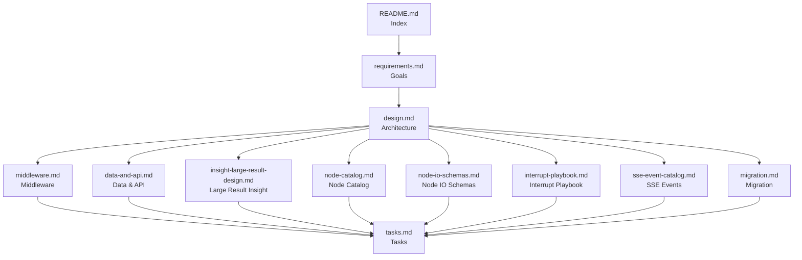

# Analytics Assistant Backend Refactor Spec

> Status: Draft v1.0
> Location: `analytics_assistant/specs/backend-langgraph-refactor`
> Read order: 1/12
> Upstream: none
> Downstream: [requirements.md](./requirements.md), [design.md](./design.md), [middleware.md](./middleware.md), [data-and-api.md](./data-and-api.md), [insight-large-result-design.md](./insight-large-result-design.md), [node-catalog.md](./node-catalog.md), [node-io-schemas.md](./node-io-schemas.md), [interrupt-playbook.md](./interrupt-playbook.md), [sse-event-catalog.md](./sse-event-catalog.md), [migration.md](./migration.md), [tasks.md](./tasks.md)
> Related: [../../docs/backend_new_architecture_design.md](../../docs/backend_new_architecture_design.md), [../../docs/backend_final_refactor_plan.md](../../docs/backend_final_refactor_plan.md)

## 1. Purpose

This spec package is the single entry point for the backend refactor plan. It follows a `.kiro/specs` style breakdown to keep responsibilities separated and reviewable.

- `requirements.md`: goals, constraints, acceptance
- `design.md`: target architecture, nodes, state
- `middleware.md`: reuse vs custom middleware
- `data-and-api.md`: storage/cache/artifact/API/SSE/resume
- `insight-large-result-design.md`: large-result insight flow
- `node-catalog.md`: node responsibilities, errors, interrupts
- `node-io-schemas.md`: node input/output JSON examples
- `interrupt-playbook.md`: interrupt triggers and resume payloads
- `sse-event-catalog.md`: SSE events and payload shapes
- `migration.md`: phases and rollout strategy
- `tasks.md`: execution checklist

## 2. Document Graph

## 3. Suggested Reading Order

1. `requirements.md`
2. `design.md`
3. `middleware.md`
4. `data-and-api.md`
5. `insight-large-result-design.md`
6. `node-catalog.md`
7. `node-io-schemas.md`
8. `interrupt-playbook.md`
9. `sse-event-catalog.md`
10. `migration.md`
11. `tasks.md`

## 4. Legacy Mapping

| Legacy doc | Replacement in spec | Notes |
| --- | --- | --- |
| `docs/backend_new_architecture_design.md` | `design.md` + `data-and-api.md` + `migration.md` | split by topic |
| `docs/backend_final_refactor_plan.md` | `requirements.md` + `middleware.md` | decisions absorbed |
| `docs/backend_refactoring_plan.md` | `data-and-api.md` | DDL/SSE/time sequence only |

## 5. Core Decisions

- `LangGraph root_graph` is the only runtime backbone.
- `thread_id = session_id`, `interrupt/resume` is the core interaction protocol.
- Insight must be file-driven, not summary-driven.
- Reuse framework middleware first, add only `InsightFilesystemMiddleware`.

## 6. How to Use

- For architecture review: `requirements.md` + `design.md`
- For middleware review: `middleware.md`
- For data & API review: `data-and-api.md`
- For node details: `node-catalog.md` + `node-io-schemas.md`
- For rollout: `migration.md` + `tasks.md`
